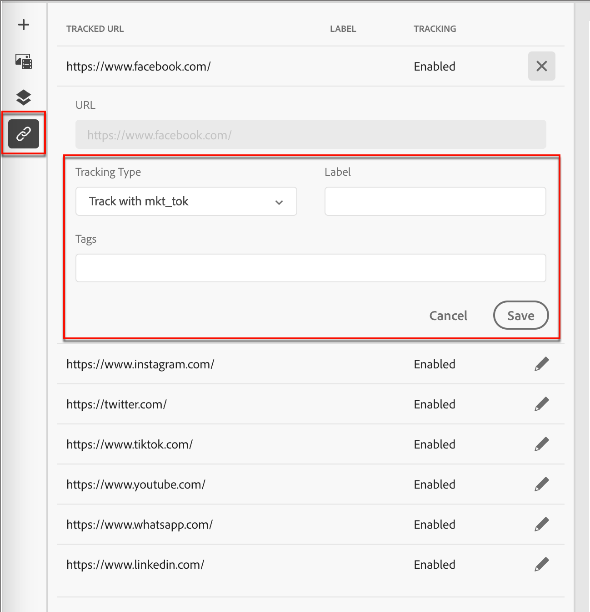

# Content authoring - link tracking

1. Click the _[!UICONTROL Links]_ icon on the left to display all the URLs of your content to be tracked.

1. If needed, click the _Edit_ (pencil) icon and modify the **[!UICONTROL Tracking Type]** or **[!UICONTROL Label]**. 

   You can also add _Tags_ for a link.

{width="500"}