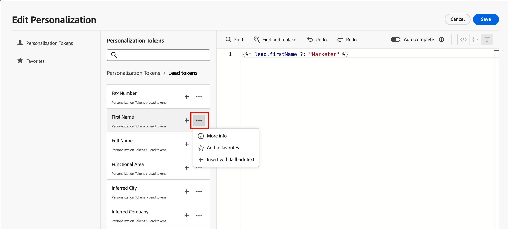

# Content authoring - personalization

Journey Optimizer B2B Edition uses an inline simple syntax that allows you to create expressions with personalized content enclosed by double curly braces `{}`. You can add multiple expressions in the same content or field without restrictions.

Examples:

* `Hello {{profile.person.name.firstName}} {{profile.person.name.lastName}}`

* `Hello {{profile.person.name.fullName}}`

>[!NOTE]
>
>Journey Optimizer B2B Edition now follows _camel case_ syntax for personalization tokens in emails to match the other Adobe Experience Platform applications for a consistent experience. This token format is fully compatible with the [Handlebars templating language](https://handlebarsjs.com/guide/#what-is-handlebars){target="_blank"}. Any tokens that were added prior to this change are automatically updated.

When processing the content, Journey Optimizer B2B Edition replaces the expression with the data contained in the Experience Platform database. So, the first example becomes _Hello John Doe_.

The following example outlines steps to personalize content using lead/account attributes and system tokens.

1. Select the text component and click the _Add personalization_ icon in the toolbar.

   {width="600"}

   This action opens the _Edit Personalization_ dialog.

1. Add a token by clicking the plus ( **+** ) symbol next to it.

   If you want to add the token with a fallback (default text that appears when that field is not available for a lead), click the _More_ icon ( **...** ) and choose **[!UICONTROL Insert with fallback text]**.

   {width="700" zoomable="yes"}

!. Add any additional tokens or other static text that you want to include.

1. Click **[!UICONTROL Save]**.

   The personalization scripting is displayed in the visual design spave, You can select it to make changes when needed. 

   {width="600"}
