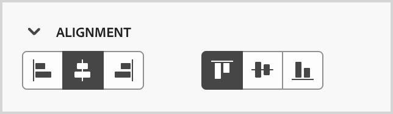
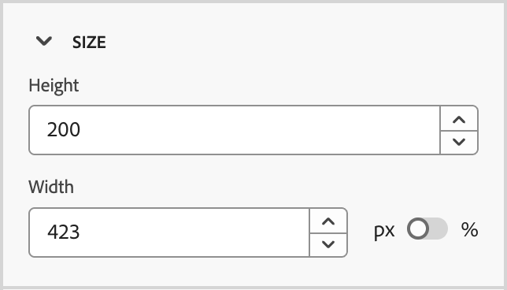

# Snippets

<!-- Content authoring steps for reuse -->

## Intent data configuration {#intent-data-note}

>[!NOTE]
>
>Intent data is included when it is configured for your Journey Optimizer B2B Edition instance. It also requires one or more published journeys **or** created buying groups. For more information about the Intent Detection model and how to submit keywords, products, and categories, see [Intent Data](../user/admin/intent-data.md).

## AEM Assets licensing note {#aem-assets-licensing-note}

>[!NOTE]
>
>Licenses for AEM Assets as a Cloud Service and Dynamic Media license are pre-requisites for the integration. Ensure that [Dynamic Media withOpen API](https://experienceleague.adobe.com/en/docs/experience-manager-cloud-service/content/assets/dynamicmedia/dynamic-media-open-apis/dynamic-media-open-apis-overview){target="_blank"} is enabled. The integration is limited to repositories from the _Delivery tier_. If you use the _Author tier_ and want to convert it, contact Adobe Experience Manager Support. 
>Depending on your contract and configuration, Adobe Experience Manager Assets as a Cloud Service can be accessed directly from Adobe Journey Optimizer B2B Edition when designing visual content.

## Content authoring - components - structures step {#structures-step}

1. To start your content design, drag an item from the **[!UICONTROL Structures]** and drop it onto the canvas.

   Add as many items from _[!UICONTROL Structures]_ as you need and edit the settings for each in the pane on the right.

   >[!TIP]
   >
   >Select the _[!UICONTROL n:n column]_ component to define the number of columns of your choice (between three and 10). You can also define the width of each column by moving the arrows below the column.

   {width="800" zoomable="yes"}

   Each column size cannot be less than 10% of the total width of the structure component. Only empty columns can be removed.

## Content authoring - components - contents step {#contents-step}

1. Expand the **[!UICONTROL Contents]** section and add as many elements as you need into one or more structure components.

   {width="800" zoomable="yes"}
   <!--
   reference to the contents elements--->

## Content authoring - components - settings step {#settings-step}

1. If needed, you can make additional customizations for each component in the _[!UICONTROL Settings]_ or _[!UICONTROL Style]_ tabs.

   For example, you can change the text style, padding, or margin of each component.

## Content authoring - assets step {#assets-step}

1. From the _Asset_ picker, you can directly select assets stored in the asset library.

   Double-click the folder that contains your assets. Drag and drop the items into a structure component.

   For more information about using assets from your source type, see [Add assets to your content](../user/content/assets-overview.md#use-assets-for-content-authoring).

   {width="800" zoomable="yes"}

## Content authoring - personalization step {#personalization-step}

1. Insert personalization fields to customize your content from profiles attributes, audience memberships, contextual attributes, and more.

## Content authoring - enable condition content step {#dynamic-content-step}

1. Click **[!UICONTROL Enable condition content]** to add dynamic content and adapt the content to the targeted profiles based on conditional rules.

## Content authoring - links tracking step {#links-tracking-step}

1. Select the **[!UICONTROL Links]** tab from the left pane to display all the URLs of your content that is tracked.

   You can modify the _Tracking Type_ or _Label_ and add tags if needed.

## Content components - advanced styles {#styles-advanced}

To apply additional CSS-compliant attributes with values, use the **[!UICONTROL Advanced]** style settings. You can change the values of the existing attributes, or add new ones. The styling is applied to the component using the CSS inheritance model for parent-child components (elements).

The displayed attributes reflect the styles that are currently defined for the component. You can change the values according to [CSS definitions](https://www.w3schools.com/CSSref/index.php){target="_blank"}. Click the _Add_ (**+**) icon to add a new style attribute for the component.

{width="250"}

## Content components - alignment styles horizontal {#styles-alignment-h}

Expand the **[!UICONTROL Alignment]** section and choose the horizontal alignment that you want to use: left, center, or right. This style translates to a standard `text-align` CSS style and affects how the component is positioned within the containing component.

{width="250"}

## Content components - alignment styles vertical {#styles-alignment-v}

Expand the **[!UICONTROL Alignment]** section and choose the vertical alignment that you want to use: top, middle, or bottom. This style translates to a standard `vertical-align` CSS style and affects positioning within the containing component.

{width="250"}

## Content components - alignment styles horizontal and vertical {#styles-alignment-h-v}

Expand the **[!UICONTROL Alignment]** section and choose the horizontal and vertical alignment that you want to use. The alignment styles affect how the HTML component is positioned within the containing component (structural or container).

The horizontal alignment translates to a standard `text-align` CSS style and you can choose from left, center, or right. The vertical alignment translates to the standard `vertical-align` CSS style and you can choose from top, middle, or bottom.

{width="300"}

## Content components - background styles {#styles-background}

With the _[!UICONTROL Styles]_ tab selected in the right panel, use the **[!UICONTROL Background]** section to define the background color for the component.

Select the checkbox and click the color square to choose a color from the picker. You can choose a color by entering a known RGB, HSL, HSB, or hexadecimal value. Or, you can use the color slider and the color field to select the color.

{width="300"}

## Content components - border styles {#styles-border}

1. On the right panel with the _[!UICONTROL Styles]_ tab selected, expand the **[!UICONTROL Border]** section and set the options to display a border for the component:

1. Move the toggle to the right to enable the border display options and set them according to your design criteria:

   * To set the **[!UICONTROL Border color]**, select the checkbox and click the color square to choose a color from the picker. You can choose a color by entering a known RGB, HSL, HSB, or hexadecimal value. Or, you can use the color slider and the color field to select the color.

   {width="300"}

   * To set the **[!UICONTROL Border size]** (line width), click the up and down arrow icons to increase or decrease the number of pixels.

   * To set the **[!UICONTROL Border style]**, choose a value from the list of standard CSS `border-style` values.  

   * To determine where the border is displayed, select each **[!UICONTROL Border position]** checkbox.

   {width="250"}

1. For the **[!UICONTROL Border radius]**, set the numerical value according to the curve you want for the corners. 

   A value of 0 (default) produces a squared corner.

## Content components - margin styles {#styles-margin}

On the right panel with the _[!UICONTROL Styles]_ tab selected, expand the **[!UICONTROL Margin]** section and set the options for margin spacing within the structural component. This style replicates the CSS `margin` parameter, which controls to the space outside a component border, separating it from other components. It creates a gap around the component to influence its positioning and the layout of surrounding content.

Set the margin values in pixels according to your design needs. You can set the margin for all sides, the top-botton, the left-right, or each side of the component independently:

* **All sides** - To set one value to apply to all sides, clear the **[!UICONTROL Different margin for each side]** checkbox. Click the up and down arrow icons to increase or decrease the number of pixels.

   {width="250"}

* **Top-bottom** - To set the top and bottom margins to the same value, set the _Locked_ icon between the top and bottom settings. Click the up and down arrow icons for either to increase or decrease the number of pixels.

* **Left-right** - To set the left and right margins to the same value, set the _Locked_ icon between the left and right settings. Click the up and down arrow icons for either to increase or decrease the number of pixels.

   {width="250"}

* **Independent** - To set each margin to an independent value, set the _Unlocked_ icon between the top and bottom settings and between the left and right. For each setting, click the up and down arrow icons for either to increase or decrease the number of pixels.

   {width="250"}

## Content components - padding styles {#styles-padding}

On the right panel with the _[!UICONTROL Styles]_ tab selected, expand the **[!UICONTROL Padding]** section and set the options for padding within the structural component. This style replicates the CSS `padding` parameter, which is the space between the content of a component and its border. The padding provides internal spacing that you can use to control the distance between the content and the border of the component.

Set the padding values in pixels according to your design needs. You can set the padding for all sides, the top-botton, the left-right, or each side of the component independently:

* **All sides** - To set one value to apply to all sides, clear the **[!UICONTROL Different padding for each side]** checkbox. Click the up and down arrow icons to increase or decrease the number of pixels.

   {width="250"}

* **Top-bottom** - To set the top and bottom padding to the same value, set the _Locked_ icon between the top and bottom settings. Click the up and down arrow icons for either to increase or decrease the number of pixels.

* **Left-right** - To set the left and right padding to the same value, set the _Locked_ icon between the left and right settings. Click the up and down arrow icons for either to increase or decrease the number of pixels.

   {width="250"}

* **Independent** - To set padding for each side to an independent value, set the _Unlocked_ icon between the top and bottom settings and between the left and right. For each setting, click the up and down arrow icons for either to increase or decrease the number of pixels.

   {width="250"}

## Content components - size styles {#styles-size}

On the right panel with the _[!UICONTROL Styles]_ tab selected, expand the **[!UICONTROL Size]** section and set the options for the component height and width:

* **[!UICONTROL Height]** - Click the up and down arrow icons to increase or decrease the number of pixels. An empty value (Auto) is the default and sizes the height of the element according to its contents.

* **[!UICONTROL Width]** - Use the toggle to set the width by pixels or percentage.

   * For a percentage width, use the slider to set the percentage value. The percentage determines the element size based on the content box of the containing block, which excludes padding and borders. For example, a value of 50 sets the element width to 50% of its containing block content width.

     {width="250"}

   * For a pixel-based width, click the up and down arrow icons to increase or decrease the number of pixels. An empty value (Auto) is the default and sizes the width of the element according to its contents.

     {width="250"}

## Content components - text styles {#styles-text}

On the right panel with the _[!UICONTROL Styles]_ tab selected, expand the **[!UICONTROL Text]** section and set the options for the component text styles:

* **[!UICONTROL Font family]** - Click the down arrow icon to select a font family for text within the component.

* **[!UICONTROL Font size]** - Click the up and down arrow icons to increase or decrease the font size, or enter a value. For entered values, you can use decimals.

* **[!UICONTROL Line height]** - Click the up and down arrow icons to increase or decrease the line height, or enter a value. For entered values, you can use decimals.

   {width="250"}

* **[!UICONTROL Text styles]** - Select the icon for the text style: _Bold_, _Italic_, _Underlined_, or _Strikethrough_.

* **[!UICONTROL Text alignment]** - Select the icon for the horizontal text alignment: _Left_, _Centered_, _Right_, or _Justified_. 

* **[!UICONTROL Font color]** - Click the color square to choose a font color from the picker. You can choose a color by entering a known RGB, HSL, HSB, or hexadecimal value. Or, you can use the color slider and the color field to select the color.

   {width="300"}

## Content - image selection - Marketo DAM {#me-dam}

Choose this type to browse and select an image asset from the Journey Optimizer B2B Edition library or from the connected Market Engage instance. 

{width="700" zoomable="yes"}

From the dialog, you can choose an image from the selected repository. Click **[!UICONTROL Select]** to add the asset.

There are tools available to help you locate the asset that you need: 

* Click the _Filter_ icon on the top left to filter the displayed items according to your criteria.

* Enter text in the _Search_ field to filter the displayed items for a match of the asset name.

   {width="700" zoomable="yes"}

## Content - image selection - AEM Assets {#aem-assets-dam}

Choose this type to browse and select an image asset from a [configured Experience Manage Assets repository](../user/admin/configure-aem-repositories.md). 

From the _[!UICONTROL Select Assets]_ dialog, choose an image using the available tools to locate the asset that you need and click **[!UICONTROL Select]**.:

* Change the **[!UICONTROL Repository]** at the top right.

* Click **[!UICONTROL Manage assets]** at the top right to open the Assets repository in another browser tab and use AEM Assets management tools.

* Click the _View type_ selector at the top right to change the display to **[!UICONTROL List View]**, **[!UICONTROL Grid View]**, **[!UICONTROL Gallery View]**, or **[!UICONTROL Waterfall View]**.

* Click the _Sort order_ icon to change the sort order between ascending and descending.

   {width="700" zoomable="yes"}

* Click the **[!UICONTROL Sort by]** menu arrow to change the sort criteria to **[!UICONTROL Name]**, **[!UICONTROL Size]**, or **[!UICONTROL Modified]**.

* Click the _Filter_ icon on the top left to filter the displayed items according to your criteria.

* Enter text in the _Search_ field to filter the displayed items for a match of the asset name.
   
   {width="700" zoomable="yes"}

## Content - image upload {#image-upload}

Choose this type to select a file from your system and import it into the Journey Optimizer B2B Edition asset library.

In the _[!UICONTROL Upload image]_ dialog, drag and drop a file from your system to the file box. The maximum file size is 100 MB.
   
{width="450"}

The file names of the selected images are displayed in the dialog. Asset file names must be unique (across folders), and if a file with the name already exists, a message is displayed. Names can have a maximum of 100 characters, and cannot contain special characters (such as `;`, `:`, `\`, and `|`). 

Click **[!UICONTROL Import]**.

## Engagement score activities - Marketo {#engagement-activities-me}

| Activity name | Description | Max daily frequency count | Default model activity weight |
| --- | --- | --- | --- |
| [!UICONTROL Attend Event] | A member attended an event | 20 | 60 |
| [!UICONTROL Email Clicked] | A member clicks a link in an email | 20 | 30 |
| [!UICONTROL Email Opened] | A member opens an email | 20 | 30 |
| [!UICONTROL Form Filled Out]| A member fills and submits a form on a web page | 20 | 40 |
| [!UICONTROL Interesting Moment] | A member has an interesting moment | 20 | 60 |
| [!UICONTROL Link Clicks] | A member clicks a link on a web page | 20 | 40 |
| [!UICONTROL Page Views]| A member views a web page | 20 | 40 |
| [!UICONTROL Register for Event] | A member registered for an event | 20 | 60 |
