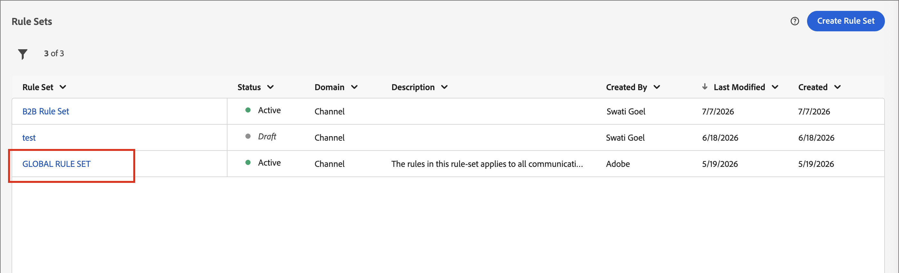

# Business rules {#business-rules}

>[!CONTEXTUALHELP]
>id="ajo-b2b-prime_business_rules_rule_sets"
>title="Rule Sets"
>abstract="Use rule sets to apply frequency capping or quiet hours rules to different types of marketing communications. You can also create rule sets to exclude journeys to part of your audience based on frequency capping rules."

Business rules allow your organization to define and group multiple rules into rule sets so that marketers can apply them to their emails as needed. This provides improved granularity to limit how often and how many journeys a customer can enter within a certain time frame or control how often users receive messages depending on the type of communication.

You can create two types of rule sets:

* **Channel** rule sets apply rules to communication channels. They allow you to set:

   * **Frequency capping rules** - Example: *Do not send more than one Email, SMS, Push, Direct mail, or WhatsApp communication per day.*
   * **Quiet hours rules** - Example: *Do not send email messages outside of the 8AM - 9PM timeslot.*

* **Journey** rule sets apply entry and concurrency capping rules to a journey. (Not yet supported for the Beta release.)

>[!PREREQUISITES]
>
>To work with business rules, you need the following CX Enterprise permissions:
>
>* **[!UICONTROL View Frequency Rules]**: Access and view business rules.
>* **[!UICONTROL Manage Frequency Rules]**: Create, edit or delete business rules.

## Access and manage rule sets {#access-manage}

To access all existing rule sets, expand **[!UICONTROL Administration]** in the left navigation and select **[!UICONTROL Business rules]**.

{width="800" zoomable="yes"}

### Global and custom rule sets {#global-custom}

When accessing _Rule Sets_ for the first time, a default rule set is pre-created and active: **_[!UICONTROL GLOBAL RULE SET]_**. This is a global rule set that you can apply to control how often users receive messages across one or multiple channels. The rules defined in this rule set apply to all selected channels.

{width="700" zoomable="yes"}

In addition to this default rule set, you can create your own custom rule sets and apply them to a journey or channel node to use specific capping and quiet hours rules.

### Open a rule set {#open-rule-set}

Click a rule set name to view and edit its rule definitions. All rules included in that rule set are listed. Use the _More menu_ ( **...** ) on the top right to activate it, deactivate it, or delete it.
    
{width="700" zoomable="yes"}

### Edit the rules {#edit-rules}

For any draft rule in the rule set, click the _Edit_ (  ) icon next to the rule name to edit the rule settings. You can also click the _More menu_ ( **...** ) icon to activate or delete the rule.

{width="500" zoomable="yes"}

To deactivate a rule, click the _Deactivate_ (  ) icon next to the active rule. In the confirmation dialog, click **[!UICONTROL Deactivate]**. The status changes to **_[!UICONTROL Inactive]_** and the rule does not apply to future message executions. Any messages currently in execution are not affected.

>[!NOTE]
>
>Deactivating a rule or rule set does not affect or reset any counts on individual profiles.

## Create and activate custom rule sets {#create}

>[!CONTEXTUALHELP]
>id="ajo-b2b-prime_rule_set_domain"
>title="Rule Set Domain"
>abstract="When creating a rule set, you need to specify if the rules within the rule set will enforce capping rules that are specific to communication channels, or to journeys."

>[!CONTEXTUALHELP]
>id="ajo-b2b-prime_rule_sets_category"
>title="Select the message rule category"
>abstract="When activated and applied to a message, all the frequency rules matching the selected category will be automatically applied to this message. Currently only the Marketing category is available."

>[!CONTEXTUALHELP]
>id="ajob2b-prime_rule_type"
>title="Rule type"
>abstract="Select the desired rule type for your channel rule set: Use the **Frequency capping** type to apply capping rules to communication channels. For example, do not send more than one email or SMS communication per day. Select **Quiet hours** to define time-based exclusions to ensure that no messages are sent during specific periods of time."

>[!CONTEXTUALHELP]
>id="ajo-b2b-prime_rule_sets_duration"
>title="Reset capping frequency"
>abstract="Select the calendar period used to reset the capping counter: Hourly, Daily, Weekly, or Monthly. The counter automatically resets to 0 at the start of each new period."

>[!CONTEXTUALHELP]
>id="ajo-b2b-prime_rule_set_rule_capping"
>title="Rule capping"
>abstract="Set the capping for your rule. Depending on the rule set domain and the selection in the Rule Type field, this field can define the maximum number of messages that can be sent to a profile, or the maximum number of journeys the profile can enter or be enrolled in simultaneously."

>[!CONTEXTUALHELP]
>id="ajo-b2b-prime_journey_business_rules"
>title="Rule set"
>abstract="Select the rule set to apply to your custom action."

>[!NOTE]
>
>You can create up to 10 rule sets for the channel domain and 10 rule sets for the journey domain, for a total of 20 rule sets.

1. Expand **[!UICONTROL Administration]** in the left navigation and select **[!UICONTROL Business rules]**.

1. On the _[!UICONTROL Rules sets]_ list page, click **[!UICONTROL Create rule set]** at the top right.

    {width="400"}

1. Enter a unique **[!UICONTROL Name]** (required) for the rule set and add a **[!UICONTROL Description]** (optional).

1. Select the rule set **[!UICONTROL Domain]**.

   * **[!UICONTROL Channel]** - Apply capping rules or quiet hours rules to communication channels.
   * **[!UICONTROL Journey]** - Apply entry and concurrency capping rules to a journey.

   >[!IMPORTANT]
   >
   >Journey rules are not yet supported in this Beta release.

1. Click **[!UICONTROL Save]**.

   {width="700" zoomable="yes"}

### Add the rules {#add-rules}

After you create the rule set, add each rule that you want to include.

1. Click **[!UICONTROL Add rule]**.

1. Configure the rule parameters according to its purpose.

   The parameters available for the rule depend on the rule set domain selected at its creation.

   {width="700" zoomable="yes"}

   Detailed information about configuring journey and channel rules is available in these sections:
   
   <!-- * [Journey capping](../conflict-prioritization/journey-capping.md) -->
   * [Frequency capping by channel and communication type](#frequency-capping)
   * [Quiet hours](#quiet-hours)

1. Click **[!UICONTROL Create Rule]** to confirm the rule creation.

   The new rule is listed in the rule set with _Draft_ status.

1. Repeat the preceding steps to add as many rules as needed for the rule set.

   When created, a rule has the _[!UICONTROL Draft]_ status and cannot yet impact any message.

   {width="700" zoomable="yes"}

1. To activate a rule for the rule set, click the _More menu_ ( **...** ) icon next to the rule name and choose **[!UICONTROL Activate]**.

   In the confirmation dialog, click **[!UICONTROL Activate]**.

### Activate the rule set {#activate-rule-set}

Activating the rule set makes it available to apply to a journey or channel message. When a rule set is active, you cannot add more rules to it. You can deactivate it to make changes and then activate it again.

1. Open the rule set from the _Rule Sets_ list page.

1. Click the _More menu_ ( **...** ) at the top right and choose **[!UICONTROL Activate Rule Set]**.

   {width="700" zoomable="yes"}

1. In the confirmation dialog, click **[!UICONTROL Activate]**.

   >[!NOTE]
   >
   >It can take up to 10 minutes for a rule or rule set to be fully activated. You do not need to modify messages or republish journeys for a rule to take effect.

You can apply the active rule set to a message or a journey, depending on the domain setting for the rule set.

## Frequency capping by channel {#frequency-capping}

Set frequency caps by channel and communication type to limit how many messages a profile receives and avoid overwhelming customers with similar communications. Channel rule sets apply capping rules to communication channels. For example, do not send more than one email or SMS communication per day.

Leveraging channel rule sets allows you to set frequency capping by communication type to prevent overloading customers with similar messages. For example, you can create a rule set to limit the number of _promotional communications_ sent to your customers and another rule set to limit the number of _newsletters_ sent to them. You can then choose to apply either the promotional communication or the newsletters rule set.

>[!IMPORTANT]
>
>To ensure channel level capping works correctly, make sure you choose the highest priority namespace while building a journey. Learn more about namespace priority in the [Platform Identity Service guide](https://experienceleague.adobe.com/en/docs/experience-platform/identity/features/identity-graph-linking-rules/namespace-priority){target="_blank"}

### Create a channel capping rule {#create-capping-rule}

>[!CONTEXTUALHELP]
>id="ajo-b2b-prime_rule_sets_channel"
>title="Define the channels the rule applies to"
>abstract="Select at least one channel. Capping applies across channels as a total count."

1. Select the channel rule set where you want to add the capping rule, or create a new channel rule set.

1. In the rule set page, click **[!UICONTROL Add Rule]** and enter a unique name for the rule.

   >[!NOTE]
   >
   > The _[!UICONTROL Category]_ field specifies the messaging category for the rule. Currently, this field is read-only and only the **[!UICONTROL Marketing]** category is available.

1. For the _[!UICONTROL Rule Type]_, choose **[!UICONTROL Channel capping]**.

   {width="700" zoomable="yes"}

1. In the **[!UICONTROL Capping count]** field, set the capping value for your rule.

   This value is the maximum number of messages that can be sent to an individual user profile each month, week, day, or hour, according to your selection in the other fields.

1. For **[!UICONTROL Reset capping frequency]**, select if you want the capping to be applied.

   Frequency cap is based on the selected calendar period. It is reset at the beginning of the corresponding time frame. Choose the expiry of the counter for each period:

   * **[!UICONTROL Hourly]** - The frequency cap is valid for the selected number of hours. The counter automatically resets at the beginning of each time window. For a 1-hour frequency cap, it resets every hour, coinciding with the end of a UTC hour.
   * **[!UICONTROL Daily]** - The daily frequency cap is valid for the day until 23:59:59 UTC and resets to 0 at the start of the next day.
   * **[!UICONTROL Weekly]** - The frequency cap is valid until Saturday 23:59:59 UTC of that week. The expiry date applies regardless of when the rule was created. For example, if the rule is created on Thursday, this rule is valid until Saturday at 23:59:59.
   * **[!UICONTROL Monthly]** - The frequency cap is valid until the last day of the month at 23:59:59 UTC. For example, the monthly expiration for January is 01-31 23:59:59 UTC.

   >[!IMPORTANT]
   >
   >* To ensure accuracy, make sure you choose the highest priority namespace while authoring a journey. Learn more about namespace priority in the [Platform Identity Service guide](https://experienceleague.adobe.com/en/docs/experience-platform/identity/features/identity-graph-linking-rules/namespace-priority){target="_blank"} 
   >
   >* The profile counter value updates when the communication is delivered. Consider this when you are sending large volumes of communications, because the throughput could result in the recipient getting the email minutes or even hours after the initiation of the communication (in the case that you are sending millions of communications simultaneously). This matters in the case that a recipient receives two communications close together. It is recommended that you space communications apart by at least two hours where possible to provide enough time for the recipient to receive the communication and the counter value to update accordingly.

1. Use the **[!UICONTROL Every]** field to set the frequency for the capping rule over multiple hours, days, weeks, or months (depending on the specified time frame). 

   Make sure you enter a value that matches the selected duration type: 1-23 for _Hourly_, 1-30 for _Daily_, 1-4 for _Weekly_, and 1-3 for _Monthly_.

   The counter automatically resets to 0 when a new time window begins. For a two-day frequency cap, this reset occurs every two days at midnight UTC.

1. Select the channels you want to use for this rule: 

   * **[!UICONTROL Email]**
   * **[!UICONTROL SMS]** (not currently supported for this Beta release)
   * **[!UICONTROL Push notification]** (not currently supported for this Beta release)
   * **[!UICONTROL Direct mail]** (not currently supported for this Beta release)
   * **[!UICONTROL WhatsApp]** (not currently supported for this Beta release)

   {width="700" zoomable="yes"}

   Select multiple channels if you want to apply capping across all selected channels as a total count.

   For example, set capping to 5, and select both the Email and SMS channels. If a profile has already received three marketing emails and two marketing SMS messages for the selected period, this profile is excluded from the very next delivery of any marketing email or SMS message.

1. Click **[!UICONTROL Save]** to confirm the rule creation.

   Your frequency rule is added to the rule set with the _[!UICONTROL Draft]_ status.

1. Repeat the steps above to add as many rules as needed to the rule set.

1. When the capping rule is ready to be applied to messages, activate the rule and the rule set.

### Apply the channel capping rule set {#apply-capping-rule}

1. When creating a journey, add one of the Send [action nodes](../marketing/action-nodes.md) for a channel that you selected for your rule and edit the content of your message.

1. On the _[!UICONTROL Actions]_ tab, set the **[!UICONTROL Business rules]** option to the rule set with the frequency capping rule.

   {width="600" zoomable="yes"}

   >[!NOTE]
   >
   >Only activated rule sets are available in the list.

   <!--Messages where the category selected is **[!UICONTROL Transactional]** will not be evaluated against business rules.-->

1. Before activating your journey, make sure you schedule its execution at least 10 minutes into the future.

   This provides the required time to populate the counter values on the profile for the business rule you selected. If you activate the journey immediately, the rule set counter values cannot populate on the profiles of the recipients, and the message is not counted toward their frequency capping rules for the custom rule sets. 

<!-- 
1. You can view the number of profiles excluded from delivery in the [Customer Journey Analytics report](../reports/report-gs-cja.md), and in the [Live report](../reports/live-report.md), where frequency rules will be listed as a possible reason for users excluded from delivery.

-->

>[!NOTE]
>
>Several rules can apply to the same channel, but once the lower cap is reached, the profile will be excluded from the next deliveries.

When testing frequency rules, it is recommended to use a newly created test profile, because when a profile's frequency cap is reached, there is no way to reset the counter until the next period. Deactivating a rule allows capped profiles to receive messages, but it does not remove or delete any counter increments.

## Set quiet hours {#quiet-hours}

**_Quiet hours_** let you define time-based exclusions for email, SMS, Push, and WhatsApp channels. They ensure that no messages are sent during specific periods of time, helping you respect customer preferences and compliance requirements.

>[!NOTE]
>
>In the current Beta release, only email and WhatsApp channels are supported in journeys.

You can apply quiet hours through rule sets and assign them to individual channel actions in journeys for precise control. By streamlining these standards, you can enhance customer experience, save time, and ensure compliance with communication rules:

* **Don't wake up your customer** - *The right customer, right channel, right time* is the mantra of many marketers, so it makes sense that timing is a critical part of the customer journey. By setting a Quiet hours rule, brands have better control over when contacts are receiving messages, ensuring they are getting them when they're more likely to take action on your message.
* **Convenience** - Easily intercept communications across campaigns & journeys when you need to prevent an audience from receiving a message without needing to stop the entire journey or campaign. 
* **Time Saving** - Manage exclusions in one place by creating a **time-based rule**, instead of adding multiple condition nodes with custom expressions.  
<!--* **Extra Safeguard** - Benefit from an extra safeguard in case audience criteria or time-window configurations were incorrectly set, ensuring individuals are still excluded when they should be.--> 

>[!BEGINSHADEBOX]

**Guardrails and limitations**

* **Propagation delay** – Updates to a quiet hours rule may take up to 12 hours to be applied to channel actions that already use that rule.
* **High-volume latency** – In cases of high-volume communications, the system may take additional time to begin successfully enforcing quiet hour suppressions.

>[!ENDSHADEBOX]

<!--* **Custom actions** – For custom actions, only quiet hours rules are enforced. If a rule set also includes other rules (e.g., frequency capping), those rules are ignored.-->
<!--* **Pre-suppression window** – The system begins suppressing communications 30 minutes before quiet hours start, ensuring that no messages are delivered once the quiet period begins.-->

### Create quiet hours rules {#create-quiet-hour-rules}

>[!NOTE]
>
>Quiet hours can only be defined in **_custom rule sets_**. The global rule set does not support quiet hours configuration.

1. Select the channel rule set where you want to add the rule, or create a new channel rule set.

1. In the rule set page, click **[!UICONTROL Add Rule]** and enter a unique name for the rule.

   >[!NOTE]
   >
   > The _[!UICONTROL Category]_ field specifies the messaging category for the rule. Currently, this field is read-only and only the **[!UICONTROL Marketing]** category is available.

1. For the _[!UICONTROL Rule type]_ select **[!UICONTROL Quiet hours]**.

   {width="700" zoomable="yes"}

1. In the **[!UICONTROL Dates & times]** section, define when to apply quiet hours:

   * For **[!UICONTROL Time zone]**, choose a standard time zone for all recipients in the audience, regardless of their individual time zones.

      To use the time zone field from each profile, select **[!UICONTROL Use recipients local time zone]**.

      >[!IMPORTANT]
      >
      >If a profile has no time zone value, quiet hours are not enforced for that profile.

   * Click the _Calendar_ icon and specify the time period at which quiet hours should apply.

      * **[!UICONTROL Weekly]** - Choose specific days of the week and a timeslot. You can also enforce the rule **[!UICONTROL All day]**.

      * **[!UICONTROL Custom date]** - Choose specific dates in the calendar and a timeslot. You can also enforce the rule **[!UICONTROL All day]**.

      {width="450"}

   * Click the **[!UICONTROL Add more dates]** button to add up to five separate periods.    

1. In the **[!UICONTROL Handling actions during quiet hours]** section, choose how messages are treated during the selected period of time:

   

   * **[!UICONTROL Queue message]** - Messages are sent at the completion of the quiet hours period unless in Paused state.
  
     >[!NOTE]
     >
     >If a message remains in a queued state for a profile for more than 7 days, the message will be discarded.

   * **[!UICONTROL Discard message]** - Messages are never sent.

     >[!NOTE]
     >
     >If you select **[!UICONTROL Discard]** and apply this rule to a journey action, the profile is removed from the message delivery and exited from the journey.

1. Click **[!UICONTROL Save]** to confirm the rule creation.

   Your quiet hours rule is added to the rule set with the _[!UICONTROL Draft]_ status.

1. Repeat the steps above to add as many rules as needed to the rule set.

1. When the rule is ready to be applied to messages, activate the rule and the rule set. 

### Apply quiet hours to a journey action {#apply-quiet-hours}

After the rule is saved and the rule set is activated, you can apply it to channel actions in journeys.

1. When creating a journey, add one of the Send [action nodes](../marketing/action-nodes.md) for a channel that you selected for your rule and edit the content of your message.

1. On the _[!UICONTROL Actions]_ tab, set the **[!UICONTROL Business rules]** option to the rule set with the quiet hours rule.

   {width="600" zoomable="yes"}

   >[!NOTE]
   >
   >Only activated rule sets are available in the list.

1. Complete and publish the journey when you are ready.
