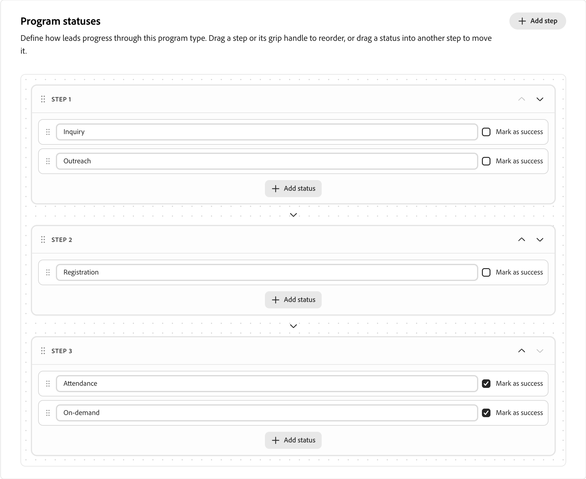

# Program types

Program types define important aspects of [programs](../marketing/programs.md) and their members, and distinguish different types of marketing programs from each other. Each program type defines the following properties, which are inherited for programs using the program type:

* **Attributes** - The attributes describe the important aspects of the program type, such as event dates and location attributes.

* **Program status flow** - Each status is assigned to a step in the program type (such as 1, 2, or 3). Members of a program can only move from a status with the same step number (for example, from _No-Showed_ to _Attended_), or to a status with a higher step number (for example, from _Invited_ to _Registered_).

   Program statuses are mutually exclusive and linear, so a person can only have one status value per program. When designing statuses, think about which statuses you want to allow movement between. For example, if someone did not show for a webinar but has an option to attend on-demand later, you would want them to either have the same status number or set on-demand to a higher status number so a program member can advance to it.

>[!NOTE]
>
>If a program type is used by at least one program, it cannot be edited.

_To define a custom program type:_

1. In the [!DNL Adobe Journey Optimizer B2B Prime] left navigation, expand **[!UICONTROL Administration]** and select **[!UICONTROL Program types]**.

   {width="800" zoomable="yes"}

1. Click **[!UICONTROL Create type]** at the top right.

1. Enter a unique **[!UICONTROL Name]** (required) and **[!UICONTROL Description]** (optional).

   {width="600" zoomable="yes"}

   >[!TIP]
   >
   >Including a description is a best practice and makes your program type library more manageable.

1. Click **[!UICONTROL Create type]**.

1. Add the **[!UICONTROL Attributes]** for the program type.

   For each attribute that you want to add:

   * Click **[!UICONTROL Add attribute]**.
   * Choose the **[!UICONTROL API name]** and enter the **[!UICONTROL Display name]**.
   * Click **[!UICONTROL Save]**.

   {width="600" zoomable="yes"}

1. Define the steps for **[!UICONTROL Program statuses]**.

   Define each step that you want to include in the flow:

   * Click **[!UICONTROL Add step]**.
   * Enter a status name.
   * (Optional) Click **[!UICONTROL Add status]** and enter an additional status name to include for the step.

   Select the **[!UICONTROL Mark as success]** check box for any step that you want to track as a successful program execution.

   {width="600" zoomable="yes"}

1. Click **[!UICONTROL Done]** to save your changes and return to the program types list.