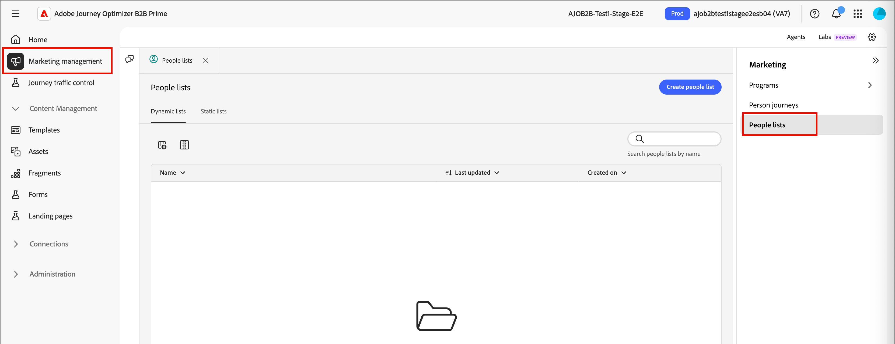

# Destinations

Destinations are pre-built integrations that allow you to export people list data from [!DNL Adobe Journey Optimizer B2B Prime] to external marketing platforms such as advertising networks, email service providers, and CRM systems. In [!DNL Journey Optimizer B2B Prime], you activate [static people lists](./people-lists.md#static-list) (composed of Marketo Engage person records) to destinations so that those audiences are available for targeting and engagement in downstream channels.

<!-- 
Does not align w/AEP info for Beta

Activating a static list to a destination follows a three-step process:

1. **Connect** — Authenticate and configure a connection to a destination platform.
1. **Map** — Select the static list and map its people attributes to the fields required by the destination.
1. **Schedule** — Define when and how often the list data is exported to the destination.

Destination activations reflect the membership state of the static list at the time of each synch.

## Destination types {#destination-types}

[!DNL Journey Optimizer B2B Prime] supports the following destination types for activating static people lists:

| Type | Description |
|--- |--- |
| Streaming | Real-time API-based connections that push audience membership updates to the destination as they occur. |
| File-based (batch) | Scheduled exports that deliver audience data as structured files to cloud storage or SFTP locations, which the destination platform then ingests. |

-->

## Connect a destination {#connect-destination}

1. On the left navigation, expand **[!UICONTROL Connections]** and select **[!UICONTROL Destinations]**.

1. In the _[!UICONTROL Catalog]_ tab, locate the external destination type connector.

   >[!TIP]
   >
   >You can quickly find the connector by entering the name, such as `LinkedIn`, in the search box.

   {width="800" zoomable="yes"}   

1. In the connector card, click **[!UICONTROL Configure new destination]**.

1. Select **[!UICONTROL New Account]** and enter your account credentials.

   {width="500"}

1. Click **[!UICONTROL Connect to destination]**.

   >[!IMPORTANT]
   >
   >At this point, **do not** enter the _[!UICONTROL Destination details]_. Only the connection is needed.

1. Review the data governance and marketing action settings, then click **[!UICONTROL Save]**.

The connected destination appears in the list on the _[!UICONTROL Browse]_ tab and is available for static list activation.

## Activate a static list to a destination {#activate}

>[!NOTE]
>
>Only [static people lists](./people-lists.md#static-list) can be activated to destinations in [!DNL Journey Optimizer B2B Prime]. [Dynamic lists](./people-lists.md#dynamic-lists) are not eligible for destination activation.

1. On the left navigation, expand **[!UICONTROL Marketing Management]**.

1. On the right in the **[!UICONTROL Marketing]** resource list, select **[!UICONTROL People lists]**.

   {width="800" zoomable="yes"}

1. Select the **[!UICONTROL Static lists]** tab.

1. Locate the static list that you want to activate to a destination.

1. Click the _Activate_ (  ) icon next to the static list name.

1. Select the check box for the configured destination connection.

   {width="700" zoomable="yes"}

1. Click **[!UICONTROL Save]**.

<!--

This method not working for Beta

1. On the _[!UICONTROL Browse]_ tab, locate the destination you want to use for the activation and click the name to open it.

1. Select the **[!UICONTROL Activation data]** tab.

1. Click **[!UICONTROL Activate people lists]**.

1. Select the static people list you want to export and click **[!UICONTROL Next]**.

1. Map the people list attributes to the required fields of the destination schema and click **[!UICONTROL Next]**.

1. Set the export schedule:

   * **[!UICONTROL Frequency]** — Choose how often the list is exported (for example, daily or weekly).
   * **[!UICONTROL Start date]** — Set when the first export should run.

1. Review the activation summary and click **[!UICONTROL Finish]**.

The activation is created and the static list data is exported to the destination according to the defined schedule.

-->
