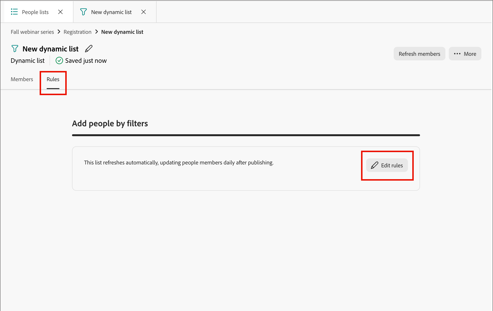
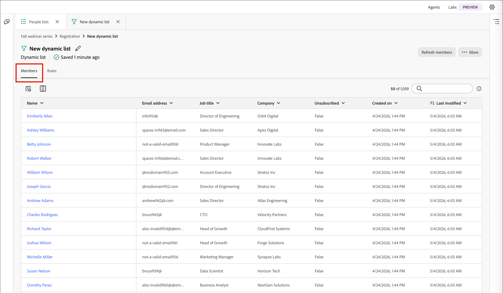

# People lists

In [!DNL Adobe Journey Optimizer B2B Prime], people lists are the person-level audience containers for targeting and person journey entry, with dynamic lists for rule-based live qualification and static lists for fixed or journey-managed membership.

## Access and browse people lists {#access-browse}

1. On the left navigation, expand **[!UICONTROL Marketing Management]**.

1. On the right in the **[!UICONTROL Marketing]** resource list, select **[!UICONTROL People lists]**.

   {width="800" zoomable="yes"}

There are two tabs for the page where you can view and manage **[!UICONTROL Dynamic lists]** and **[!UICONTROL Static lists]**. Click the tab to switch the list view between the two types. 

You can enter text in the _Search_ tool at the top of the list to filter the displayed list by name. Use the list tools to customize the displayed list:

* Click the _Customize table_ (  ) icon to control the displayed columns.
* Click the _Reset columns_ (  ) icon to reset the column widths.

From this space you can also:

* Create new dynamic and static lists
* Access lists to review current membership
* Apply membership filters

<!--
## Audience Hub

The AI Audience Hub is a centralized, AI-driven starting point for all audience-related capabilities across [!DNL Adobe Journey Optimizer B2B Prime]. It is designed to accelerate first-time user success while progressively unlocking advanced intelligence, insights, and control for returning and power users.

The Hub acts as:

* A guided starting point for discovering, creating, and refining person lists, account lists, and buying groups

* A visibility layer for audience health, coverage, overlap, engagement patterns, and AI-driven insights

* A control center for audience governance, optimization, reuse, and readiness for activation across journeys and sales workflows

### High level structure

Prompt-based starting point - Quick Start prompts and freeform input to help users discover, create, or optimize audiences.

1. AI insights feed - Surfaces key audience signals such as overlap, gaps, saturation risk, and optimization opportunities.

1. Adaptive audience library - A personalized view of people lists, account lists, and buying groups that adapts based on usage, relevance, and activation.

1. Optimization and arbitration nudges - Guides users to refine, split, or reuse audiences before activation.

1. Audience visibility and reporting - High-level insight into audience health, engagement patterns, and usage across active journeys.

### Empty and Error States (High-Level)

No audiences / no data - Show Quick Start prompts to help first-time users create or import person lists

Low data or incomplete audience - Explain what's missing (e.g., insufficient contacts, missing persona coverage, or low engagement data) and suggest next steps.

AI insights unavailable - Provide a graceful fallback with a clear explanation, so users understand why insights aren't shown and what actions they can take manually.
-->

## Create a people list {#create-people-list}

1. Click **[!UICONTROL Create list]** at the top right of the _[!UICONTROL People lists]_ page.

1. In the dialog, select a program as the **[!UICONTROL Parent]** for the list.

1. Enter a **[!UICONTROL Name]** (required) and **[!UICONTROL Description]** (optional) for the list.

1. Choose the list **[!UICONTROL Type]**:

   * [**[!UICONTROL Static]**](#static-lists) - Membership is determined by qualifying filters evaluated when you create the list. The list membership does not update unless you manually qualify or disqualify records. 
   * [**[!UICONTROL Dynamic]**](#dynamic-lists) - Membership is dynamically determined by qualifying filters. The list membership refreshes automatically.

   {width="450"}

1. Click **[!UICONTROL Create]**.

>[!NOTE]
>
>Delete and duplicate are not currently supported for people lists in this Beta release.

## Static lists {#static-lists}

Static list membership is defined by simple filters that reference people attributes and activities. Membership does not change unless you manually qualify or disqualify members.

>[!NOTE]
>
>Static list filter definitions are applied only once when you add to or remove members from the list. The defined filter is not available afterwards. If you want to maintain a consistent audience definition using filters, use a dynamic list instead.

<!--
What internet says about Marketo static lists -- which of these is also true in AJO B2B Prime?

* Manual Targeting: Storing fixed cohorts, such as attendees of a specific webinar, people who purchased a certain product, or a list of competitors.
* Third-Party Syncing: Allowing external platforms (like Amplitude or Twilio Segment) to automatically sync and export groups of users directly into Marketo as targeted audiences.
* Status Tracking: Helping marketers organize leads into specific categories or track multi-value interests without needing to create new, permanent database fields.List 
* Segmentation: Acting as a reliable, unchanging recipient or suppression list for email campaigns and engagement programs. Unlike a Smart List—which dynamically adds or removes people based on changing criteria or rules—a static list serves as a reliable snapshot. People remain on the list until explicitly added or removed by you or a backend flow.

So far, activating to a destination is the only thing that they are used for that I have found.
-->

### Add members {#static-list-add-members}

1. Open the static list and click **[!UICONTROL Add people]** at the top right.

1. In the dialog, define the rules for qualifying your leads by dragging and dropping filters from the left. 

   You can filter people using any combination of:

   * Activity history
   * Company attributes
   * Person attributes
   * Special filters such as journey membership

   For each filter that you add, click **[!UICONTROL Add constraints]** to refine the matching criteria for the filter.

   {width="700" zoomable="yes"}

1. To save your changes, click **[!UICONTROL Done]**.

1. Select the **[!UICONTROL Members]** tab. 

   After a brief time, qualifying members appear in the list.

   {width="700" zoomable="yes"}

### Remove members {#static-list-remove-members}

1. Open the static list and click **[!UICONTROL Remove people]** at the top right.

1. In the _[!UICONTROL Remove people]_ dialog, add the filters to match members that you want to disqualify.

   {width="700" zoomable="yes"}

1. To save your changes, click **[!UICONTROL Done]**.

1. Select the **[!UICONTROL Members]** tab. 

   After a brief time, the disqualified members leave the list.

### Activate to a destination {#static-list-activate}

When you activate a static list, it is actionable in downstream systems, with ongoing sync instead of manual exports. This is useful for paid media targeting, suppression, and downstream orchestration.

* The static list acts as a container for the people.
* The activation sends/syncs that membership to a destination.
* The destination can then do something with those people, such as target them on LinkedIn or remove them from an external audience.

Because the activation model is meant to be persistent, not a one-time export:

* People added to the list later are propagated automatically.
* People removed later are deactivated automatically.
* Marketers avoid repeated CSV exports and manual uploads.
* Journeys can refresh the audience over time for ongoing orchestration.

>[!PREREQUISITES]
>
>You must have one or more [configured destinations](./destinations.md) for your [!DNL Journey Optimizer B2B Prime] sandbox before you can activate a static list to a destination.

1. Select the **[!UICONTROL Static lists]** tab.

1. Locate the static list that you want to activate to a destination.

1. Click the _More menu_ ( **...** ) icon next to the list and choose **[!UICONTROL Activate to destination]**.

   {width="450"}

   You can also open the static list and use the _[!UICONTROL More]_ menu at the top right.

   <!-- which UI is it?  _Activate_ (  ) icon next to the static list name. -->

1. Select the check box for the configured destination connection.

   {width="600" zoomable="yes"}

1. Click **[!UICONTROL Save]**.

1. Confirm the activation in the _[!UICONTROL Activate list to destination]_ dialog by clicking **[!UICONTROL Activate]**.

When activation completes, a confirmation appears (_The destination has been activated._) and the destination is listed as **[!UICONTROL Active]** on the **[!UICONTROL Destinations]** tab of the list. A static list can be activated to more than one destination at a time; membership syncs to all of them.

To review the destinations that a static list is activated to, open the list and select the **[!UICONTROL Destinations]** tab. By default, a new list has no destinations connected.

#### Deactivate a destination {#deactivate-destination}

1. Open the static list and select the **[!UICONTROL Destinations]** tab.

1. Click the _minus_ ( **–** ) icon on the row of the destination that you want to remove.

1. Confirm in the _[!UICONTROL Deactivate destination]_ dialog.

Deactivating removes the destination from the list. The people in the list are also removed from that destination audience.

## Dynamic lists {#dynamic-lists}

Dynamic list membership is defined using simple filters that reference people attributes and activities. Membership is automatically maintained by qualifying and disqualifying leads according to the filter logic.

### Set membership rules {#set-membership-rules}

1. Open the dynamic list and select the **[!UICONTROL Rules]** tab.

1. Click the **[!UICONTROL Edit rules]**.

   {width="550" zoomable="yes"}

1. In the dialog, define the rules for qualifying your leads by dragging and dropping filters from the left.

   You can qualify leads for the list using any combination of:

   * Activity history
   * Company attributes
   * Person attributes
   * Special filters such as journey membership

   For each filter that you add, click **[!UICONTROL Add constraints]** to refine the matching criteria for the filter.

   {width="700" zoomable="yes"}

1. To save your changes, click **[!UICONTROL Done]**.

1. Select the **[!UICONTROL Members]** tab. 

   After a brief time, qualifying members appear in the list.

   {width="700" zoomable="yes"}

   To open the [person details](./person-details.md) page where you can view the summary and recent activities, click the name of a person in the list.

### Duplicate a dynamic list {#duplicate-dynamic-list}

For a dynamic list, a duplicate action is similar to a clone function. Use this function to replicate the membership filtering and add it to a different program.

1. In the _[!UICONTROL Dynamic lists]_ tab, click the _More menu_ ( **...** ) icon next to the list and choose **[!UICONTROL Duplicate]**.

1. In the dialog, select the **[!UICONTROL Parent]** program for the duplicated list.

1. Enter a unique **[!UICONTROL Name]** (required) and **[!UICONTROL Description]** (optional).

   By default, the dialog uses the name of the originating list appended with `_copy`. Enter a different unique name for the list as needed.

   {width="375"}

1. Click **[!UICONTROL Duplicate]**.
