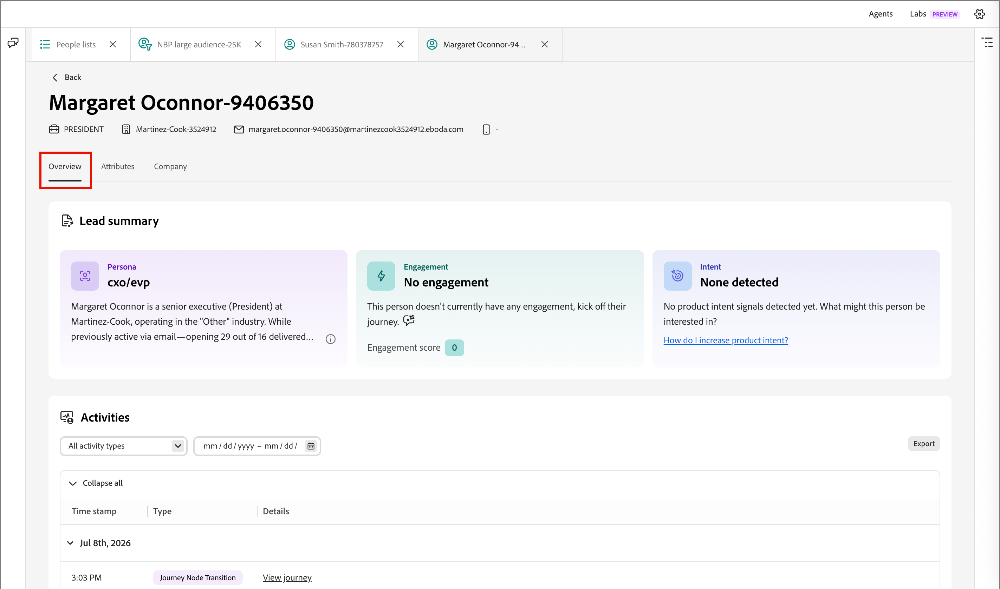

# Person details

In [!DNL Adobe Journey Optimizer B2B Prime], when you click a person's name on the _[!UICONTROL Members]_ tab of a [people list](./people-lists.md), the person details page opens with a consolidated view of that individual. This page provides:

* An AI-generated persona, engagement, and intent summary
* A full activity history
* Profile and company attributes
* AI Assistant chat interface scoped to answer questions about the person

## Open person details {#open-person-details}

1. On the left navigation, expand **[!UICONTROL Marketing Management]**.

1. On the right in the **[!UICONTROL Marketing]** resource list, select **[!UICONTROL People lists]**.

1. Open a dynamic or static list.

1. Click the **[!UICONTROL Name]** of a person in the list.

   {width="600" zoomable="yes"} 

The person details page opens with three tabs: **[!UICONTROL Overview]**, **[!UICONTROL Attributes]**, and **[!UICONTROL Company]**.

## Page header {#page-header}

The header displays the person's name as the page title, along with a quick-glance contact strip:

* Job title
* Company
* Email address
* Phone number

Click **[!UICONTROL Back]** to return to the originating list.

## Overview tab {#overview-tab}

The **[!UICONTROL Overview]** tab contains the lead summary cards and the activity timeline.

{width="700" zoomable="yes"}

### Lead summary {#lead-summary}

Three cards give an AI-generated assessment of the person:

| Card | Contents |
|---|---|
| **[!UICONTROL Persona]** | The [derived persona](./personas.md) for the person, plus a short narrative describing their role, company, and industry. Click the info icon for more detail. |
| **[!UICONTROL Engagement]** | The [person engagement score](./engagement-scores.md), trend (for example, _Increasing_), and level (_Low_, _Medium_, _High_). |
| **[!UICONTROL Intent]** | Detected buying intent, or _None detected_, with contextual guidance and a link to help you increase product intent. |

### Activities {#activities}

Below the lead summary, the **[!UICONTROL Activities]** panel lists the person's full interaction history, grouped by date. Each date group is expandable and collapsible, and each row shows a timestamp, an activity type tag (for example, _[!UICONTROL Change Data Value]_, _[!UICONTROL Add to List]_, _[!UICONTROL Add Person to Journey]_, or _[!UICONTROL Journey Node Transition]_), and a plain-language description of what happened. Where applicable, the description includes a link, such as **[!UICONTROL View list]** or **[!UICONTROL View journey]**, to jump to the related object.

Use the panel controls to work with the timeline:

* **Activity type** – Filter the timeline to a specific activity type, such as email sends, webinar interactions, or list and journey changes.
* **Date range** – Constrain the timeline to a specific date range using the calendar control.
* **[!UICONTROL Export]** – Export the visible activity data.
* **[!UICONTROL Collapse all] / [!UICONTROL Expand all]** – Toggle every date grouping open or closed at once.

## Attributes tab {#attributes-tab}

{width="700" zoomable="yes"}

The **[!UICONTROL Attributes]** tab displays the person's stored profile fields as a label/value list:

* First name
* Middle name
* Last name
* Email
* Title
* Phone
* Address
* City
* State
* Country
* Company
* Created
* Last updated

## Company tab {#company-tab}

{width="700" zoomable="yes"}

The **[!UICONTROL Company]** tab displays firmographic data associated with the person's company:

* Company
* Industry
* Annual revenue
* Billing street
* Billing city
* Billing state
* Billing postal code
* Billing country

Fields without available data are shown as a dash.

## Ask AI Assistant about a person {#ask-ai-assistant}

Open the **[!UICONTROL AI Assistant]** panel icon near the top of the page to get help with the current person record. The panel opens scoped to that person — a chip below the message thread (for example, _person: [Person Name]_) confirms which record your prompts target.

{width="700" zoomable="yes"}

### Start from a suggested prompt {#suggested-prompts}

When you open the panel from a person details page, AI Assistant greets you with a contextual welcome message and default suggested prompts, such as:

* _Help me understand [Person Name]_
* _Tell me about [Person Name]'s persona_
* _Summarize [Person Name]'s engagement activity_

Click a suggested prompt, or type your own question in the input box at the bottom of the panel.

### Review the response {#review-response}

Selecting a prompt runs a multi-step [skill](../agents/skills.md), shown as sequential status steps (for example, _Lookup person by ID_ and _Get person story_) while AI Assistant composes the answer. The response is a structured summary that can include profile details, engagement history, and email performance for the person.

Use the thumbs-up/thumbs-down control to rate the response. As with all AI Assistant output, review the response before using it. For more information, see the [Adobe Generative AI User Guidelines](https://www.adobe.com/legal/licenses-terms/adobe-dx-gen-ai-user-guidelines.html){target="_blank"}.
