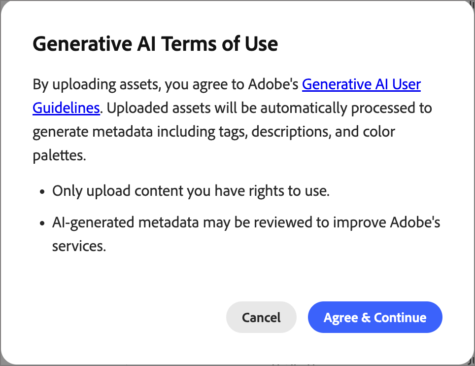
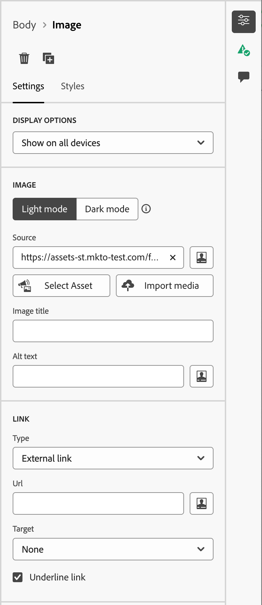

# Assets

In [!DNL Adobe Journey Optimizer B2B Prime], assets are typically the images used when designing content to support journeys. You can use these images within your [emails](email-authoring.md), [email templates](templates.md), and [visual fragments](email-authoring.md#visual-fragments) from the asset selector or a simple drag-and-drop interface within the visual design space.

Supported file formats: JPG, JPEG, GIF, PNG, EPS, SVG, and RGB

>[!NOTE]
>
>In this Beta release, you can choose images and assets from a one-time copy of your Marketo Engage asset library directly inside the email canvas. Modifying assets in Marketo Engage after the initial copy is **not** reflected in [!DNL Journey Optimizer B2B Prime].
>
>You can upload additional image assets from the _[!UICONTROL Assets]_ library or content design space. These uploaded assets are available for use only in the [!DNL Journey Optimizer B2B Prime] instance.
>
>Import of assets from external systems and access to a pre-populated asset library are not yet available. Future releases are expected to include asset import from existing systems, folder support, and expanded asset management capabilities.

<!-- You can [edit these assets using Adobe Express](./image-edit-adobe-express.md), and move them into folders to organize them for use across your emails, templates, and fragments. -->

The **Assets** library provides access to the centralized repository for storing and managing images and other creative assets. It includes AI-powered capabilities that automatically generate metadata and enable natural-language search.

In the left navigation, expand **[!UICONTROL Content Management]** and select **[!UICONTROL Assets]**.

{width="800" zoomable="yes"}

>[!BEGINSHADEBOX]

The first time you access the _[!UICONTROL Assets]_ library, review the [_[!UICONTROL Generative AI Terms of Use]_](https://www.adobe.com/legal/licenses-terms/adobe-gen-ai-user-guidelines.html) and confirm your agreement.

{width="500"}

>[!ENDSHADEBOX]

The library supports two layout options:

* **[!UICONTROL List]** — Click the _List view_ (  ) icon to display assets in a sortable table with metadata columns.
* **[!UICONTROL Gallery]** — Click the _Gallery view_ (  ) icon to display assets as a visual thumbnail grid.

## Search for assets {#find-assets}

Use the _[!UICONTROL Search]_ field to find assets by describing what you need in natural language. Search results are based on AI-generated metadata, so you are not limited to searching by file name.

**Examples:**

* `team members`
* `nature`
* `exercise`

{width="700" zoomable="yes"}

## View asset details {#view-details}

Select any asset in list or gallery view to open its detail view on the right, which displays an AI-generated description, tags, keywords, and additional metadata fields. This information is generated automatically when the asset is uploaded. Select the **[!UICONTROL AI metadata]** tab to review the generated description, tags, and metadata.

{width="700" zoomable="yes"}

## Upload an asset {#upload}

1. Click **[!UICONTROL Upload]** at the top right.

1. In the dialog, drag and drop a file from your local system.

   {width="450"}

   Alternatively, you can click **[!UICONTROL Select file from your computer]** to use your local file system to locate and select the file.

1. Click **[!UICONTROL Upload file]** to confirm and upload the file to the repository.

After the upload completes, the system automatically generates a description, assigns tags and keywords, and extracts visual attributes such as subject and setting. No manual tagging is required. The new image is displayed with a _[!UICONTROL PROCESSING]_ status until this process is complete.

{width="700" zoomable="yes"}

## Use assets for content authoring {#assets-authoring}

Use assets as you author your emails, email templates, and visual fragments. The visual content editor provides access to the images in the _Assets_ library. You can also upload an image asset, which places it in the internal assets repository.

You can choose the image asset when you edit the settings for an image component or directly on the canvas:

* **_Empty component_** - When you add an image component to the canvas, it is empty and provides easy access to choose select or import an image file.

   {width="500"}

* **_Image component toolbar_** - When you have an image component selected in the canvas, the toolbar provides easy access to choose a source and select the image file.

   {width="500"}

* **_Image component settings_** - When you have an image component selected in the canvas, you can view and edit the settings in the right panel. To add or change the image file displayed in the component, choose the source type and select an image file.

   {width="350"}

Click **[!UICONTROL Select Asset]** to open the asset selector, where you can choose an image from the [!DNL Journey Optimizer B2B Prime] asset repository.

{width="700" zoomable="yes"}

You can use search and filters to locate the desired image asset. Select the asset and click **[!UICONTROL Select]** to use it for the image component.

You can also choose an image asset in the background settings for a structure component.
