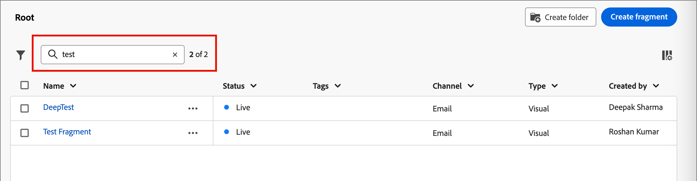

# Fragments

A fragment is a reusable component that can be referenced in one or more emails and email templates across [!DNL Journey Optimizer B2B Prime]. It is usually a block of content (text, image, or both) that can be pre-created and quickly inserted into an email or email template. With this functionality, you can prebuild multiple custom content blocks for use by your marketing team members to assemble email content for an improved design process. Common use cases include header/footer content blocks for email, event invite banners, and seasonal greetings.

>[!BEGINSHADEBOX]

**Visual fragments**

Visual fragments are pre-defined visual blocks built using the visual design tools that you can reuse across multiple emails or email templates. The current scope of [!DNL Journey Optimizer B2B Prime] and this documentation includes visual fragments only.

>[!NOTE]
>
>Expression-based fragments are not yet supported in [!DNL Journey Optimizer B2B Prime].

>[!ENDSHADEBOX]

To make the best use of fragments in your workflows:

* _Create your own fragments_ - Create visual fragments, either from scratch or by saving content as a fragment from the visual content design space.
* _Reuse fragments_ - Use them as many times as needed in your email or email template content.

## Access and manage fragments {#access-manage-fragments}

To access visual fragments in [!DNL Journey Optimizer B2B Prime], go to the left navigation and expand **[!UICONTROL Content Management]**. Then, select **[!UICONTROL Fragments]**. This action opens a listing page with all the fragments created in the instance listed in a table.

{width="700" zoomable="yes"}

The table is sorted by the _[!UICONTROL Modified]_ column, with the most recently updated fragments at the top by default. Click the column title to change between ascending and descending.

The folder structure on the left allows you to organize fragments. By default, all fragments are displayed. When you select a folder, only the fragments and subfolders included in the selected folder are displayed.

### Fragment status {#fragment-status}

The fragment status determines its availability for use in an email or email template, and the changes that you can make to it.

| Status | Description |
| ------ | ----------- |
| Draft | When you create a fragment, it is in draft status. It remains in this status as you define or edit the visual design space until you publish it for use in an email or email template. Available actions: <ul><li>Edit all details<li>Edit in visual design space<li>Publish<li>Duplicate<li>Delete|
| Live | When you publish a fragment, it becomes available for use in an email or email template. Published fragment content cannot be modified in the visual design space. Available actions: <ul><li>Edit description<li>Add to an email or template<li>Create draft version<li>Duplicate<li>Delete (if not in-use)|
| Live (with draft) | When you create a draft from a live fragment, the live version remains available for use in an email or email template, and the draft content can be modified in the visual design space. If you publish the draft version, it replaces the current live version and the content is updated in the emails and email templates where it is in use. Available actions: <ul><li>Edit description<li>Add to an email or template<li>Edit draft version in the visual design space<li>Publish draft version<li>Duplicate<li>Delete (if not in-use)|
| Archived | The fragment is archived and is not displayed in the _Fragments_ list. |

### Filter the fragments list {#filter-list}

To search for a fragment by name, enter a text string into the search bar for a match. When a [folder](#folders) is selected, the search applies to all fragments or folders in the first level of hierarchy of that folder.

{width="500" zoomable="yes"}

Click the _Filter_ icon (  ) to show the available filter options and change the settings to filter the displayed items according to your specified criteria.

### Customize the column display {#column-display}

Customize the columns that you want to display in the table by clicking the _Customize table_ icon (  ) at the top right.

In the dialog, select the columns to display and click **[!UICONTROL Apply]**.

{width="300"}

### Bulk actions {#bulk-actions}

You can select multiple fragments using the checkboxes and apply bulk operations to all of them. The available actions are displayed in a bulk action bar at the bottom of the list page. The following operations are available:

* **[!UICONTROL Move to folder]** - Move selected fragments into a folder.
* **[!UICONTROL Archive]** - Archive selected fragments.

You can also sort the fragment list by clicking any column header, and resize columns by dragging the column border to fit the data you need.

## Create fragments {#create-fragments}

You can create new visual fragments in [!DNL Journey Optimizer B2B Prime] by clicking **[!UICONTROL Create fragment]** at the top right.

1. In the _[!UICONTROL Create fragment]_ page, enter a useful **[!UICONTROL Name]** (required) and **[!UICONTROL Description]** (optional).

   * Name - Maximum of 100 characters, must be unique, case-insensitive

   * Description - Maximum of 300 characters

   * Alpha, numeric, and special characters are allowed

   * Reserved characters are **_not allowed_**: `\ / : * ? " < > |`

   {width="700" zoomable="yes"}

1. Click **[!UICONTROL Create]**.

   The visual design space opens with an empty canvas.

1. Use the content design tools to create the visual fragment content:

   * [Add structure and content](./fragment-authoring.md#design-fragment)
   * [Add assets](./fragment-authoring.md#add-assets)
   * [Navigate the layers, settings, and styles](./fragment-authoring.md#navigate-layers-settings-styles)
   * [Personalize content](./fragment-authoring.md#personalize-content)
   * [Edit linked URL tracking](./fragment-authoring.md#edit-linked-url-tracking)

1. Click **[!UICONTROL Save]** at any time to save the draft fragment.

1. When you are ready to make the fragment available for use in an email or email template, click **[!UICONTROL Publish]**.

## View fragment details {#view-details}

Click the name of any fragment in the list page to open the fragment details page. You can choose to edit the fragment, rename the fragment, or update the fragment description. Make updates and click outside of the name or description field to auto-save changes.

>[!NOTE]
>
>If a published fragment is in use by an email or email template, you cannot change the name or edit the content. You can create a draft version if you want to make changes to the fragment.

{width="700" zoomable="yes"}

Click **[!UICONTROL Edit fragment]** to open the fragment in the visual content editor.

Exit the view at any time by clicking the _Back_ arrow at the top left, which returns you to the _Fragments_ list page.

## View fragment references {#references}

For a _Live_ fragment, you can view a list of assets that currently reference (use) the fragment.

1. Within the fragment details page, click the More (**...**) icon at the top right.

1. Select **[!UICONTROL Explore references]**.

   The _[!UICONTROL Fragment usage]_ page displays a list of assets where the fragment is currently used within [!DNL Journey Optimizer B2B Prime], across emails and email templates.

   >[!IMPORTANT]
   >
   >Any fragment that is currently in use by any email or email template cannot be deleted.

   References are displayed according to category: _Email_ or _Email template_. Every email in [!DNL Journey Optimizer B2B Prime] is defined within a _Send Email_ action node of a person journey, so the parent journey of the email that uses the fragment is displayed in references.

1. Click the link to open the corresponding email or email template where the fragment is used.

## Use folders to manage fragments {#folders}

To easily navigate your fragments, you can use folders to organize them more effectively into a structured hierarchy. This enables you to categorize and manage the items according to your organization needs.

Select the _[!UICONTROL Root]_ folder to display all fragments, including those located in all subfolders. Select any folder in the structure to display its contents. With a folder selected, click Create fragment to create a new fragment in that folder.

### Create folders {#folders-create}

1. With the parent folder selected (Root or another folder), click **[!UICONTROL Create folder]** at the top right.

1. Enter a **[!UICONTROL Name]** for the new folder and click **[!UICONTROL Save]**.

   The new folder appears on top of the list inside the selected parent folder.

   You can click the More menu ( **...** ) icon to rename, move, or delete the folder.

### Move folders {#folders-move}

1. Click the _More menu_ (**...**) icon next to the name of the fragment that you want to move.

1. Choose **[!UICONTROL Move to folder]**.

1. In the dialog, navigate the folder structure and select the folder where you want to move the fragment.

1. Click **[!UICONTROL Move]**.

### Delete folders {#folders-delete}

1. In the folder structure, select the parent for the folder that you want to delete.

1. Click the _More menu_ (**...**) icon next to the name of the displayed subfolder that you want to delete.

1. Choose **[!UICONTROL Delete folder]**.

## Edit fragments {#edit-fragments}

Edits to a fragment depend on its current status:

* When a fragment is in _Draft_ status, you can edit any of its details and the visual content.
* When a fragment is in _Live_ status, you can edit the fragment description, but not the name. You cannot edit the visual content unless you create a draft.
* When a fragment is in _Live_ status with an existing draft, editing the details is limited to the description. You can also edit the visual content for the draft version.

>[!BEGINTABS]

>[!TAB Draft]

1. From the _[!UICONTROL Fragments]_ listing page, click the fragment name to open it.

   A preview of the visual content is displayed.

1. Modify the description, if needed.

   {width="600" zoomable="yes"}

1. To make changes to the content in the visual design space, click **[!UICONTROL Edit]** at the top right.

   Use the visual design tools as needed:

   * [Add structure and content](./fragment-authoring.md#design-fragment)
   * [Add assets](./fragment-authoring.md#add-assets)
   * [Navigate the layers, settings, and styles](./fragment-authoring.md#navigate-layers-settings-styles)
   * [Personalize content](./fragment-authoring.md#personalize-content)
   * [Edit linked URL tracking](./fragment-authoring.md#edit-linked-url-tracking)

   Click **[!UICONTROL Save]**, or **[!UICONTROL Save & close]** to return to the fragment details.

1. When the fragment meets your criteria and you want to make it available for use in an email or email template, click **[!UICONTROL Publish]**.

>[!TAB Live]

1. From the _[!UICONTROL Fragments]_ listing page, click the fragment name to open it.

   A preview of the visual content is displayed, with the fragment details on the right.

1. Modify the description, if needed.

1. If you want to update the content, click **[!UICONTROL Modify]** at the top right.

1. In the dialog, click **[!UICONTROL Confirm]** to create a draft version of the fragment. 

   {width="300"}

1. Click **[!UICONTROL Edit]** at the top right.

1.  Use the visual design tools as needed to update the content in the draft:

   * [Add structure and content](./fragment-authoring.md#design-fragment)
   * [Add assets](./fragment-authoring.md#add-assets)
   * [Navigate the layers, settings, and styles](./fragment-authoring.md#navigate-layers-settings-styles)
   * [Personalize content](./fragment-authoring.md#personalize-content)
   * [Edit linked URL tracking](./fragment-authoring.md#edit-linked-url-tracking)

   Click **[!UICONTROL Save]**, or **[!UICONTROL Save & close]** to return to the fragment details.

1. When the draft fragment meets your criteria and you want to make the changes available for use in an email or email template, click **[!UICONTROL Publish]**.

   When you publish the draft version, it replaces the current live version and the content is updated in the emails and email templates where it is already in use.

>[!TAB Live (with draft)]

There are two ways to open the draft version for editing from the _[!UICONTROL Fragments]_ listing page:

* Click the _Draft_ icon ( ) next to the fragment name.

* Click the fragment name to open it. Then, click the _More menu_ (***...***) icon at the top right and choose **[!UICONTROL Open draft version]**.

A preview of the visual content for the draft version is displayed.

_To update the draft content:_

1. Click **[!UICONTROL Edit]** at the top right.

1. Use the visual design tools as needed:

   * [Add structure and content](./fragment-authoring.md#design-fragment)
   * [Add assets](./fragment-authoring.md#add-assets)
   * [Navigate the layers, settings, and styles](./fragment-authoring.md#navigate-layers-settings-styles)
   * [Personalize content](./fragment-authoring.md#personalize-content)
   * [Edit linked URL tracking](./fragment-authoring.md#edit-linked-url-tracking)

   Click **[!UICONTROL Save]**, or **[!UICONTROL Save & close]** to return to the fragment details.

1. When the draft fragment meets your criteria and you want to make the changes available for use in an email or email template, click **[!UICONTROL Publish]**.

   When you publish the draft version, it replaces the current published version and the content is updated in the emails and email templates where it is already in use.

>[!ENDTABS]

## Duplicate fragments {#duplicate-fragments}

You can duplicate a fragment using either of the following methods:

* From the _[!UICONTROL Fragments]_ listing page, click the _More_ icon (**...**) next to the fragment name and choose **[!UICONTROL Duplicate]**.
* At the top right of the fragment details page, click the _More_ (**...**) icon and choose **[!UICONTROL Duplicate]**.

In the dialog, enter a useful name (unique) and description. Click **[!UICONTROL Duplicate]** to complete the action.

The duplicated (new) fragment then appears in the _Fragments_ listing, located in the same folder.

<!-- 

## Save a new fragment from email or template content {#save-as-fragment}

When you are creating/editing an email or email template in the visual content editor, you can choose to save all or parts of the content as a fragment so that it is available for reuse.

1. When you have some content to be saved as a fragment, click **[!UICONTROL More]** and choose **[!UICONTROL Save as Fragment]**.

1. Select the different elements to be included in the fragment.

   Select multiple structures by holding the Shift or Control button.

   You can only select structures that are adjacent to each other and the interface does not allow you to select non-adjacent elements.

1. With the content selected, click **[!UICONTROL Create]** at the top right.

1. In the dialog, enter a useful name and description for the fragment. Then click **[!UICONTROL Create]**.

   The new fragment is then displayed in the _Fragments_ listing page and is also available for use within emails and email templates.

-->

## Add visual fragments to your email or template content {#add-to-content}

Fragments are designed for reuse and can be inserted for email and email template authoring. You can add up to 30 fragments in an email or template. Fragments can be nested up to one level only.

>[!BEGINTABS]

>[!TAB Add fragments to an email]

1. Navigate to a person journey and open an existing _[!UICONTROL Send Email]_ action node or [add a new one](../marketing/action-nodes.md#add-an-action-node).

1. Click **[!UICONTROL Edit email body]** to open or continue [authoring the email content](./email-authoring.md).

1. Drag and drop an item from the **[!UICONTROL Structures]** menu to provide a _structure_ for the fragment.

1. To open the listing of published fragments, click the _Fragments_ icon.

   You can:
   * Sort the listing.
   * Browse, search, and filter the listing.
   * Switch between card (thumbnail) and list views.
   * Refresh the list to reflect any of the recently created fragments.

   {width="600"}

1. Drag and drop any of the fragments into the structure component placeholder.

   The editor renders the fragment within the section/element of the email structure.

The content of the fragment is dynamically updated within the structure to render a visual of how the content appears in the email.

>[!TIP]
>
>If you want the fragment to occupy the entire horizontal layout within the email, add a [!UICONTROL 1:1 column] structure and then drag and drop the fragment into it.

After the email is saved, it appears in the fragment details page when the _[!UICONTROL Used By]_ tab is selected. Fragments added to an email are not editable within the email or template -- the published source fragment defines the content.

>[!TAB Add fragments to an email template]

1. From the left navigation, expand **[!UICONTROL Content Management]** and select **[!UICONTROL Templates]**.

1. [Create a new template](./templates-create.md), or open an existing email template.

1. In the template properties panel on the right, click **[!UICONTROL Edit email body]**.

1. Drag and drop an item from the **[!UICONTROL Structures]** menu to provide a containing _structure_ for the fragment.

1. To open the fragments listing, click the _Fragments_ icon on the left.

   You can:
   * Sort the listing.
   * Browse, search, and filter the listing.
   * Switch between card (thumbnail) and list views.
   * Refresh the list to reflect any of the recently created fragments.

   {width="600"}

1. Drag and drop a fragment into the structure component.

   The editor renders the fragment within the section/element of the email template structure.

>[!TIP]
>
>If you want the fragment to occupy the entire horizontal layout within the email template, add a _[!UICONTROL 1:1 column]_ structure and then drag and drop the fragment into it.

After the email template is saved, it appears in the fragment details page when the _[!UICONTROL Used By]_ tab is selected. Fragments added to an email template are not editable within the template -- the published source fragment defines the content.

>[!ENDTABS]

## Fragment actions during email and template authoring {#fragment-actions}

When a fragment is added to an email or email template, the fragment content cannot be edited within the email or template. However, you can apply the following actions:

* **[!UICONTROL Delete]** - This action removes the fragment from the current email or email template content (the fragment source is unaffected).
* **[!UICONTROL Refresh]** - This action refreshes the content of the fragment in the current email or email template. Refreshing is useful when you want to reflect any recent edits to the fragment after the addition to the email or email template.
* **[!UICONTROL Duplicate]** - This action duplicates the fragment within the same email or email template within the editor, with the same dimensions and added just below it.
* **[!UICONTROL Open fragment]** - This action opens a new browser tab with the fragment editor page and details.
* **[!UICONTROL Explore references]** - This action opens the Fragment usage page, where you can view usage for the fragment by type.
* **[!UICONTROL Break inheritance]** - This action breaks the inheritance of the fragment (and its changes) from the source. Use this action to make the fragment content available as independent and editable content within the email or email template. This action also removes the email or email template from the _Used By_ reference for the original fragment.

When you select the fragment on the editor page, these actions are available from the context toolbar and the properties panel on the right.

{width="600" zoomable="yes"}
