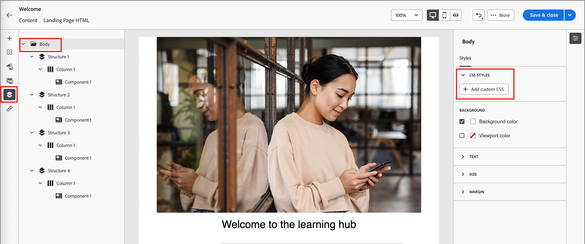

# Landing page design

After you [create a landing page](./landing-pages-create-publish.md#create-landing-page), use the visual design space to author the structural and content components in your page.

## Add structure and content {#structure-content-landing-page}

{{$include /help/_includes/content-design-components-prime.md}}

### Add custom CSS {#add-custom-css}

You can add your own custom CSS directly within the landing page design space. Use custom CSS to apply advanced and specific styling, for greater flexibility and control over the appearance of your content. It is a best practice to add this highest-level styling before you include components, such as images, buttons, and text.

With at least one content component in the canvas, select the **[!UICONTROL Body]** component in the left navigation tree to access the custom CSS editor.

{width="800" zoomable="yes"}

See [Add custom CSS for your content](./design-custom-css.md) for steps, syntax rules, and troubleshooting.

### Add assets {#add-assets}

In the visual design space, select the _Assets_ (  ) icon in the left navigation bar to browse and select image assets from the [!DNL Journey Optimizer B2B Prime] asset library.

For steps to select, replace, or upload image assets, see [Use assets for content authoring](./digital-asset-management.md#assets-authoring).

### Add forms {#add-forms}

{{$include /help/_includes/content-design-add-forms.md}}

### Navigate the layers, settings, and styles {#navigate-layers-settings-styles}

{{$include /help/_includes/content-design-navigation.md}}

### Personalize content {#personalize-content}

[!DNL Journey Optimizer B2B Prime] uses Handlebars syntax for personalization. Tokens are replaced with values from each visitor's profile data when the landing page is viewed.

_To add personalization:_

1. Select the text component and click the _Add personalization_ (  ) icon in the toolbar.
1. In the personalization dialog, browse the schema tree on the left and select an attribute. The editor inserts the corresponding Handlebars expression.
1. Add a fallback value to handle missing data, if needed.
1. Click **[!UICONTROL Confirm]** or **[!UICONTROL Insert]**. The expression appears inline in the field.

For details about expression editor tools and syntax, see [Personalization editor](./personalization-expressions.md).

### Edit linked URL tracking {#linked-url-tracking}

{{$include /help/_includes/content-design-links.md}}

{width="400"}

Use the **[!UICONTROL Tracking Type]** to control tracking for the link:

* **[!UICONTROL Tracked]** - Activates tracking on the link URL.
* **[!UICONTROL Never]** - Never activates tracking of the link URL.

### Save your work {#save-your-work}

Click **[!UICONTROL Save]** at any time to save the draft landing page.

You can continue to make edits to the draft page. When you are ready to display the page and make it available for linking in an email or SMS message, you can publish the page.

### View options {#view-options}

Leverage the view and content validation options that are available in the visual design space.

* Zoom in/out on the content across preset zoom options.

* Switch viewing the content across Desktop, Mobile, or Text-only/Plain-text.
   * Click the _View_ icon for content preview across devices.
   * Select one of the out-of-the-box devices or enter custom dimensions to preview the content.

### More options {#more-options}

From the _[!UICONTROL More ...]_ menu at the top of the visual design space, you can take the following actions:

{width="500"}

* **[!UICONTROL Reset landing page]** - Click this option to clear the visual design canvas to a blank slate and restart building your page content.
* **[!UICONTROL Change your design]** - Return to the _[!UICONTROL Create your primary landing page]_ home page. From there, you can choose another template to restart the design process, or choose to design the page from scratch in a blank canvas.
* **[!UICONTROL Export HTML]** - Download the content in the visual canvas to your local system in HTML format packaged as a zip file.
