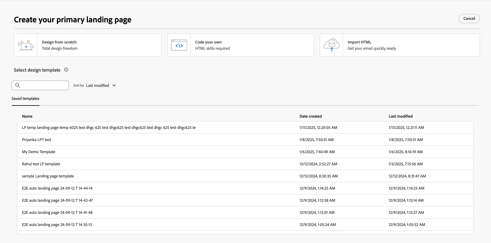
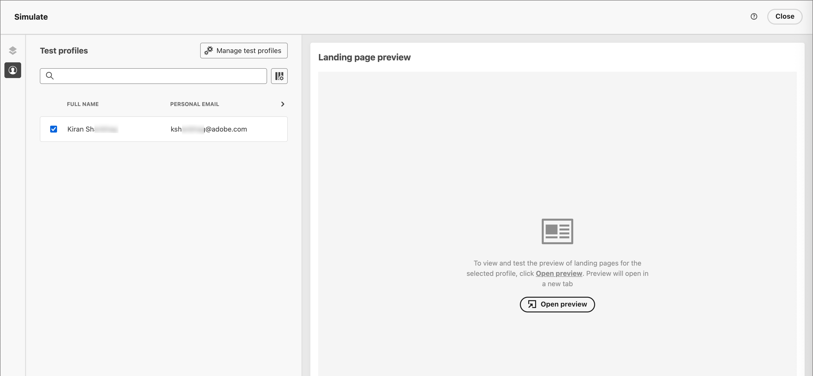

# Create and publish landing pages

As a marketer, you can define and publish pages that you want to incorporate into your journeys. When you add a new landing page, you configure the primary page and any subpages, design the content, test it, and publish it.

>[!BEGINSHADEBOX]

## Landing page prerequisites {#landing-page-prerequisites}

Before marketers can create landing pages to support their journeys, the following configurations and assets must be in place:

* [Landing page subdomain](../admin/configuration-presets-landing-pages.md#lp-subdomains) - Set up a subdomain dedicated to hosting your landing pages.
* [Landing page preset](../admin/configuration-presets-landing-pages.md#lp-presets) - A preset defines the subdomain and other settings applied to your landing pages.
* [Form](./forms.md) (for data capture use cases) - Required when you want to embed a form on a landing page and submit data to Experience Platform.

>[!ENDSHADEBOX]

## Create a landing page {#create-landing-page}

>[!CONTEXTUALHELP]
>id="ajo-b2b-prime_lp_create"
>title="Define and configure your landing page"
>abstract="To create a landing page, you need to select a preset, then configure the primary page and subpages, and finally test your page before publishing it."

To direct members of a journey audience to a defined web page when they click a specific link, create a landing page in [!DNL Journey Optimizer B2B Prime].

>[!IMPORTANT]
>
>Before you create your first landing page, complete the landing page setup. This includes configuring a subdomain to host your landing pages and defining at least one preset that specifies the subdomain and other channel settings. You select a preset when you create the landing page. For administrator setup, see [Landing page configuration](../admin/configuration-presets-landing-pages.md).
>
>For data capture use cases, create a [form](./forms.md) before you embed it on a landing page.

_To create a landing page:_

1. Go to the left navigation and select **[!UICONTROL Content Management]** > **[!UICONTROL Landing pages]**.

1. From the landing page list, click **[!UICONTROL Create landing page]**.

1. Enter a **[!UICONTROL Title]** (required) and **[!UICONTROL Description]** (optional).

   Title and description criteria:

   * **Title** — Maximum of 100 characters. Must be unique (case-insensitive).
   * **Description** — Maximum of 300 characters.
   * Alpha, numeric, and special characters are allowed.
   * Reserved characters are **_not allowed_**: `\ / : * ? " < > |`

   {width="600"}

1. Select a **[!UICONTROL Preset]**.

   An administrator [creates landing page presets](../admin/configuration-presets-landing-pages.md#lp-presets) to define the subdomain and other settings used for landing pages. Select a preset, then click **[!UICONTROL View preset]** to review its settings and confirm they match your landing page requirements.

1. Click **[!UICONTROL Create]**.

   The primary page and its properties are displayed. Learn how to [configure the primary page settings](#configure-primary-page).

   {width="700" zoomable="yes"}

1. To add a subpage (for example, a thank-you or error page), click the **+** icon.

   You can add up to two subpages per landing page.

After you configure and design the primary page and any subpages, [test your landing page](#test-landing-page) before you publish it.

>[!CAUTION]
>
>You cannot access your landing page by copying and pasting the defined URL into a web browser, even if the page is published. Test the page using the preview function as described in [Test the landing page](#test-landing-page).

## Configure the primary page {#configure-primary-page}

>[!CONTEXTUALHELP]
>id="ajo-b2b-prime_lp_primary_page"
>title="Define your primary page settings"
>abstract="Define the primary page, which is immediately displayed when a recipient clicks the landing page link, such as from an email or a website."

>[!CONTEXTUALHELP]
>id="ajo-b2b-prime_lp_access_settings"
>title="Define your landing page URL"
>abstract="In this section, define a unique landing page URL. The first part of the URL requires that you previously set up a landing page subdomain as part of the preset you selected."

The primary page is the page that is immediately displayed when a recipient clicks the landing page link, such as from an email or a website.

_To define the primary page settings:_

1. Change the **[!UICONTROL Page Name]** according to your needs, which is _Primary page_ by default.

1. Define the ending portion of the page URL.

   The preset that you selected determines the first part of the URL. An administrator configures the [landing page subdomain](../admin/configuration-presets-landing-pages.md#lp-subdomains) as part of the preset.

   >[!CAUTION]
   >
   >The landing page URL must be unique.
   >
   >You cannot access your landing page by copying and pasting this URL into a web browser, even if the page is published. Test it using the preview function as described in [Test the landing page](#test-landing-page).

1. If you want an anonymous landing page, disable the **[!UICONTROL Require identified users]** option.

1. Click the _Calendar_ (  ) icon to set the **[!UICONTROL Page expiry]**.

   After you select an expiry date, choose the action upon page expiration:

   * **[!UICONTROL Redirect URL]** - Enter the URL of the page to use as a redirect.

      {width="400"}

   * **[!UICONTROL Browser error]** - Enter the error text to display in place of the page.

      {width="400"}

## Choose the content design type {#choose-design-type}

To add the _[!UICONTROL Content]_ for the page, click **[!UICONTROL Open Designer]**. The design process begins with choosing how you want to start:

* [Design from scratch](#design-from-scratch)
* [Import HTML](#import-html)

{width="800" zoomable="yes"}

After you select your preferred method for starting the landing page design, use the visual design tools to [complete the page content](./landing-page-design.md).

### Design from scratch {#design-from-scratch}

Use the visual content design space to define the structure and content of the landing page. By adding and moving structural components with simple drag-and-drop actions, you can design the layout and organization of the page content within seconds.

1. From the design home page, select the **[!UICONTROL Design from scratch]** option.

1. [Add structure and content](./landing-page-design.md#structure-content-landing-page) to the page.

1. [Review and edit linked URL tracking](./landing-page-design.md#linked-url-tracking).

1. [Test the landing page](#test-landing-page).

When you are satisfied with the content, click **[!UICONTROL Save]**.

### Import HTML {#import-html}

<!-- originally  from   /help/_includes/content-design-import.md but copied and revised to omit the part about Marketo Engage assets and AEM assets -->

Imported content can be:

* An HTML file with an incorporated style sheet
* A .zip file that includes an HTML file, the style sheet (.css), and images

   >[!NOTE]
   >
   >There are no constraints on the .zip file structure. However, references must be relative and fit with the tree structure of the .zip folder. The images are always uploaded to the [assets repository](./digital-asset-management.md).

_To import a file containing HTML content:_

1. From the design home page, select the **[!UICONTROL Import HTML]** option.

1. Drag and drop the HTML or .zip file containing your HTML content and click **[!UICONTROL Import]**.

{width="500"}

>[!NOTE]
>
>Using a `<table>` tag as the first layer in an HTML file can cause style loss, including background and width settings in the top layer tag.

You can personalize the imported content as needed with the visual design tools.

## Check alerts {#check-alerts}

As you design your landing page content, alerts appear at the top right when key settings are missing.

{width="250"}

If you do not see this button, there are no detected issues.

There are two types of alerts:

* **_Warnings_** that refer to recommendations and best practices, such as:

   * `Placeholder links are present in the landing page body`: Do not forget to replace the placeholders with valid links.

   * `Text version of HTML is empty`: Do not forget to define a text version of your page body, which is used when HTML content cannot be displayed.

   * `Empty link is present in page body`: Check that all the links in your page are correct.

* **_Errors_** that prevent you from testing or activating the journey as long as they are not resolved, such as:

   * `The landing page content is empty`: Page content is mandatory.

## Test the landing page {#test-landing-page}

>[!CONTEXTUALHELP]
>id="ajo-b2b-prime_preview_lp_profiles"
>title="Preview and test your landing page"
>abstract="After you define your landing page settings and content, use test profiles to preview the page."

When the landing page settings and content are defined, you can use test profiles to preview the page. If you inserted [personalized content](./landing-page-design.md#personalize-content), you can check how this content is displayed in the landing page using test profile data.

>[!PREREQUISITES]
>
>To preview and test landing pages, you must have the **[!UICONTROL Publish Messages]** permission and a defined dataset that contains test profiles.

1. Click **[!UICONTROL Preview & test]** to open the test profile selection.

   >[!NOTE]
   >
   >You can also use **[!UICONTROL Simulate content]** when you are in the visual design space.

1. From the _[!UICONTROL Simulate]_ screen, select a test profile.

   {width="700" zoomable="yes"}

   If the profiles that you need are not listed, click **[!UICONTROL Manage test profiles]** to use a known test profile email address and add it to the list.

   +++Add test profiles

   For **[!UICONTROL Identity namespace]**, click the _Select_ icon (  ) and choose the `Email` namespace to use to test profiles.

   {width="700" zoomable="yes"}

   In the **[!UICONTROL Identity value]** field, enter the email address to identify the test profile and click **[!UICONTROL Add profile]**. You can repeat this to add multiple profiles.

   {width="700" zoomable="yes"}

   Click the back arrow at the top left to return to the _[!UICONTROL Simulate]_ page.

   +++

1. Select **[!UICONTROL Open preview]** to test your landing page.

   The landing page preview opens in a new tab. The selected test profile data replaces personalized elements.

   {width="600"}

1. Select other test profiles to preview the rendering for each variant of your landing page.

## Publish the page {#publish-landing-page}

>[!PREREQUISITES]
>
>To publish landing pages, you must have the **[!UICONTROL Publish Messages]** permission. Before publishing, [check and resolve all alerts](#check-alerts).

When the draft page meets your criteria and you want to make it available for linking in your journey messages, click **[!UICONTROL Publish]** at the top right. In the confirmation dialog, click **[!UICONTROL Publish]** again to confirm.

{width="250"}

When the landing page is published, it is displayed in the landing page list with the **_[!UICONTROL Published]_** status. This means that it is live and ready to be used in an email or SMS message sent through a journey.

You cannot access the published landing page by copying and pasting the URL into a web browser. You can test it at any time using the [preview function](#test-landing-page).
