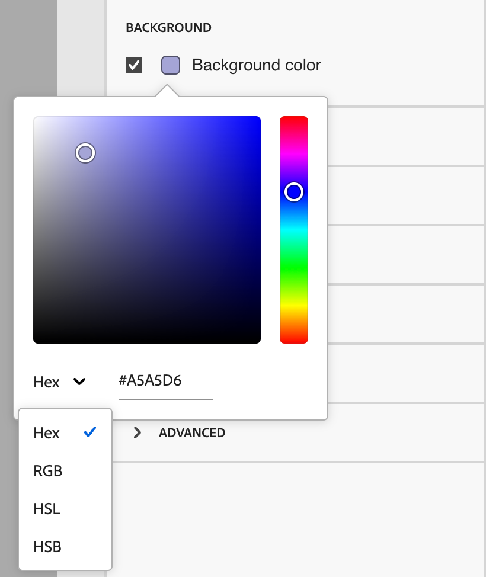
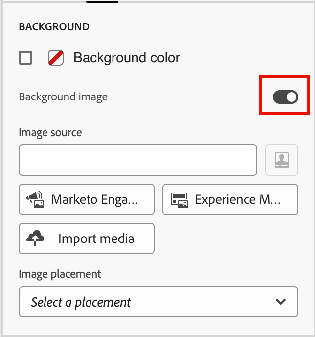

# Structure components {#structure-components}

>[!CONTEXTUALHELP]
>id="ajo-b2b-prime_structure_components_email"
>title="About Structure components"
>abstract="Structure components are layout elements that you can use to design the structure of an email."

>[!CONTEXTUALHELP]
>id="ajo-b2b-prime_structure_components_landing_page"
>title="About Structure components"
>abstract="Structure components are layout elements that you can use to design the structure of a page."

>[!CONTEXTUALHELP]
>id="ajo-b2b-prime_structure_components_fragment"
>title="About Structure components"
>abstract="Structure components are layout elements that you can use to design the structure of a fragment."

>[!CONTEXTUALHELP]
>id="ajo-b2b-prime_structure_components_template"
>title="About Structure components"
>abstract="Structure components are layout elements that you can use to design the structure of a template."

Use the _Structure components_ in the visual design space to define the structure of your content. By adding and moving structural elements with simple drag-and-drop actions, you can quickly define the shape of your content layout. Each structure component spans the horizontal space and you can stack them to build the layout vertically. <!-- Divide each component into columns to form each content block that you need, then add [content components](./content-components.md) inside them to populate the layout. -->

## Structure library {#structure-library}

At the top of the _[!UICONTROL Components]_ library, the **[!UICONTROL Structures]** section displays the available structure components:

| Icon  | Component  | Description |
| ----- | ----------- | ----------- |
|  | [!UICONTROL 1:1 column] |  A single column container that fills the width of the space. |
|  | [!UICONTROL 1:2 column Left] | A two-column container that uses a 1:2 ratio to fill the width of the space. The first (left) column occupies a third of the width and the second (right) occupies the remaining two-thirds. |
|  | [!UICONTROL 1:3 column Left] | A two-column container that uses a 1:3 ratio to fill the width of the space. The first (left) column occupies a fourth of the width and the second (right) occupies the remaining three-fourths. |
|  | [!UICONTROL 2:1 column Right] | A two-column container that uses a 2:1 ratio to fill the width of the space. The first (left) column occupies two-thirds of the width and the second (right) occupies the remaining one-third. |
|  | [!UICONTROL 2:2 column] | A two-column container that uses a 2:2 ratio to fill the width of the space. The left and right columns are equal in width. |
|  | [!UICONTROL 3:1 column Right] | A two-column container that uses a 3:1 ratio to fill the width of the space. The first (left) column occupies three-fourths (75%) of the width and the second (right) occupies the remaining one-fourth (25%). |
|  | [!UICONTROL 3:3 column] | A three-column container that uses a 3:3 ratio to fill the width of the space. All three columns are equal in width. |
|  | [!UICONTROL 4:4 column] | A four-column container that uses a 4:4 ratio to fill the width of the space. All four columns are equal in width. |
|  | [!UICONTROL n:n column] | A customizable column structure that fills the space according to the columns that you define. You set the number of columns (between two and ten) and set the width of each column individually. [Learn more](#change-nn-columns) |

## Add structure components {#add-structure-components}

When you design the content for your email, landing page, or fragment, add each structure component to construct the layout. Drag an item from the **[!UICONTROL Structures]** section on the left and drop it onto the canvas. You can use the toolbar to select a column and use the _Settings_ and _Styles_ tabs on the right panel to define the parameters for the selected component or column.

{width="800" zoomable="yes"}

### Component toolbar {#component-toolbar}

The toolbar is displayed in the canvas when you select it in the canvas. The available tools provide an easy way to select a column and apply component functions.

{width="150"}

| Tool | Name | Usage |
| ---- | ---- | ----- |
| {width="40"} | Enable conditional content | (Emails and fragments) Enable conditional variants for the component. |
| {width="100"} | Select a column |  Select a column by number. When the column is selected, you can apply column settings and styles. |
| {width="40"} | Duplicate | Create a copy of the component and add it directly below. |
| {width="40"} | Delete | Remove the component. |

### Component settings {#component-settings}

After you add a component, it is selected in the visual design space and its properties are displayed in the right panel. The _[!UICONTROL Settings]_ tab is displayed by default. You can also select a structure component at any time to change the settings.

#### Display options

If you want to exclude the component from desktop or mobile device display, change the **[!UICONTROL Display Options]** setting. The default, _[!UICONTROL Show on all devices]_, enables display across all devices. 

{width="400" zoomable="yes"}

Choose another setting to make the component exclusive by device type:

* _[!UICONTROL Show only on desktop devices]_ - Choose this setting when you want to display the component on desktop devices and exclude it for mobile devices.
* _[!UICONTROL Show only on mobile devices]_ - Choose this setting when you want to display the component on mobile devices, such as phones and tablets, and exclude it for desktop devices.

#### Header and footer

You can designate a structure component as the HTML header or footer in the email message or landing page. With the structure component selected in the canvas, click the **[!UICONTROL Header]** or **[!UICONTROL Footer]** option. There can be only one header or footer, and the option is not available if another component is assigned.

{width="600" zoomable="yes"}

You can remove the header or footer designation by selecting the component and clicking the option to remove it.

### Stacked columns {#stacked-columns}

For smaller screens or display windows, the columns in the structure component display as stacked unless you change the default setting. With the multi-column structure component selected, change the **[!UICONTROL Do not stack columns on mobile]** setting by moving the toggle slider to the right.

{width="250"}

## Component styles {#component-styles}

After you add a component, it is selected in the visual design space and its properties are displayed in the right panel. You can also select a component at any time to change the settings and styles.

### Background {#background}

With the _[!UICONTROL Styles]_ tab selected in the right panel, use the **[!UICONTROL Background]** section to define the color and optional image to use as a background for the structure component.

#### [!UICONTROL Background color]

Select the checkbox and click the color square to choose a color from the picker. You can choose a color by entering a known RGB, HSL, HSB, or hexadecimal value. Or, use the color slider and the color field to select the color.

{width="300"}

#### [!UICONTROL Background image] {#background-image}

Move the toggle selector to enable the background image settings.

{width="250"}

Click **[!UICONTROL Select Asset]** to open the asset selector, where you can choose an image from the [Assets library](./digital-asset-management.md#assets-authoring).

Use the **[!UICONTROL Image placement]** option to choose how the image fills the structure component. The placement settings follow the standard [HTML background image fill and alignment attributes](https://www.w3schools.com/html/html_images_background.asp){target="_blank"}.

{width="250"}

### Other styles {#other-styles}

You can apply other structure component styles to adjust its display in the email message or landing page. For styling beyond these built-in options, see [Add custom CSS for your content](./design-custom-css.md).

+++Border

{{styles-border}}

+++

+++Margin

{{styles-margin}}

+++

+++Advanced

{{styles-advanced}}

+++

## Columns {#columns}

Use the _Select a column_ tool in the component toolbar to select a column. You can then use the column toolbar to change the column selection, remove the column, or apply conditional content variations for the column. The parameters for the column are displayed in the _[!UICONTROL Settings]_ and _[!UICONTROL Styles]_ tabs on the right.

{width="500"}

| Tool | Name | Usage |
| ---- | ---- | ----- |
| — | Clear column | Clear the content in the column. See the first tool in the column toolbar figure. |
| {width="40"} | Enable conditional content | (Emails and fragments) Enable conditional variants for the column. |
| {width="100"} | Select a column |  Select a column by number. When the column is selected, you can apply settings and styles. |

### Change n:n columns {#change-nn-columns}

The column widths are static for most of the structure components. When you add the _[!UICONTROL n:n column]_ component, you can change the number of columns and the column sizing. The n:n column component starts with five columns of equal width (20%).

>[!NOTE]
>
>Each column size cannot be less than 10% of the total width of the structure component. Only empty columns can be removed.

With the component selected in the canvas, use the **[!UICONTROL Columns number]** option in the right panel to change the number of columns. Click the up and down arrow icons to increase or decrease the number of columns, or enter the number in the field. 

{width="650" zoomable="yes"}

In the canvas, move the column sizing icon to adjust the width of the selected column. As you increase or decrease the width, the adjacent column also adjusts so that all columns occupy 100% of the component width.

{width="500" zoomable="yes"}

### Column styles {#column-styles}

With the column selected in the canvas, you can set styles to apply to that column. 

+++Background

* **[!UICONTROL Background color]** - Select the checkbox and click the color square to choose a color from the picker. You can choose a color by entering a known RGB, HSL, HSB, or hexadecimal value. Or, you can use the color slider and the color field to select the color.

   {width="300"}

* **[!UICONTROL Background image]** - Move the toggle selector to enable the background image settings.

   {width="250"}

   Choose the asset source type and [select an image file](#background-image).

+++

+++Border

{{styles-border}}

+++

+++Alignment

{{styles-alignment-v}}

+++

+++Margin

{{styles-margin}}

+++

+++Advanced

{{styles-advanced}}

+++

## Navigation tree {#navigation-tree}

In the visual design space, you can access the structural components, including columns and content, using the navigation tree. Click the _[!UICONTROL Navigation tree]_ icon (  ) on the left to display the tree.

{width="800" zoomable="yes"}

The _[!UICONTROL Body]_ element is the root of the tree structure. Click any of the components or column child elements in the tree to select it on the canvas. The _[!UICONTROL Settings]_ and _[!UICONTROL Styles]_ tabs on the right display the parameters for that component or column.

{width="800" zoomable="yes"}
