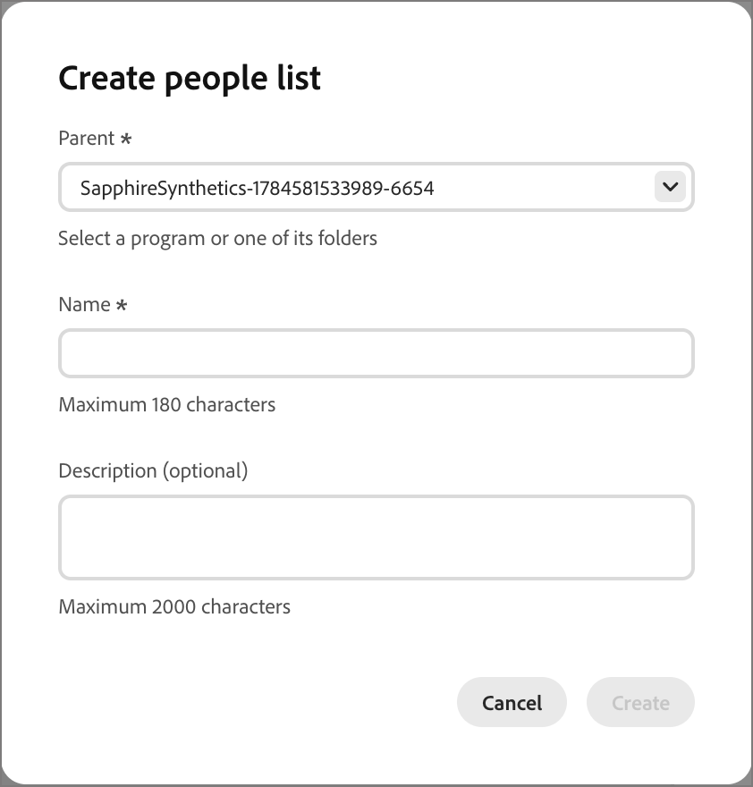
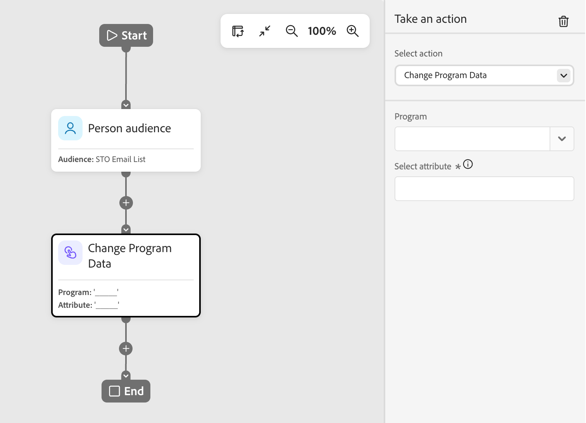

# Take an action node

In a person journey, use an action on people when you want to apply a change to all people on the node path.

## Actions and constraints {#actions}

| Action | Constraints |
| ------ | ----------- |
| **[!UICONTROL Activate to destination]** | <li>Select or create a static list <li>If the list does not have an activated destination, activate the list to one or more destinations |
| **[!UICONTROL Add Person to Journey]** | <li>Select a scheduled or live journey <li>Audience criteria of the target journey are not applied |
| **[!UICONTROL Add To List]** | <li>Create a new static list or select an existing one |
| **[!UICONTROL Add to Marketo List]** | <li>Select a static list in Marketo Engage |
| **[!UICONTROL Change Data Value]** | <li>Select person attribute <li>Set new value |
| **[!UICONTROL Change Program Data]** | <li>Select program attribute <li>Set new value |
| **[!UICONTROL Change Program Status]** | <li>Select program<li>Select new status |
| **[!UICONTROL Remove From List]** | <li>Select Static List <li>Skips person if not currently a member |
| **[!UICONTROL Remove from Marketo List]** | <li>Select a static list in Marketo Engage <li>Skips person if not currently a member |
| **[!UICONTROL Remove Person from Journey]** | <li>Select a live journey <li>Skips person if not currently a member of the target journey |
| **[!UICONTROL Request Marketo Campaign]** | <li>Select a Marketo Engage campaign |
| **[!UICONTROL Send Email]** | <li>Create, edit, or use an AI-personalized email <li>Send-time optimization (optional) |
| **[!UICONTROL Send WhatsApp]** | <li>Select a WhatsApp message |

## Add an action node {#add-an-action-node}

1. Navigate to the journey canvas.

1. Click the plus ( **+** ) icon on a path and choose **[!UICONTROL Take an action]**.

   {width="200"}

1. In the node properties on the right, select an action from the list and set any values for the action.

+++Activate to destination

Use this action to add people to a static list and activate that list to a destination directly from your journey. You can use an existing static list, or create one specifically for the journey.

>[!PREREQUISITES]
>
>You must have one or more [configured destinations](../audiences/destinations.md) for your [!DNL Journey Optimizer B2B Prime] sandbox before you set up an _Activate to destination_ journey node.

{width="450"}

Under **[!UICONTROL Add to list]**, choose one of the following options:

* **[!UICONTROL Create]** — Create a new static list and add people to it. The list is immediately available under **[!UICONTROL People lists]**.

   Select a parent program for the list and enter a **[!UICONTROL Name]** (required) and **[!UICONTROL Description]** (optional). Click **[!UICONTROL Create]** to add the new list for the node.

   {width="375"}
  
* **[!UICONTROL Select]** — Select an existing static list where you want to add people who reach the node.

   Select the checkbox for the existing static list and click **[!UICONTROL Save]**.

   {width="700" zoomable="yes"}

Anyone who reaches the node is added to the selected static list, but the action is not complete until the list is activated to a destination:

* If the selected list is already activated, its destinations appear under **[!UICONTROL Destinations]** and the action is ready.
* Otherwise, an _At least one destination is required_ message appears. Click **[!UICONTROL Activate list to destination]**, select the destination, and click **[!UICONTROL Save]**. Click **[!UICONTROL Activate]** in the confirmation dialog.

{width="600" zoomable="yes"}

When activation completes, the destination appears under **[!UICONTROL Destinations]** and the action is ready. You can activate the list to additional destinations if needed.

Anyone who reaches the node is added to the selected static list, which is activated to the chosen destination, so they are added to that destination audience and, in turn, to any campaign that the audience feeds.

+++

+++[!UICONTROL Add Person to Journey]

Use this action to add people to other scheduled or live journeys. People added through this action are immediately added to the audience of the target journey; the audience criteria of the target journey are not applied.

{width="450"}

+++

+++[!UICONTROL Add To List]

Use this action to add people to a static list in Journey Optimizer B2B Prime.

{width="450"}

Choose one of the following options:

* **[!UICONTROL Create]** — Create a new static list asset and add people to it. The list is immediately available for use by other assets in Journey Optimizer B2B Prime.
* **[!UICONTROL Select]** — Select an existing static list asset where you want to add people who reach the node.

+++

+++[!UICONTROL Add to Marketo List]

Use this action to add people to a static list in Marketo Engage.

{width="450"}

+++

+++[!UICONTROL Change Data Value]

Use this action to update the value of an attribute on a person record. Select the attribute and set the new value.

>[!TIP]
>
>To clear the value of an attribute, set the value to `NULL`.

{width="450"}

+++

+++[!UICONTROL Change Program Data]

Use this action to update the value of a program attribute. Select the program attribute and set the new value.

{width="450"}

+++

+++[!UICONTROL Change Program Status]

Use this action to change the status of a person in a Marketo Engage program. Select the program and then select the new status.

{width="450"}

+++

+++[!UICONTROL Remove From List]

Use this action to remove people from a static list in Journey Optimizer B2B Prime. If a person is not currently a member of the list, the action is skipped for that person.

{width="450"}

+++

+++[!UICONTROL Remove from Marketo List]

Use this action to remove people from a static list in Marketo Engage. If a person is not currently a member of the list, the action is skipped for that person.

{width="450"}

+++

+++[!UICONTROL Remove Person from Journey]

Use this action to remove people from other live person journeys. The person is immediately removed from the target journey and no further actions are taken on them. If a person is not currently a member of the target journey, the action is skipped for that person.

{width="450"}

+++

+++[!UICONTROL Request Marketo Campaign]

Use this action to add people to a request campaign in a connected Marketo Engage instance. Select the Marketo Engage campaign to request.

{width="450"}

+++

+++[!UICONTROL Send Email]

Use this action to send an email to opted-in people. People who are unsubscribed, block listed, email suspended, or marketing suspended skip this action.

{width="450"}

You can create an email, edit an existing email, or use an AI-personalized email. For information about creating and editing emails, see [Email channel](./email-channel.md).

You can use [Send-time optimization](./email-send-time-optimization.md) to personalize email delivery timing by predicting when each profile is most likely to engage.

+++

+++[!UICONTROL Send WhatsApp]

Use this action to send a WhatsApp message. You can create, personalize, and preview WhatsApp messages in the visual design space (see [WhatsApp authoring](../content/whatsapp-authoring.md)).

{width="450"}

+++
