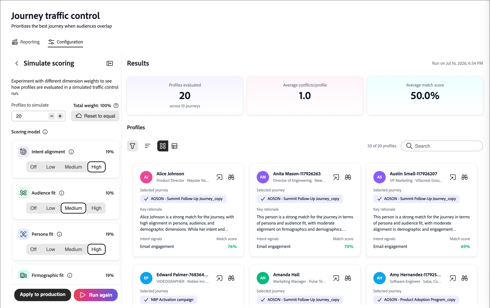

# Journey traffic control

Journey traffic control (JTC) prioritizes the best journey for a person when audiences overlap. When a person qualifies for two or more JTC-enabled journeys at the same time, an AI decisioning model evaluates that person against each candidate journey and adds them to the single best-fit journey at that moment, holding them out of the others.

>[!NOTE]
>
>Journey traffic control works the same way for both [!DNL Journey Optimizer B2B Ultimate] and [!DNL Journey Optimizer B2B Prime]. The capability and logic are identical; only minor UI differences exist between tiers. The information in this page reflects the [!DNL Journey Optimizer B2B Prime] experience.

After the person completes the journey, they are re-evaluated for the remaining journeys for which they remain qualified. JTC then adds them to the next best-fit journey, and so on. This prevents the same person from being flooded across multiple overlapping journeys simultaneously and ensures each contact receives the most relevant experience first.

>[!NOTE]
>
>Currently, a person can be placed in only one JTC-selected journey at a time. An administrator configuration option to allow a person to be enrolled in more than one journey concurrently is planned for a future release.

## Scoring dimensions {#scoring-dimensions}

The model evaluates each person journey combination across seven scoring dimensions. Each dimension is scored independently and then combined, according to the weights you configure, to produce a final match probability for that person and journey. The journey with the strongest match is selected.

| Dimension | What it evaluates |
|---|---|
| Intent alignment | Behavioral intent signals: keyword searches, product-page visits, content downloads, email opens/click-through, and pricing-page activity. |
| Audience fit | How well the person matches the [target audience](./person-audience-node.md) for the journey. |
| Persona fit | Alignment between the person's role/[persona](../audiences/personas.md) and the journey. |
| Firmographic fit | Company-level attributes (such as industry, size, and revenue). |
| Demographic match | Person-level demographic attributes. |
| Psychographic alignment | Attitudinal/preference-based alignment. |
| Engagement fit | Recency and depth of the person's [engagement](../audiences/engagement-scores.md). |

Dimensions for which a person has no data are skipped automatically, so scoring is never penalized for missing attributes.

>[!IMPORTANT]
>
>At least two journeys must have JTC enabled for the capability to do anything meaningful. Enabling it on a single journey causes no harm, but with no competing journey there is nothing to arbitrate. Only when two or more journeys are JTC-enabled does the model begin resolving conflicts.

## Prerequisites {#prerequisites}

Before journey traffic control can produce results, keep the following in mind:

* **Reporting requires a published, JTC-enabled journey.** The _[!UICONTROL Reporting]_ tab does not show any data until at least one journey is published with journey traffic control enabled.
* **Simulation requires at least one published journey in the instance.** Simulation evaluates [profiles](../audiences/people-lists.md) that are already in live journeys, so it does not work unless the instance has at least one published journey to draw profiles from. Simulation itself does not require JTC to be enabled (see [_Simulate scoring_](#simulate-scoring)).

## Get started {#get-started}

Select **[!UICONTROL Journey traffic control]** on the left navigation. The displayed page has two tabs:

* **[!UICONTROL Reporting]** — View the results of traffic control runs (populated only after JTC has run on live journeys).
* **[!UICONTROL Configuration]** — Adjust the scoring dimensions, simulate outcomes, and choose which journeys participate.

>[!IMPORTANT]
>
>For a brand-new customer who has never used journey traffic control, the _[!UICONTROL Reporting]_ tab is empty. Reporting only reflects journeys that have had traffic control applied and running. Start on the _[!UICONTROL Configuration]_ tab.

## Configuration tab {#configuration-tab}

The _[!UICONTROL Configuration]_ tab has two sections: **[!UICONTROL Adjust dimension scoring]** and **[!UICONTROL Select journeys]**.

### Adjust dimension scoring {#adjust-dimension-scoring}

This section is where you set how much each of the seven dimensions contributes to the final match score. Each dimension can be set to **[!UICONTROL Off]**, **[!UICONTROL Low]**, **[!UICONTROL Medium]**, or **[!UICONTROL High]** importance. The percentage shown on each card is the normalized contribution of that dimension after combining all your selections — the seven weights always total 100%. Raising one dimension automatically re-normalizes the others so the total stays at 100%.

Click **[!UICONTROL Reset to equal]** to return all dimensions to an even weighting.

{width="800" zoomable="yes"}

### Simulate scoring {#simulate-scoring}

Before committing weights to production, you can simulate how traffic control would behave. Simulation does not require journey traffic control to be enabled. It evaluates profiles that are already in your live journeys and applies the traffic control logic to them, so you can judge whether the outcomes look right for the weights you've chosen.

1. Choose how many profiles to simulate.

1. Click **[!UICONTROL Simulate scoring]**.

The results header summarizes the run:

* **Profiles evaluated** — how many profiles were scored, and across how many journeys.
* **Average conflicts/profile** — the average number of competing journeys per profile.
* **Average match score** — the average confidence of the selected journeys.

{width="700" zoomable="yes"}

Below the summary, each evaluated profile appears as a card showing the selected journey, key rationale, intent signals, and match score. Select a profile to open a detail view with:

* **Match score** — The overall match, with a color-coded breakdown by dimension.
* **Decision** — The journeys this person qualified for, which one was selected, and why.
* **Dimension scores by weight** — The per-dimension scores that drove the decision, expandable to show the underlying signals.

{width="450" zoomable="yes"}

When you are satisfied with the outcome, you can:

* Adjust the dimension weights and click **[!UICONTROL Run again]** to re-run the simulation.

* Click **[!UICONTROL Apply to production]** to commit the weights.

  New traffic control decisions use the new settings immediately; past decisions are not affected. The weights you tested appear on the main _[!UICONTROL Configuration]_ tab and are used for any journeys traffic control is evaluating in your live environment.

You can also leave the page without applying the weights.

<!--

This section does not appear in the staging environment

### Select journeys {#select-journeys}

The _[!UICONTROL Select journeys]_ section is where you choose which journeys participate in traffic control.

>[!IMPORTANT]
>
>Only draft journeys are available for selection. Traffic control cannot be enabled for a journey that is already live. When JTC is enabled for a journey and then that journey is published, it cannot be disabled.

-->

## Enable traffic control for journeys {#enable-traffic-control-journey}

When two or more journeys have journey traffic control enabled and are published:

* Any person who qualifies for one or more of these journeys is evaluated based on their profile and the journey metadata.
* If a person qualifies for several JTC-enabled journeys at once (for example, five), the model determines which is the best journey in that moment and enrolls the person into that one journey only. They are held out of the others.
* The person proceeds through that journey until it completes.
* On completion, they are re-evaluated against the remaining journeys for which they are still qualified and added to the next best one, repeating until no qualifying journeys remain.

### Enable JTC for a draft journey {#enable-traffic-control-draft-journey}

Journey traffic control can be enabled directly on an individual journey when it is in _Draft_ status. <!-- This is the same setting surfaced from the admin/configuration flow — enabling it in either place keeps the two in sync. -->

1. On the left navigation, expand **[!UICONTROL Marketing Management]**.

1. On the right in the **[!UICONTROL Marketing]** resource list, select **[!UICONTROL Person journeys]**.

1. Click the name of the draft person journey to open it.

1. Click **[!UICONTROL ... More]** at the top right and choose **[!UICONTROL Journey traffic control settings]**.

   {width="700" zoomable="yes"}

1. In the dialog, enable the **[!UICONTROL Enable journey traffic control]** option.

   The settings dialog explains the behavior: when enabled, the journey becomes a candidate in the traffic control process, and if a person qualifies for two or more active journeys the decisioning model evaluates and recommends the most suitable journey for them.

   {width="380"}

1. Click **[!UICONTROL Save]**.

>[!IMPORTANT]
>
>The toggle can be changed at any time while the journey remains in _Draft_ status. <!-- If it was already enabled from the admin section (or previously enabled by someone else), the toggle appears on. --> After you publish the journey with JTC enabled, entry into that journey is evaluated by traffic control, and the setting can no longer be disabled.

### Optimize the journey description {#optimize-journey-description}

The traffic control agent can effectively use the metadata of a journey — the nodes in the journey, the name of the audience, and similar structural signals — to inform its decision. However, it benefits greatly from a rich, descriptive journey description that clearly states the purpose and goals of the journey.

A strong description gives the model the context it needs to make a better-informed decision about whether a person belongs in that journey versus a competing one. This matters most when a journey is very basic. For example, a journey with only a few nodes offers limited structural context on its own, and a clear description of the intended goal of the journey and who it is meant to reach can be the deciding factor in the model choosing correctly.

>[!TIP]
>
>Treat the journey description as an input to the decisioning model, not just internal documentation. Describe the purpose of the journey (what it is trying to achieve), its goals, and the audience for which it is intended. The more explicit the description, the more accurately traffic control can arbitrate when a person qualifies for multiple overlapping journeys — especially for lightweight journeys with few nodes.

## Reporting tab {#reporting-tab}

After traffic control is enabled for two journeys or more with completed runs, the _[!UICONTROL Reporting]_ tab displays the results. There are two views: **[!UICONTROL By run]** and **[!UICONTROL By journey]**.

### By run {#by-run}

The _[!UICONTROL By run]_ view lists every traffic control run. For each run, you can see the time, trigger (Scheduled or Manual), active journeys evaluated, people evaluated, traffic control decisions, processing time, and status. Select a run to open a detail panel with the key metrics for the run — people evaluated, active journeys evaluated, traffic control decisions, activity records generated, and processing time — along with the list of journeys evaluated in that run.

{width="700" zoomable="yes"}

### By journey {#by-journey}

Use the _By journey_ view to inspect how traffic control affected any given journey. The table shows, per journey, the number of people evaluated, enrolled in this journey, moved to other journeys, and already active.

{width="700" zoomable="yes"}

<!--
Selecting a journey opens a detail panel:

* **Summary** — Total people evaluated, broken down into _Enrolled in this journey_, _Moved to other journeys_, and _Already active_.
* **Competing journeys** — Every journey that had people competing with this one, and how many were enrolled in each.
* **People evaluated** — The individual people, each with an outcome (_Enrolled_, _Moved_, or _Already active_), competing journeys, and match score.

>[!TIP]
>
>The sum of enrolled people across all competing journeys always equals the _Moved to other journeys_ count in the summary. _Already active_ means the person was already in the journey when the evaluation occurred.

Selecting an individual person shows the same detail view as in simulation: the match score, the decision (competing journeys and which journey was selected and why), and the full dimension breakdown behind the selection.
-->
