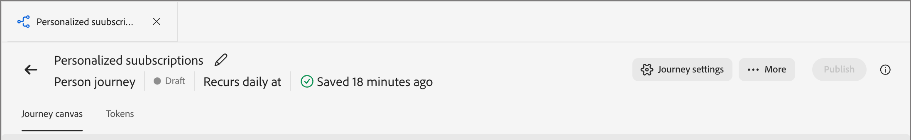
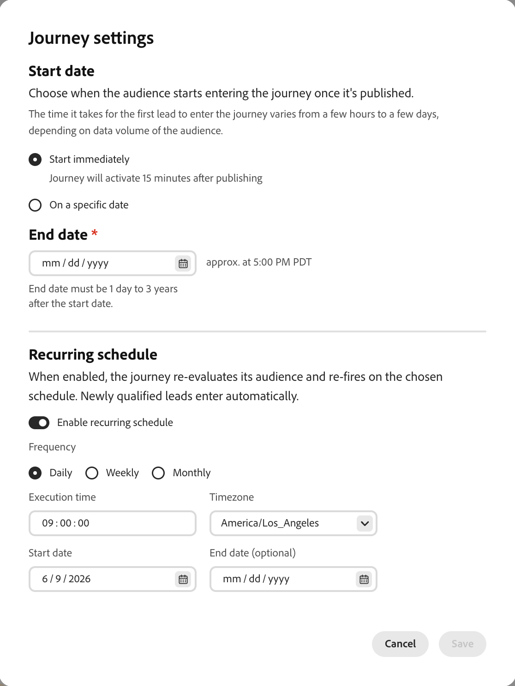

# Person Journeys

In [!DNL Adobe Journey Optimizer B2B Edition Prime], person journeys are automated, multistep lead-based marketing plans that orchestrate personalized experiences across channels. These journeys use Marketo Engage data to execute these marketing plans in response to engagement, business events, or scheduled campaigns.

>[!NOTE]
>
>Each journey resides within a defined [program](./programs.md). You must have at least one program to use as a parent before you create a journey.

_To build a new person journey:_

1. Create the person journey.
1. Add the nodes and define the journey flow in the journey map.
1. [Publish the journey](#publish-a-journey).

## Access and browse person journeys {#access-and-browse-person-journeys}

1. On the left navigation, expand **[!UICONTROL Marketing Management]**.

1. On the right in the **[!UICONTROL Marketing]** resource list, select **[!UICONTROL Person journeys]**.

   The _Person journeys_ list is displayed as a tabbed page in the main workspace.

   You can enter text in the _Search_ tool at the top of the list to filter the displayed list by name.

   {width="800" zoomable="yes"}

1. Use the list tools to customize the displayed list:

   * Click the _Filter_ (  ) icon to filter the list by status.
   * Click the _Customize table_ (  ) icon to control the displayed columns.
   * Click the _Reset columns_ (  ) icon to reset the column widths.

### Journey list columns {#journey-list-columns}

The journeys list page includes the following columns:

* [!UICONTROL Name] (click the name to open the journey map for editing)
* [!UICONTROL Status]
* [!UICONTROL Creation date]
* [!UICONTROL Created by]
* [!UICONTROL Last update]
* [!UICONTROL Last updated by]
* [!UICONTROL Published on]
* [!UICONTROL Published by]
* [!UICONTROL Start date]
* [!UICONTROL End date]

You can sort the list by _[!UICONTROL Status]_, _[!UICONTROL Creation date]_, or _[!UICONTROL Last update]_ by clicking the column header. You can grab and drag the heading borders to change the displayed column widths. In the _Customize table_ dialog, select or clear the checkboxes and click **[!UICONTROL Apply]**.

### Journey status {#journey-status}

The status of a journey can change based on the actions that you apply. Based on the status of a journey, certain actions are available from the right side of the header.

| Status | Description | Available actions |
| ------ | ----------- | ----------------- |
| _**Draft**_ | An unpublished journey that is editable. | [Publish](#publish-a-journey), [Duplicate](#duplicate-a-journey), [Delete](#delete-a-journey) |
| _**Live**_ | Journey status changes from _Draft_ to _Live_ when you publish a journey. In this state, it is no longer editable. | [Duplicate](#duplicate-a-journey), [Close to new entries](#close-to-new-entries), [Abort](#abort-a-journey) |
| _**Closed to new entries**_ | The journey status changes from _Live_ to _Closed to new entries_ when you click **[!UICONTROL Close to new entries]** in the journey header. | [Duplicate](#duplicate-a-journey), [Abort](#abort-a-journey) |
| _**Aborted**_ | Journey status changes from _Live_ or _Closed to new entries_ when you abort a journey. An aborted journey cannot be restarted. | [Duplicate](#duplicate-a-journey), [Delete](#delete-a-journey) |
| _**Finished**_ | When all person audience members in a journey complete the journey, the status changes from _Live_ or _Closed to new entries_ to _Finished_. | [Duplicate](#duplicate-a-journey), [Delete](#delete-a-journey) |

## Create a person journey {#create-a-person-journey}

1. Click **[!UICONTROL Create Journey]** at the top-right of the journey list.

1. In the dialog, select the **[!UICONTROL Parent]** program for the person journey.

1. Enter a unique **[!UICONTROL Name]** (required) and **[!UICONTROL Description]** (optional).

   {width="400"}

1. Click **[!UICONTROL Create]**.

   The journey canvas opens with the starting Person audience node.

   {width="600" zoomable="yes"}

### Journey header {#journey-header}

The header of each journey map includes the journey name, status, and schedule.

{width="600" zoomable="yes"}

* Click the _Edit_ icon (  ) to change the journey name or description information.
* Click **[!UICONTROL Journey settings]** to change the journey start and recurrence.
* Click **[!UICONTROL More]** to apply a journey action, or to enable/disable traffic control and re-entry.
* If all errors are resolved and you want to activate the journey, click **[!UICONTROL Publish]**.

### Journey design {#journey-design}

The _journey map_ is the central zone in the journey workspace. It is where you can add journey nodes and configure them. Click a node to open its properties in the panel to the right of the layout and set them according to your design. A person journey always starts with a [_[!UICONTROL Person audience]_ node](./person-audience-node.md), where you can define the input for the journey.

After you create a person journey and define the person audience, build out the journey using nodes. The journey map provides a canvas, where you can build your multistep B2B marketing use cases using the following node types to construct the journey:

* [Take an action](./action-nodes.md)
* [Listen for an event](./listen-for-event-nodes.md)
* [Wait](./wait-nodes.md)
* [Split paths](./split-merge-paths-nodes.md)
* [Next best path](./next-best-path.md)
* [Merge paths](./split-merge-paths-nodes.md)

## Journey management {#journey-management}

Open the journeys list to review journey status, make changes, and take actions.

### Journey actions {#journey-actions}

The journeys list page includes all person journeys in your Journey Optimizer B2B Prime instance. From the list page, you can apply a number of actions to a journey.

#### Publish a journey {#publish-a-journey}

You can publish a journey if there are no blocker errors. When published, the journey status changes to _Live_. If the journey has errors, the **[!UICONTROL Publish]** button is dimmed with the message `Resolve errors before publishing`.

1. Open the draft journey from the _[!UICONTROL Person journeys]_ list.

1. At the top right of the journey map, click **[!UICONTROL Publish]**.

1. In the _[!UICONTROL Review journey settings]_ dialog, set the journey start options.

   If you already defined a schedule in **[!UICONTROL Journey settings]**, review the settings.

   If you need to set the journey activation, choose a schedule type:

   * To activate the journey at publish time, choose **[!UICONTROL Immediately]**.
   * To activate the journey on a future date, choose **[!UICONTROL On a specific date]** and click the _Calendar_ icon to select the date.

1. If needed, specify the **[!UICONTROL End date]** for the journey.

   {width="400" zoomable="no"}

   It can be a maximum of three years from the start date. This field is required to publish.

1. Click **[!UICONTROL Next]**.

1. In the confirmation dialog, click **[!UICONTROL Publish]**.

#### Abort a journey {#abort-a-journey}

If you abort (stop) a live journey or a journey scheduled for a future start date, people in the journey immediately stop their progress, and no further journey entrance can happen. An aborted journey cannot be restarted.

1. Open the journey from the _[!UICONTROL Person journeys]_ list.

1. Click the **[!UICONTROL More...]** menu at the top right and choose **[!UICONTROL Abort]**.

   {width="600" zoomable="yes"}

1. In the confirmation dialog, click **[!UICONTROL Abort]**.

#### Close to new entries {#close-to-new-entries}

If you close a live journey to new entries, people currently in the journey continue their path in that journey and no further journey entrance can happen. A closed journey cannot be restarted. You can duplicate a closed journey.

1. Open the journey from the _[!UICONTROL Person journeys]_ list.

1. Click the **[!UICONTROL More...]** menu at the top right and choose **[!UICONTROL Close to new entries]**.

1. In the confirmation dialog, click **[!UICONTROL Close to new entries]**.

#### Duplicate a journey {#duplicate-a-journey}

A duplicate action is similar to a clone function, but a duplicated journey does not include any created journey content assets. You can duplicate the details for the journey, or just a simple skeleton of the flow and path structure.

1. In the _[!UICONTROL Person journeys]_ list, click the _More_ icon ( **...** ) next to the journey name and choose **[!UICONTROL Duplicate]**.

   {width="400"}

   Depending on the status of the journey, you can also access the duplicate action from the journey details or journey map:

   * For a draft journey, click the **[!UICONTROL More]** menu at the top right and choose **[!UICONTROL Duplicate]**.
   * For all other journey statuses, click **[!UICONTROL Duplicate]** at the top right.

1. In the dialog, select the **[!UICONTROL Parent]** program for the duplicated journey.

1. Enter a unique **[!UICONTROL Name]** (required) and **[!UICONTROL Description]** (optional).

   By default, the dialog uses the name of the originating journey appended with `_copy`. Enter a different unique name for the journey as needed.

   {width="370"}

1. Choose the duplication **[!UICONTROL Type]**:

   * **[!UICONTROL Partial content duplication]** - Use this type to copy everything in the journey, excluding any created emails or SMS messages. Nodes that reference a Marketo Engage email or SMS message are fully intact.

   * **[!UICONTROL Duplicate without details]** - Use this type to copy only the node structure and paths. All node settings and path conditions are undefined (default), so that you can reuse the basic flow with different audience, actions, and path segmentation settings. All Wait nodes use the default of five days.

1. Click **[!UICONTROL Duplicate]**.

   The duplicated journey opens in the journey canvas, where you can set the details and create journey content as needed.

#### Delete a journey {#delete-a-journey}

Use a delete action to delete a journey permanently. You cannot delete a live journey or a journey scheduled for a future start date.

>[!WARNING]
>
>Deleting a journey is permanent and cannot be undone.

1. In the _[!UICONTROL Person journeys]_ list, click the _More_ icon ( **...** ) next to the journey name and choose **[!UICONTROL Delete]**.

   Depending on the status of the journey, you can also access the delete action from the journey header:

   * For a draft journey, click **[!UICONTROL More...]** at the top right and choose **[!UICONTROL Delete]**.
   * For other journey statuses, such as _Finished_ or _Aborted_, click **[!UICONTROL Delete]** at the top right.

1. In the confirmation dialog, click **[!UICONTROL Delete]**.
