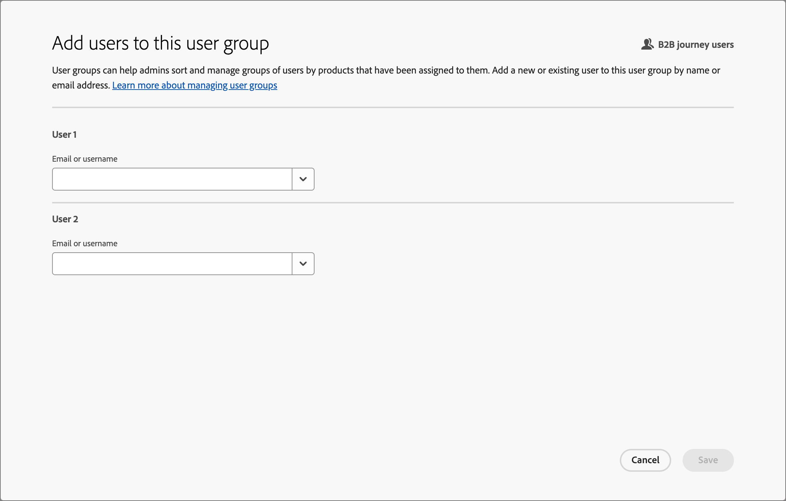

# User access and permissions

After provisioning is complete and sandboxes are bound, complete the following steps to provide [!DNL Journey Optimizer B2B Prime] access for your team and users.

1. [Create a [!DNL Journey Optimizer B2B Edition] product profile](#create-profile) in the Admin Console (one-time/initial setup only).
1. [Add a user group](#add-user-group) in the Admin Console.
1. [Assign the product profile](#assign-profile) to the user group in the Admin Console.
1. [Add users to the new group](#add-users) in the Admin Console.
1. [Edit built-in roles](#edit-role-permissions) or [create a custom role](#create-a-custom-role) with [!DNL Journey Optimizer B2B Edition] permissions in Adobe Experience Platform.
1. [Add users](#add-users-to-a-role) or [groups](#add-user-groups-to-a-role) to roles in Adobe Experience Platform.

## Configure the product profile {#config-profile}

As an administrator, you can complete these tasks in the Adobe Admin Console, which is a central place to administer and manage your Adobe product licenses and users. In the Admin Console, you can create and manage users in a single location instead of within your various individual solutions. To learn more about its functions and capabilities, refer to the [Admin Console overview](https://helpx.adobe.com/business/enterprise/plan-your-deployment/basic-concepts/admin-console.html) page.

### Access the Admin Console {#admin-console}

Before you can use the Admin Console to administer users within your team, you need to ensure that you can access the Admin Console and have the appropriate permissions.

1. As a system administrator, you should receive multiple emails from Adobe as part of the onboarding process.

   Locate the welcome email that provides the information about the organization name to which you have been granted access.

1. Click the **[!UICONTROL Get started]** link in your welcome email to navigate to the Admin Console. 

   If you cannot find the email, open a browser directly to the Admin Console at [https://adminconsole.adobe.com](https://adminconsole.adobe.com).

1. Log in using your Adobe ID.

   Upon successful login, you see the _Overview_ page of the Adobe Admin Console.

1. If you have access to multiple organizations, ensure that you have logged in to the correct organization.

   To change your organization, click the organization name from the top right corner and choose the organization to which you need access.

1. Select **[!UICONTROL Administrators]** from the _[!UICONTROL Users]_ card to verify that you are a system administrator.

   {width="800" zoomable="yes"}

1. Search by entering your Adobe ID email, username, first, or last name.

   * If your access is correctly configured, the search returns your record. 

   * If the value in the **[!UICONTROL ADMIN ROLE]** column shows `System`, you know that you (or the displayed user) are a system administrator.

### Create the [!DNL Journey Optimizer B2B Edition] product profile {#create-profile}

When granting users access to an Adobe solution, you do not necessarily want to give them full access. Product profiles enable each solution to have its own set of user permissions. Use the Admin Console to assign product profiles.

For more information about using product profiles for user entitlements, see [_Manage product profiles for enterprise users_](https://helpx.adobe.com/business/enterprise/manage-products-and-entitlements/manage-products-and-product-profiles/manage-product-profiles.html){target="_blank"} in the Admin Console documentation.

{width="30"} A system administrator or [!DNL Experience Platform] product administrator can perform the following steps from [https://adminconsole.adobe.com](https://adminconsole.adobe.com).

1. Select the **[!UICONTROL Products]** tab.

1. Open the [!DNL Journey Optimizer B2B Edition] instance where you want to add the profile and click **[!UICONTROL New profile]**.

   {width="600" zoomable="yes"}    

1. Enter a product profile name, such as _B2B Users_.

1. Click **[!UICONTROL Next]** and then **[!UICONTROL Save]**.

### Add a user group {#add-user-group}

A user group is a collection of users who are granted a shared set of permissions. You can add or remove users in your user group. The group permissions remain the same while the users within the group change.

For more information about how user groups are used to manage permissions, see [Manage user groups](https://helpx.adobe.com/business/enterprise/manage-users/user-groups.html){target="_blank"} in the Admin Console documentation.

{width="30"} A system administrator can perform the following steps from [https://adminconsole.adobe.com](https://adminconsole.adobe.com).

1. Select the **[!UICONTROL Users]** tab.

1. Choose **[!UICONTROL User Groups]** in the left navigation.

1. Click **[!UICONTROL New user group]** at the top right.

1. Enter a name for the user group, such as _B2B users_ and click **[!UICONTROL Save]**.

   {width="600" zoomable="yes"} 

### Assign the product profile {#assign-profile}

{width="30"} A product administrator can perform the following steps from [https://adminconsole.adobe.com](https://adminconsole.adobe.com).

1. Click the user group that you created.

1. Select the **[!UICONTROL Assigned product profiles]** tab and click **[!UICONTROL Assign profile]**.

1. Click **+** and add each instance of the following products:

   * [!UICONTROL Adobe Journey Optimizer B2B Edition - Users Profile]
   * [!UICONTROL Adobe Experience Platform - AEP-Default-All-Users]
   * [!UICONTROL Adobe Experience Platform Data Collection - Default Data Collection All Access]
   * [!UICONTROL Adobe Experience Platform - Default Production All Access]

   {width="600" zoomable="yes"}   

1. Click **[!UICONTROL Save]**.

### Add users to the new group {#add-users}

For information about user management, see [_Adobe Admin Console users_](https://helpx.adobe.com/business/enterprise/manage-users/users.html){target="_blank"} in the Admin Console documentation.

{width="30"} A system administrator or product administrator can perform the following steps from [https://adminconsole.adobe.com](https://adminconsole.adobe.com). A product administrator can add only users that already exist in their organization.

1. If the users are not already members of your organization, add each user:

   * Under _[!UICONTROL Quick links]_, click **[!UICONTROL Add users]**.

   * Enter the user's email address and click **[!UICONTROL Add as new user]**.

      {width="600" zoomable="yes"}
   
   * Enter the first and last name, then click **[!UICONTROL Save]**.

1. Add each user to the group:

   * Click the user name.

   * In the user details page, scroll to **[!UICONTROL User groups]**.
   
   * Click the _More_ ( **...** ) icon on the left and choose **[!UICONTROL Edit user groups]**.

   * Click the _Add_ ( **+** ) icon below **[!UICONTROL User groups]**.

      {width="600" zoomable="yes"}

   * Select the user group that you created previously and click **[!UICONTROL Apply]**.

   * Click **[!UICONTROL Save]** for the user changes.

## Assign product permissions {#assign-product-permissions}

Permissions are unitary rights that allow you to define the authorizations assigned to a product profile. Each permission is grouped under a capability, such as journeys or buying groups, representing functionalities in [!DNL Journey Optimizer B2B Prime].

The _Permissions_ area of Adobe Experience Platform is where administrators can define user roles and access policies to manage access permissions for features and objects within a product application. In this app, you can create and manage roles, as well as assign the desired resource permissions for these roles. Permissions also allow you to manage the sandboxes and users associated with a specific role.

For more information about role permissions in Experience Platform, see [Manage permissions for a role](https://experienceleague.adobe.com/en/docs/experience-platform/access-control/abac/permissions-ui/permissions){target="_blank"} in the Experience Platform documentation.

1. Go to [experience.adobe.com](https://experience.adobe.com/).

1. In the _[!UICONTROL Quick access]_ panel, select **[!UICONTROL Permissions]**.

   >[!NOTE]
   >
   >If you don't see _[!UICONTROL Permissions]_, you may need to click **[!UICONTROL View all]** and select it from the available applications.

   {width="700" zoomable="yes"}

<!--

### B2B product permissions {#b2b-product-permissions}

The following permissions govern access to [!DNL Journey Optimizer B2B Edition] capabilities:

| Category | Description | Permissions |
| -------- | ----------- | ---------- |
| B2B Account Lists | Configure, manage, view, and publish permissions for B2B account lists. These permissions include actions such as add, remove, import, and delete accounts from account lists. | <li>Manage B2B Account Lists |
| B2B Admin Configurations | Configure, manage, and view permissions for B2B administrative configurations. These permissions include digital asset management connections, asset repositories, and events. | <li>Manage B2B Admin Configurations |
| B2B Assets | Configure, manage, and view permissions for B2B assets. These permissions include emails, SMS, landing pages, fragments, templates, and images. | <li>Manage B2B Assets <li>Manage B2B Templates <li>Manage B2B Fragments <li>Manage B2B Emails |
| B2B Buying Groups | Configure, manage, and view permissions for B2B buying groups. These permissions include solution interests, roles templates, and buying group status. | <li>Manage B2B Buying Groups <li>Manage B2B Solution Interests <li>Manage B2B Role Templates <li>Manage B2B Stages <li>View B2B Buying Groups |
| B2B Channel Configurations | Configure, manage, and view permissions for B2B channel configurations. These permissions include settings for communication limits, API credentials, and security settings. | <li>Manage B2B Channels Configurations |
| B2B Dashboards | Configure and view permissions for B2B dashboards. These permissions include account engagement, buying group stages, surging accounts, and contact coverage. | <li>View B2B Engagement Dashboard |
| B2B Journeys | Configure, manage, view, and publish permissions for B2B journeys. These permissions include account and person actions, event listeners, and split paths. | <li>Manage B2B Account Journeys |
| Journey Optimizer Rules | Access and configure frequency rules (communication limits). These permissions should be limited to product administrators. | <li>View Frequency Rules <li>Manage Frequency Rules |

### B2B built-in roles {#b2b-built-in-roles}

When your organization has [!DNL Journey Optimizer B2B Edition] provisioned, Experience Platform includes a set of built-in (default) roles that you can use to manage access to the product capabilities:

| Role | Permissions |
| ---- | ----------- |
| B2B Journey Manager | <li>Manage B2B Journeys <li>Manage B2B Buying Groups <li>Manage B2B Account Lists <li>View B2B Engagement Dashboard <li>View B2B Insights Dashboard |
| B2B Channel Manager | <li>Manage B2B Assets <li>Manage B2B Templates <li>Manage B2B Fragments |
| B2B System Administrator | <li>Manage B2B Channels Configurations <li>Manage B2B Admin Configurations |
| B2B Sales User | <li>View B2B Engagement Dashboard <li>View B2B Buying Groups <li>Access In-CRM Insights |

-->

### Edit role permissions {#edit-role-permissions}

For built-in or custom roles, you can decide at any time to add or delete permissions. If you modify a default or custom role, it impacts every user assigned to the role.

>[!IMPORTANT]
>
>[!DNL Journey Optimizer B2B Prime] access requires that you enable a specific sandbox that is provisioned using the following naming convention: Marketo Engage subscription prefix + Prime. For example, if your linked Marketo Engage subscription prefix is _AcmeAssoc_, the sandbox required for [!DNL Journey Optimizer B2B Prime] access is _AcmeAssocPrime_.

>[!NOTE]
>
>An Admin Console system administrator can perform these steps.

_To change the permissions for a role:_

1. Select **[!UICONTROL Roles]** in the left navigation.

1. Click the **_B2B Channel Manager_** role name.

1. In the details page, click **[!UICONTROL Edit]** at the top right.

   {width="800" zoomable="yes"}

   In the role editor, the _[!UICONTROL Resources]_ menu displays the list of resources that apply to the Experience Cloud - Platform powered applications.

1. Select the sandbox provisioned for [!DNL Journey Optimizer B2B Prime] access (`<Marketo subscription prefix>Prime`).

   {width="800" zoomable="yes"}
   
1. Click the _Add_ icon (**+**) for each of the B2B resources.

   {width="700" zoomable="yes"}

1. Add the specific permissions for each of the resources, or select **[!UICONTROL Add all]**.

1. Click **[!UICONTROL Save]**.

   <!-- {width="700" zoomable="yes"} -->

1. Click **[!UICONTROL Close]** to return to the details page.

### Add users to a role {#add-users-to-a-role}

{width="30"} A system administrator or Experience Platform administrator can perform the following steps.

1. Open the role details and select the **[!UICONTROL Users]** tab.

   This tab displays a list of all users assigned to the role.

1. Click **[!UICONTROL Add users]**.

   {width="800" zoomable="yes"}

1. In the _[!UICONTROL Add users]_ dialog, locate and select the users that you want to add to the role.

   * You can use the Search tool to filter the list of users. 

   * Select the checkbox for each user.

   {width="600" zoomable="yes"}

1. Click **[!UICONTROL Save]** when you have selected all the users that you want to add.

### Add user groups to a role {#add-user-groups-to-a-role}

For information about user management, see [_Adobe Admin Console users_](https://helpx.adobe.com/business/enterprise/manage-users/users.html){target="_blank"} in the Admin Console documentation.

{width="30"} A system administrator or Experience Platform administrator can perform the following steps.

1. Open the role details and select the **[!UICONTROL User groups]** tab.

   This tab displays a list of all user groups assigned to the role. 

1. Click **[!UICONTROL Add Groups]**.

   {width="800" zoomable="yes"}

1. In the _[!UICONTROL Add groups]_ dialog, locate and select the groups that you want to add to the role.

   * You can use the Search tool to filter the list of user groups. 

   * Select the checkbox for each user group.

   {width="600" zoomable="yes"}

1. Click **[!UICONTROL Save]** when you have selected all the groups that you want to add.

### Create a custom role {#create-a-custom-role}

{width="30"} A system administrator or Experience Platform administrator can perform the following steps.

1. Select **[!UICONTROL Roles]** in the left navigation and select **[!UICONTROL Create role]**.

1. In the _[!UICONTROL Create new role]_ dialog, enter a name for the role, such as _B2B Marketers_, and a description (optional).

1. Click **[!UICONTROL Confirm]**.

1. Select the sandbox provisioned for [!DNL Journey Optimizer B2B Prime] access (`<Marketo subscription prefix>Prime`).

   {width="800" zoomable="yes"}

1. Add B2B product permissions:

   <!-- To determine which product capabilities that you want for the role, refer to the list of [B2B product permissions](#b2b-product-permissions). -->

   In the _[!UICONTROL Resources]_ list on the left, locate the B2B items and click the _Add_ (**+**) icon to add each attribute that you want to enable for the role.

   You can enter _B2B_ in the search tool to filter the list for the B2B product permissions.

   {width="700" zoomable="yes"}   

1. Click **[!UICONTROL Save]** at the top right.

1. Go to the role details and select the **[!UICONTROL User groups]** tab.

1. Click **[!UICONTROL Add Groups]**.

1. Select the checkbox next to the user group that you created previously in the Admin Console.

1. Click **[!UICONTROL Save]**.

Your custom role is configured and users in the assigned group can now access the [!DNL Journey Optimizer B2B Prime] capabilities you selected.
