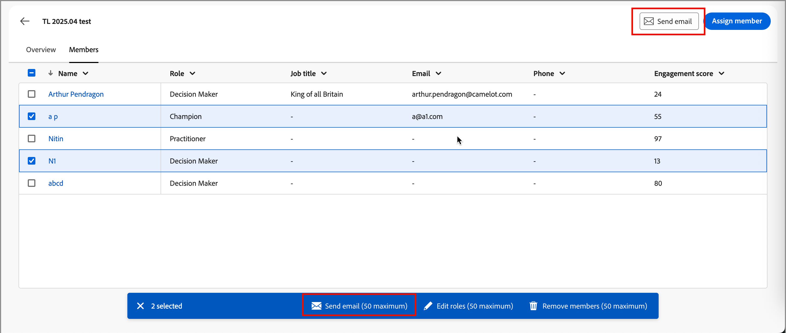

# Account details

When you click an account name from anywhere in Journey Optimizer B2B Edition, the _Account details_ page is displayed. This page provides useful information about the account, including generative AI summaries. There are also [actions](#account-actions) that you can execute for contacts associated with the account.

{width="700" zoomable="yes"}

Use the **[!UICONTROL Overview]** tab to review information about the account, and the **[!UICONTROL Contacts]** tab to access a list of the account contacts.

## [!UICONTROL Overview] tab

The account details page is comprised of three primary sections:

### Account overview

{zoomable="yes"}

The account overview section includes the following account information:

* Account name
* Number of people in the account
* Industry
* Open opportunities
* The three most recent account journeys where the account is currently in use (click the journey name to open the [journey overview](../journeys/journey-overview.md))
* Generative AI summary of the account, which includes information about the top engaged buying groups.

### Intent data

In Journey Optimizer B2B Edition, the Intent Detection model predicts a solution/product of interest with high enough confidence based on account contact activity. The intent of account contacts can be interpreted as the probability of having interest in a product. 

{{intent-data-note}}

{width="700" zoomable="yes"}

* Levels of intent
* Types of intent signal - Keywords, product, and solution

### Contact coverage

{width="800" zoomable="yes"}

The _[!UICONTROL Contact coverage]_ section displays the number of contacts from the account with a specific role associated with a solution interest. Assignment of role and solution interest is based on the buying group roles template. Click a cell to display the following details:

* Description, in the following format: _x people have y role for z solution interest_
* Columns
* Name
* Account
* Job title
* Buying group
* Person engagement score 
* Last activity
* Details

Click the _Filter_ (  ) icon at the top left to filter the data display using any of these attributes:

* Solution interest
* Time period

### Contact overlap

{width="800" zoomable="yes"}

The _[!UICONTROL Contact overlap]_ section displays contacts from the account who are part of more than one buying group as a result of being associated with several solution interests. This information is in the form of a table with the following columns:

* Name
* Job title
* Account
* Solution interest

Click the _Information_ (  ) next to the contact name to display a table with the following details:

* Buying group (click the name to open the [buying group details](../buying-groups/buying-group-details.md))
* Role
* Solution interest
* Product intent (if [configured](../admin/intent-data.md))
* Product

Click the _Filter_ (  ) icon at the top left to filter the data display using any of these attributes:

* Solution interest
* Roles

## [!UICONTROL Contacts] tab

Select the **[!UICONTROL Contacts]** tab to view a list of all people associated with the account, which syncs into Experience Platform. Each contact listed includes the name, email address, and engagement score.

{width="700" zoomable="yes"}

## Send email

You can send a marketer-approved email to one or more selected contacts (up to 50 at a time), or to all contacts for the account. The list of available emails is limited to approved emails from the connected Marketo Engage instance.

>[!BEGINTABS]

>[!TAB All account contacts]

1. From the _[!UICONTROL Overview]_ tab, click **[!UICONTROL Send email]** at the top right.

   {width="700" zoomable="yes"}

1. In the _[!UICONTROL Send email]_ dialog, select the Marketo Engage workspace, and then select the checkbox for the email that you want to send.

   {width="700" zoomable="yes"}

1. Click **[!UICONTROL Send]**.

>[!TAB Selected contacts]

1. From the _[!UICONTROL Contacts]_ tab, select the checkboxes for the contacts that you want to receive the email.

1. At the top-right or in the selection bar at the bottom, click **[!UICONTROL Send email]**.

   {width="700" zoomable="yes"}

1. In the _[!UICONTROL Send email]_ dialog, select the Marketo Engage workspace, and then select the checkbox for the email that you want to send.

   {width="700" zoomable="yes"}

1. Click **[!UICONTROL Send]**.

>[!ENDTABS]
