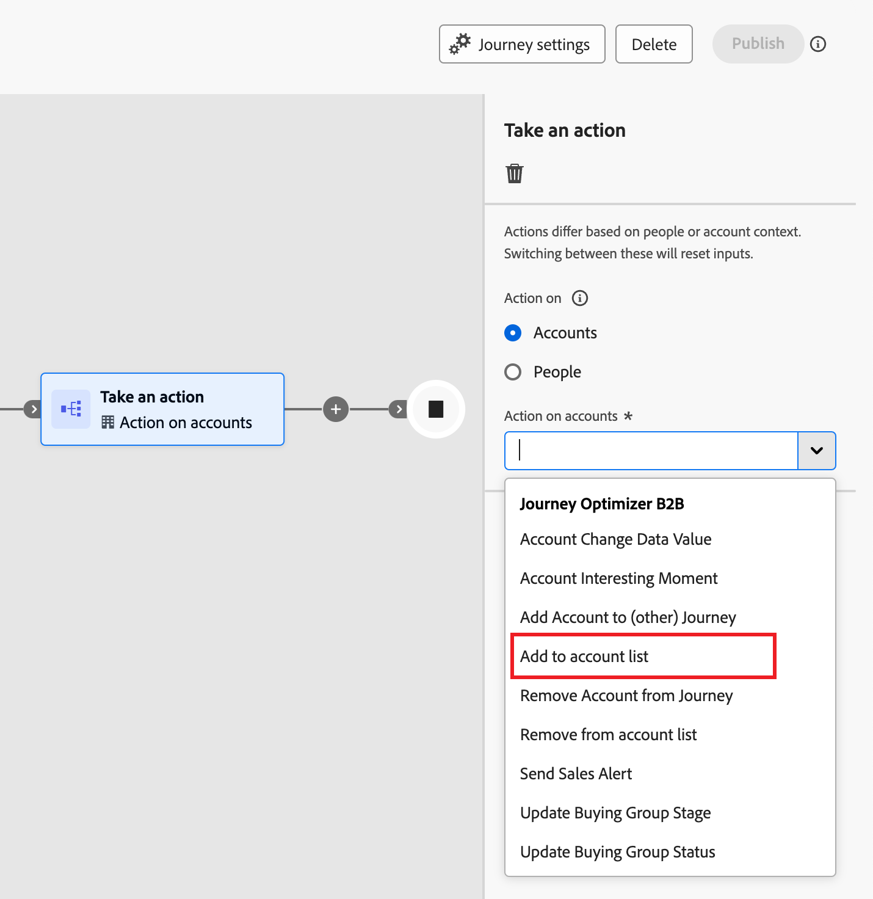
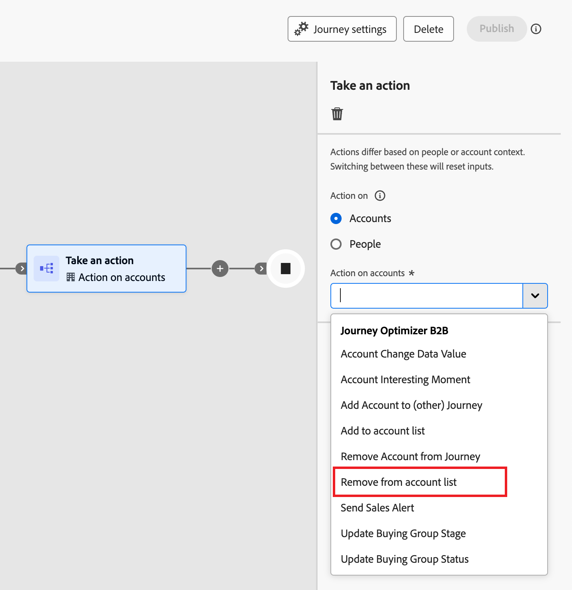

# Use account lists in journeys

There are multiple ways that you can incorporate Live (published) account lists into your account journeys.

## Account audience node

All account journeys start with an [_Account audience_ node](../journeys/account-audience-nodes.md). When you set this node to use an account list, the member accounts move through the journey when it goes live (published).

1. Select the **[!UICONTROL Account list]** option for the starting _Account audience_ node.

   {width="500"}

1. Click **[!UICONTROL Add accounts list]**.

1. Select the checkbox for the account list and click **[!UICONTROL Save]**.

   {width="600" zoomable="yes"}

## Take an action node - Add to account

**_Static account lists only_**

Within an account journey, add accounts to a static account list using [a _Take an Action_ node](../journeys/action-nodes.md).

For example, you have a journey path where you send an email and some accounts take various actions as a response. You consider this activity to be a qualification point in the journey. With the qualification, you want to add them to an account list that is used as the audience for another journey with a different flow for qualified accounts.

>[!NOTE]
>
>If an account is already in the list when the node executes, the action is ignored.

1. Select the _[!UICONTROL Action on]_ **[!UICONTROL Accounts]** option.

1. For _[!UICONTROL Action on accounts]_, choose **[!UICONTROL Add to account list]**.

   {width="500"}

1. For **[!UICONTROL Select live static account list]**, choose the account list where you want to add accounts.

   {width="500"}

## Take an action node - Remove from account

**_Static account lists only_**

Within an account journey, remove accounts from a static account list using [a _Take an Action_ node](../journeys/action-nodes.md).

For example, you have a journey path where you send an email and some accounts take various actions as a response. You consider this activity to be a qualification point in the journey. With this qualification, you want to remove them from an account list. This list is used as the audience for another journey that sends additional emails so that you don't duplicate your qualification communications.

>[!NOTE]
>
>If an account is not in the list where it is scheduled for removal, the action is ignored.

1. Select the _[!UICONTROL Action on]_ **[!UICONTROL Accounts]** option.

1. For _[!UICONTROL Action on accounts]_, choose **[!UICONTROL Remove from account list]**.

   {width="500"}

1. For **[!UICONTROL Select live static account list]**, choose the account list where you want to remove accounts.

   {width="500"}
