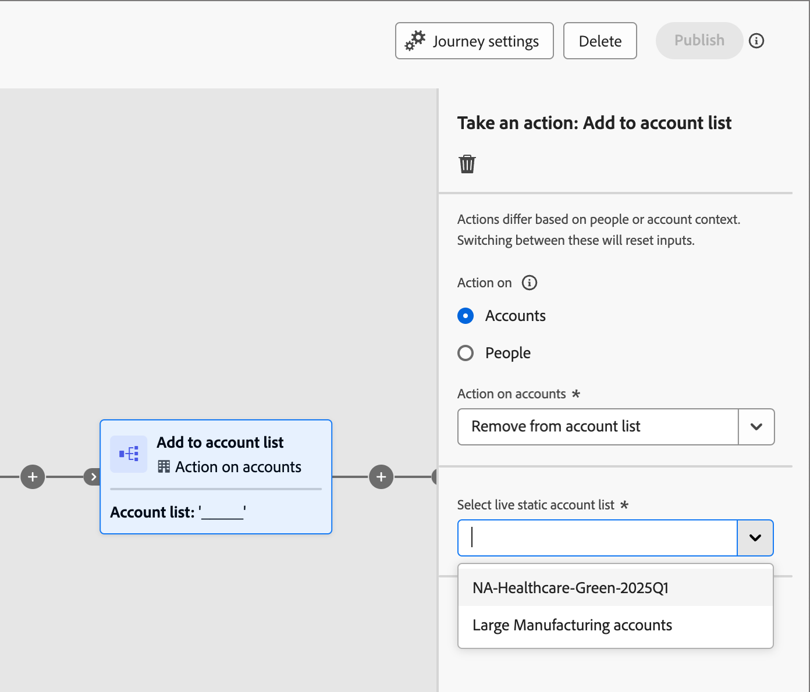

# Use account lists in journeys and programs

There are multiple ways that you can incorporate Live (published) account lists into your account journeys.

## Account audience node

All account journeys start with an [_Account audience_ node](../journeys/account-audience-nodes.md). When you set this node to use an account list, the member accounts move through the journey when it goes live (published).

1. Select the **[!UICONTROL Account list]** option for the starting _Account audience_ node.

   {width="500"}

1. Click **[!UICONTROL Add accounts list]**.

1. Select the checkbox for the account list and click **[!UICONTROL Save]**.

   {width="600" zoomable="yes"}

## Take an action node - Add to account

**_Static account lists only_**

Within an account journey, add accounts to a static account list using [a _Take an Action_ node](../journeys/action-nodes.md).

For example, you might have a journey path where you send an email and some account take various actions as a response actions. You consider this activity to be a qualification point in the journey and want to add them to an account list that is used to as the audience for another journey with a different flow for qualified accounts.

>[!NOTE]
>
>If an account is already in the list when the node executes, the action is ignored.

1. Select the _[!UICONTROL Action on]_ **[!UICONTROL Accounts]** option.

1. For _[!UICONTROL Action on accounts]_, choose **[!UICONTROL Add to account list]**.

   {width="500"}

1. For **[!UICONTROL Select live static account list]**, choose the account list where you want to add accounts.

   {width="500"}

## Take an action node - Remove from account

**_Static account lists only_**

Within an account journey, remove accounts from a static account list using [a _Take an Action_ node](../journeys/action-nodes.md).

For example, you might have a journey path where you send an email and some account take various actions as a response actions. You consider this activity to be a qualification point in the journey and want to remove them from an account list that is used to as the audience for another journey that sends additional emails so that you don't duplicate your qualification communications.

>[!NOTE]
>
>If an account is not in the list where it is scheduled for removal, the action is ignored.

1. Select the _[!UICONTROL Action on]_ **[!UICONTROL Accounts]** option.

1. For _[!UICONTROL Action on accounts]_, choose **[!UICONTROL Remove from account list]**.

   {width="500"}

1. For **[!UICONTROL Select live static account list]**, choose the account list where you want to remove accounts.

   {width="500"}

## Marketo Engage program - Member of account list

As a Marketer, you might want to suppress programs in Marketo Engage for people that are part of account lists in Journey Optimizer B2B Edition.

In the Marketo Engage instance that is connected to Journey Optimizer B2B Edition, you can use the _[!UICONTROL Member of Account List]_ filter in your Smart Lists to identify these leads according to your campaign strategy. For more information about Smart Lists, refer to the [Marketo Engage documentation](https://experienceleague.adobe.com/en/docs/marketo/using/product-docs/core-marketo-concepts/smart-lists-and-static-lists/understanding-smart-lists){target="_blank"}.

### Add the filter to a Smart List

1. In Marketo Engage, select a campaign and click the **[!UICONTROL Smart List]** tab.

1. In the filters list displayed on the right, enter `Member` and locate the **[!UICONTROL Member of Account List]** filter.

1. Drag the filter onto the Smart List canvas.

1. On the Smart List canvas, set the **[!UICONTROL Member of account]** list value.

   Click the down arrow to display all account lists, or enter part of the account list name to help locate the account list that you need.

   {width="800" zoomable="yes"}

1. In the campaign flow, add the **[!UICONTROL Add to List]** step and choose the list where you want to populate the people from the Journey Optimizer B2B Edition account list.

   Refer to _[Add a Flow step to a smart campaign](https://experienceleague.adobe.com/en/docs/marketo/using/product-docs/core-marketo-concepts/smart-campaigns/flow-actions/add-a-flow-step-to-a-smart-campaign){target="_blank"}_ in the Marketo Engage documentation for detailed information about adding steps to a flow.

### Review the members

After the flow runs, you can view the list of people populated in the list. Open the list and select the People tab.

{width="800" zoomable="yes"}

