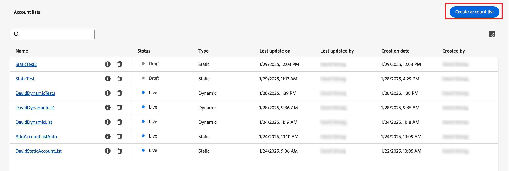
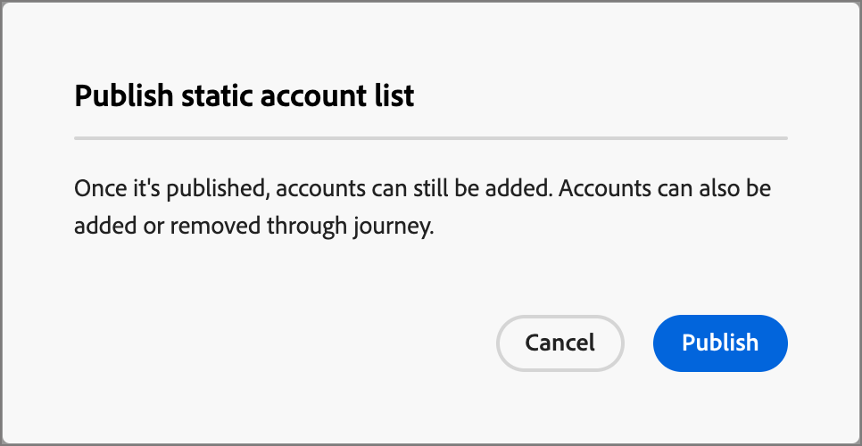
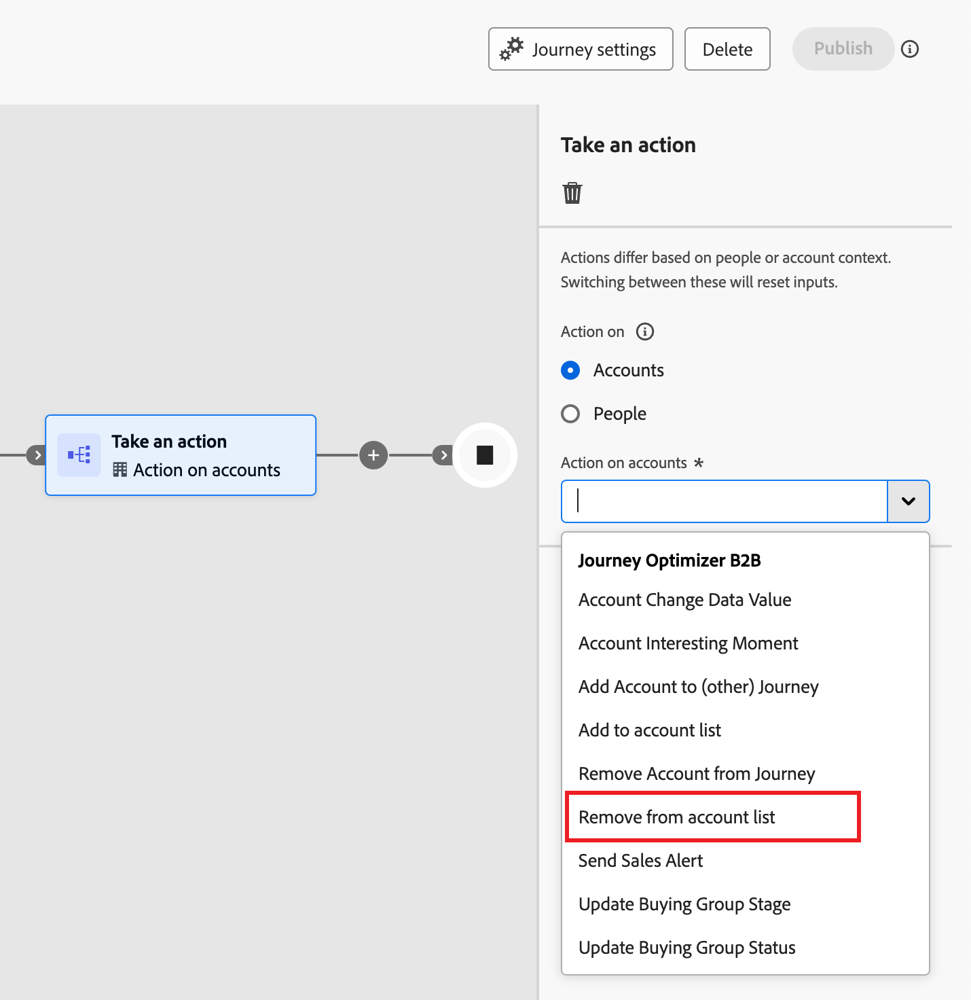

# Account lists

An account list is a collection of named accounts that Marketers can use for targeted journey orchestration. An account list can target named accounts by your defined criteria, such as industry, location, or size of the company. There are two types of account lists:

* **Static** - With a static account list, the list only changes when you add the accounts. You can manually add accounts by applying a filter set to populate the list based on current account data, or add and remove accounts through an account journey. 
* **Dynamic** - With a dynamic account list, you define a filter set for automatically curating the list. The system uses this filter set to add and remove accounts according to changes in the account information. This list management is similar to [audience segmentation in Real-time Customer Data Platform](https://experienceleague.adobe.com/en/docs/experience-platform/rtcdp/segmentation/b2b).

When an account list is in a _Live_ (published) state, it is available for use in account journeys.

## Access and browse account lists

1. In your Adobe Experience Platform home page, click Adobe Journey Optimizer B2B Edition.

1. On the left navigation, expand **[!UICONTROL Accounts]** and click **[!UICONTROL Account lists]**.

   {width="800" zoomable="yes"}

   The displayed _[!UICONTROL Account lists]_ page includes the following columns:

   * [!UICONTROL Name] (click the name of the account list to view details)
   * [!UICONTROL Status]
   * [!UICONTROL Type] 
   * [!UICONTROL Last updated on]
   * [!UICONTROL Last updated by]
   * [!UICONTROL Creation date]
   * [!UICONTROL Created by]

  This table includes the ability to search by Name. The sort function is currently unavailable.

You can customize the displayed table by clicking the _Column settings_ (  ) icon in the top-right corner and selecting or clearing the checkboxes. 

{width="300"}

To view the description for an account list, click the _Information_ icon next to the name.

## Create an account list

When you create an account list, you define a set of filters to generate the list. For example, you can use it to generate a list of accounts where the industry is Healthcare and the revenue is over $100M.

1. In the _[!UICONTROL Account lists]_ page, click the **[!UICONTROL Create account list]** at the top-right on the page.

   {width="700" zoomable="yes"}

1. In the _[!UICONTROL Create account list]_ dialog, enter a unique **[!UICONTROL Name]** (required) and a **[!UICONTROL Description]** (optional).

1. Choose the _[!UICONTROL Type]_ for the account list, **[!UICONTROL Static]** or **[!UICONTROL Dynamic]**.

   {width="380"}

1. Click **[!UICONTROL Create]**.

   A new static account list opens with an empty list of accounts. A new dynamic account list opens with the _[!UICONTROL Add accounts by filter]_ panel in the page. 
   
## Add accounts to the account list

For a static list, you could proceed to publish the empty account list and add accounts through an account journey. You can also manually add accounts by applying a filter set before you publish it.

For a dynamic account list, you must add the filter set that you want to use to manage the list automatically before you publish it.

>[!BEGINTABS]

>[!TAB Static account list]

After you create the static account list, you can populate the list by applying a filter set. You can also apply a filter set to add accounts to a static account list after it is published (_Live_).

>[!NOTE]
>
>If you want the account list to start as empty, do not select any filters and simply publish the account list. It is useful to start with an empty list when you plan to add members through an account journey action (see [Take an action node - Add to account](#take-an-action-node---add-to-account)).

1. CLick **[!UICONTROL Add accounts]**.

   {width="700" zoomable="yes"}

   You can access this function in the empty list page or at the top right.

1. In the _[!UICONTROL Add accounts by filter]_ dialog, use the **[!UICONTROL Account Filters]** menu to add the attributes and activities that you want to use to construct the filter set:

   The filters are nested into category folders. You can expand each folder and scroll through the lists of available filters. Or, use the _Search_ tool at the top to locate the filter that you need.

   * Drag and drop the filter from the left menu to the filter definition space.
   * Complete the match evaluation definition.
   * Repeat these actions for each filter that you want to include.

     {width="700" zoomable="yes"}

   * You can fine tune your conditions by applying the **[!UICONTROL Filter logic]** at the top. You can choose to match all attribute conditions or any condition.

     {width="450"}  

1. When the filter set and logic are complete, click **[!UICONTROL Populate accounts]**.

   The population process may take some time, depending on the number of accounts to evaluate and populate (the size of your database and the filter criteria you selected). It can take up to two hours for accounts to populate in your list.

You can proceed to publish the list to make it available for add and remove actions in an account journey. 

>[!TAB Dynamic account list]

After you create a dynamic account list, you define the filter set that is used to manage the list (add/remove accounts) when it is _Live_ (published). You cannot add/remove accounts through account journeys, but it a published dynamic account list is available for the starting account audience node.  

1. Click **[!UICONTROL Select filters]**.

   {width="700" zoomable="yes"}

1. In the _[!UICONTROL Add accounts by filter]_ dialog, use the **[!UICONTROL Account Filters]** menu to add the attributes and special filters that you want to use to construct the filter set:

   The filters are nested into category folders. You can expand each folder and scroll through the lists of available filters. Or, use the _Search_ tool at the top to locate the filter that you need.

   * Drag and drop the filter from the left menu to the filter definition space.
   * Complete the match evaluation definition.
   * Repeat these actions for each filter that you want to include.

     {width="700" zoomable="yes"}

   * You can fine tune your conditions by applying the **[!UICONTROL Filter logic]** at the top. You can choose to match all attribute conditions or any condition.

     {width="450"} 

1. When the filter set and logic are complete, click **[!UICONTROL Done]**.

   If you are satisfied with the filter set, you can proceed to [publish the list](#publish-an-account-list) to make it available for the starting [account audience node](#account-audience-node) in an account journey. 

   >[!NOTE]
   >
   >You cannot update the filters for a dynamic account list after the list is published.

   The population process may take some time, depending on the number of accounts to evaluate and populate (the size of your database and the filter criteria you selected). It can take up to two hours for accounts to populate in your list.

>[!ENDTABS]

## Publish an account list

You can proceed to publish an account list as soon as the filter set is complete. 

>[!BEGINTABS]

>[!TAB Static account list]

1. Click **[!UICONTROL Publish]** at the top right.

   {width="700" zoomable="yes"}

1. In the _[!UICONTROL Publish static account list]_ dialog, click **[!UICONTROL Publish]** to confirm.

   {width="400"}

The status of the static account list changes to _[!UICONTROL Live]_ and it is available for [use in an account journey](#account-list-usage-in-account-journeys).

>[!TAB Dynamic account list]

You can proceed to publish a dynamic account list as soon as the filter set is complete. After the account list is in a Live status, it is available to select in an Account audience journey node. 

1. Click **[!UICONTROL Publish]** at the top right.

   {width="700" zoomable="yes"}

1. In the _[!UICONTROL Publish dynamic account list]_ dialog, click **[!UICONTROL Publish]** to confirm.

   {width="400"}

The status of the dynamic account list changes to _[!UICONTROL Live]_ and it is available for [use in an account journey](#account-list-usage-in-account-journeys).

>[!ENDTABS]

## Account list usage in account journeys

There are three ways that you can incorporate Live (published) account lists in your account journeys:

### Account audience node

1. Select **[!UICONTROL Account list]** for the starting _Account audience_ node.

   {width="500"}

1. Click **[!UICONTROL Add accounts list]**.

1. Select the checkbox for the account list and click **[!UICONTROL Save]**.

   {width="600" zoomable="yes"}

The accounts in the list move through the journey when it goes live (published). 

### Take an action node - Add to account

**_Static account lists only_**

Add accounts to a static account list using [a _Take an Action_ node](../journeys/action-nodes.md).

For example, you might have a journey path where you send an email and some account take various actions as a response actions. You consider this activity to be a qualification point in the journey and want to add them to an account list that is used to as the audience for another journey with a different flow for qualified accounts.

>[!NOTE]
>
>If an account is already in the list when the node executes, the action is ignored.

1. Select the _[!UICONTROL Action on]_ **[!UICONTROL Accounts]** option.

1. For _[!UICONTROL Action on accounts]_, choose **[!UICONTROL Add to account list]**.

   {width="500"}

1. For **[!UICONTROL Select live static account list]**, choose the account list where you want to add accounts.

   {width="500"}

### Take an action node - Remove from account

**_Static account lists only_**

Remove accounts from a static account list using [a _Take an Action_ node](../journeys/action-nodes.md).

For example, you might have a journey path where you send an email and some account take various actions as a response actions. You consider this activity to be a qualification point in the journey and want to remove them from an account list that is used to as the audience for another journey that sends additional emails so that you don't duplicate your qualification communications.

>[!NOTE]
>
>If an account is not in the list where it is scheduled for removal, the action is ignored.

1. Select the _[!UICONTROL Action on]_ **[!UICONTROL Accounts]** option.

1. For _[!UICONTROL Action on accounts]_, choose **[!UICONTROL Remove from account list]**.

   {width="500"}

1. For **[!UICONTROL Select live static account list]**, choose the account list where you want to remove accounts.

   {width="500"}
