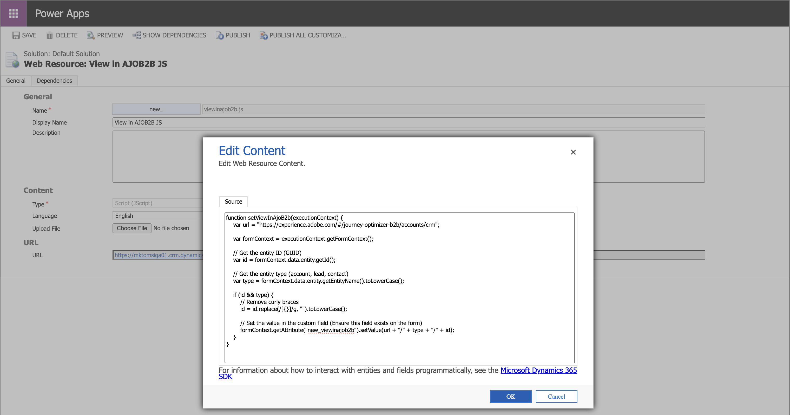
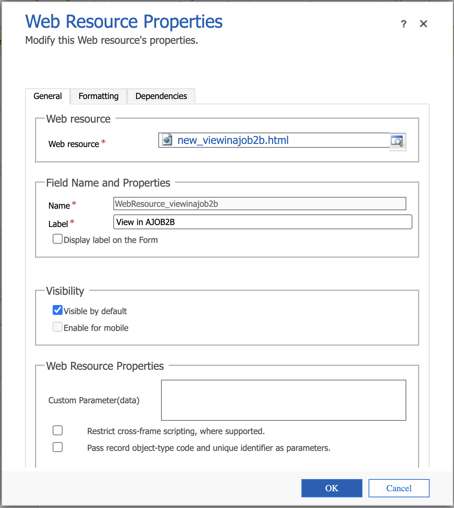

# In-CRM access to detail pages

Adobe Journey Optimizer B2B Edition allows sales and account team members to access detailed pages for account and buying group information directly from their Customer Relationship Management (CRM) tool, such as Salesforce or Microsoft Dynamics. With this integration, sales representatives can quickly access real-time account and buying group insights, such as engagement history, intent signals, and AI-generated recommendations. This ability empowers the Sales team for faster outreach, smarter prioritization, and better alignment with Marketing.

To enable sales and account team members for viewing [account details](account-details.md) and [person details](person-details.md) pages in Journey Optimizer B2B Edition from the CRM, the Salesforce or Dynamics administrator can add a link from the account, contact, or lead view.

When a Sales team member uses the link from the CRM instance, the sandbox should be _Prod_, and the IMS organization is determined according to the following ordered logic:

1. The most recent organization the user accessed
1. The first in the list with an alphabetical sort
1. The organization selected in their preferences

## Salesforce links

A Salesforce administrator with the _Customize Application_ permission can configure the link in the Account, Contact, or Lead layout. Configured links enable Sales users to access the corresponding account details or person details page in Adobe Journey Optimizer B2B Edition.

In Salesforce, add the custom link as a button, hyperlink, or linked icon and customize it according to your team's preferences.

{width="800" zoomable="yes"}

For detailed information about adding a custom link in Salesforce, refer to [Define Custom Buttons and Links](https://help.salesforce.com/s/articleView?id=platform.defining_custom_links.htm&type=5) in the Salesforce documentation.

When you define the target URL for the link, you can use the account, contact, or lead layout and link it to the corresponding details page in Journey Optimizer B2B Edition: 

* **Account** - `https://experience.adobe.com/#/journey-optimizer-b2b/accounts/crm/account/[18-character ID of account]`
 
* **Contact** - `https://experience.adobe.com/#/journey-optimizer-b2b/accounts/crm/contact/[18-character ID of contact]`

* **Lead** - `https://experience.adobe.com/#/journey-optimizer-b2b/accounts/crm/lead/[18-character ID of lead]`

Use the `Account` object to fetch the 18-character ID of the account, such as `CASESAFEID(Account.Id)` or `CASESAFEID(Id)`.

**_Examples:_** 

+++Field link

1. In Salesforce, go to **[!UICONTROL Setup]** > **[!UICONTROL Object Manager]** > **[!UICONTROL Account]**/**[!UICONTROL Contact]**/**[!UICONTROL Lead]** > **[!UICONTROL Fields & Relationships]**. 
1. Click **[!UICONTROL New]** to create a formula (text) field, and add it to an _Account_, _Contact_, or _Lead_ layout.

   For the formula, use the following examples as a guide.

   **_Text hyperlink:_**
   
   * Account - `HYPERLINK("https://experience.adobe.com/#/journey-optimizer-b2b/accounts/crm/account/" & CASESAFEID(Id), "View in AJO B2B")`
   * Contact - `HYPERLINK("https://experience.adobe.com/#/journey-optimizer-b2b/accounts/crm/contact/" & CASESAFEID(Id), "View in AJO B2B")`
   * Lead - `HYPERLINK("https://experience.adobe.com/#/journey-optimizer-b2b/accounts/crm/lead/" & CASESAFEID(Id), "View in AJO B2B")`

   **_Icon hyperlink:_**
   
   * Account - `HYPERLINK("https://experience.adobe.com/#/journey-optimizer-b2b/accounts/crm/account/" & CASESAFEID(Id), IMAGE("https://cdn.experience.adobe.net/assets/HeroIcons.6620f5dc.svg#AdobeExperienceSubCloud", "View in AJO B2B", 24, 24))`
   * Contact - `HYPERLINK("https://experience.adobe.com/#/journey-optimizer-b2b/accounts/crm/contact/" & CASESAFEID(Id), IMAGE("https://cdn.experience.adobe.net/assets/HeroIcons.6620f5dc.svg#AdobeExperienceSubCloud", "View in AJO B2B", 24, 24))`
   * Contact - `HYPERLINK("https://experience.adobe.com/#/journey-optimizer-b2b/accounts/crm/lead/" & CASESAFEID(Id), IMAGE("https://cdn.experience.adobe.net/assets/HeroIcons.6620f5dc.svg#AdobeExperienceSubCloud", "View in AJO B2B", 24, 24))`

   {width="800" zoomable="yes"}

1. Refresh the page for the layout changes to be displayed. Go to **[!UICONTROL Profile]**, and select a different option under **[!UICONTROL DISPLAY DENSITY]**.

   {width="450" zoomable="yes"}

+++

+++Detail page link

1. In Salesforce, go to **[!UICONTROL Setup]** > **[!UICONTROL Object Manager]** > **[!UICONTROL Account]**/**[!UICONTROL Contact]**/**[!UICONTROL Lead]** > **[!UICONTROL Buttons, Links, and Actions]**.
1. Click **[!UICONTROL New Button or Link]** in the top-right corner and create the detail page link.

   For the formula, use the following examples as a guide.

   * Account - `{!URLFOR("https://experience.adobe.com/#/journey-optimizer-b2b/accounts/crm/account/" & CASESAFEID(Account.Id), null)}`
   * Contact - `{!URLFOR("https://experience.adobe.com/#/journey-optimizer-b2b/accounts/crm/contact/" & CASESAFEID(Contact.Id), null)}`
   * Lead - `{!URLFOR("https://experience.adobe.com/#/journey-optimizer-b2b/accounts/crm/lead/" & CASESAFEID(Lead.Id), null)}`

   {width="800" zoomable="yes"}   

1. Go to **[!UICONTROL Page Layouts]** in the left navigation. 

1. Drag the link from **[!UICONTROL Custom Links]** and drop it into the _Custom Links_ section in the layout. 

+++

+++Detail page button

1. In Salesforce, go to **[!UICONTROL Setup]** > **[!UICONTROL Object Manager]** > **[!UICONTROL Account]**/**[!UICONTROL Contact]**/**[!UICONTROL Lead]** > **[!UICONTROL Buttons, Links, and Actions]**.
1. Click **[!UICONTROL New Button or Link]** in the top-right corner and create the detail page button.

   For the **[!UICONTROL Display Type]**, choose **[!UICONTROL Detail Page Link]**.

   For the formula, use the following examples as a guide.

   * Account - `{!URLFOR("https://experience.adobe.com/#/journey-optimizer-b2b/accounts/crm/account/" & CASESAFEID(Account.Id), null)}`
   * Contact - `{!URLFOR("https://experience.adobe.com/#/journey-optimizer-b2b/accounts/crm/contact/" & CASESAFEID(Contact.Id), null)}`
   * Lead - `{!URLFOR("https://experience.adobe.com/#/journey-optimizer-b2b/accounts/crm/lead/" & CASESAFEID(Lead.Id), null)}`

   {width="800" zoomable="yes"} 

1. Go to **[!UICONTROL Page Layouts]** in the left navigation. 

1. Drag the button from **[!UICONTROL Mobile & Lightning Actions]** and drop it into the **[!UICONTROL Salesforce Mobile and Lightning Experience Actions]** section in the layout.

   {width="800" zoomable="yes"}

+++

## Microsoft Dynamics links

A Dynamics developer can extend the Account, Contact, or Lead entity to add a link field. Configured links enable Sales users to access the corresponding account details or person details page in Adobe Journey Optimizer B2B Edition.

Add the custom link as a button, a hyperlink, or a linked icon link and customize it according to your team's preferences.

{width="800" zoomable="yes"}

Use Power Apps to customize Microsoft model-driven apps, such as Dynamics components. For detailed information about using Power Apps to add a custom link in Dynamics, refer to the [PowerApps documentation](https://learn.microsoft.com/en-us/power-apps/maker/model-driven-apps/create-edit-web-resources).

When you define the target URL for the link, you can use the account, contact, or lead view and link it to the corresponding details page in Journey Optimizer B2B Edition: 

* **Account** - `https://experience.adobe.com/#/journey-optimizer-b2b/accounts/crm/account/[Account ID]`
 
* **Contact** - `https://experience.adobe.com/#/journey-optimizer-b2b/accounts/crm/contact/[Contact ID]`

* **Lead** - `https://experience.adobe.com/#/journey-optimizer-b2b/accounts/crm/lead/[Lead ID]`

**_Examples:_** 

+++URL field

Follow this sequence of tasks to add the custom link as a URL field:

**1 - Configure the solution field**

1. Go to **[!UICONTROL Advanced Settings]** > **[!UICONTROL Customize the system]** and select the **[!UICONTROL Solution]** tab.
1. Select **[!UICONTROL Entities]** > **[!UICONTROL Account]**/**[!UICONTROL Contact]**/**[!UICONTROL Lead]** > **[!UICONTROL Fields]**.
1. Click **[!UICONTROL New]** and configure the new field.

    {width="800" zoomable="yes"} 

1. Save the field configuration.
1. From the _[!UICONTROL Solution]_ tab, select **[!UICONTROL Web Resources]**. 
1. Click **[!UICONTROL New]**  and configure the following Script (JScript) web resource:

   ```js
   function setViewInAjoB2b(executionContext) {
    var url = "https://experience.adobe.com/#/journey-optimizer-b2b/accounts/crm";
 
    var formContext = executionContext.getFormContext();
 
    // Get the entity ID (GUID)
    var id = formContext.data.entity.getId();
 
    // Get the entity type (account, lead, contact)
    var type = formContext.data.entity.getEntityName().toLowerCase();
 
    if (id && type) {
        // Remove curly braces
        id = id.replace(/[{}]/g, "").toLowerCase();
 
        // Set the value in the custom field (Ensure this field exists on the form)
        formContext.getAttribute("new_viewinajob2b").setValue(url + "/" + type + "/" + id);
       }
   }
   ```

    {width="800" zoomable="yes"} 

1. At the top of the page, click **[!UICONTROL SAVE]** and then **[!UICONTROL PUBLISH]**.

**2 - Configure the form**

1. On the _Solution_ tab, select **[!UICONTROL Entities]** > **[!UICONTROL Account]**/**[!UICONTROL Contact]**/**[!UICONTROL Lead]** > **[!UICONTROL Forms]** > **[!UICONTROL Account]**/**[!UICONTROL Contact]**/**[!UICONTROL Lead]**.
1. Drag the new field that you created in the fist task from **[!UICONTROL Field Explorer]** into the **[!UICONTROL Summary]** section.

   {width="800" zoomable="yes"} 

1. Double-click the field in the _Summary_ section and configure its properties. 

   {width="800" zoomable="yes"} 

   When the property configuration is complete, click **[!UICONTROL OK]**. 

1. In the ribbon at the top of the page, click **[!UICONTROL Save]** and then **[!UICONTROL Publish]**.

**3 - Add the JS web resource to the form libraries**

1. On the _[!UICONTROL Home]_ tab at the top, click **[!UICONTROL Form Properties]**.
1. Click **[!UICONTROL Add]**.

   {width="500" zoomable="yes"} 

1. Locate the resource, select it, and click **[!UICONTROL Add]**.

   {width="500" zoomable="yes"} 

1. With the added resource selected, click **[!UICONTROL Add]** under _[!UICONTROL Event Handlers]_.
1. Add the `setViewInAjoB2b` function into **[!UICONTROL Event Handlers]**. 
1. With the function selected in the _[!UICONTROL Event Handlers]_ list, set **[!UICONTROL Control]** to `Form` and **[!UICONTROL Event]** to `OnLoad`.

   {width="500" zoomable="yes"} 

1. Click **[!UICONTROL OK]**.

1. On the _[!UICONTROL Home]_ tab at the top, click **[!UICONTROL Save]** and then **[!UICONTROL Publish]**.

**4 - Verify the link**

To verify the link, check the Account, Contact, or Lead view in Dynamics.

{width="500" zoomable="yes"} 

If the link is not displayed, try going to Accounts, Contacts, or Leads under **[!UICONTROL Customers]** on the Dynamics home page. Then go back to the specific account, contact, or lead view. You can also try signing out and signing in again.

+++

+++HTML web resource

Follow this sequence of tasks to add the custom link as an HTML web resource:

>[!NOTE]
>
>This example depends on how Dynamics uses Webpage web resources. 

**1 - Configure the solution web resources**

1. Go to **[!UICONTROL Advanced Settings]** > **[!UICONTROL Customize the system]** and select the **[!UICONTROL Solution]** tab.

1. On the _[!UICONTROL Solution]_ tab, select **[!UICONTROL Web Resources]**. 

1. Click **[!UICONTROL New]** and configure the following Script (JScript) web resource using the following function: 

    ```js
    function getFormContext(executionContext) {
        window.top["formContext"] = executionContext.getFormContext();
    }
    ```

    {width="800" zoomable="yes"}

1. Click **[!UICONTROL New]** to create another web resource and configure a Webpage (HTML) web resource using the following HTML: 

    ```html
    <html>
    <head>
        <script>
        function onLoad(){
            // Adobe URL
            var url = "https://experience.adobe.com/#/journey-optimizer-b2b/accounts/crm";
    
            // Get the entity ID (GUID)
            var id = window.top.formContext.data.entity.getId();
    
            // Get the entity type (account, lead, contact)
            var type = window.top.formContext.data.entity.getEntityName().toLowerCase();
    
            if (id && type) {
                // Remove curly braces
                id = id.replace(/[{}]/g, "").toLowerCase();
                var url = url + "/" + type + "/" + id;
    
                // Find the hyperlink and set the href value
                var link = document.getElementById("link");
                link.href = url;
            }
        }
        </script>
    </head>
    <body onload="onLoad()" style="margin-left: 0;">
        <a id="link" style="text-decoration: none; font-family: sans-serif; font-size: 13px;" target="_blank">
            
            <span style="vertical-align: middle;">View in AJOB2B</span>
        </a>
    </body>
    </html>
    ```

1. At the top of the page, click **[!UICONTROL SAVE]** and then **[!UICONTROL PUBLISH]**.

**2 - Add the JS web resources to the form libraries**

1. On the _Solution_ tab, select **[!UICONTROL Entities]** > **[!UICONTROL Account]**/**[!UICONTROL Contact]**/**[!UICONTROL Lead]** > **[!UICONTROL Forms]** > **[!UICONTROL Account]**/**[!UICONTROL Contact]**/**[!UICONTROL Lead]**.

1. On the _Home_ tab at the top, click **[!UICONTROL Form Properties]**.

1. Click **[!UICONTROL Add]**.

1. Locate the JScript web resource (`new_getFormContext`) that you created, select it, and click **[!UICONTROL Add]**.

   {width="500" zoomable="yes"}

1. With the added resource selected, click **[!UICONTROL Add]** under _[!UICONTROL Event Handlers]_.
1. Add the `getFormContext` function into **[!UICONTROL Event Handlers]**. 
1. With the function selected in the _[!UICONTROL Event Handlers]_ list, set **[!UICONTROL Control]** to `Form` and **[!UICONTROL Event]** to `OnLoad`.

   {width="500" zoomable="yes"} 
 
1. Click **[!UICONTROL OK]**.

1. On the _[!UICONTROL Home]_ tab at the top, click **[!UICONTROL Save]** and then **[!UICONTROL Publish]**.

**3 - Configure the form**

1. On the **[!UICONTROL HOME]** tab for the Account, Contact, or Lead form, select **[!UICONTROL Body]** (to create the linked resource in the _Summary_ section) or **[!UICONTROL Header]** (to create it in the header menu).

   {width="500" zoomable="yes"} 

1. Select the **[!UICONTROL INSERT]** tab at the top and click **[!UICONTROL Web Resource]**. 

1. Insert the web resource that you created and configure the properties.

    {width="500" zoomable="yes"}

   For detailed information about web resource properties and formatting, see the [Power Apps documentation](https://learn.microsoft.com/en-us/power-apps/maker/model-driven-apps/web-resource-properties-legacy).

1. Click **[!UICONTROL OK]**.

   If you chose a Body/Summary placement for the web resource, it is displayed in the form layout.

   {width="800" zoomable="yes"} 

1. On the _[!UICONTROL Home]_ tab at the top, click **[!UICONTROL Save]** and then **[!UICONTROL Publish]**.

**4 - Verify the link**

To verify the link, check the Account, Contact, or Lead view in Dynamics.

{width="500" zoomable="yes"} 

If the link is not displayed, try going to Accounts, Contacts, or Leads under **[!UICONTROL Customers]** on the Dynamics home page. Then go back to the specific account, contact, or lead view. You can also try signing out and signing in again.

+++
