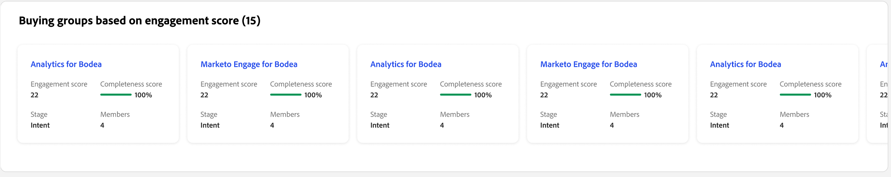
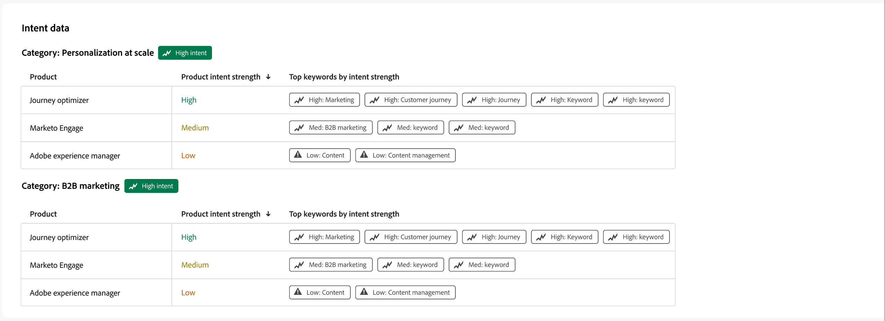

# Person details

When you click a person name from anywhere in Journey Optimizer B2B Edition, the person details page is displayed. This page includes useful information about the person associated with an account or buying group, including a generative AI summary of highlight and intent data (if configured). <!-- There are also [actions](#person-actions) that you can execute for the person. -->

{width="800" zoomable="yes"}

You can access this page by clicking a name displayed in the [Intelligent Dashboard](../dashboards/intelligent-dashboard.md), [Buying Group details page](../buying-groups/buying-group-details.md), or [Account details page](./account-details.md).

The person details page is comprised of the following four sections:

## Person overview

{zoomable="yes"}

The person overview section at the top of the page includes the following information:

* Name
* Title
* Email
* Phone number
* Engagement score
* Summary

## Activities

This section provides a list of the most recent email, web, form-fill, and interesting moments associated to the person (up to 20). The items are lists as the activity type with the date and time.

{width="700" zoomable="yes"}

## Buying groups based on engagement score

This section includes buying groups where the person is a member, and is sorted according to engagement score. Each card includes the following buying group information:

* Name - Click the name to open the [buying group details](../buying-groups/buying-group-details.md).
* Engagement score 
* Completeness score
* Stage
* Members

{width="700" zoomable="yes"}

## Intent data

In Journey Optimizer B2B Edition, the Intent Detection model predicts a solution/product of interest with high enough confidence based on a person's activity. It also leverages other account co-members' activities, along with tagged content. The intent of a person can be interpreted as the probability of having interest in a product.

{{intent-data-note}}

{width="700" zoomable="yes"}

* Levels of intent
* Types of intent signal - Keywords, product, and solution

<!-- ## Person actions -->
