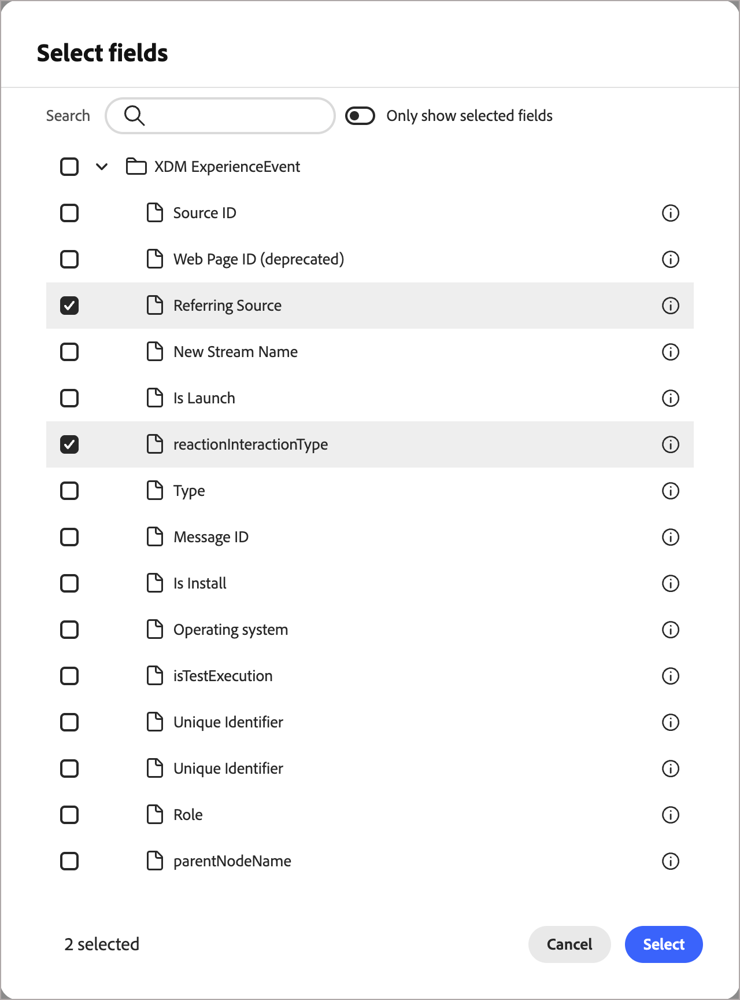

# Select Experience Events and fields

Administrators can select specific [AEP Experience Events](https://experienceleague.adobe.com/en/docs/experience-platform/xdm/classes/experienceevent){target="_blank"} and their associated fields within the Experience Event union schema. After selection, users can configure decisioning rules to listen to those Experience Events to enable dynamic and targeted campaign actions based on near real-time event data. 

<!-- {width="30"} [Watch the video overview](#overview-video) -->

>[!PREREQUISITES]
>
>Using Experience Events and fields in Journey Optimizer B2B Edition requires profile-enabled Experience Event schemas. For more information, see [Enable Real-Time Customer Profiles](https://experienceleague.adobe.com/en/docs/platform-learn/getting-started-for-data-architects-and-data-engineers/enable-profiles){target="_blank"} in the Experience Platform tutorials.

Using AEP experience events in journeys is a two-step process: 

1. An administrator [adds AEP Experience Events and fields](#add-an-event) in the Journey Optimizer B2B Edition configurations.

1. In a journey, a marketer uses the configured events in one of two ways:

   * Adds a _Listen for an event_ node and [selects an Experience Event](../journeys/listen-for-event-nodes.md#listen-for-an-experience-event) to trigger journey progression based on real-time event activity during the journey.
   * Adds a _Split paths by people_ node and configures a path to [filter on an event](../journeys/split-merge-paths-nodes.md#experience-event-history-filtering) from the **[!UICONTROL Event history]** folder.

>[!BEGINSHADEBOX]

## Guidelines and limitations {#guidelines-and-limitations}

As you select events to meet your organizational goals, consider the following: 

* You can select up to 50 events and up to 100 fields per event.

* Journeys can listen to Experience Events that are ingested using Experience Platform streaming capabilities, such as Web SDK or HTTP API.

* Historical experience event data begins accumulating for a person when the event exists in the Journey Optimizer B2B Edition database. For people who already exist when an event type is first configured, backfill begins at configuration time. For new people, accumulation starts when the person is first added (their prior history is not retroactively available).

* There is currently no delete mechanism for accumulated event history. Long-term retention policy is subject to change.

* When you use an Experience Event and publish the journey, you can add more fields, but you cannot remove fields that were previously selected.

* You can reference an Experience Event in multiple journeys or use it more than once in the same journey. 

>[!ENDSHADEBOX]

## Manage Experience Events {#manage-experience-events}

1. In the left navigation, choose **[!UICONTROL Administration]** > **[!UICONTROL Configurations]**.

1. Click **[!UICONTROL XDM Configurations]** on the intermediate panel, and then click the **[!UICONTROL Events]** tab to display the list of the available events.

   {width="800" zoomable="yes"}

   The list is displayed according to the _[!UICONTROL Last update]_ column, with the most recently updated events at the top by default.

   From this page, you can [select](#add-an-event) and [edit](#edit-an-event) events for use in journeys.
      
   To access the details for a selected event, click the event name.

### Filter the event list {#filter-the-event-list}

Enter text in the _[!UICONTROL Search]_ field to filter the displayed events for a match of the event name.

{width="600" zoomable="yes"}

### Add an event {#add-an-event}

To make an Experience Event available for a _Listen for an event_ node in a journey, select the event and the supported fields.

1. Click **[!UICONTROL Select experience event]** at the top right.

   The event details page is displayed. From this page, you can choose the event type and the fields.

   {width="700" zoomable="yes"}

1. Choose the event type.

   * Click **[!UICONTROL Select event type]**.

   * In the dialog, choose the event type.

      Use the _[!UICONTROL Search]_ field to filter the displayed list by name. Use the **[!UICONTROL Only show selected fields]** slider to review the current selections.

      {width="450" zoomable="yes"}      
   
   * Click **[!UICONTROL Select]**.

1. Choose one or more fields for the event type.

   * Click **[!UICONTROL Select fields]**.
   
   * In the dialog, select the fields that you want to use as constraints for matching events.

      Use the _[!UICONTROL Search]_ field to filter the displayed list by name. Use the **[!UICONTROL Only show selected fields]** slider to review the current selections.

      {width="450" zoomable="yes"} 
   
   * Click **[!UICONTROL Select]**.

1. In the event details page, click **[!UICONTROL Save]**.

The saved event is displayed in the list on the _[!UICONTROL Events]_ tab.

### Edit an event {#edit-an-event}

To change the fields, edit the event details.

1. Click the event name, or click the _More menu_ ( **...** ) icon and choose **[!UICONTROL Edit]**.

   {width="500" zoomable="yes"}    

1. Click **[!UICONTROL Edit fields]** to open the _[!UICONTROL Select fields]_ dialog and add more fields.

   You cannot remove fields that were previously selected after a journey that uses this event is published.

1. Click **[!UICONTROL Select]** to save your selections.

### Remove an event {#remove-an-event}

To prevent an Experience Event from being used in a _Listen for an event_ node within a journey, remove the event. You cannot remove an event if a journey in the _Scheduled_, _Live_, or _Finished_ status uses it.

1. Click the _More menu_ ( **...** ) icon next to the event name and choose **[!UICONTROL Remove]**. 

1. In the confirmation dialog, click **[!UICONTROL Remove]**.

   {width="500" zoomable="yes"} 

## Events and fields {#events-and-fields}

For [!DNL Journey Optimizer B2B Edition], certain people-level activities are captured as [!DNL Experience Platform] Experience Events. These events are stored in a system dataset that uses the XDM Experience Event schema and includes journey-specific field groups. You can use these events in [!UICONTROL Journey Optimizer B2B Edition] like any other Experience Event. 

Each event exposes a defined set of fields that can be used in journey _Listen for an event_ nodes (decisioning based on events). To determine which event and fields to use in these journey nodes, review the available event types and their fields:

### Email sent {#email-sent}

This event tracks when a marketing email was sent to a person.

Event type: `directMarketing.emailSent`

+++Fields

| Display name | Path |
| ------------ | ---- |
| Identifier | `_id` |
| Event type | `eventType` |
| Timestamp  | `timestamp` |
| Person ID  | `personID` |
| Person source ID | `personKey.sourceID` |
| Person source type | `personKey.sourceType` |
| Person source instance ID | `personKey.sourceInstanceID` |
| Person source Key | `personKey.sourceKey` |
| Email source ID | `directMarketing.emailSent.mailingKey.sourceID` |
| Email source type | `directMarketing.emailSent.mailingKey.sourceType` |
| Email source instance ID | `directMarketing.emailSent.mailingKey.sourceInstanceID` |
| Email source key | `directMarketing.emailSent.mailingKey.sourceKey` |
| Mailing name | `directMarketing.emailSent.mailingName` |
| Journey ID | `_experience.journeyOrchestration.stepEvents.journeyID` |
| Node ID | `_experience.journeyOrchestration.stepEvents.nodeID` |

+++

### Email delivered {#email-delivered}

This event tracks when an email was delivered successfully to a person's email service.

Event type: `directMarketing.emailDelivered`

+++Fields

| Display name | Path |
| ------------ | ---- |
| Identifier | `_id` |
| Event type | `eventType` |
| Timestamp  | `timestamp` |
| Person ID  | `personID` |
| Person source ID | `personKey.sourceID` |
| Person source type | `personKey.sourceType` |
| Person source instance ID | `personKey.sourceInstanceID` |
| Person source Key | `personKey.sourceKey` |
| Mailing source ID | `directMarketing.mailingKey.sourceID` |
| Mailing source type | `directMarketing.mailingKey.sourceType` |
| Mailing source instance ID | `directMarketing.mailingKey.sourceInstanceID` |
| Mailing source key | `directMarketing.mailingKey.sourceKey` |
| Mailing name | `directMarketing.mailingName` |
| Journey ID | `_experience.journeyOrchestration.stepEvents.journeyID` |
| Node ID | `_experience.journeyOrchestration.stepEvents.nodeID` |

+++

### Email opened {#email-opened}

This event tracks when a person opened a marketing email.

Event type: `directMarketing.emailOpened`

+++Fields

| Display name | Path |
| ------------ | ---- |
| Identifier | `_id` |
| Event type | `eventType` |
| Timestamp  | `timestamp` |
| Person ID  | `personID` |
| Person source ID | `personKey.sourceID` |
| Person source type | `personKey.sourceType` |
| Person source instance ID | `personKey.sourceInstanceID` |
| Person source Key | `personKey.sourceKey` |
| Mailing source ID | `directMarketing.mailingKey.sourceID` |
| Mailing source type | `directMarketing.mailingKey.sourceType` |
| Mailing source instance ID | `directMarketing.mailingKey.sourceInstanceID` |
| Mailing source key | `directMarketing.mailingKey.sourceKey` |
| Mailing name | `directMarketing.mailingName` |
| Is mobile device | `device.isMobileDevice` |
| Device model | `device.model` |
| User agent | `environment.browserDetails.userAgent` |
| Operating system | `environment.operatingSystem` |
| Journey ID | `_experience.journeyOrchestration.stepEvents.journeyID` |
| Node ID | `_experience.journeyOrchestration.stepEvents.nodeID` |

+++

### Email clicked {#email-clicked}

This event tracks when a person clicked a link in a marketing email.

Event type: `directMarketing.emailClicked`

+++Fields

| Display name | Path |
| ------------ | ---- |
| Identifier | `_id` |
| Event type | `eventType` |
| Timestamp  | `timestamp` |
| Person ID  | `personID` |
| Person source ID | `personKey.sourceID` |
| Person source type | `personKey.sourceType` |
| Person source instance ID | `personKey.sourceInstanceID` |
| Person source Key | `personKey.sourceKey` |
| Mailing source ID | `directMarketing.mailingKey.sourceID` |
| Mailing source type | `directMarketing.mailingKey.sourceType` |
| Mailing source instance ID | `directMarketing.mailingKey.sourceInstanceID` |
| Mailing source key | `directMarketing.mailingKey.sourceKey` |
| Mailing name | `directMarketing.mailingName` |
| Link URL | `directMarketing.linkURL` |
| Is mobile device | `device.isMobileDevice` |
| Model | `device.model` |
| User agent  | `environment.browserDetails.userAgent` |
| Operating system | `environment.operatingSystem` |
| Journey ID | `_experience.journeyOrchestration.stepEvents.journeyID` |
| Node ID | `_experience.journeyOrchestration.stepEvents.nodeID` |

+++

### Email bounced {#email-bounced}

This event tracks when an email to a person bounced.

Event type: `directMarketing.emailBounced`

+++Fields

| Display name | Path |
| ------------ | ---- |
| Identifier | `_id` |
| Event type | `eventType` |
| Timestamp  | `timestamp` |
| Person ID  | `personID` |
| Person source ID | `personKey.sourceID` |
| Person source type | `personKey.sourceType` |
| Person source instance ID | `personKey.sourceInstanceID` |
| Person source Key | `personKey.sourceKey` |
| Mailing source ID | `directMarketing.mailingKey.sourceID` |
| Mailing source type | `directMarketing.mailingKey.sourceType` |
| Mailing source instance ID | `directMarketing.mailingKey.sourceInstanceID` |
| Mailing source key | `directMarketing.mailingKey.sourceKey` |
| Mailing name | `directMarketing.mailingName` |
| Email | `directMarketing.email` |
| Email bounced code | `directMarketing.emailBouncedCode` |
| Email bounced details | `directMarketing.emailBouncedDetails` |
| Journey ID | `_experience.journeyOrchestration.stepEvents.journeyID` |
| Node ID | `_experience.journeyOrchestration.stepEvents.nodeID` |

+++

### Email bounced soft {#email-bounced-soft}

This event tracks when an email to a person soft-bounced.

Event type: `directMarketing.emailBouncedSoft`

+++Fields

| Display name | Path |
| ------------ | ---- |
| Identifier | `_id` |
| Event type | `eventType` |
| Timestamp  | `timestamp` |
| Person ID  | `personID` |
| Person source ID | `personKey.sourceID` |
| Person source type | `personKey.sourceType` |
| Person source instance ID | `personKey.sourceInstanceID` |
| Person source Key | `personKey.sourceKey` |
| Mailing source ID | `directMarketing.mailingKey.sourceID` |
| Mailing source type | `directMarketing.mailingKey.sourceType` |
| Mailing source instance ID | `directMarketing.mailingKey.sourceInstanceID` |
| Mailing source key | `directMarketing.mailingKey.sourceKey` |
| Mailing name | `directMarketing.mailingName` |
| Email | `directMarketing.email` |
| Email bounced code | `directMarketing.emailBouncedCode` |
| Email bounced details | `directMarketing.emailBouncedDetails` |
| Journey ID | `_experience.journeyOrchestration.stepEvents.journeyID` |
| Node ID | `_experience.journeyOrchestration.stepEvents.nodeID` |

+++

### Email unsubscribed {#email-unsubscribed}

This event tracks when a person unsubscribed from a marketing email.

Event type: `directMarketing.emailUnsubscribed`

+++Fields

| Display name | Path |
| ------------ | ---- |
| Identifier | `_id` |
| Event type | `eventType` |
| Timestamp  | `timestamp` |
| Person ID  | `personID` |
| Person source ID | `personKey.sourceID` |
| Person source type | `personKey.sourceType` |
| Person source instance ID | `personKey.sourceInstanceID` |
| Person source Key | `personKey.sourceKey` |
| Mailing source ID | `directMarketing.mailingKey.sourceID` |
| Mailing source type | `directMarketing.mailingKey.sourceType` |
| Mailing source instance ID | `directMarketing.mailingKey.sourceInstanceID` |
| Mailing source key | `directMarketing.mailingKey.sourceKey` |
| Mailing name | `directMarketing.mailingName` |
| Journey ID | `_experience.journeyOrchestration.stepEvents.journeyID` |
| Node ID | `_experience.journeyOrchestration.stepEvents.nodeID` |

+++

### Visit web page {#visit-web-page}

This event type is the standard method for marking the hit as a page view.

Event type: `web.webpagedetails.pageViews`

+++Fields

| Display name | Path |
| ------------ | ---- |
| Identifier | `_id` |
| Event type | `eventType` |
| Timestamp  | `timestamp` |
| Person ID  | `personID` |
| Person source ID | `personKey.sourceID` |
| Person source type | `personKey.sourceType` |
| Person source instance ID | `personKey.sourceInstanceID` |
| Person source Key | `personKey.sourceKey` |
| Web page source ID | `web.webPageDetails.webPageKey.sourceID` |
| Web page source type | `web.webPageDetails.webPageKey.sourceType` |
| Web page source instance ID | `web.webPageDetails.webPageKey.sourceInstanceID` |
| Web page source key | `web.webPageDetails.webPageKey.sourceKey` |
| Web page name | `web.webPageDetails.name` |
| Web page URL | `web.webPageDetails.URL` |
| Web page query parameters | `web.webPageDetails.queryParameters` |
| Web page ID | `web.webPageDetails.webPageID` |
| User agent | `environment.browserDetails.userAgent` |
| Referrer URL | `web.webReferrer.URL` |

+++

### Form filled out {#form-filled-out}

This event tracks when a person filled out a form on a web page.

Event type: `web.formFilledOut`

+++Fields

| Display name | Path |
| ------------ | ---- |
| Identifier | `_id` |
| Event type | `eventType` |
| Timestamp  | `timestamp` |
| Person ID  | `personID` |
| Person source ID | `personKey.sourceID` |
| Person source type | `personKey.sourceType` |
| Person source instance ID | `personKey.sourceInstanceID` |
| Person source Key | `personKey.sourceKey` |
| Web form source ID | `web.fillOutForm.webFormKey.sourceID` |
| Web form source type | `web.fillOutForm.webFormKey.sourceType` |
| Web form source instance ID | `web.fillOutForm.webFormKey.sourceInstanceID` |
| Web form source key | `web.fillOutForm.webFormKey.sourceKey` |
| Web form ID | `web.fillOutForm.webFormID` |
| Web form name | `web.fillOutForm.webFormName` |
| Web page query parameters | `web.webPageDetails.queryParameters` |
| Web page ID | `web.webPageDetails.webPageID` |
| User agent | `environment.browserDetails.userAgent` |
| Referrer URL | `web.webReferrer.URL` |

+++

### Web link clicked {#web-link-clicked}

The event signals that the Web SDK automatically recorded a link click.

Event type: `web.webinteraction.linkClicks`

+++Fields

| Display name | Path |
| ------------ | ---- |
| Identifier | `_id` |
| Event type | `eventType` |
| Timestamp  | `timestamp` |
| Person ID  | `personID` |
| Person source ID | `personKey.sourceID` |
| Person source type | `personKey.sourceType` |
| Person source instance ID | `personKey.sourceInstanceID` |
| Person source Key | `personKey.sourceKey` |
| Web interaction source ID | `web.webInteraction.webInteractionKey.sourceID` |
| Web interaction source type | `web.webInteraction.webInteractionKey.sourceType` |
| Web interaction source instance ID | `web.webInteraction.webInteractionKey.sourceInstanceID` |
| Web interaction source key | `web.webInteraction.webInteractionKey.sourceKey` |
| Web interaction link ID | `web.webInteraction.linkID` |
| Web interaction link URL | `web.webInteraction.linkURL` |
| Web page query parameters | `web.webPageDetails.queryParameters` |
| Web page ID | `web.webPageDetails.webPageID` |
| User agent | `environment.browserDetails.userAgent` |
| Referrer URL | `web.webReferrer.URL` |

+++

### Interesting moment {#interesting-moment}

This event tracks when an interesting moment was recorded for a person.

Event type: `leadOperation.interestingMoment`

+++Fields

| Display name | Path |
| ------------ | ---- |
| Identifier | `_id` |
| Event type | `eventType` |
| Timestamp  | `timestamp` |
| Person ID  | `personID` |
| Person source ID | `personKey.sourceID` |
| Person source type | `personKey.sourceType` |
| Person source instance ID | `personKey.sourceInstanceID` |
| Person source Key | `personKey.sourceKey` |
| Moment date  | `leadOperation.interestingMoment.date` |
| Moment description | `leadOperation.interestingMoment.description` |
| Moment source | `leadOperation.interestingMoment.source` |
| Moment type | `leadOperation.interestingMoment.type` |
| Journey ID | `_experience.journeyOrchestration.stepEvents.journeyID` |
| Node ID | `_experience.journeyOrchestration.stepEvents.nodeID` |

+++

<!--
 ## Overview video

>[!VIDEO](https://video.tv.adobe.com/v/3448637/?learn=on) 
-->