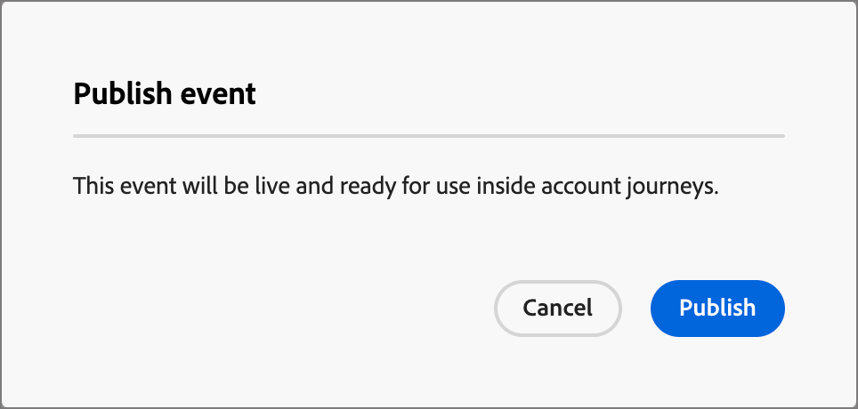
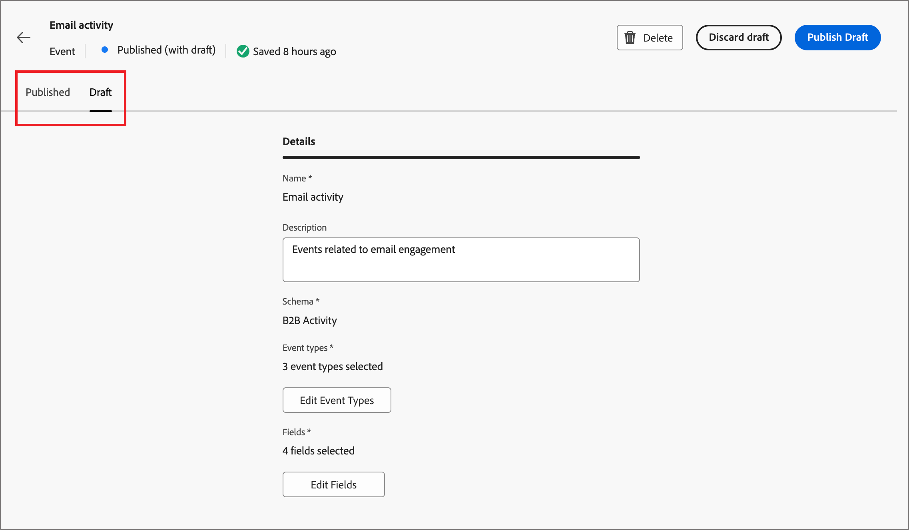

# Configure Experience Platform event definitions

Administrators can configure Adobe Experience Platform (AEP)-based event definitions, which enable Marketers to create account journeys that react to [AEP Experience Events](https://experienceleague.adobe.com/en/docs/experience-platform/xdm/classes/experienceevent). Using AEP experience events in account journeys is a two-step process: 

1. Create and publish an AEP event definition.

2. In an account journey, add a _Listen for an event_ node and [select an AEP event definition as a people event](../journeys/listen-for-event-nodes.md#listen-for-an-experience-event).

Each event definition requires the following Experience Platform input:

* **_Schema_** – XDM schema that defines the Experience Event data structure. It must be based on an Experience Event and must be profile-enabled.

   >[!NOTE]
   >
   >Coordinate with your Engineering team to ensure that the needed schemas are defined. [Creating XDM schemas](https://experienceleague.adobe.com/en/docs/experience-platform/xdm/schema/composition) is a complex process performed by data engineers based on use case requirements across your organization.

* **_Event types_** – XDM ExperienceEvent eventType (maximum of 20 per event definition).

* **_Fields_** – XDM fields that are present in the schema (maximum of 20 per event definition)

* **_Name_** - A unique name for the event definition.

* **_Description_** - A description for the event definition.

## Limitations and guardrails

As you create and manage your event definitions to meet your organizational goals, keep the following in mind:

* Journey Optimizer B2B Edition supports a maximum of 50 event definitions.

* Account journeys can listen for AEP Experience Events that are ingested using AEP streaming capabilities, such as Web SDK or HTTP API.

* Only one AEP event definition can use a combined schema and set of event types. When you create an event definition using a schema (for example, `My Schema`) and an event type (for example, `Web Webpagedetails Page Views`), no other event definition can use the combination of `My Schema` and `Web Webpagedetails Page Views`. 

* An event definition can be used in more than one account journey.

* AEP Experience Events can be used for decisioning purposes within an account journey, but are not retained. Therefore, no historical record of AEP Experience Events can be leveraged within Journey Optimizer B2B Edition.

* The constraints for _date of activity_ and _minimum number of times_ are not supported.

* After an event definition is published, the schema and name cannot be modified. However, you can add event types and fields by creating a draft version and publishing again.

* Event definitions used in published journeys cannot be deleted.

## Access and manage event definitions

1. In the left navigation, choose **[!UICONTROL Administration]** > **[!UICONTROL Configuration]**.

1. Click **[!UICONTROL Events]** on the intermediate panel to display the list of event definitions.

   From this page, you can [create](#create-an-event-definition), [publish](#publish-an-event-defintion), [edit](#publish-an-event-defintion), and [delete](#delete-an-event-definition) event definitions.

   {width="800" zoomable="yes"}

   The table is sorted by the _[!UICONTROL Modified]_ column, with the most recently updated definitions at the top by default.<!-- Click the column title to change between ascending and descending.-->

1. To access the details for an event definition, click the name.

### Event definition status and lifecycle

In the _[!UICONTROL Event definitions]_ list, the **[!UICONTROL Status]** column indicates the current status for each definition. The status determines its availability for use in account journeys, and the changes that you can make to it. 

| Status               | Description |
| -------------------- | ----------- |
| Draft                | When you create an event definition, it is in draft status. It remains in this status until you publish it for use in account journeys. Available actions: <ul><li>Edit all details<li>Publish<li>Delete|
| Published            | When you publish an event definition, it becomes available for use in account journeys. The details cannot be modified. Available actions: <ul><li>Available for _Listen for an event_ journey node<li>Create draft version<li>Delete (if not in-use)|
| Published (with draft) | When you create a draft from a published event definition, the published version remains available for use in account journeys, and the draft version can be modified. If you publish the draft version, it replaces the current published version and the event definition is updated for account journeys where it is not yet executed. Available actions: <ul><li>Edit all details<li>Publish draft version<li>Discard draft version<li>Delete (if not in-use)|

{zoomable="yes"}

### Filter the event definitions list

To search for an event definition by name, enter a text string into the search bar for a match. 

{width="700" zoomable="yes"}

## Create an event definition

1. In the left navigation, choose **[!UICONTROL Administration]** > **[!UICONTROL Configuration]**.

1. Click **[!UICONTROL Events]** on the intermediate panel to display the list of event definitions.

1. Click **[!UICONTROL Create event]** at the top right.

1. Enter the **[!UICONTROL Name]** (required) and **[!UICONTROL Description]** (optional).

   {width="600" zoomable="yes"}

1. Set the **[!UICONTROL Schema]** to use for the event definition.

   The schema that you select determines the fields that are available to add to the definition, which are then available as constraints for a _Listen for an event_ node in an account journey.

   * Click **[!UICONTROL Select schema]**.
   * In the dialog, select a schema from the list of Experience Event-based schemas.
   * Click **[!UICONTROL Select]**.

   {width="600" zoomable="yes"}

1. Select the **[!UICONTROL Event types]** to use for the event definition.

   The [event types](https://experienceleague.adobe.com/en/docs/experience-platform/xdm/classes/experienceevent#eventType) that you select determine the events that are available as constraints for a _Listen for an event_ node in an account journey.

   * Click **[!UICONTROL Select event types]**.
   * In the dialog, select one or more event types from the list (maximum of 20).
   * Click **[!UICONTROL Select]**.

   {width="600" zoomable="yes"}

1. Select the **[!UICONTROL Fields]** to use for the event definition.

   The fields that you select determine the constraints that are available when the event is used for a _Listen for an event_ node in an account journey.

   >[!NOTE]
   >
   >The `eventType` field is required and automatically selected. 
   
   * Click **[!UICONTROL Select fields]**.
   * In the dialog, select one or more fields from the list (maximum of 20).
   * Click **[!UICONTROL Select]**.

   {width="600" zoomable="yes"}

1. When the schema, event types, and fields are complete, click **[!UICONTROL Create]**.

   Upon creation, the list page is displayed and the new event is at the top of the list with a _Draft_ status.

   {width="700" zoomable="yes"}

## Publish an event definition

When you are satisfied that the draft event definition is complete and correct for your needs, you can publish it to make it available for use in account journeys. After the event definition is published, you can create a draft version if you need to make changes to it. However, you cannot change the schema, and you can only add event types and fields (you cannot delete them).

1. In the left navigation, choose **[!UICONTROL Administration]** > **[!UICONTROL Configuration]**.

1. Click **[!UICONTROL Events]** on the intermediate panel to display the list of event definitions.

1. In the _[!UICONTROL Event definitions]_ list, click the name of the draft event definition to open the details page.

   {width="600" zoomable="yes"}

   If needed, review the settings before you publish. You can [edit the draft](#edit-an-event-definition) if it does not satisfy your requirements.

1. Click **[!UICONTROL Publish]** at the top right.

1. In the confirmation dialog, click **[!UICONTROL Publish]**.

   {width="300"}

   The status for the event definition changes to _Published_ and it is now [available for use in account journeys](../journeys/listen-for-event-nodes.md#listen-for-an-experience-event).

   {width="700" zoomable="yes"}

## Edit an event definition

1. In the left navigation, choose **[!UICONTROL Administration]** > **[!UICONTROL Configuration]**.

1. Click **[!UICONTROL Events]** on the intermediate panel to display the list of event definitions.

   Edits to an event definition depend on its current status:

   * When an event definition is in _Draft_ status, you can edit any of its details.
   * When an event definition is in _Published_ status, you cannot edit it. You can create a draft version that is editable and then replace the published version.
   * When an event definition is in _Published (with draft)_ status, you can change the draft version (edit the description, and add event types and fields).

   {width="700" zoomable="yes"}

1. From the _[!UICONTROL Event definitions]_ listing page, click the event definition name to open it.

Follow the steps according to the status:

>[!BEGINTABS]

>[!TAB Draft]

1. Change any of the event definition details as needed.

   {width="600" zoomable="yes"}

   Follow that same guidelines that are used for [creating an event definition](#create-an-event-definition).

   The changes are automatically saved in the draft.

1. When the event definition meets your criteria and you want to make it available for use account journeys, click **[!UICONTROL Publish]**.

1. In the confirmation dialog, click **[!UICONTROL Publish]**.

   The status for the event definition changes to _Published_ and it is now available for use in account journeys.

>[!TAB Published]

1. To update the event definition, click **[!UICONTROL Create draft version]** at the top right.

   {width="600" zoomable="yes"}

1. In the confirmation dialog, click **[!UICONTROL Create draft]** to open the draft version.

   {width="300"}

   This action creates the draft version and returns to the list page, where the event definition is now in _Published (with draft)_ status.

1. Click the event definition name to open it.

   For a _Published (with draft)_ event definition, the _[!UICONTROL Published]_ version tab is selected by default.

1. Select the **[!UICONTROL Draft]** version tab.

   {width="600" zoomable="yes"}   

1. Change any of the editable details (**[!UICONTROL Description]**, **[!UICONTROL Event types]**, and **[!UICONTROL Fields]**) as needed.

   Follow that same guidelines that are used for [creating an event definition](#create-an-event-definition).

   The changes are automatically saved in the draft.

1. When the draft event definition meets your criteria and you want to replace the current published version for use in account journeys, click **[!UICONTROL Publish Draft]**.

1. In the confirmation dialog, click **[!UICONTROL Publish]**.

   {width="300"}

   When you publish the draft version, it replaces the current published version and the event definition is updated for account journeys where it is already in use but not yet executed.

>[!TAB Published (with draft)]

When you open a _Published (with draft)_ event definition, the _[!UICONTROL Published]_ version tab is selected by default.

1. Select the **[!UICONTROL Draft]** version tab.

   {width="600" zoomable="yes"}   

1. Change any of the editable details (**[!UICONTROL Description]**, **[!UICONTROL Event types]**, and **[!UICONTROL Fields]**) as needed.

   Follow that same guidelines that are used for [creating an event definition](#create-an-event-definition).

   The changes are automatically saved in the draft.

1. When the draft event definition meets your criteria and you want to replace the current published version for use in account journeys, click **[!UICONTROL Publish Draft]**.

1. In the confirmation dialog, click **[!UICONTROL Publish]**.

   {width="300"}

   When you publish the draft version, it replaces the current published version and the event definition is updated for account journeys where it is already in use but not yet executed.

>[!ENDTABS]

## Delete an event definition

You can delete an event definition if it is not in use by a published account journey.

>[!CAUTION]
>
>Use this action with caution. Removal of an event definition cannot be reversed.

1. In the left navigation, choose **[!UICONTROL Administration]** > **[!UICONTROL Configuration]**.

1. Click **[!UICONTROL Events]** on the intermediate panel to display the list of event definitions.

1. Locate event definition in list and click the _Delete_ (  ) icon to the right of the name.

1. In the confirmation dialog, click **[!UICONTROL Delete]**.

   {width="300"}
