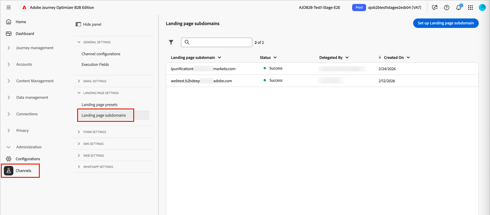
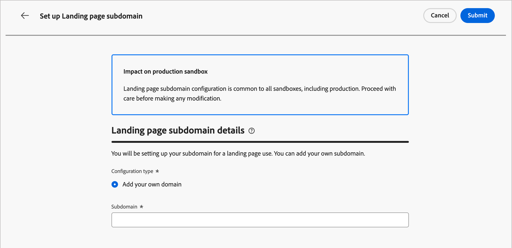
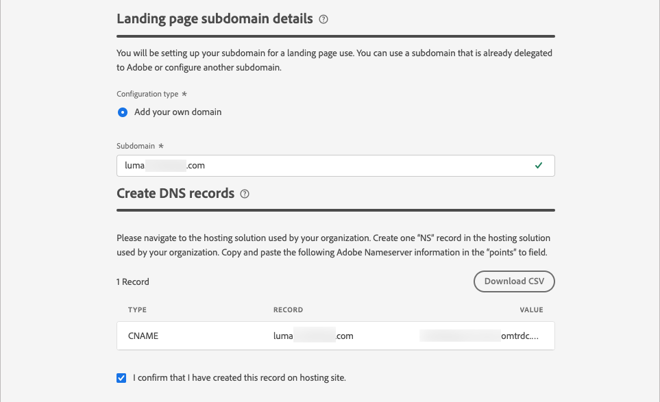
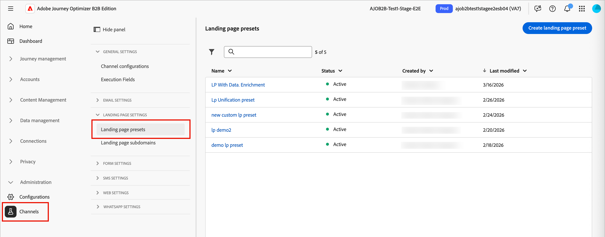

# Landing page configuration

Administrators should ensure that the landing page configurations are in place for the marketers who author and publish these pages. There are two configuration types required for crafting landing pages that reflect a brand and track engagement effectively:

* **_Subdomains_** — Set up where landing pages are hosted. Manage landing page subdomains to delegate, configure, or undelegate domain settings.
* **_Presets_** — Define reusable configurations (including subdomain and other channel settings) so that marketers can create and manage landing pages consistently.

## Subdomains {#lp-subdomains}

>[!CONTEXTUALHELP]
>id="ajo-b2b_admin_subdomain_lp_header"
>title="Delegate a landing page subdomain"
>abstract="Set up a subdomain for a landing page use. You can use a subdomain that is already delegated to Adobe or configure another subdomain."

>[!CONTEXTUALHELP]
>id="ajo-b2b_admin_subdomain_lp"
>title="Delegate a landing page subdomain"
>abstract="You must configure a landing page subdomain before creating a landing page preset. You can use a subdomain already delegated to Adobe or configure a new subdomain."

>[!CONTEXTUALHELP]
>id="ajo-b2b_admin_config_lp_subdomain"
>title="Create a landing page preset"
>abstract="To create a landing page preset, make sure you have at least one configured landing page subdomain to choose from the Subdomain name list."

To review the configured landing page subdomains, go to **[!UICONTROL Administration]** > **[!UICONTROL Channels]**. Under _[!UICONTROL Landing Pages]_ in the navigation pane, select **[!UICONTROL Landing Page Subdomains]**.

{width="800" zoomable="yes"}

The **Status** column provides information on the subdomain creation and delegation process:

* _[!UICONTROL Draft]_: The subdomain delegation is saved as a draft. Click the subdomain name to resume the creation process.
* _[!UICONTROL Processing]_: The subdomain is in progress through several configuration checks, which are required before it can be used.
* _[!UICONTROL Success]_: The subdomain passed through the checks successfully and can be used to deliver messages.
* _[!UICONTROL Failed]_: One or several checks failed after the subdomain delegation was submitted.

>[!NOTE]
>
>Before you can [create landing page presets](#lp-presets), you must set up the subdomains to be used for landing pages. You can use a subdomain that is already delegated to Adobe, or you can configure another subdomain. 

A landing page subdomain configuration is **common to all environments**. Therefore:

* To access and edit landing page subdomains, you must have the **[!UICONTROL Manage Landing Page Subdomains]** permission on the production sandbox.

* Any modification to a landing page subdomain also impacts the production sandboxes.

<!-- 
### Use an existing subdomain {#lp-existing-subdomain}

To use a subdomain that is already delegated to Adobe:

1. Click **[!UICONTROL Set up landing page subdomain]**.

    

1. For _[!UICONTROL Configuration type]_, choose **[!UICONTROL Use delegated domain]**.

    

1. Enter the prefix that you want to display in the landing page URL.

    Only alpha-numeric characters and hyphens are allowed.

    >[!CAUTION]
    >
    >Do not use `cdn` or `data` prefixes as these are reserved for internal use. You should also avoid other restricted or reserved prefixes, such as `dmarc` or `spf`.

1. Select a delegated subdomain from the list.

    You cannot select a subdomain that is already used as landing page subdomain.
    
    

    You cannot use multiple delegated subdomains of the same parent domain. For example, if 'marketing1.yourcompany.com' is already delegated to Adobe for your landing pages, you cannot use 'marketing2.yourcompany.com'. However, when multi-level subdomains are supported for landing pages, you may proceed using a subdomain of 'marketing1.yourcompany.com' (such as 'email.marketing1.yourcompany.com'), or a different parent domain.

    >[!CAUTION]
    >
    >If you select a domain that was delegated to Adobe using the [CNAME method](../configuration/delegate-subdomain.md#cname-subdomain-setup), you must create the DNS record on your hosting platform. To generate the DNS record, the process is the same as when you configure a new landing page subdomain.

1. Click **[!UICONTROL Submit]**.

   The subdomain is displayed in the list with the _[!UICONTROL Processing]_ status. For more on subdomains' statuses, see TBD.

    

   >[!IMPORTANT]
   >
   >The subdomain is not ready for use until Adobe performs the required checks, which can take **_up to 4 hours_**.

   When the checks are successful, the subdomain is listed with the _[!UICONTROL Success]_ status and it is ready to use for creating landing page presets.
-->

### Configure a new subdomain {#lp-new-subdomain}

>[!CONTEXTUALHELP]
>id="ajo-b2b_admin_lp_subdomain_dns"
>title="Generate the matching DNS record"
>abstract="To configure a new landing page subdomain, you need to copy the Adobe nameserver information displayed in the Journey Optimizer B2B interface and paste it into your domain-hosting solution to generate the matching DNS record. When the checks are successful, the subdomain is ready to be used to create landing page presets."

1. Click **[!UICONTROL Set up landing page subdomain]**.

1. For _[!UICONTROL Configuration type]_, choose **[!UICONTROL Add your own domain]**.

1. Specify the subdomain to delegate.

    >[!IMPORTANT]
    >
    >* You cannot use an existing landing page subdomain.
    >
    >* Capital letters are not allowed in subdomains.

    {width="500" zoomable="yes"}
    
    Delegating an invalid subdomain to Adobe is not allowed. Make sure you enter a valid subdomain which is owned by your organization, such as marketing.yourcompany.com.
    
    For landing pages, multi-level subdomains are supported. For example, you can use `email.marketing.yourcompany.com`.

1. Copy the displayed record, or download a CSV file, then navigate to your domain-hosting solution to generate the matching DNS record.

   The record to be placed in your DNS servers displays.

1. Make sure that the DNS record was generated into your domain-hosting solution. 

   If everything is configured properly, select the confirmation checkbox and click **[!UICONTROL Submit]**.

   {width="500" zoomable="yes"}

    When you configure a new landing page subdomain, it always points to a CNAME record.

    When the subdomain delegation is submitted, the subdomain displays in the list with the _[!UICONTROL Processing]_ status.

   >[!IMPORTANT]
   >
   >The subdomain is not ready for use until Adobe performs the required checks, which can take **_up to 4 hours_**.

   When the checks are successful, the subdomain is listed with the _[!UICONTROL Success]_ status and it is ready to use for creating landing page presets.

   The subdomain is marked as _[!UICONTROL Failed]_ if you did not create the validation record on your hosting solution.

### Undelegate a subdomain {#undelegate-subdomain}

1. In [!DNL Journey Optimizer], unpublish all the landing pages associated with the subdomain.

1. If the landing page subdomain points to a CNAME record, delete the CNAME record from your hosting solution (do not delete the original email subdomain, if any).

   <!--
    >[!NOTE]
    >
    >A landing page subdomain can point to a CNAME record because it was either an [existing subdomain](#lp-use-existing-subdomain) delegated to Adobe using the [CNAME method](../configuration/delegate-subdomain.md#cname-subdomain-setup), or a [new landing page subdomain](#lp-configure-new-subdomain) that you configured. 
    -->

1. Contact your Adobe representative with the subdomain you want to undelegate.

After Adobe handles your request, the subdomain inventory page no longer displays the undelegated domain.

<!-- 
old marketo way for Prime?

A landing page subdomain should help to identify the content type, product name, or campaign, and reinforce the page authenticity. Before you configure the subdomains, define one or more CNAMEs to use for your landing pages. For example:

* **product**.[CompanyDomain].com
* **go**.[CompanyDomain].com
* **signup**.[CompanyDomain].com

In these examples, the first part (in bold) is the `LandingPageCNAME`.

Add a new subdomain for each unique brand URL that you want to host on Adobe Journey Optimizer B2B Edition. You can add a maximum number of 50 subdomains.

>[!IMPORTANT]
>
>Delegating an invalid subdomain to Adobe is not allowed. Make sure you enter a valid subdomain that your organization owns, such as _marketing.yourcompany.com_.

To review your subdomains and add new ones, go to **[!UICONTROL Administration]** > **[!UICONTROL Channels]**. Under _[!UICONTROL Landing Pages]_ in the navigation panel, select **[!UICONTROL Subdomains]**.

{width="800" zoomable="yes"}

_To add a landing page subdomain:_

1. Click **[!UICONTROL Add subdomain]** at the top right.

1. In the _[!UICONTROL Subdomain details]_, enter the subdomain information:

   * **[!UICONTROL Subdomain]** - The subdomain URL to use, such as `marketing.yourcompany.com`
   * **[!UICONTROL Default page]** - The URL for the default subdomain page, such as `marketing.yourcompany.com/products`
   * **[!UICONTROL Fallback page]** - The URL for the fallback page to be used if a landing page on the subdomain is not active, such as `marketing.yourcompany.com/expired`

   {width="700" zoomable="yes"}

1. Click **[!UICONTROL Save]**.

-->

## Presets {#lp-presets}

>[!CONTEXTUALHELP]
>id="ajo-b2b_admin_config_lp_subdomain_header"
>title="Create a landing page preset"
>abstract="In order to build a landing page and leverage it through Journey Optimizer B2B Edition, you must create a landing page preset that includes the subdomain to use."

When marketers [create a landing page](../content/landing-pages.md#create-a-landing-page), they must select a landing page preset to be able to build the landing page and leverage it through [!DNL Journey Optimizer B2B Edition]. The preset includes the subdomain to use for the landing page.

Before you configure a preset, ensure that there is at least one configured landing page subdomain with the _[!UICONTROL Success]_ status.

To review the configured landing page presets, go to **[!UICONTROL Administration]** > **[!UICONTROL Channels]**. Under _[!UICONTROL Landing Pages]_ in the navigation pane, select **[!UICONTROL Landing page presets]**.

{width="800" zoomable="yes"}

Click any preset name to access the landing page preset details.

### Create a landing page preset {#lp-create-preset}

1. Click **[!UICONTROL Create landing page preset]**.

1. Enter a name and a description for the preset.
    
    Names must begin with a letter (A-Z), and only contain alpha-numeric characters, underscore `_`, dot`.` and hyphen `-` characters.

1. Select a landing page subdomain.

    {width="500" zoomable="yes"}

    >[!NOTE]
    >
    >To be able to select a subdomain, ensure you have previously configured at least one landing page subdomain.

    The settings corresponding to the selected subdomain display.

1. You can select the landing page subdomain for the **[!UICONTROL Tracking URL]** by checking the **[!UICONTROL Same as landing page subdomain]** option.<!-- [Learn more about tracking](../email/message-tracking.md) -->

    {width="500" zoomable="yes"}

    For example, if the landing page URL is `pages.mail.luma.com`, and the tracking URL is `data.mail.luma.com`, you can choose `pages.mail.luma.com` to be used as the tracking subdomain.

    <!-- 
    >[!CAUTION]
    >
    >The selected landing page subdomain is used to specify the **[!UICONTROL Tracking URL]**and **[!UICONTROL Image Delivery URL]** if that subdomain was created using an [existing subdomain](#use-an-existing-subdomain).
    >
    >If the subdomain was created using the [Add your own domain](#configure-a-new-subdomain) option, the primary subdomain (such as the first delegated subdomain) is used instead. We don't have the existing option right now.
    -->

1. Click **[!UICONTROL Submit]** to confirm the landing page preset creation.

   <!--You can also save the preset as draft and resume its configuration later on.-->

   When the landing page preset is created, it is displayed in the list with the _[!UICONTROL Active]_ status and is ready to use for [creating landing pages](../content/landing-pages.md#create-a-landing-page).
