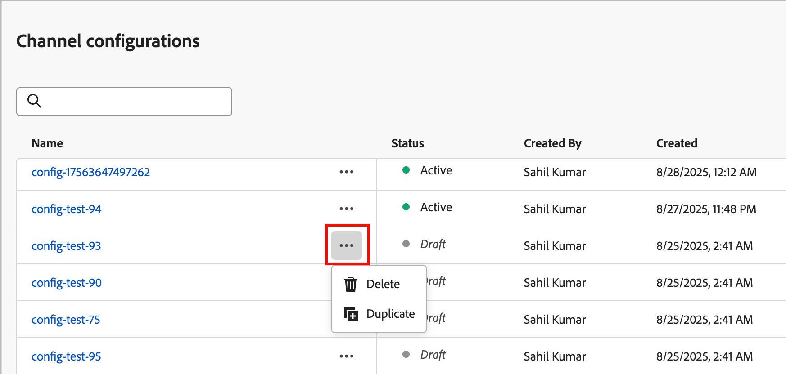

# Web channel configurations

A web configuration is a web property identified by a URL where the content is delivered. It can match a single page URL or multiple pages so that web experiences can deliver modifications across one or several web pages. These configurations are required for marketers to [add web personalization action nodes in journeys](../content/web-experiences.md#create-a-web-experience) and to [design the experience modifications](../content/web-experience-design.md) for a campaign.

>[!BEGINSHADEBOX]

**Prerequisites**

To use web channels, your website must have the [Adobe Experience Platform Web SDK](https://experienceleague.adobe.com/en/docs/experience-platform/collection/js/js-overview) (`alloy.js`) implemented for visitor identification and content delivery. Make sure that the Adobe Experience Platform Web SDK version is 2.16 or above.

Web channel configuration in Journey Optimizer B2B Edition requires the following [permissions](../admin/user-management.md#b2b-product-permissions):

* _[!UICONTROL Channel Configurations]_ > _[!UICONTROL Manage Messages Presets]_ - Required to create, update, and delete web channel configurations.
* _[!UICONTROL Channel Configurations]_ > _[!UICONTROL View Messages Presets]_ - Required to view web channel configurations.

>[!ENDSHADEBOX]

## Create a web channel configuration

1. In the left navigation, go to **[!UICONTROL Administration]** > **[!UICONTROL Channels]**. 

1. Under _[!UICONTROL Web]_ in the navigation panel, select **[!UICONTROL Channel configurations]**.

   {width="800" zoomable="yes"}

1. Click **[!UICONTROL Create channel configuration]** at the top right.

1. Enter a **[!UICONTROL Name]** (required) and a **[!UICONTROL Description]** (optional) for the configuration.

   >[!NOTE]
   >
   >Names must begin with a letter (A-Z) and can only contain alphanumeric characters. You can also use underscore `_`, dot `.`, and hyphen `-` characters.

1. In the **[!UICONTROL Web settings]** section, select one of the following options:

   * **[!UICONTROL Single page]** - If you want to apply the changes to a single page only, enter or select a **[!UICONTROL Page URL]**.

      {width="600" zoomable="yes"}

   * **[!UICONTROL Pages matching rule]** - To target multiple URLs matching the same rule, build a [pages matching rule](#build-a-pages-matching-rule) and enter a **[!UICONTROL Default authoring and preview URL]**.

1. Click **[!UICONTROL Submit]** to save your changes.

After you save the configuration, it is in a _Draft_ status and is available to marketers when they use a web channel in their journeys. You can continue to edit the configuration as long as it remains in draft state. You can also delete a draft web channel configuration by clicking the _More_ icon (**...**) next to the name and choosing **[!UICONTROL Delete]**.

As soon as the web channel is used in a journey, it moves to an _Active_ status. In this state, you can edit the name and description for the configuration. You cannot change the web settings or delete the configuration.

## Pages matching rules {#pages-matching-rule}

When creating a web configuration, you can build a _[!UICONTROL Pages matching rule]_ to target multiple URLs that match the same rule. These rules allow you to apply the same content changes across multiple pages.

For example, you might want to apply changes to a hero banner across an entire website, or add a top image that is displayed on all product pages.

### Build a rule

1. When you [create a web channel configuration](#create-a-web-channel-configuration), choose **[!UICONTROL Page matching rule]**.

1. Define your criteria for the **[!UICONTROL Domain]** and **[!UICONTROL Page]** fields using the different operators in each section to build the rule.

   +++Domain operators

   Use the following operators for matching domains according to the string value that you enter:

   | Operator | Description | Examples |
   | --- | --- | --- |
   | [!UICONTROL Equals] | Exact match of the domain. | |
   | [!UICONTROL Starts with] | Matches all domains (including subdomains) that start with the string entered. | `Starts with: dev` matches all domains and subdomains that start with `dev`, such as `dev.example.com`, `dev.products.example.com`, and `developer.example.com` |
   | [!UICONTROL Ends with] | Matches all domains (including subdomains) that end with the string entered. | `Ends with: example.com` matches all domains and subdomains that end with `example.com`, such as `stage.example.com`, `prod.example.com`, and `myexample.com` |
   | [!UICONTROL Wildcard matching] | Allows you to define a wildcard match in the middle of the string, such as `dev.*.example.com`. The validation rules require that the value contains one and only one wildcard (asterisk) when the operator is _wildcard matching_. | `Wildcard matching: dev.*.example.com` matches domains such as `dev.products.example.com`, `dev.mytest.products.example.com`, and `dev.blog.example.com` |
   | [!UICONTROL Any] | Matches all domains. It is useful when testing a particular path across domains. | |

   +++

   +++Path operators

   Use the following operators for matching paths according to the string value that you enter:

   | Operator | Description | Examples |
   | --- | --- | --- |
   | [!UICONTROL Equals] | Exact match of the path. | |
   | [!UICONTROL Starts with] | Matches all paths (including subpaths) that start with the string. | |
   | [!UICONTROL Ends with] | Matches all paths (including subpaths) that end with the string. | |
   | [!UICONTROL Any] | Matches all paths. It is useful when targeting all paths under one or multiple domains. | |
   | [!UICONTROL Wildcard matching] | Allows you to define an internal wildcard inside the path, such as `/products/*/detail`. The wildcard character `*` in the path component matches any sequence of characters until the first `/` character.  And `/*/` matches any sequence of characters (including subpaths). | `Wildcard matching: /products/*/detail` matches paths such as `example.com/products/yoga/detail`, `example.com/products/surf/detail`, `example.com/products/tennis/detail`, and `example.com/products/yoga/pants/detail` |
   | [!UICONTROL Contains] | The value is translated to a wildcard, such as `*mystring*`, and matches all paths that contain the sequence of characters. | `Contains: product` matches all paths that contain the string `product`, such as `example.com/products`, `example.com/yoga/perfproduct`, `example.com/surf/productdescription`, and `example.com/home/product/page` |

   +++

   For example, to support content changes on all the _LumaSecure_ solution pages of your _Bodea_ website, select **[!UICONTROL Domain]** > **[!UICONTROL Starts with]** > `bodea` and **[!UICONTROL Page]** > **[!UICONTROL Contains]** > `lumasecure`.

   {width="600" zoomable="yes"}

1. If your use case requires multiple rules, click **[!UICONTROL Add another page rule]** and repeat the previous step.

   * You can define up to 10 rules.

   * Use the **[!UICONTROL Or]** or **[!UICONTROL Exclude]** operators between the different rules.

     _[!UICONTROL Or]_ is the default operator for defining multiple rules and is useful for adding multiple criteria definitions that can be matched. 

     _[!UICONTROL Exclude]_ is useful when one of the pages that match the defined rule should not be targeted. For example, you can target all `bodea.com` pages that contain `lumasecure`, but excluding blog pages (such as `bodea.com/blogs/lumasecure/latest-release`).

   {width="600" zoomable="yes"}

1. Enter the **[!UICONTROL Default authoring and preview URL]**.

   This step ensures that the pages generated or matched by the rule have a designated URL for both web experience content design and preview purposes.

## Duplicate a web channel

You can duplicate an existing web channel configuration and change it to create a new web channel based on an existing one. An active web channel configuration saved to the library cannot be modified. 

1. Click the _More menu_ icon (**...**) for the variant and choose **[!UICONTROL Duplicate]**.

   {width="450"}

   This action creates a duplicated web channel with `_Copy_nnn` appended to the name.

1. Click the name of the duplicated web channel to edit the parameters.

   * Change the name and description to match the purpose or items in the rule.
   * If needed, change the single page URL.
   * If needed, change the pages matching rule according to your requirements.

1. When the configuration is complete, click **[!UICONTROL Submit]**.
