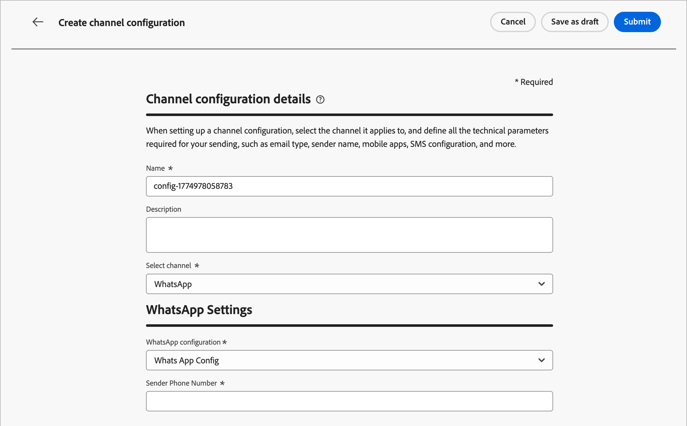

# WhatsApp channel setup

Adobe Journey Optimizer B2B Edition sends WhatsApp messages through Meta's Cloud API. Before marketers can create WhatsApp messages for account journeys, a product administrator must configure a WhatsApp channel.

## Prerequisites

Before configuring the WhatsApp channel, ensure that you have the following:

* [A Meta Business Manager account](https://business.facebook.com/)
* [A WhatsApp Business Account with a verified sender name and phone number](https://developers.facebook.com/docs/whatsapp/overview/business-accounts/)
* [A Meta user authorization token with the appropriate permissions](https://developers.facebook.com/blog/post/2022/12/05/auth-tokens/)
* [Approved message templates in your WhatsApp Business Account](https://developers.facebook.com/docs/whatsapp/message-templates/guidelines/)

>[!IMPORTANT]
>
>Your use of WhatsApp messaging services is subject to the terms and conditions from Meta. By accessing WhatsApp messaging through Journey Optimizer B2B Edition, you acknowledge that you have reviewed and agree to comply with [Meta WhatsApp Business policies](https://www.whatsapp.com/legal/business-policy/).

## Limitations {#limitations}

The following limitations apply to the WhatsApp channel:

* Adobe Journey Optimizer B2B Edition is **not HIPAA compliant and not HIPAA-ready**. Additionally, third-party vendors are not covered under Adobe's BAA. Customers are responsible for their own compliance and vendor validation.

* Automated or predefined response messages are not yet supported.

* Starting April 2025, Meta temporarily suspended delivery of all marketing template messages to WhatsApp users who have a United States phone number (a number composed of a +1 dialing code and a US area code). [Learn more in the Meta documentation](https://developers.facebook.com/documentation/business-messaging/whatsapp/templates/marketing-templates/per-user-limits/)

* The native integration functionality does not allow integration with third-party Business Service Provider (BSP).

## Complete the channel configuration

Before sending your WhatsApp message, you must configure your Journey Optimizer B2B Edition environment and connect it with your WhatsApp account.

Complete the following tasks:

   1. [Create the WhatsApp API credentials](#create-whatsapp-api-credentials)
   1. [Add the WhatsApp webhooks](#configure-webhooks)
   1. [Create the WhatsApp channel configuration](#create-channel-configuration)

### Create WhatsApp API credentials

>[!NOTE]
>
>The described settings are accessible only to users with Admin privileges.

1. On the left navigation, expand the **[!UICONTROL Administration]** section and click **[!UICONTROL Channels]**.

1. In the panel, expand **[!UICONTROL WhatsApp Settings]** and select **[!UICONTROL API Credentials]**.

   {width="800" zoomable="yes"}

1. Click **[!UICONTROL Create new API credentials]** at the top right.

1. Configure your API credentials, as detailed below:

    * **[!UICONTROL Name]** - Enter a unique name for the credentials
    * **[!UICONTROL API Token]** - Enter your API token. For information, refer to the [Meta Documentation](https://developers.facebook.com/blog/post/2022/12/05/auth-tokens/).
    * **[!UICONTROL Business Account ID]** - Enter the unique number related to your business portfolio. For information, refer to the [Meta Documentation](https://www.facebook.com/business/help/1181250022022158?id=180505742745347).

    {width="500" zoomable="yes"}

1. Click **[!UICONTROL Continue]**.

1. Choose the **[!UICONTROL WhatsApp Business Account]** that you want to connect to your WhatsApp API credentials.

    {width="500" zoomable="yes"}

1. Select the **[!UICONTROL Sender name]** to use for sending WhatsApp messages.

   The phone number settings are automatically populated:

    * **Quality Rating** - reflects customer feedback for messages sent in the past 24 hours.
        * Green: High quality
        * Yellow: Medium quality
        * Red: Low quality
        
        For more information, see [_Quality rating_](https://www.facebook.com/business/help/766346674749731#) in the Meta documentation.

    * **Throughput** - indicates the rate at which your phone number can send messages.

1. Click **[!UICONTROL Submit]** when you finished the configuration of your API credentials.

When you click _[!UICONTROL Submit]_, the credentials are immediately validated and saved, redirecting you to the _[!UICONTROL API credentials]_ listing page. 

If the submitted credentials are invalid, the system displays an HTTP 500 error message. In this case, you can choose to cancel the configuration or update it and submit again. 

+++HTTP 500 error troubleshooting

If you encounter an HTTP 500 error when configuring WhatsApp API credentials, follow these troubleshooting steps:

1. Verify your Adobe entitlements - Confirm that your organization has the _cjm_whatsapp_ entitlement provisioned. Without this entitlement, the WhatsApp channel cannot be configured.

1. Validate the business account fields - Ensure that all mandatory fields are correct:

   * API Token - Must be a valid [Meta access token with appropriate permissions](https://developers.facebook.com/blog/post/2022/12/05/auth-tokens/).
   * Business Account ID - Must match your [Meta Business Account ID](https://www.facebook.com/business/help/1181250022022158?id=180505742745347) exactly.

1. Test the credentials externally - Verify your credentials directly with the Meta API to confirm whether the issue is with the credentials or with Journey Optimizer B2B Edition credential handling.

<!-- 1. Enable advanced logging - To identify internal server or authentication misconfigurations, enable advanced logs in your Journey Optimizer B2B Edition environment to provide detailed information about the API call failures. 
do we have advanced logs? How are they enabled?-->

1. Contact Adobe - If the environment and entitlements are confirmed valid but the HTTP 500 error persists, contact your Adobe representative.

+++

### Add the WhatsApp webhooks {#configure-webhooks}

>[!CONTEXTUALHELP]
>id="ajo_b2b_admin-whatsapp-webhook-inbound-keyword-category"
>title="Inbound keyword category"
>abstract="<b>Opt-In</b>: sends your defined auto-response when a user subscribes.  <b>Opt-Out</b>: sends your defined auto-response when a user unsubscribes.  <b>Help</b>: sends your defined auto-response when a user requests help or support.  <b>Default</b>: sends your fallback auto-response when no keywords match."

>[!CONTEXTUALHELP]
>id="ajo_b2b_admin_whatsapp-webhook-inbound-keyword"
>title="Enter your keywords"
>abstract="You can define keywords to trigger specific auto-responses based on what users text. Keywords are not case-sensitive (stop and STOP are treated the same)."

>[!CONTEXTUALHELP]
>id="ajo_b2b_admin-whatsapp-webhook-webhook-url"
>title="Callback URL"
>abstract="The validation request and webhook notifications for this object are sent to the specified URL."

>[!CONTEXTUALHELP]
>id="ajo_b2b_admin-whatsapp-webhook-verify-token"
>title="Verify Token"
>abstract="The token that Meta echoes back to confirm and verify the callback URL during the verification process."

Webhooks enable Journey Optimizer B2B Edition to receive inbound messages, consent responses, and delivery notifications from your WhatsApp Business Account. Configure webhooks to ensure proper consent management and message tracking.

>[!NOTE]
>
>Without specified opt-in or opt-out keywords, standard consent messages are not enabled.

When the WhatsApp API credentials are successfully created, you can configure the webhooks.

1. In the navigation panel, select **[!UICONTROL WhatsApp Webhooks]**.

1. Click **[!UICONTROL Create Webhook]**.

1. Enter a **[!UICONTROL Name]** for the webhook configuration.

1. For **[!UICONTROL Configuration]**, select the API credentials (created in the previous task) to associate with the webhook.

1. For the **[!UICONTROL Inbound keyword category]**, choose a category to define keywords and the reply message: 

   * **[!UICONTROL Opt-in]** - Users must actively agree to receive WhatsApp messages, often managed through forms on your website or app.
   * **[!UICONTROL Opt-out]** - Configure your webhook to listen for phrases like `Stop` or `No Message` to automatically mark users as opted-out.
   * **[!UICONTROL Help]** - Allow automated systems to detect when a user sends `HELP` (or similar keywords like `Unknown`) and automatically reply with specific information, such as service instructions.
   * **[!UICONTROL Default]** - Handle incoming messages that do not match specifically defined keywords. It serves as a fallback category to enable tracking events (such as opens and delivery reports) in Adobe Experience Platform datasets.

   When you select the keyword category, the default keywords are populated.

1. For **[!UICONTROL Enter a keyword]**, you can enter a custom keyword and click _Add_ ( **+** ). 

   You can add multiple keywords per category.

   >[!NOTE]
   >
   >Keywords are not case-sensitive (`stop` and `STOP` are treated the same).

1. Enter the **[!UICONTROL Reply message]** to send automatically when a received message matches a keyword in this category.

   {width="500" zoomable="yes"}

1. For each additional keyword category you want to configure, click _Add_ (**+**) at the top right corner and repeat steps 5–7.

1. Click **[!UICONTROL Submit]** to save the webhook configuration.

### Copy the token and URL

After the webhook is submitted, you can retrieve the token and URL values, and then register it in Meta.

1. In the **[!UICONTROL WhatsApp Webhooks]** list, click the edit (  ) icon for the webhook you created. 

1. Copy the **[!UICONTROL Verify Token]** and **[!UICONTROL Webhook URL]** values.

   {width="500" zoomable="yes"}

1. In the [Meta for Developers portal](https://developers.facebook.com/), navigate to your WhatsApp application settings and configure the webhook using the values that you copied.

### Create channel configuration {#create-channel-configuration}

A channel configuration defines the delivery settings used when sending WhatsApp messages from a journey action node.

1. In the navigation panel, under _[!UICONTROL General settings]_, select **[!UICONTROL Channel configurations]**.

   {width="600" zoomable="yes"}

1. Click **[!UICONTROL Create channel configuration]** at the top right.

1. Enter a **[!UICONTROL Name]** and **[!UICONTROL Description]** (optional) for the configuration.

   >[!NOTE]
   >
   >The name must begin with a letter (A–Z) and can contain only alphanumeric characters, underscores (`_`), dots (`.`), and hyphens (`-`).

1. For **[!UICONTROL Select channel]**, choose `WhatsApp`.

 <!-- 1. For **[!UICONTROL Marketing action]**, select one or more marketing actions to associate consent policies with this configuration.

   Make sure to include all applicable marketing actions to ensure compliance with customer preferences.

   All consent policies associated with a selected marketing action are automatically leveraged in order to respect the preferences of your customers. For example, any WhatsApp message using that configuration in a journey is only sent to the profiles who have consented to receive WhatsApp messages from you. Profiles who have not consented to receive these communications are excluded. -->

1. Under _[!UICONTROL WhatsApp Settings]_, select the **[!UICONTROL WhatsApp configuration]** (API credentials) that you created in the previous task.

1. Enter the **[!UICONTROL Sender phone number]** to use for message delivery.

   {width="500" zoomable="yes"}

1. (Not currently applicable for Journey Optimizer B2B Edition) For the **[!UICONTROL WhatsApp Execution Field]**, select the profile attribute to use as the priority phone number when multiple phone numbers are available for a recipient.

1. Click **[!UICONTROL Submit]** to save, or **[!UICONTROL Save as draft]** to complete and submit the configuration later.

The configuration initially displays with a _Processing_ status while validation checks run. When all checks pass, the status changes to **_Active_** and the configuration is ready to be selected when marketers author WhatsApp messages in journey actions.
