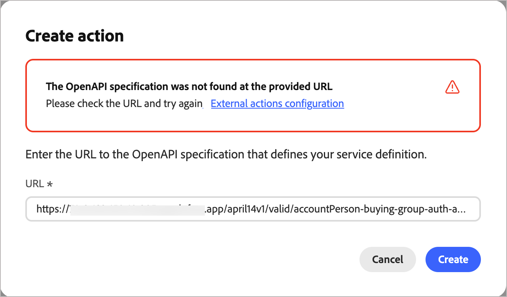

# External actions configuration

External actions allow account journeys in Journey Optimizer B2B Edition to connect with external systems directly from the journey canvas. When an account audience reaches an external action node, the system makes an asynchronous outbound call to a configured external service, passing audience attribute data for accounts, people, or both. The external service processes the data and responds using a callback, returning audience data and metadata that can be used to guide journey execution.

This feature supports two journey node types:

* **External action** – Calls an external service and continues along a single outgoing path. Ideal for _fire-and-forget_ integrations, such as updating a CRM record or triggering a downstream notification.
* **External split paths** – Calls an external service and evaluates the response to route accounts along one of several defined paths.

>[!NOTE]
>
>External action services are supported only for account journeys. These node types are not available for person journeys.

## Implementation overview

Setting up external actions requires coordination across three roles in sequence:

| | Role | Task |
| ---- | ---- | ---- |
| 1 | Developer | [Implement and publish the external service](#implement-service) |
| 2 | Administrator | [Configure the action in Journey Optimizer B2B Edition](#configure-action) |
| 3 | Marketer | [Add an external node to an account journey](#add-journey-node) |

## Implement the external service {#implement-service}

The developer must create and publish a public-facing web service that complies with the [Adobe Journey Optimizer B2B Edition External Actions Service Provider Interface](https://developer.adobe.com/journey-optimizer-b2b-apis/).

>[!NOTE]
>
>The callback function requires a bearer token. Retrieve this by setting up [OAuth Server-to-Server credentials in Adobe Developer Console](https://developer.adobe.com/developer-console/docs/guides/authentication/ServerToServerAuthentication/implementation) for your IMS Organization.

After the service is live, provide the URL to the OpenAPI specification and the authentication credentials to the product administrator who is responsible for configuring the action.

## Configure the action {#configure-action}

An action must be configured and activated before marketers can use it in a journey. Actions are created in _Draft_ state and your changes are saved automatically. It remains as a draft until you activate it.

>[!PREREQUISITES]
>
>Obtain the URL to the OpenAPI specification and the authentication credentials from the developer before you add the configuration.
>
>To define and activate an external action, you must have the _[!UICONTROL Manage B2B Admin Configurations]_ [product permission](./user-management.md#b2b-product-permissions).

1. Go to **[!UICONTROL Administration]** > **[!UICONTROL Configurations]**. 

1. Click **[!UICONTROL External Actions]** on the intermediate panel.

   {width="800" zoomable="yes"}

1. Click **[!UICONTROL Create action]** at the top right.

1. Enter the URL to the OpenAPI specification for your external service and click **[!UICONTROL Create]**.

   {width="500"}

   The external service must be live and reachable for this step to succeed. If there is a validation error, the dialog displays a message to describe the error and a suggestion for resolving it. For more information, see [_Troubleshooting_](#troubleshooting).

1. When the URL resolves successfully, review the **[!UICONTROL Service details]**.

   The service details are read directly from the OpenAPI specification when the action is created. You cannot change these properties in the configuration after creation.

   | Property | Description | OpenAPI spec property |
   | -------- | ----------- | --------------------- |
   | [!UICONTROL Name] | Name for the action | `info.title` |
   | [!UICONTROL Description] | Description for the action | `info.description` |
   | [!UICONTROL URL] | URL to the OpenAPI specification that defines the external service | `servers.url` |

1. Enter the **[!UICONTROL Authentication]** credentials for the external service (`components.securitySchemes`).

   >[!NOTE]
   >
   >The displayed credential fields depend on the authentication mechanism defined in the external service. Supported types are API Key, OAuth2, and HTTP Basic Authentication.

   {width="600" zoomable="yes"}

   You can change the credentials as needed when the configured action is in the _Draft_ or _Active_ status.

1. Click **[!UICONTROL Next]**.

1. Set the **[!UICONTROL Configurations]** properties to define how the action exchanges data with the external service. 

   >[!NOTE]
   >
   >Properties marked as _Static_ are not updatable at configuration time and are based on the service definition.

   * **[!UICONTROL Action type]** (_Static_) – The supported journey node type:
   
      * [!UICONTROL External action] (`enableSplitPath` = false)
      * [!UICONTROL External action split path] (`enableSplitPath` = true)

      You cannot change the action type after creating the action configuration.

   * **[!UICONTROL Accessors]**  (_Static_) – (External action split path only) The variables that are returned by the external service to be available as path conditions in an External split path node. (`invocationPayloadDef.accessorsMetadata`)

   * **[!UICONTROL Journey context]**  (_Static_) – The scope of audience data sent in the request (`supportedEntityType`):

      * [!UICONTROL Account] – Sends only accounts

      * [!UICONTROL People] – Sends only people

      * [!UICONTROL People in Account] – Sends accounts and account-related people

   * **[!UICONTROL Outgoing Fields]** – Map each field in the table to an [XDM field](../admin/xdm-field-management.md). These fields are sent in the request body to the external service. Service definition properties: `invocationPayloadDef.accountFields`, `invocationPayloadDef.fields`.

      {width="600" zoomable="yes"}

   * **[!UICONTROL Incoming Fields]** – Map each field in the table to an [updatable XDM field](../admin/xdm-field-management.md#updatable-fields). These fields are populated from the external service response. Service definition properties: `callbackPayloadDef.accountFields`, `callbackPayloadDef.fields`. Updatable after creation.

   * **[!UICONTROL Header parameters]** – Enter a value for each row to pass as an HTTP header in the request. Service definition property: `invocationPayloadDef.headers`.

   * **[!UICONTROL Timeout]** – Enter the number of minutes to wait for the external service to invoke the callback before the request is considered failed. Service definition property: `timeout`.

   * **[!UICONTROL Global attributes]** – Enter a value for each row to include as a static field in the request body. Service definition property: `invocationPayloadDef.globalAttributes`.

      {width="600" zoomable="yes"}

1. Click the _Back arrow_ to return to the list and keep the action in a _Draft_ state. 

   Or, click **[!UICONTROL Activate]** to change the action configuration to the _Active_ state. The configured external action must be active to make it available for use in account journeys.

### Troubleshooting {#troubleshooting}

When you enter the URL to the OpenAPI specification for your external service and click **[!UICONTROL Create]**, the system performs validation of the service. When it encounters an error, the dialog displays a message to describe the error.

{width="600" zoomable="yes"}

>[!NOTE]
>
>Many of the following errors require that you work with the developer who created and published the public-facing web service to resolve.

#### Validation error details

| Displayed error | Why it happened | What to do |
|---|---|---|
| `This URL is already used by another external action` | This spec URL is already registered to a different action in your org. | Use a different spec URL, or delete the existing action that already uses it. |
| `An action with this name already exists` | The `info.title` in your spec matches an action that already exists | Change the title in your spec's `info.title` field to something unique. |
| `Duplicate operation ID found in the specification` | Two or more operations in your spec share the same `operationId`. | Give every operation a unique `operationId`. |
| `Field in the specification exceeds the maximum allowed length` | A text field in your spec (such as a title or description) is too long. | Shorten the field that is flagged. |
| `The entity type value is invalid` | An Adobe-specific `x-` extension for entity type has an unrecognised value | Correct the entity type to a supported value. See the [developer documentation](https://developer.adobe.com/journey-optimizer-b2b-apis/) for the valid options. |
| `The provided document is not a valid OpenAPI specification` | The spec can't be parsed structurally. | Validate your spec against the OpenAPI 3.0 schema and fix any issues. |
| `Required OpenAPI field is missing` | A standard OpenAPI required field is absent (such as `info` or `paths`). | Add the missing field. |
| `Required endpoint is missing from the specification` | An endpoint that Adobe Journey Optimizer B2B Edition requires is not defined in your spec. | Add the required endpoint. See the [developer documentation](https://developer.adobe.com/journey-optimizer-b2b-apis/) for which endpoints are needed. |
| `Required extension field is missing` | A required Adobe `x-` extension field is absent from your spec. | Add the missing extension field as described in the documentation. |
| `Security schemes are missing from the specification` | Your spec has no `securitySchemes` defined under `components`. | Define at least one security scheme. |
| `Multiple authentication types are not supported` | Your spec defines more than one authentication scheme. | Update your spec to use a single authentication type. |
| `The authentication type is not supported` | The security scheme type you've used (such as `oauth2` or `openIdConnect`) is not supported. | Switch to a supported auth type. See the developer documentation for the supported options. |
| `The OpenAPI version is not supported` | Version mismatch at the spec level | Update your spec to use OpenAPI 3.0.x. |
| `An unexpected error occurred` | An unclassified problem was found in your spec. | Check your spec for anything unusual and try again. If the error persists, contact support. |

<!--
## Errors you'll see if something goes wrong with the request itself

This error appears below the URL field (not in the alert banner) and means there was a network problem or an unexpected server response — not a problem with your URL or spec.

| What you'll see | Why it happened | What to do |
|---|---|---|
| `Failed to create external action. Please try again.` | A network error occurred or the server returned an unexpected response | Check your connection and try again. If it keeps happening, contact support |
-->

## Add an external node to a journey {#add-journey-node}

After an action is activated, marketers can add an _[!UICONTROL External action]_ or _[!UICONTROL External split path]_ node to any account journey. For information about how to add and use these nodes in the account journey canvas, see [External nodes](../journeys/external-nodes.md).
