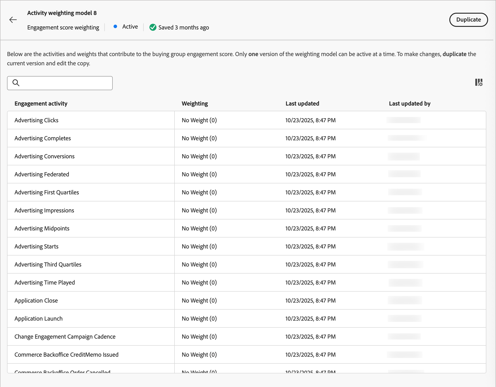

# Configure custom engagement score weighting

A buying group engagement score reflects the level of engagement by evaluating various activities recorded for members of the buying group. With custom score weighting, marketing operations teams have the flexibility to define their own models for weighting the activities that are most meaningful for engagement. A custom scoring model produces a more accurate reflection of your pipeline by prioritizing the behaviors that most accurately signal buying intent in your sales process.

As an administrator, you can define multiple engagement score models for your organization, but only one model can be active at any one time. You define a score model according to the weight applied to each engagement scoring activity.

## Access the engagement score weighting models

1. In the left navigation, choose **[!UICONTROL Administration]** > **[!UICONTROL Configurations]**.

1. Click **[!UICONTROL Engagement score weighting]** on the intermediate panel to display the list of scoring models.

   From this page, you can [create (duplicate)](#create-an-engagement-score-model), [activate](#activate-a-score-model), and [edit](#change-the-engagement-weighting-settings) engagement score models.

   {width="800" zoomable="yes"}

   The table displays the most recently updated models at the top (sorted by _[!UICONTROL Last updated]_) and includes the ability to search by _[!UICONTROL Name]_. You can customize the displayed table by clicking the _Column settings_ (  ) icon in the top-right corner and selecting or clearing the column checkboxes.

  {width="300"}

1. To access the details for an engagement score model, click the name.

### Default score model

The system creates an initial engagement score model named _Activity weighting model 1_, which is the active model until you create your own custom model and activate it. When you activate your custom model, the default model changes to an _Archived_ status. You can duplicate it if you decide to revert back to the default engagement score model, or to use it as a starting point for another custom model.

{width="600" zoomable="yes"}

### Delete a draft model

You can delete a draft engagement score model if you decide that you do not want to activate it in the future. Click the _More menu_ (***...***) icon next to the draft score model name in the list and choose **[!UICONTROL Delete]**.

{width="350"}

In the confirmation dialog, click **[!UICONTROL Delete]**.

## Create a custom engagement scoring model

To create a custom engagement score model, duplicate the default model or another custom model that is already created. You can duplicate the current _Active_ model, a _Draft_ model, or an _Archived_ model. Then, edit the duplicate model according to your needs.

1. Click the model name to open the model details page and click **[!UICONTROL Duplicate]** at the top right.

   {width="600" zoomable="yes"}

   You can also click the _More menu_ (***...***) icon next to the score model name in the list and choose **[!UICONTROL Duplicate]**.

   {width="325"}

1. In the _Duplicate_ dialog, enter a unique name for the duplicated model and click **[!UICONTROL Duplicate]**.

   {width="500"}

   The duplicated model is displayed in the list with a _Draft_ status. Click the name to open the score model details and make your changes.

### Change the engagement weighting settings

The weight settings define the bands that you can assign to each activity in the model. You can change the bands to reflect your organization's strategies for evaluating engagement. For example, you might adjust the _Normal_ weighting band to a value of 65 if you want to assign a higher value to normal activities. Or, you can add a weighting band that is designed to capture activities that fall between _Normal_ and _Important_. In this case, you could add a band and label it as _Significant_ and assign a weight band value of 75.

1. In the score model details page, click **[!UICONTROL Engagement weight settings]** at the top.

   {width="600" zoomable="yes"}

1. For each weight band, adjust the name or values according to your needs:

   * Change the name in the _[!UICONTROL Weighting band]_ field.
   * Enter a new value. You can also click **&plus;** or **&minus;** to increase or decrease the value.

   {width="500"}   

1. If needed, add another weighting band:

   Click **[!UICONTROL + Add weighting band]** at the bottom of the list. This action inserts a blank weighting band at the bottom of the list. 

   Enter the name and set the value for the band. Make sure to use a unique name and value.

1. If needed, remove a weighting band, click the _Delete_ (  ) icon for the weighting band row.

1. When your changes are complete, click **[!UICONTROL Save]**.

### Change the activity weighting

Each score model includes the full list of supported engagement score activities:

{{engagement-activities}}

For each activity in the list, set the value that you want to assign to each activity occurrence. Click the down arrow in the **[!UICONTROL Weighting]** field and choose the weighting band as defined in the engagement weighting settings.

{width="500"}  

If you do not want the engagement score calculation to use an activity, set the weighting to a zero (0) value.

Your changes are saved automatically.

## Activate a score model

When you activate a draft score model, it replaces the currently active model. The currently active model is automatically archived.

1. Open a draft score model to view the details page.

1. Click **[!UICONTROL Activate]**.

1. In the confirmation dialog, click **[!UICONTROL Activate]**.

   {width="400"}
