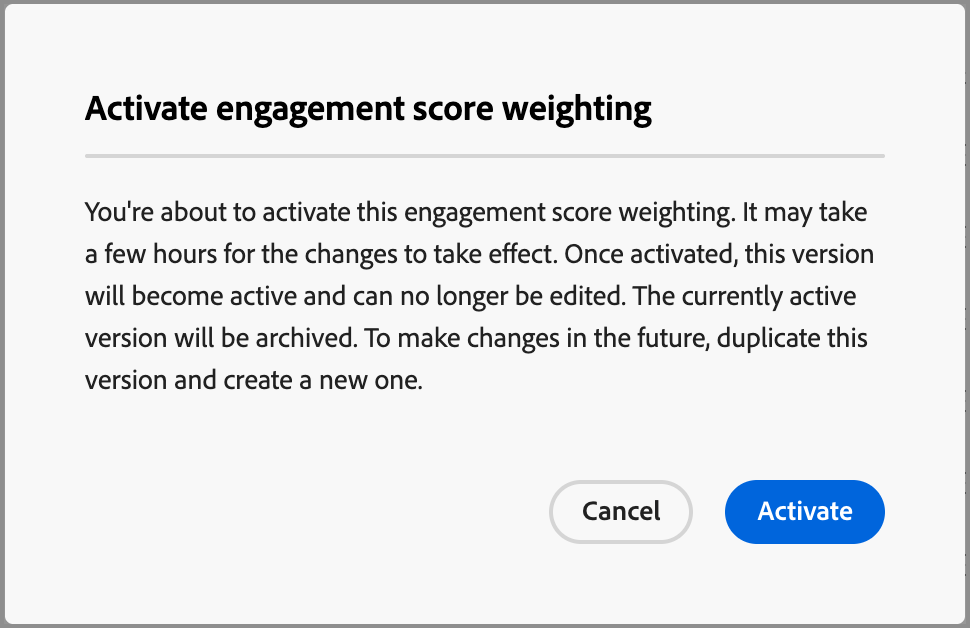

# Configure custom engagement score weighting

A [buying group engagement score](../buying-groups/engagement-scores.md) reflects the level of engagement by evaluating various activities recorded for members of the buying group. With custom score weighting, marketing operations teams have the flexibility to define their own models for weighting the activities. A custom scoring model produces a more accurate reflection of your pipeline by prioritizing the behaviors that most accurately signal buying intent in your sales process.

As an administrator, you can define multiple engagement score models for your organization, but only one model can be active at any one time. You define a score model according to the weight applied to each engagement scoring activity.

>[!PREREQUISITES]
>
>To define and activate an engagement score weighting model, you must have the _[!UICONTROL Manage B2B Admin Configurations]_ [product permission](./user-management.md#b2b-product-permissions).

## Access the engagement score weighting models

Open the _[!UICONTROL Engagement score weighting]_ list to view active, draft, and archived models:

1. In the left navigation, choose **[!UICONTROL Administration]** > **[!UICONTROL Configurations]**.

1. Click **[!UICONTROL Engagement score weighting]** on the intermediate panel to display the list of scoring models.

   From this page, you can [create (duplicate)](#create-an-engagement-score-model), [activate](#activate-a-score-model), and [edit](#change-the-engagement-weighting-settings) engagement score models.

    {width="800" zoomable="yes"}

   The list displays the most recently updated models at the top (sorted by _[!UICONTROL Last updated]_) and includes the ability to search by _[!UICONTROL Name]_.

   You can customize the displayed table by clicking the _Column settings_ (  ) icon in the top-right corner and selecting or clearing the column checkboxes.

   {width="300"}

1. To access the details for an engagement score model, click the name.

### Default score model

The system creates an initial engagement score model named _Activity weighting model 1_. The model status and engagement activities depend on the data architecture for your [!DNL Journey Optimizer B2B Edition] environment:

* **Simplified architecture** (Beta) - If your environment uses the [simplified architecture](../simplified-architecture.md), the engagement activities are based on standard and custom Experience Platform events. The weights on all activities are 0 by default.

   {width="600" zoomable="yes"}

* **Standard architecture** - If your environment uses the standard architecture, the connected [!DNL Marketo Engage] instance is the source for the engagement activity data. The default model is active until you create a custom version and activate it.

   {width="600" zoomable="yes"}

When you activate a custom model, the active model changes to an _Archived_ status. If you decide to revert back to the default engagement score model, you can duplicate the original default model and then activate it or use it as a starting point for another custom model.

### Delete a draft model

You can delete a draft engagement score model if you decide that you do not want to activate it in the future. Click the _More menu_ (***...***) icon next to the draft score model name in the list and choose **[!UICONTROL Delete]**.

{width="350"}

In the confirmation dialog, click **[!UICONTROL Delete]**.

## Create a custom engagement scoring model

To create a custom engagement score model, duplicate the default model or another custom model that is already created. You can duplicate the current _Active_ model, a _Draft_ model, or an _Archived_ model. Then, edit the duplicate model according to your needs.

1. Click the model name to open the model details page and click **[!UICONTROL Duplicate]** at the top right.

   {width="600" zoomable="yes"}

   You can also click the _More menu_ (***...***) icon next to the score model name in the list and choose **[!UICONTROL Duplicate]**.

   {width="325"}

1. In the _Duplicate_ dialog, enter a unique name for the duplicated model and click **[!UICONTROL Duplicate]**.

   {width="500"}

   The duplicated model is displayed in the list with a _Draft_ status. Click the name to open the score model details and make your changes.

### Change the engagement weighting settings

The weight settings define the bands that you can assign to each activity in the model. You can change the bands to reflect your organization's strategies for evaluating engagement. For example, you might adjust the _Normal_ weighting band to a value of 65 if you want to assign a higher value to normal activities. Or, you can add a weighting band that is designed to capture activities that fall between _Normal_ and _Important_. In this case, you could add a band and label it as _Significant_ and assign a weight band value of 75.

1. In the score model details page, click **[!UICONTROL Engagement weight settings]** at the top.

   {width="600" zoomable="yes"}

1. For each weight band, adjust the name or values according to your needs:

   * Change the name in the _[!UICONTROL Weighting band]_ field.
   * Enter a new value. You can also click **&plus;** or **&minus;** to increase or decrease the value.

   {width="500"}   

1. If needed, add another weighting band:

   Click **[!UICONTROL + Add weighting band]** at the bottom of the list. This action inserts a blank weighting band at the bottom of the list. 

   Enter the name and set the value for the band. Make sure to use a unique name and value.

1. To remove a weighting band, click the _Delete_ (  ) icon for the weighting band row.

1. When your changes are complete, click **[!UICONTROL Save]**.

### Change the activity weighting

Each score model includes the full list of supported engagement score activities.

+++Activities for simplified architecture

The default model for the simplified architecture includes the Experience Platform tracked activities. Each activity has a zero (0) weight (not used) until you assign a weight to it. All activities also have a maximum daily frequency of 20, which you cannot change.

<table style="table-layout: fixed; width: 100%; border: 0;">
<tbody>
<tr style="border: 0;">
<td>
<ul><li>Advertising Clicks </li><li>Advertising Completes </li><li>Advertising Conversions </li><li>Advertising Federated </li><li>Advertising First Quartiles </li><li>Advertising Impressions </li><li>Advertising Midpoints </li><li>Advertising Starts </li><li>Advertising Third Quartiles </li><li>Advertising Time Played </li><li>Application Close </li><li>Application Launch </li><li>Change Engagement Campaign Cadence </li><li>Commerce Backoffice CreditMemo Issued </li><li>Commerce Backoffice Order Cancelled </li><li>Commerce Backoffice Order Placed </li><li>Commerce Backoffice OrderItems Shipped </li><li>Commerce Backoffice Shipment Completed </li><li>Commerce Checkouts </li><li>Commerce Product List (Cart) Adds </li><li>Commerce Product List (Cart) Opens </li><li>Commerce Product List (Cart) Removals </li><li>Commerce Product List (Cart) Reopens </li><li>Commerce Product List (Cart) Views </li><li>Commerce Product Views </li><li>Commerce Purchases </li><li>Commerce Save For Laters </li><li>Decisioning Proposition Dismiss </li><li>Decisioning Proposition Display </li><li>Decisioning Proposition Interact </li></ul>
</td>
<td>
<ul><li>Decisioning Proposition Send </li><li>Decisioning Proposition Trigger </li><li>Delivery Feedback </li><li>Direct Marketing Email Bounced </li><li>Direct Marketing Email Bounced Soft </li><li>Direct Marketing Email Clicked </li><li>Direct Marketing Email Delivered </li><li>Direct Marketing Email Opened </li><li>Direct Marketing Email Sent </li><li>Direct Marketing Email Unsubscribed </li><li>Inapp message was dismissed </li><li>Inapp message was displayed </li><li>Inapp message was interacted with </li><li>Lead Operation Add To Campaign </li><li>Lead Operation Call Webhook </li><li>Lead Operation Change Campaign Stream </li><li>Lead Operation Convert Lead </li><li>Lead Operation Interesting Moment </li><li>Lead Operation Merge Leads </li><li>Lead Operation New Lead </li><li>Lead Operation Revenue Stage changed </li><li>Lead Operation Score Changed </li><li>Lead Operation Status in Campaign Progression Changed </li></ul>
</td>
<td>
<ul><li>Lead Operation Add To List </li><li>Lead Operation Remove From List </li><li>Location exit </li><li>Media adBreakComplete </li><li>Media adBreakStart </li><li>Media adComplete </li><li>Media adSkip </li><li>Media adStart </li><li>Media bitrateChange </li><li>Media bufferStart </li><li>Media chapterComplete </li><li>Media chapterSkip </li><li>Media chapterStart </li><li>Media custom tracking </li><li>Media downloaded content </li><li>Media error </li><li>Media pauseStart </li><li>Media ping </li><li>Media play </li><li>Media sessionComplete </li><li>Media sessionEnd </li><li>Media sessionStart </li><li>Media statesUpdate </li><li>Message Feedback </li><li>Message Rendering Data </li><li>Message Tracking </li><li>Opportunity Event Add To Opportunity </li><li>Opportunity Event Opportunity Updated </li><li>Opportunity Event Remove From Opportunity </li><li>Push Tracking Application Opened </li><li>Push Tracking Custom Action </li><li>Web Form Filled Out </li><li>Web Webinteraction Link Clicks </li><li>Web Webpagedetails Page Views</li></ul>
</td>
</tbody>
</table>

+++

+++Activities for standard architecture

The default model for the standard architecture includes the [!DNL Marketo Engage] tracked activities with an associated default weight. When you duplicate this model, you can change the weighting according to your needs. You cannot change the maximum daily frequency. 

{{engagement-activities-me}}

+++

For each activity in the list, set the value that you want to assign to each activity occurrence. Click the down arrow in the **[!UICONTROL Weighting]** field and choose the weighting band as defined in the engagement weighting settings.

{width="600" zoomable="yes"} 

If you do not want the engagement score calculation to use an activity, set the weighting to a zero (0) value.

Your changes are saved automatically.

## Activate a score model

When you activate a draft score model, it replaces the currently active model. The currently active model is automatically archived.

1. Open a draft score model to view the details page.

1. Click **[!UICONTROL Activate]**.

1. In the confirmation dialog, click **[!UICONTROL Activate]**.

   {width="400"}
