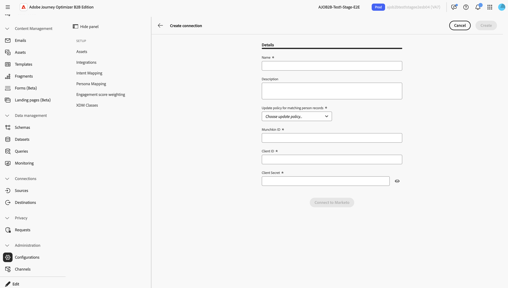

# Activate Marketo Engage connections to support actions

Marketo Engage actions are _people-based_ actions that allow you to coordinate your _account-based_ marketing orchestration between Journey Optimizer B2B Edition and your _lead-based_ marketing efforts in Marketo Engage. Use these actions to orchestrate static list membership and to place people into campaigns.

To use Marketo Engage journey actions, an administrator first creates a [custom service](https://experienceleague.adobe.com/en/docs/marketo-developer/marketo/rest/custom-services){target="_blank"} in Marketo Engage, which provides the credentials needed for authentication. Then, a product administrator for Journey Optimizer B2B Edition uses the credentials to create a connection to Marketo Engage. Journey Optimizer B2B Edition users can then reference the connection to configure Marketo Engage actions in person and account journeys:

* [!UICONTROL Add to Marketo List]
* [!UICONTROL Remove from Marketo List]
* [!UICONTROL Add to Marketo Request Campaign]

## Configure a Marketo Engage connection {#external-marketo-configure}

>[!CONTEXTUALHELP]
>id="ajo-b2b_marketo-configure-connections"
>title="External Marketo Engage connections"
>abstract="Product administrators can configure connections to external Marketo Engage instances, which makes them available for journey actions."

To configure an external Marketo Engage instance for use with journey actions, complete the following tasks.

### Create the Marketo Engage custom service

1. Log in to Marketo Engage as an administrator and [create a custom service](https://experienceleague.adobe.com/en/docs/marketo/using/product-docs/administration/additional-integrations/create-a-custom-service-for-use-with-rest-api){target="_blank"}.
1. Copy the following values to use for the Journey Optimizer B2B Edition connection:

   * Munchkin ID
   * Client ID
   * Client Secret

The [role permissions assigned in the custom service](https://experienceleague.adobe.com/en/docs/marketo-developer/marketo/rest/custom-services#permission-list){target="_blank"} govern Marketo Engage workspace visibility for assets, such as lists and campaigns. Marketers can use the same connection multiple times within a journey and use different Marketo Engage connections within the same journey.

### Add the integration

{width="800" zoomable="yes"}

1. In Journey Optimizer B2B Edition, navigate to **[!UICONTROL Administration]** > **[!UICONTROL Configurations]**.
1. Select the **[!UICONTROL Integrations]** tab.
1. Click **[!UICONTROL Create a connection]**.
1. Enter a **[!UICONTROL Name]** (required) and **[!UICONTROL Description]** (optional).
1. Select the update policy that is used for applying an action to a matching person record.

   When an action runs for the connected Marketo Engage instance, the selected _update policy_ determines the person records in Marketo Engage to select if multiple identifiers exist in the unified person profile. 
   
   * **[!UICONTROL Update all matching records]**
   * **[!UICONTROL Update only the oldest matching record]**
   * **[!UICONTROL Update only the newest matching record]**
   
   >[!NOTE]
   >
   >A person/lead proceeds through the journey regardless of a match, except when an error occurs. A journey action does not create a new person record in Marketo Engage when a matching record does not exist.

1. Enter the Munchkin ID, Client ID, and Client Secret for the service created in the external Marketo Engage instance.
1. Click **[!UICONTROL Connect to Marketo]**.
1. Click **[!UICONTROL Create]**.

## Use the connection in a journey action

When a marketer uses a Marketo Engage action in a journey, they can configure the node using the connection name.

>[!NOTE]
>
>Marketo Engage actions executed from a journey do not apply to the REST API limits for the connected Marketo Engage instance.

With the completed integration, Marketo Engage actions are available from **_Actions on:_** in the node properties.

{width="800" zoomable="yes"}
