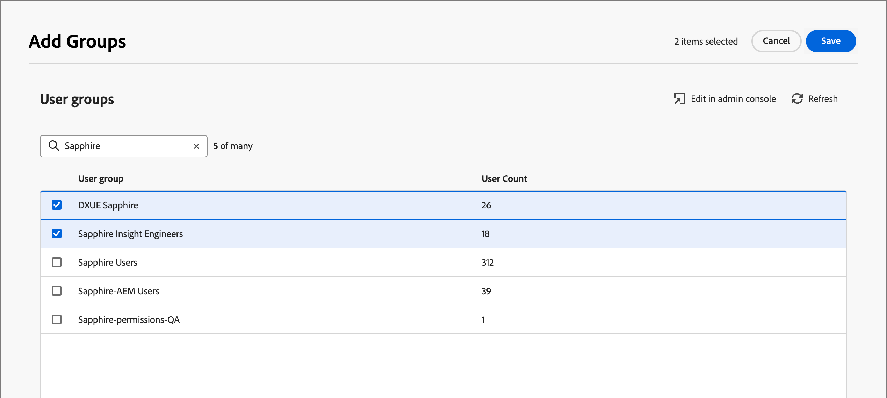

# User management

After provisioning is complete and sandboxes are bound, complete the following steps to provide Adobe Journey Optimizer B2B Edition access for your team and users.

1. [Create a Marketo Engage product profile](#marketo-engage-profile) in the Admin Console (new Marketo Engage instance only).
1. [Create a user group](#create-user-group) in the Admin Console.
1. [Edit built-in roles](#edit-roles) or [create a custom role](#create-a-custom-role) with Journey Optimizer B2B Edition permissions.
1. [Add users](#add-users) or [groups](#add-user-groups-to-a-role) to roles.

As an administrator, you can complete these tasks in the Adobe Admin Console, which is a central place to administer and manage your Adobe product licenses and users. In the Admin Console, you can create and manage users in a single location instead of within your various individual solutions. Refer to the [Admin Console overview](https://helpx.adobe.com/enterprise/using/admin-console.html) page to learn more about its functions and capabilities.

## Access the Admin Console

Before you can use the Admin Console to administer users within your team, you need to ensure that you can access the Admin Console and have the appropriate permissions.

1. As a system administrator, you should receive multiple emails from Adobe as part of the onboarding process.

   Look for the welcome email that provides the information about the organization name to which you have been granted access.

1. Click the **[!UICONTROL Get started]** link in your welcome email to navigate to the Admin Console. 

   If you cannot find the email, open a browser directly to the Admin Console at [https://adminconsole.adobe.com](https://adminconsole.adobe.com).

1. Log in using your Adobe ID.

   Upon successful login, you see the _Overview_ page of the Adobe Admin Console.

1. If you have access to multiple organizations, ensure that you have logged in to the correct organization.

   To change your organization, click the organization name from the top right corner and choose the organization to which you need access.

1. Select **[!UICONTROL Administrators]** from the _[!UICONTROL Users]_ card to verify that you are a system administrator.

   {width="700" zoomable="yes"}

1. Search by entering your Adobe ID email, username, first, or last name.

   * If your access is correctly configured, the search returns your record. 

   * If the value in the **[!UICONTROL ADMIN ROLE]** column shows `System`, you know that you (or the displayed user) are a system administrator.

## Create the Marketo Engage product profile {#marketo-engage-profile}

When granting users access to an Adobe solution, you do not necessarily want to give them full access. Product profiles enable each solution to have its own set of user permissions. Use the Admin Console to assign product profiles.

For more information about using product profiles for user entitlements, see [Manage product profiles for enterprise users](https://helpx.adobe.com/enterprise/using/manage-product-profiles.html){target="_blank"} in the Admin Console documentation.
<!--
>[!BEGINSHADEBOX]

When you add a user to the Marketo Engage product profile, they are subsequently added to the _Standard User_ role within the Default workspace of the Marketo Engage subscription. This role grants them all _Standard User_ permissions for Marketo Engage in that workspace. Currently, all Journey Optimizer B2B Edition users are required to be Marketo Engage users. A Marketo Engage administrator can restrict access by updating the permissions for the _Standard User_ role or by moving the user to a different Marketo Engage user role with more restrictive permissions.

For more information about managing these permissions within Marketo Engage, see [Managing User Roles and Permissions](https://experienceleague.adobe.com/en/docs/marketo/using/product-docs/administration/users-and-roles/managing-user-roles-and-permissions){target="_blank"} in the Marketo Engage documentation.

>[!ENDSHADEBOX]-->

{width="30"} A system administrator or Marketo Engage product administrator can perform the following steps.

1. Log in to [https://adminconsole.adobe.com](https://adminconsole.adobe.com).

1. Select the **[!UICONTROL Products]** tab.

1. Open the Marketo Engage instance where you want to add the profile and click **[!UICONTROL New profile]**.

   {width="700" zoomable="yes"}

1. Enter a product profile name, such as _Standard User_.

1. Click **Next** and then **Save**.

## Create a user group {#create-user-group}

A user group is a collection of users are granted a shared set of permissions. You can add or remove users in your user group. The group permissions remain the same while the users within the group change.

For more information about how user groups are used to manage permissions, see [Manage user groups](https://helpx.adobe.com/enterprise/using/user-groups.html){target="_blank"} in the Admin Console documentation.

{width="30"} A system administrator can perform the following steps.

1. Log in to [https://adminconsole.adobe.com](https://adminconsole.adobe.com).

1. Select the **[!UICONTROL Users]** tab.

1. Choose **[!UICONTROL User Groups]** in the left navigation.

1. Click **[!UICONTROL New user group]** at the top right.

1. Enter a name for the user group, such as _Standard Users_ and click **[!UICONTROL Save]**.

1. Click the user group you just created.

1. Select the **[!UICONTROL Assigned product profiles]** tab and click **[!UICONTROL Assign profile]**.

1. Click **+** and add each instance of the following products:

   * [!UICONTROL Marketo Engage]
   * [!UICONTROL Adobe Experience Platform - AEP-Default-All-Users]
   * [!UICONTROL Adobe Experience Platform Data Collection]
   * [!UICONTROL Data Collection All Access]

   {width="700" zoomable="yes"}

1. Click **[!UICONTROL Save]**.

## Add users to a group

For information about user management, see [Admin Console users](https://helpx.adobe.com/enterprise/using/user-groups.html) in the Admin Console documentation.

{width="30"} A system administrator or product administrator can perform the following steps. A product administrator can add only users that already exist in their organization. 

1. Go to [https://adminconsole.adobe.com](https://adminconsole.adobe.com).

1. Under _[!UICONTROL Quick links]_, click **[!UICONTROL Add users]**.

1. Add each user:

   * Enter the user's email address, first name, and last name.

      {width="600" zoomable="yes"}

   * For **[!UICONTROL User groups]**, click **+**.

   * Select the user group that you created previously.
   
   * Click **[!UICONTROL Apply]**.

1. Click **[!UICONTROL Save]**.

## Edit roles for product permissions {#edit-roles}

Permissions are unitary rights that allow you to define the authorizations assigned to a product profile. Each permission is gathered under a capability, such as journeys or buying groups, which represents the different functionalities or objects in Journey Optimizer B2B Edition.

The _Permissions_ area of Adobe Experience Platform is where administrators can define user roles and access policies to manage access permissions for features and objects within a product application. In this app, you can create and manage roles, as well as assign the desired resource permissions for these roles. Permissions also allow you to manage the sandboxes and users associated with a specific role.

For more information about role permissions in Experience Platform, see [Manage permissions for a role](https://experienceleague.adobe.com/en/docs/experience-platform/access-control/abac/permissions-ui/permissions){target="_blank"} in the Experience Platform documentation.

### B2B product permissions

The following permissions govern access to Journey Optimizer B2B Edition capabilities:

| Category | Description | Permissions |
| -------- | ----------- | ---------- |
| B2B Account Lists | Configure, manage, view, and publish permissions for B2B account lists. These permissions include actions such as add, remove, import, and delete accounts from account lists. | <li>Manage B2B Account Lists |
| B2B Admin Configurations | Configure, manage, and view permissions for B2B administrative configurations. These permissions include digital asset management connections, asset repositories, and events. | <li>Manage B2B Admin Configurations |
| B2B Assets | Configure, manage, and view permissions for B2B assets. These permissions include emails, SMS, landing pages, fragments, templates, and images. | <li>Manage B2B Assets <li>Manage B2B Templates <li>Manage B2B Fragments|
| B2B Buying Groups | Configure, manage, and view permissions for B2B buying groups. These permissions include solution interests, roles templates, and buying group status. | <li>Manage B2B Buying Groups |
| B2B Channel Configurations | Configure, manage, and view permissions for B2B channel configurations. These permissions include settings for communication limits, API credentials, and security settings. | <li>Manage B2B Channels Configurations |
| B2B Dashboards |Configure and view permissions for B2B dashboards. These permissions include account engagement, buying group stages, surging accounts, and contact coverage. | <li>Manage B2B Dashboards |
| B2B Journeys | Configure manage, view, and publish permissions for B2B journeys. These permissions include account and person actions, event listeners, and split paths | <li>Manage B2B Journeys |

### B2B built-in roles

When your organization has the Journey Optimizer B2B Edition product provisioned, Experience Platform includes a set of built-in (default) roles that you can use to manage access to the product capabilities:

| Role | Permissions |
| ---- | ----------- |
| B2B Journey Manager | <li>Manage B2B Journeys <li>Manage B2B Buying Groups <li>Manage B2B Account Lists <li>View B2B Engagement Dashboard <li>View B2B Insights Dashboard |
| B2B Channel Manager | <li>Manage B2B Assets <li>Manage B2B Templates <li>Manage B2B Fragments |
| B2B System Administrator | <li>Manage B2B Channels Configurations <li>Manage B2B Admin Configurations |
| B2B Sales User | <li>View B2B Engagement Dashboard |

### Edit role permissions

For built-in or custom roles, you can decide at any time to add or delete permissions. If you modify a default or custom role, it impacts every user assigned to the role.

In the following example, you want to add permissions related to the B2B Journeys resource for users assigned to the B2B Channel Manager role. This change enables users for that role to manage account journeys also.

>[!NOTE]
>
>An Admin Console system administrator can perform these steps.

_To change the permissions for a role:_

1. Go to [experience.adobe.com](https://experience.adobe.com/).

1. In the _[!UICONTROL Quick access]_ panel, select **[!UICONTROL Permissions]**.

   >[!NOTE]
   >
   >If you don't see _[!UICONTROL Permissions]_, you may need to click **[!UICONTROL View all]** and select it from the available applications.

   {width="700" zoomable="yes"}

1. Select **[!UICONTROL Roles]** in the left navigation.

1. Click the **_B2B Channel Manager_** role name.

1. In the details page, click **[!UICONTROL Edit]** at the top right.

   {width="700" zoomable="yes"}

   In the role editor, the _[!UICONTROL Resources]_ menu displays the list of resources that apply to the Experience Cloud - Platform powered applications products.

   You can enter _B2B_ in the search tool to filter the list for the B2B product permissions. 
   
1. Click the _Add_ icon (**+**) for the B2B Journeys resource.

   {width="700" zoomable="yes"}

1. In the _[!UICONTROL B2B Journeys]_ permissions card, select **[!UICONTROL Manage B2B Account Journeys]**.

1. Click **[!UICONTROL Save]**.

   {width="700" zoomable="yes"}

1. Click **[!UICONTROL Close]** to return to the details page.

### Add users to a role

{width="30"} A system administrator or AEP product administrator can perform the following steps. 

1. Open the role details and select the **[!UICONTROL Users]** tab.

   This tab displays a list of all users assigned to the role.

1. Click **[!UICONTROL Add users]**.

   {width="700" zoomable="yes"}

1. In the _[!UICONTROL Add users]_ dialog, locate and select the users that you want to add to the role.

   * You can use the Search tool to filter the list of users. 

   * Select the checkbox for each user.

   {width="600" zoomable="yes"}

1. Click **[!UICONTROL Save]** when you have selected all the users that you want to add.

### Add user groups to a role

For information about user management, see [Admin Console users](https://helpx.adobe.com/enterprise/using/user-groups.html) in the Admin Console documentation.

{width="30"} A system administrator or AEP product administrator can perform the following steps. 

1. Open the role details and select the **[!UICONTROL User groups]** tab.

   This tab displays a list of all user groups assigned to the role. 

1. Click **[!UICONTROL Add Groups]**.

   {width="700" zoomable="yes"}

1. In the _[!UICONTROL Add groups]_ dialog, locate and select the groups that you want to add to the role.

   * You can use the Search tool to filter the list of user groups. 

   * Select the checkbox for each user group.

   {width="600" zoomable="yes"}

1. Click **[!UICONTROL Save]** when you have selected all the users that you want to add.

## Create a custom role

{width="30"} A system administrator or AEP product administrator can perform the following steps. 

1. Select **[!UICONTROL Roles]** in the left navigation and select **[!UICONTROL Create role]**.

1. In the _[!UICONTROL Create new role]_ dialog, enter a name for the role, such as _B2B Marketers_, and a description (optional).

1. Click **[!UICONTROL Confirm]**.

1. Select your sandboxes.

   {width="700" zoomable="yes"}

1. Add the profile permissions:

   * In the _[!UICONTROL Resources]_ list on the left, locate the **[!UICONTROL Profile Management]** item and click the _Add_ (**+**) icon to add the attribute.

   * For the attribute, add the following permissions:
      * [!UICONTROL View segments]
      * [!UICONTROL Manage segments]
      * [!UICONTROL View profiles]
      * [!UICONTROL Manage profiles]
      * [!UICONTROL View B2B profile]
      * [!UICONTROL Manage B2B profile]

   {width="700" zoomable="yes"}

1. Add B2B product permissions:

   Refer to the list of [B2B product permissions](#b2b-product-permissions) to determine which product capabilities that you want for the role.

   In the _[!UICONTROL Resources]_ list on the left, locate the **[!UICONTROL B2B]** items and click the _Add_ (**+**) icon to add each attribute that you want to enable for the role.

   You can enter _B2B_ in the search tool to filter the list for the B2B product permissions.

1. Click **[!UICONTROL Save]** at the top right.

1. Go to the role details and select the **[!UICONTROL User groups]** tab.

1. Click **[!UICONTROL Add Groups]**.

   {width="700" zoomable="yes"}

1. Select the checkbox next to the user group that you created previously in the Admin Console.

1. Click **[!UICONTROL Save]**.
