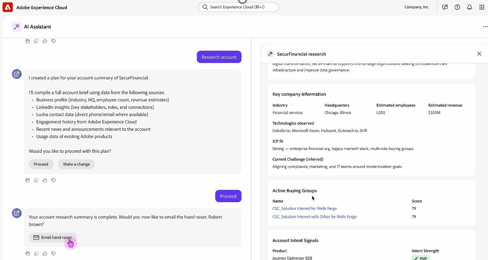

# Account Qualification Agent for B2B

>[!NOTE]
>This feature is currently in Limited Availability and is not available to all users.
>

Account Qualification Agent (AQA) — an AI-powered assistant designed for account representatives — streamlines and automates core sales development workflows, significantly reducing manual overhead and accelerating pipeline generation.

Built alongside Adobe Journey Optimizer B2B (AJO B2B) and the Adobe Agent Orchestrator framework, this solution intelligently integrates data, orchestration, and generative AI capabilities to empower BDRs with the following skills:

* Automated Account Intelligence:

    Leverages unified customer profiles and real-time signals to generate instant, context-rich summaries of target accounts and associated buying groups, enabling faster and more informed outreach

* Generative Outreach:

    Utilizes LLMs to draft highly personalized, multi-channel (email for now) outreach messages
    Prompts are dynamically tailored based on account insights, past interactions, and industry-specific context

* Autonomous Engagement:

    Supports automated follow-ups and response handling by intelligently interpreting customer replies and continuing conversations until the lead is qualified or routed, reducing human dependency while ensuring timeliness

* Data Hygiene & Enrichment:

    Automatically syncs updates back to the CRM with enriched company data, including company details and intent signals, ensuring accurate, up-to-date records and minimizing the burden of manual data entry.

This intelligent agent system enhances scalability, maintains contextual awareness across interactions, and integrates seamlessly into the BDR toolchain — enabling BDRs to focus on high-value conversations rather than repetitive tasks.

## Basic Usage

AI agents use "natural language queries", which means use the same language in the text prompt as you would in talking with a person. The more detailed you can be, the better the results.

Using natural language, you can ask the agent to:

* Show me my assigned leads with no engagement yet
* Show me all my leads that are not part of any autonomous engagement
* Give me a detailed summary on `<company>`, including their buying group, recent intent signals, and our past engagement.

This helps you to immediately understand which accounts and leads are most active and show the highest intent, so you can focus your energy where it will have the most impact.

Then, iterate over your journey, fine-tuning your prompts to get the results you need.
