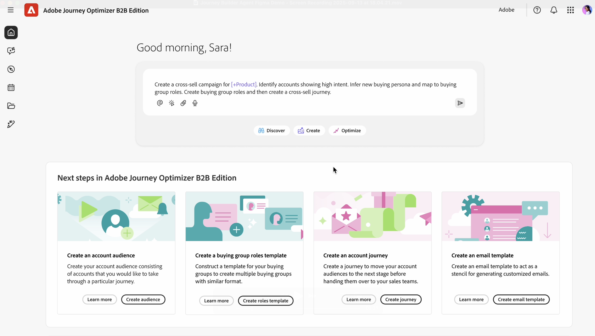

# Journey Build Agent for B2B

Journey Builder Agent B2B is an AI agent that assists you in journey design/creation, execution, and optimization through automation and data-driven recommendations. Journey Builder Agent for B2B automates and reduces the time taken to execute creation of new B2B journeys.

The Journey Agent in Journey Optimizer B2B Edition tackles three of the key challenges facing B2B marketers today:

* Dealing with increasingly complex customer journeys (complexity in audience, content & messaging, and omnichannel)
* Increasing efficiency in light of tighter budgets
* Figuring out how the optimal customer journey should be structured

Journey Builder Agent B2B Agent can be used to generate and update journeys:

* CREATE - Translate marketing objectives, products, engagement strategy, and KPIs into a personalized customer journey with automation and conditions
* RECOMMEND - Leverage past marketing engagement and other historical data to optimize journey creation
* OPTIMIZE - Analyze, adjust, and optimize active journeys based on predictions or actual performance
* MANAGE - Prioritize, manage, and orchestrate overlapping journeys and message delivery

## Basic Usage

To use the Journey Agent, type into the prompt window what you are looking to create, using natural language:

"Create a B2B journey to invite decision makers to a roadshow in engaged accounts most likely to open new pipeline."

The more detail that you can provide, the better the reply will be. If you have existing marketing materials that describe the event, or your product, etc., paste that into the prompt, so the Agent has a better sense of the goal.

"Act as a B2B journey strategist to create a multi-stage customer account journey that nurtures and engages decision-makers and marketing personas in the early exploration phase of `Solution Name`. The goal is to convert anonymous visitors into known contacts, deepen engagement with relevant content on `domain`.com, and prime qualified leads for `Product Name` sales outreach. Use channels such as email and paid media, leveraging existing audience segments and content. Structure the journey across awareness, consideration, and evaluation stages over 4–6 weeks, with clear triggers, actions, and goals for each stage. Include KPIs like conversion rates, engagement scores, and demo requests, and return the output as a structured journey flow."

This detailed prompt provides:

* Clear Intent: What do you want the AI to do? Be specific about the task or outcome.
* Context-Rich: Provide relevant background or constraints. Include examples or references if possible.
* Structured Format: Use bullet points, numbered steps, or templates.
* Role Assignment: Specify the AI's role - 'Act as a data analyst…'

Use the agent to iterate refinement: Start simple, then refine your prompt based on the results. Feedback loops improve results over time.

## End-to-end B2B Journey Creation (Account or Person Journey) from text files or prompt.

The Journey Agent can generate an end-to-end journey flow (account or person journey) from natural language text prompts and metadata, through a conversational experience rather than a traditional user interface.

End-to-end Journey prompt examples:

* Create a cross-channel journey to nurture accounts that have not engaged with my content in the past 30 days.
* Create a journey to cross-sell a solution to accounts showing high intent with no open pipeline by providing personalized content for the most important buying group roles.
* Create a B2B journey to invite decision makers to a roadshow in engaged accounts most likely to open new pipeline.
* Create a journey for whitespace accounts with intent for my solution, focusing on people engaged with content on the website.

## Multi-stage journeys

You can act as a B2B journey designer to create a multi-stage customer account journey that informs decision-makers and marketing personas early in the exploration phase.
The goal is to convert anonymous visitors into known contacts, deepen engagement with relevant content, and prime qualified leads for sales outreach.

* Use channels such as `Email`, `Paid media`, `Personalized web experiences` to leverage existing audience segments and content.
* Structure the journey across `awareness`, `consideration`, and `evaluation` stages over 4–6 weeks, with clear triggers, actions, and goals for each stage.
* Include KPIs, such as `conversion rates`, `engagement scores`, and `demo requests`, and return the output as a structured journey flow.
