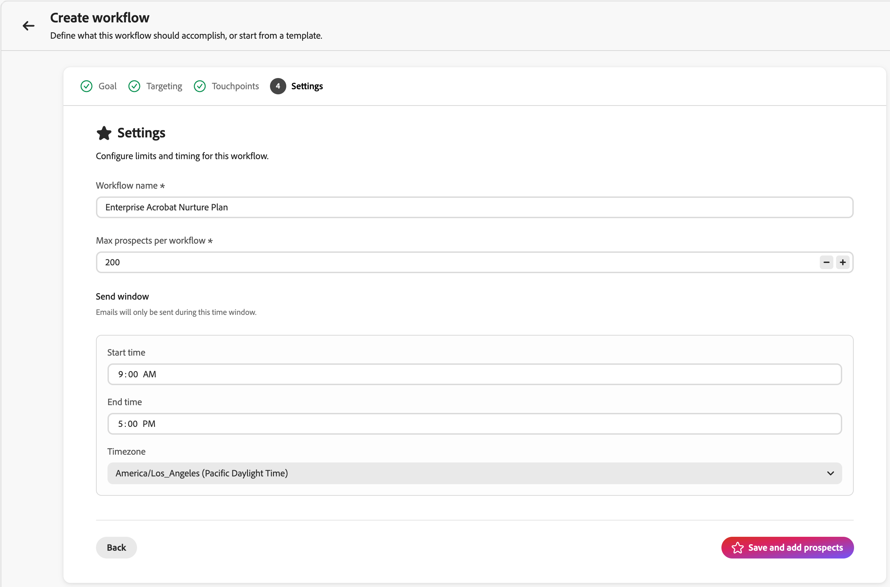
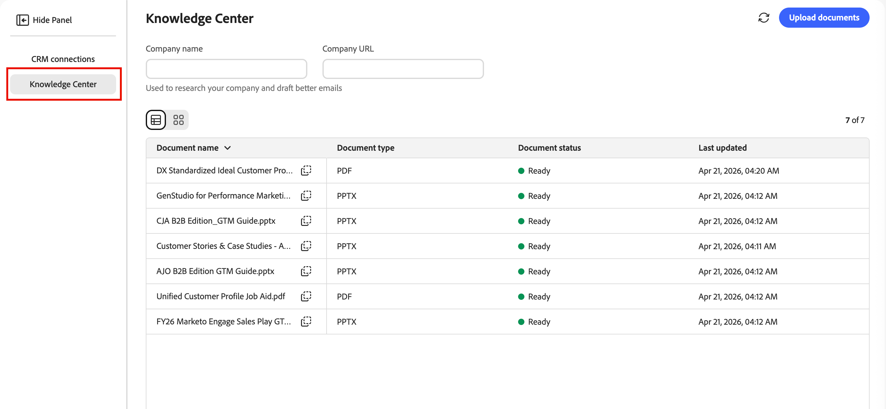
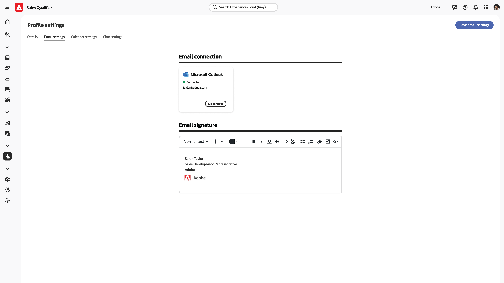

# Sales Qualifier

Sales Qualifier is an AI-driven application that you can use with Adobe Journey Optimizer B2B Edition. It implements the Account Qualification Agent and is designed to streamline workflows for Business Development Representatives (BDRs). Sales Qualifier automates prospect qualification, outreach, and buyer engagement workflows across channels. It reduces manual BDR load and accelerates pipeline velocity for Enterprise B2B companies.

BDRs can use the browser and email plugins to access business intelligence directly within CRMs or Outlook. The following video provides a short demonstration of the Sales Qualifier and Account Qualification Agent.

>[!VIDEO](https://video.tv.adobe.com/v/3476550)

## Application home

Sales Qualifier is included with [!UICONTROL Journey Optimizer B2B Edition], but it is a separate app within the Adobe Experience Platform.

{width="800" zoomable="yes"}

### Account Qualification Agent

The Account Qualification Agent (AQA) is the core of the Sales Qualifier. The AQA uses AI to read your accounts and determine which ones are ready for the next step. It assists with research, email drafting, and CRM-informed context when your organization has connected the CRM (read-only).

<!--
## Edit the left navigation bar

At the bottom left of the application, click the _Edit_ (  ) icon to control which elements are visible in the left navigation. You can also drag and drop them to reorder as you want.
-->

### Basic agent usage

Adobe AI agents use _natural language queries_, which means they use the same language in the text prompt as you do when speaking with a person. The more detailed you are, the better the results.

Using natural language, you can ask the agent to:

* `Tell me the latest financial results of Bodea`
* `Tell me more about hiring at TechNova`
* `Tell me about the new AI features in Bodea LumaSecure4`

Iterate your outbound workflows by refining your prompts to get the results you need. For example:

* _Draft a follow-up email drawing from context like earnings calls or reports._ Up to 120 words. Subject line: Captivating, incorporating a key theme. Intro: Hook with a direct quote from context sources. Body: Connect to pain points and value propositions. CTA: Propose a short call to explore further._

* _The goal of this email is to start a conversation and build credibility._ Draft an email under 120 words that has a consultative and empathetic tone. Avoid an overly familiar or sales approach and do not use the phrases "hope you are well," "just checking in," or "please."_

### Product access and user groups

Access to Sales Qualifier features is managed through user groups in Adobe Admin Console. Product administrators must set up the appropriate user groups before users can access the application.

#### Product administrators

Product administrators who need access to the [Integrations](#integrations) functionality must be members of the `Sales Qualifier Admins` user group.

1. In Adobe Admin Console, create a user group named `Sales Qualifier Admins`.
1. Add users who need to configure CRM connections and Knowledge Base settings.

#### Standard BDR users

Standard BDR users must be members of the `Sales Qualifier users` user group to access Sales Qualifier.

1. In Adobe Admin Console, create a user group named `Sales Qualifier users`.
1. Assign the **Default Production All Access** AEP profile to the group.
1. Add users to the group.

>[!NOTE]
>
>User group names must match exactly as shown in the preceding steps.

## Prospects

Select **[!UICONTROL Prospects]** in the left navigation to view a list of all the leads that you can access. It provides a quick review of information, such as lead status and last activity.

{width="800" zoomable="yes"}

Click the _Filter_   icon to filter the displayed list by lead status. 

## Outbound workflows

>[!NOTE]
>
>Outbound workflows created by product administrators are shared with all users in your organization.

An _outbound workflow_ is the structure Sales Qualifier uses to run a goal-driven email sequence. You define an outreach goal and targeting criteria and the AI proposes a multi-touch cadence and writes personalized email content for each prospect. You review and approve each email before enrollment activates the sequence so messages send only during your configured window.

An outbound workflow connects four elements:

* **Goal** – The outcome you want from the outreach (for example booking a discovery call or driving event registration).
* **Targeting filters** – Conditions that determine which prospects are eligible.
* **Cadence of touchpoints** – The ordered sequence of steps, each on a scheduled day. Touchpoints can be **emails**, **phone calls**, or **LinkedIn InMails**.
* **Personalized email content** – For each email touchpoint, the AI drafts content using the prospect profile, account context, engagement history, and recent news.

The goal drives everything downstream: the AI uses it to suggest targeting filters, design the cadence, draft touchpoint prompts, and shape personalization for every generated email.

{width="800" zoomable="yes"}

### Key concepts

| Concept | Description |
| --- | --- |
| **Workflow** | A reusable outbound activity defined by a goal, targeting filters, cadence, and settings. |
| **Goal** | What the outreach should accomplish. |
| **Touchpoint** | One step in the sequence (email, phone call, or LinkedIn InMail), scheduled relative to enrollment. |
| **Touchpoint prompt** | Instructions the AI follows when generating email body and subject for a prospect—tone, length, focus, and call to action. |
| **Cadence** | The full sequence of touchpoints: how many, in what order, and on which days. |
| **Targeting filter** | A condition that limits the workflow to a subset of prospects. |
| **Draft** | A generated email that is ready for review but not yet approved. |
| **Reasoning** | The AI's explanation of how it wrote a given email (which signals and data sources it used). |
| **Enrollment** | Approving a prospect's drafts, which activates the cadence and queues emails to send during the workflow's send window. |

The following sections describe the full lifecycle: creating a workflow in the wizard, reviewing generated emails, approving prospects, and managing workflows over time.

### Create an outbound workflow

Workflow creation is a five-step wizard: **Goal**, **Targeting**, **Generate touchpoints**, **Settings**, and **Add prospects**. Each step builds on the last; your initial goal shapes every subsequent decision.

1. In the left navigation, select **[!UICONTROL Outbound workflow]**.

1. On the **[!UICONTROL Browse]** tab, click **[!UICONTROL + Create workflow]** in the upper-right corner.

#### Step 1: Define your goal

The goal is the most important input: it tells the AI what success looks like and anchors targeting, cadence, and email generation.

1. Choose **[!UICONTROL Start from scratch]** to write your own goal, or **[!UICONTROL Start from template]** to use a saved template.

   {width="700" zoomable="yes"}

1. Choose one of the **[!UICONTROL Recommended goals]** as a starting point, or enter your own goal.

1. Click **[!UICONTROL Next: Targeting]**.

Goals work best when they state a **concrete outcome**, not only a topic. For example, `Book a 15-minute discovery call with marketing leaders evaluating campaign automation` gives the AI more to work with than `Promote campaign automation`.

#### Step 2: Configure targeting filters

Targeting filters define which prospects are eligible. When you add prospects later, only those prospects who match these filters appear in the selection list.

1. Click the down arrow to display the **[!UICONTROL Add a filter]** list and select a filter to apply.

   {width="700" zoomable="yes"}   

1. Set values for the filter.

1. Add more filters if you need to narrow the audience.

   {width="600" zoomable="yes"} 

1. Click **[!UICONTROL Next: Generate touchpoints]**.

#### Step 3: Generate and review touchpoints

After targeting is set, the AI builds the **_cadence_**: it analyzes your goal and targeting, defines the touchpoint sequence, and writes a **_touchpoint prompt_** for each step. You see a multi-step cadence with each touchpoint on a specific day. The cadence can mix email, phone call, and LinkedIn InMail steps.

{width="700" zoomable="yes"} 

Expand an email touchpoint to read its prompt. This instruction guides the AI when writing each prospect's email, including tone, length, focus, and _call to action_.

**Regenerate the cadence**

If the cadence is not what you want, click **[!UICONTROL Regenerate]** and enter a refinement instruction. For example:

* `Make it 3 touchpoints across 2 weeks`
* `Lead with an executive briefing offer in the first email`
* `Add a nurture touch focused on a relevant case study`

The AI rewrites the full cadence based on your instruction.

To adjust a single email touchpoint without regenerating the whole cadence, edit the prompt text directly in its text area.

When the cadence and prompts look right, click **[!UICONTROL Next: Settings]**.

Refining touchpoint prompts before per-prospect generation matters: those prompts are the core instructions the AI uses for every prospect later. Time spent here scales across all generated emails.

#### Step 4: Configure workflow settings

The **Settings** step controls how the workflow runs.

{width="700" zoomable="yes"} 

1. Review the **[!UICONTROL Workflow name]** and change it if you want a clearer label.
1. In **[!UICONTROL Max prospects per workflow]**, confirm the upper limit on how many prospects the workflow can manage at once.
1. Set the **[!UICONTROL Send window]** for the hours when outbound emails are allowed to send.
1. Confirm **[!UICONTROL Include opt out link]** so that each email can include an opt-out link.
1. Confirm that the **[!UICONTROL Timezone]** matches your audience.
1. Click **[!UICONTROL Save and add prospects]**.

#### Step 5: Add prospects and start email generation

Saving opens the prospect selection view, already filtered by your Step 2 targeting.

{width="700" zoomable="yes"}

1. Review the list.

   Rows typically include prospect name, account, email, job title, engagement status, and prospect status.

1. Adjust filters here if you need to expand or narrow the list.
1. Select prospects using the checkboxes.
1. Click **[!UICONTROL Next: Review touchpoints]** to start **per-prospect** email generation.

The AI generates personalized emails for every selected prospect for **each email touchpoint** in the cadence. Phone and LinkedIn InMail touchpoints remain in the sequence as scheduled steps. Generation can run in the background—use **[!UICONTROL Notify when ready]** if you want to continue other work while it completes.

For each prospect, the AI combines each touchpoint prompt with prospect-specific data (person, account, engagement history, recent news) to produce subject line and body.

### Review and refine generated emails

When generation finishes, the workflow detail view shows a banner to review drafts. Review is required and nothing sends until you approve.

{width="700" zoomable="yes"}

1. In the workflow detail view, click **[!UICONTROL Review drafts]** in the banner.
1. The **[!UICONTROL Review touchpoints]** step has two tabs:
   * **[!UICONTROL Ready for Review]** – Emails that have finished generating.
   * **[!UICONTROL Generating]** – Emails still being written.
1. In the prospect list on the left, click a name to load that prospect's touchpoints on the right.
1. Use the chevron (**>**) on a touchpoint to expand and read the full subject line and body.

#### Read the AI reasoning

For each generated email, **[!UICONTROL Reasoning]** explains how the AI crafted that message, including the signals, attributes, and sources that shaped the content and call to action. Review this information and validate personalization before you approve.

{width="600" zoomable="yes"}

#### Edit emails directly

For small edits (wording, tone, a single sentence):

1. On the expanded touchpoint, click the _Edit_ icon to open the editor.
1. Edit the subject line or body.
1. Click **[!UICONTROL Save]**.

#### Refine emails with AI

For larger changes (restructure, shift emphasis, or reframe the message), use **[!UICONTROL Generate with AI]**. The AI agent rewrites the email while keeping personalization context.

1. In the email editor, click **[!UICONTROL Generate with AI]**.

   {width="600" zoomable="yes"}

1. Enter a clear instruction, for example:
   * `Make it shorter and more direct. Keep it under 100 words.`
   * `Focus more on the prospect's role and how the solution helps them specifically.`
   * `Change the call-to-action to suggest a 15-minute introductory call instead.`
1. Review the revision and tweak manually if needed.
1. Click **[!UICONTROL Save]**.

>[!TIP]
>
>Direct edits suit wording and tone. _[!UICONTROL Generate with AI]_ is better when you would otherwise rewrite the email from scratch.

### Approve and enroll prospects

Approval activates the cadence for a prospect. Until a prospect is approved and enrolled, the system does not send emails to them.

1. In the left prospect list, select the prospects whose emails you have reviewed and are ready to send.
1. Click **[!UICONTROL Approve and enroll prospects]** (lower-right).

{width="700" zoomable="yes"}

Approved emails send during the workflow **send window** in the configured **timezone**, on each touchpoint's scheduled day relative to enrollment. Prospects you do not approve remain in **[!UICONTROL Ready for Review]** until you act. After approval, the workflow runs according to the cadence you defined.

### Manage existing workflows

On the _[!UICONTROL Outbound workflow]_ page, the **[!UICONTROL Browse]** tab lists every workflow. Each card shows the goal, configured touchpoints, and performance metrics. Use this view to monitor active workflows, return to drafts that still need review, or open a workflow to add more prospects.

### Outbound workflow best practices

* **Invest in the goal.** Downstream targeting, cadence, and emails all trace back to the goal. Specific, outcome-focused goals outperform vague ones.
* **Finalize touchpoint prompts before per-prospect generation.** After bulk generation, changes are typically made one prospect at a time.
* **Use Reasoning as a quality check.** If the wrong signal is emphasized—or an obvious one is missing—edit the email or revisit the touchpoint prompt and regenerate the cadence.
* **Match the editing tool to the change.** Direct edits for wording and tone; **[!UICONTROL Generate with AI]** for restructuring or reframing.
* **Approve only what you have reviewed.** Expand touchpoints, read the content, and refine where needed before enrollment.

## Email outbox

The Email outbox panel lists all the automated emails that you have sent.

<!--
## Meeting bookings

This panel displays all meetings set up through automation.

## Chat inbox

This panel displays all your chat threads.


You can interact with clients, and see summaries for the contact and the thread so that you can quickly know where you are in the thread.

-->

## Tasks

The _Tasks_ area in Sales Qualifier gives Business Development Representatives (BDRs) a dedicated space to manage and process their outbound workflow actions. The outbound workflow engine automatically generates tasks that represent the specific actions a BDR needs to take with each prospect — phone calls, LinkedIn InMails, and email reviews.

The task management experience is designed as a **processing queue**, not just a to-do list. You can open a task, take action, mark it complete, and move to the next one — all without leaving the page.

Select **[!UICONTROL Tasks]** in the left navigation bar to open the full tasks page. This page is the primary workspace for processing tasks one by one.

{width="800" zoomable="yes"}

<!--
**Homepage feed** - The homepage displays a running feed of your most urgent tasks, with overdue items at the top followed by today's tasks. Each item in the feed has an "Open" button that takes you directly to that task in the Tasks page with the detail panel already loaded.
-->

### Task types

All tasks are tied to outbound workflow steps. There are three types:

**Phone Call** — Created when a workflow sequence reaches a phone call step. The task panel shows agent-generated pitch points and an inline notes field for capturing call notes.

**LinkedIn InMail** — Created when a sequence reaches a LinkedIn InMail step. The task panel shows suggested InMail content that you can copy and send outside the product.

**Email Review** — Created once the system finishes generating personalized emails for a prospect enrolled in a workflow. You review and approve the emails before outbound begins for that prospect. Each prospect gets a separate Email Review task; if you enroll 10 prospects in a workflow, you see up to 10 Email Review tasks as generation completes.

### Task management

The Tasks page is split into two panels:

* **Left — Task list:** Your queue of tasks, ordered and filtered based on your selected view and sort settings.
* **Right — Task work panel:** Details for the selected task, including prospect information, workflow context, task-specific content (pitch points, suggested copy, email drafts), and action controls.

Selecting any task in the left panel loads its details into the right panel without navigating away from the page.

#### Queue controls

The work panel includes **Next** and **Previous** controls to move through your task queue in order. The queue respects whatever sort and filter settings you apply to the list. So if you're working through overdue phone call tasks sorted by due date, _Next_ and _Previous_ move through exactly that set.

When you mark a task complete, the panel automatically advances to the next task in the queue.

#### Notes

For Phone Call and LinkedIn InMail tasks, an inline notes field is available in the work panel. Notes auto-save when you click away so that you do not lose them when you navigate to another task before marking the current one complete.

#### Task actions

Use the following actions to manage your tasks:

* **[!UICONTROL Mark Complete]** - The primary action. Use this action after you've executed the task — made the call, sent the InMail, or reviewed and approved the emails. On completion, the task is recorded as **Completed** and the queue advances automatically.

* **[!UICONTROL Skip Touchpoint]** - Available from the overflow menu in the work panel. Use this option when you cannot complete this step, but the prospect remains a valid target in the workflow.
   * The prospect advances to the next step in the sequence. Future tasks still generate on schedule.
   * Select a reason: *Bad contact info*, *Bad timing*, *Content not relevant*, or *Other* (with a freetext field).
   * The task status is set to **Skipped** and logged with the reason and timestamp.
   * If this was the last step in the workflow, the prospect's workflow run ends. The task is still logged as Skipped (not Removed).

* **[!UICONTROL Remove from Workflow]** - Available from the overflow menu in the work panel. Use this when the prospect no longer belongs in this workflow.

   When you remove a prospect from a workflow:
   * All pending and future tasks for that prospect within this workflow are cancelled.
   * The prospect's enrollment status changes to **Removed by BDR**.
   * Select a reason: *Left company*, *Duplicate*, *Wrong fit*, *Already converted*, or *Other* (with a text field).
   * A confirmation dialog appears: *"This action will cancel all remaining touchpoints for [Prospect] in [Workflow Name]. Continue?"*
   * The task status is set to **Removed**. All cancelled sibling tasks are also marked **Removed**.

>[!NOTE]
>
>Skip and Remove reason data informs analytics, including skip rate by channel, removal rate by workflow, and top reasons. This helps improve workflow quality and informs performance analysis over time.

### Task status

Each task moves through the following states:

| Status | Description |
|---|---|
| **Pending** | Created but the preceding workflow step hasn't completed yet. Not visible in your task list. |
| **Upcoming** | The preceding step is complete, but the due date is in the future. Visible and actionable — you can complete it early if the moment is right. |
| **Open** | Due today. Visible and actionable. |
| **Overdue** | Past due date, not yet completed. Visible, actionable, and visually flagged. |
| **Completed** | You executed and marked the task complete. |
| **Skipped** | You skipped this touchpoint. The prospect advances in the workflow. |
| **Removed** | You removed the prospect from the workflow. All sibling tasks are cancelled. |
| **Cancelled** | System-cancelled due to a workflow change or prospect removal. |

### List views

Use the tabs at the top of the task list to switch between views:

* **Today** *(default)* — Tasks due today that haven't been completed.

* **Overdue** — Tasks whose due date has passed and are still open. Address these tasks first.

* **Upcoming** — Tasks with a future due date where the preceding workflow step has already been completed. These tasks are visible early so you can plan ahead or act sooner if the timing is right (for example, if you're already on a call with a prospect). The scheduled due date is displayed so you know the intended timing.

* **Completed** — A record of tasks you've completed, skipped, or removed. Useful for review and audit purposes.

### Filtering and search

There are multiple ways to filter the task list:

* Filter by task type using a multi-select list. Selecting multiple types shows tasks matching *any* of the selected types (Phone Call **or** Email Review, for example).

* Filter by task status. Selecting multiple statuses shows tasks matching any of the selected statuses.

* Filter across groups using **AND** logic. For example, `Type = Phone Call and Status = Overdue` shows only overdue call tasks.

Use the search bar to find tasks by prospect name, company name, or engagement name. Search applies alongside any active filters. Text-match only — exact partial matches, no fuzzy search.

### Sorting

Use the **Sort by** control to choose how the task list is ordered. Sorting also determines the order in which Next and Previous move through the queue.

| Sort Option | Behavior |
|---|---|
| **Due Date (Ascending)** *(default)* | Oldest due date first. Overdue tasks appear before today's tasks. |
| **Due Date (Descending)** | Latest due date first. |
| **Created Date (Newest)** | Most recently created tasks first. |
| **Created Date (Oldest)** | Oldest created tasks first. |
| **Task Type** | Grouped by type in order: Phone Call → LinkedIn InMail → Email Review. Within each group, sorted by due date ascending. |

### Overdue tasks

A task becomes overdue the day after its due date if it hasn't been completed. Overdue tasks:

* Appear in the **Overdue** view and at the top of the homepage feed.
* Are visually flagged with an "Overdue" badge in the task list.
* Remain fully actionable — you can complete, skip, or remove them.

### Upcoming tasks

Upcoming tasks are created the moment a prospect completes a workflow step, even if the next step due date is still in the future. This visibility gives you early insight into your pipeline so you can plan ahead or act early when the opportunity arises.

Upcoming tasks show their scheduled due date, so you always know when they're intended to be addressed. Completing an upcoming task early is fully supported — the workflow engine records the actual completion date and advances the prospect normally.

### Task completion

Task completion isn't limited to the Tasks page.

**Engaged Prospect view:** Touchpoint previews on an engaged prospect's page include a _Mark complete_ action alongside a content preview and optional notes field. Completing a task here updates its status in the Tasks page immediately. This view doesn't trigger auto-advance behavior — it's a view-and-act surface, not a queue-processing surface.

**Salesforce (CRM Plugin):** The Sales Qualifier plugin in Salesforce displays task status (upcoming, pending, completed, overdue, skipped) within the outbound workflow card. In the current version, the CRM card is **read-only** — you can see task status but must complete tasks from within Sales Qualifier.

### Empty states

* **Today with no tasks:** You see a _You're all caught up for today_ message. If upcoming tasks exist, a prompt appears as _You have [N] upcoming tasks — view upcoming_.
* **Overdue tasks present:** A prompt encourages you to address overdue tasks first.

## Integrations

With integrations, Sales Qualifier can use your CRM so the Account Qualification Agent (AQA) and outbound workflows share a consistent view of leads, accounts, contacts, activities, and owners in Salesforce or Microsoft Dynamics 365. CRM integrations connect with **read-only** access so that AQA can retrieve CRM sales data and activities (for example emails, calls, tasks, and appointments) to enrich insights. CRM data is used for insights and operational efficiency in the app. It is not used to modify your CRM records through this connection.

>[!IMPORTANT]
>
>Accessing integrations in Sales Qualifier requires `Sales Qualifier Admins` user group membership.

### CRM access scope

The CRM connection is **_read-only_**. Typical entities used include users, contacts, owner mappings, leads, accounts, opportunities, and activities. Your CRM administrator prepares API access in Salesforce or Dynamics. You then connect Sales Qualifier and map inbound fields in the app.

### Prepare credentials in your CRM

Work with your CRM administrator before you connect Sales Qualifier. The following summarizes what is usually created in each system.

#### Microsoft Dynamics 365 (Dataverse / Power Platform)

1. In Azure Active Directory, register an application (**[!UICONTROL App registrations]**).

   Note the **Client ID** and **Tenant ID**, and create a **Client Secret**.

1. In the **[!UICONTROL Power Platform admin center]**, open your environment and go to **[!UICONTROL Settings]** > **[!UICONTROL Users + permissions]** > **[!UICONTROL Application users]**.

1. Create an application user linked to that Azure AD app.

1. Assign a security role that grants **read** access to the entities Sales Qualifier needs (for example leads, contacts, accounts, opportunities, and activities). 

   The app requires a security role with read access to read data.

**Information to provide when connecting Dynamics:**

* Client ID
* Client Secret
* Tenant ID
* Dynamics instance URL (organization URL)

#### Salesforce

In Salesforce, [create an External Client App](https://help.salesforce.com/s/articleView?id=xcloud.create_a_local_external_client_app.htm&type=5) (or a _Connected App_) with OAuth enabled and scopes that allow API access to identity and data, following your org's security standards. The integrating user (for example when using a client-credentials style configuration) must have read access to objects such as leads, accounts, contacts, tasks, events, opportunities, and related opportunity objects. Administrative tasks often require a user with **[!UICONTROL Manage Connected Apps]** (among other permissions) to view a consumer key and secret after creation.

>[!PREREQUISITES]
>
>To create an External Client App, a product administrator should verify that you have the following enabled (from Profile or Permission Set):
>
>* Customize Application
>* View Setup and Configuration
>* Modify All Data
>* Manage Connected Apps (important)
>
>   If _Manage Connected Apps_ is not enabled, you might not be able to view the client ID and client secret after you create the External Client App.

When you create the External Client App, enable OAuth and give permissions. Also enable the following client credentials:

* Access the identity URL service (id, profile, email, address, phone)
* Manage user data via APIs (api)
* Access unique user identifiers (openid)

After you create the app, enable client credentials flow again and use contact email as the username.  When client credentials are enabled, configure a user to _Run As_.

Ensure that the configured user has read access to the following objects:

* Leads
* Accounts
* Contacts
* Tasks
* Events
* Opportunity
* OpportunityContactRoles
* OpportunityLineItems

**Information to provide when connecting Salesforce in Sales Qualifier:**

* Client ID (Consumer Key)
* Client Secret (Consumer Secret)
* Callback URL (as configured on the connected app)
* Salesforce instance URL

>[!IMPORTANT]
>
>Do not send client secrets by email. Use your organization's approved secure channel to share credentials with whoever enters them in Sales Qualifier.

### Connect to your CRM

1. Log in to Sales Qualifier and confirm that the correct sandbox or environment is selected.

1. In the left navigation, expand **[!UICONTROL Administration]** and select **[!UICONTROL Integrations]**.

   The page displays cards for Salesforce and Microsoft Dynamics.

   {width="800" zoomable="yes"}   

1. Click **[!UICONTROL Connect]** for the CRM that you use.

1. Enter the Client ID, secrets, tenant or callback values, and **instance URL** from your CRM administrator.

1. After a successful connection, the card shows **[!UICONTROL Connected]**.

### Instance URL guidelines

The **instance URL** must be the environment base URL your CRM uses for API and integration configuration—not a UI-only hostname.

**Salesforce**

1. Sign in and note your org _My Domain_ subdomain from the browser address bar (the `{{mydomain}}` value).

1. For Sales Qualifier, use the canonical form: `https://{{mydomain}}.my.salesforce.com` .

   Do **not** use a `lightning.force.com` URL as the instance URL.

**Microsoft Dynamics 365**

1. Open your CRM in the browser and copy the base URL from the address bar.

   It is typically in the form `https://{{org}}.crm.dynamics.com`.

### Map CRM fields (inbound mapping)

After the CRM is connected, open **[!UICONTROL Manage]** on the integration to work with **[!UICONTROL CRM inbound mapping]**.

1. Click **[!UICONTROL Add Section]** and enter a name, optional description, and entity type (for example prospect).

1. Select the CRM fields to import, preview the mapping, and save.

   The section appears under the inbound mapping tab.

1. Mapped prospect fields appear on the **[!UICONTROL Person]** tab for prospects:
   * Account fields on the account view.
   * Opportunity-related fields in the opportunity areas of the account experience.

### Reference: sample API parameters

Your CRM team can use these examples to confirm read access returns the expected lead fields.

**Dynamics (OData-style excerpt)**

```text
$select=fullname,_ownerid_value,leadid,emailaddress1,jobtitle,statuscode,createdon,modifiedon,statecode
$filter=_ownerid_value eq '<crmUserId>' [AND additional filters]
$expand=Lead_ActivityPointers(...),parentaccountid(...)
$orderby=modifiedon desc
```

**Salesforce (SOQL excerpt)**

```sql
SELECT Id, Salutation, FirstName, LastName, Name, Title, Company, Email,
  LeadSource, Status, OwnerId, LastModifiedDate, LastActivityDate, CreatedDate,
  (SELECT Id, Subject, ActivityDate, Status FROM Tasks ORDER BY ActivityDate DESC LIMIT 1),
  (SELECT Id, Subject, ActivityDateTime FROM Events ORDER BY ActivityDateTime DESC LIMIT 1)
FROM Lead
WHERE OwnerId = '<crmUserId>' AND IsDeleted = false
ORDER BY LastModifiedDate DESC
```

### Knowledge Center

The _[!UICONTROL Knowledge Center]_ gives AQA access to customer documents and linked knowledge so Sales Qualifier can generate better research and qualification insights using your own materials. Upload the content and informational resources that you want to use for generating emails.

{width="700" zoomable="yes"} 

## Profile settings

The profile settings specify information about yourself, including personal details, email and calendar settings, and chat availability.

### Email settings

In the **[!UICONTROL Email settings]** tab, set up your email connections.



* **[!UICONTROL Email connections]** - Click **[!UICONTROL Connect]** and follow the Microsoft login procedure. 

* **[!UICONTROL Email signature]** - Configure the email signature that is used in auto-generated emails.

### Calendar configuration

On the **[!UICONTROL Calendar configuration]** tab, set your time zone and availability.

<!-- 

-->

* **[!UICONTROL Calendar connection]** - Click **[!UICONTROL Connect]** and follow the Microsoft login procedure to integrate your calendar. 

* **[!UICONTROL Meeting confirmation email]** - When a client confirms a meeting with you, they receive the confirmation email as a reply. Use these settings to define the email subject and body.

* **[!UICONTROL Preferences]** - Set your default meeting length and the time between back-to-back meetings.

If you disconnect your calendar:

* Active booking links are effectively disabled.
* The booking page shows a friendly, temporarily unavailable state.
* Reconnecting preserves settings.

### Calendar availability

Your calendar availability in Sales Qualifier is based on two inputs:

* Your connected work calendar (Outlook or Gmail)
* Your configured availability + timeslot rules in _Calendar Settings_.

Sales Qualifier reads free/busy status from the connected calendar, not full event contents, and uses that together with the configured rules to decide which booking slots a prospect can see.

You can configure:

* Working hours by day of week
* Multiple blocks per day (example: 9:00–12:00 and 1:00–5:00)
* Your time zone
* Meeting duration
* Buffer before/after meetings
* Minimum notice
* Booking window

<!-- 
### Chat settings

In the **[!UICONTROL Chat settings]** tab, set your Timezone Live chat availability.


## Representative management

The _[!UICONTROL Representative management]_ panel displays the defined representatives and their calendar status.

## Meeting performance

This panel presents analytics around your completed meetings.
-->

<!--
 SHPHR-24341 remove section
## Set up the Chrome plugin

The AI Assistant Chrome plugin is available on the [Google Store](https://chromewebstore.google.com/detail/ai-assistant/hancbabllcmckehonngbdkhilocpdfji?authuser=0&hl=en).

When the plugin is installed in Chrome, the Adobe logo appears on the middle right when you are on an integrated site:

* Adobe web applications
* Salesforce
* Outlook
* Microsoft Dynamics and web applications
* Google applications 
-->
