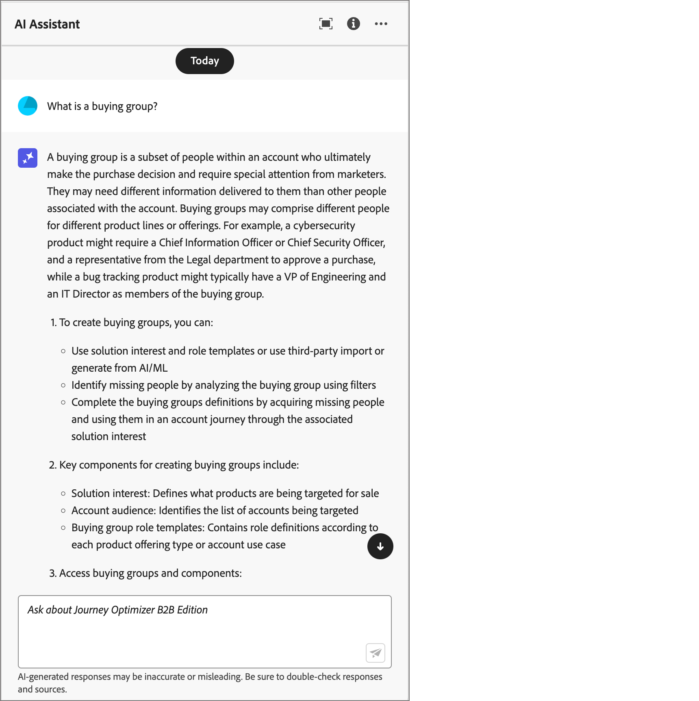

# Use AI Assistant in Journey Optimizer B2B Edition

In Journey Optimizer B2B Edition, AI Assistant is a user interface feature that you can use to understand product concepts, quickly navigate and learn about the Journey Optimizer B2B Edition features, and get operational insights for your specific environment. It is also available in several products across Adobe Experience Cloud.

>[!IMPORTANT]
>
>An agreement for the Adobe Experience Cloud Generative AI User Guidelines is required before you can use the AI Assistant. For more information about this agreement and usage guidelines, see the [Adobe Experience Cloud Generative AI User Guidelines](https://www.adobe.com/legal/licenses-terms/adobe-dx-gen-ai-user-guidelines.html).

To access AI Assistant, click the icon in the header. AI Assistant opens in a panel on the right.

{width="500" zoomable="yes"}

The AI Assistant interface appears, immediately providing you with information to get started. You can use the options provided under _Ideas to get started_ to answer questions and commands, such as:

* Which of my account journeys were published?
* What solution interests were created?
* Tell me the key benefits of Journey Optimizer B2B Edition.

In Adobe Journey Optimizer B2B Edition, AI Assistant supports the following use cases:

## Product knowledge

Product knowledge questions are about Journey Optimizer B2B Edition concepts related to aspects of Adobe Journey Optimizer. Some examples of product knowledge questions include:

* How do I set up SMS provider accounts?
* How do I send an email in an account journey?
* How can I personalize my email content?

To ask a product question, enter it in the field at the bottom of the panel and press enter.

{width="450" zoomable="yes"}

You can verify the responses returned by AI Assistant by reviewing the citations available with every product knowledge answer.

To view citations and validate AI Assistant's response, select **[!UICONTROL Show sources]**. 

{width="450" zoomable="yes"}

AI Assistant updates the interface and provides you with links to documentation that corroborate the initial response. Additionally, when citations are enabled, AI Assistant updates the response to include footnotes for indicating the specific parts of the answer that reference the provided documentation.

Use the thumb up or thumb down to rate the quality of the answer.

## Operational insights

Operational insight questions are about the journey objects in your organization's sandbox. Some examples of operational insight questions or prompts include:

* How many live journeys do I have in Adobe Journey Optimizer B2B Edition?
* Give me a list of all the scheduled journeys
* How many journeys have been created in the last 7 days?

You must be in an active sandbox for AI Assistant to provide a sufficient response to a question about your operational insights.

>[!NOTE]
>
>The only Adobe Journey Optimizer B2B Edition objects supported by the AI Assistant operational insights questions are listed in the [operational insights domain table](./ai-assistant-overview.md#operational-insights). It can access data only for the sandbox you are currently in.

<!-- Select to view an example of an operational insights question.

In the following example, AI Assistant receives the following query: _Show me dataflows that were created using the Amazon S3 source._

<screen>

AI Assistant responds with a table list of your dataflows and their corresponding IDs. Click the _Download_ icon ( Download icon ) to download the table as a CSV file. To view the entire table, click the _Expand_ icon ( Expand icon ).

<screen>

An expanded view of the table appears, providing you with a more comprehensive list of dataflows based on the parameters of your query.

<screen>

When prompted with an operational insights question, AI Assistant provides an explanation of how it computed the answer. In the following example, AI Assistant outlines the steps it took in order to identify the dataflows that were created using the Amazon S3 source.

<screen>

You can also provide filters and modifications to your questions, and you can instruct AI Assistant to render its findings based on the filters that you include. For example, you can ask AI Assistant to show you a trend of the count of segment definitions in the order of their created date, remove segment definitions with zero total profiles, and use month names instead of integers when displaying the data.

### Verify operational insights responses

You can verify each response related to operational insights questions using an SQL query that AI Assistant provides.

Select to view example of verifying operational insights responses

After receiving an answer for an operational insights question, click **[!UICONTROL Show sources]** and then select **[!UICONTROL View source query]**.

<screen>

When queried with an operational insights question, AI Assistant provides an SQL query that you can use to verify the process that it took to compute its answer. This source query is for verification purposes only and is not supported on Query Service.

<screen>  -- >
