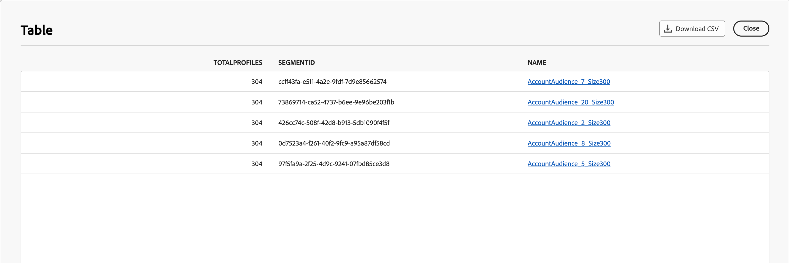

# Use AI Assistant in Journey Optimizer B2B Edition

In Journey Optimizer B2B Edition, AI Assistant is a user interface feature that you can use to understand product concepts, quickly navigate and learn about the product features, and get operational insights for your environment. It is also available in several products across Adobe Experience Cloud.

>[!IMPORTANT]
>
>An agreement for the Adobe Experience Cloud Generative AI User Guidelines is required before you can use the AI Assistant. For more information about this agreement and usage guidelines, see the [Adobe Experience Cloud Generative AI User Guidelines](https://www.adobe.com/legal/licenses-terms/adobe-dx-gen-ai-user-guidelines.html).

To access AI Assistant, click the icon in the header. AI Assistant opens in a panel on the right.

{width="420"}

The AI Assistant interface appears, immediately providing you with information to get started. You can use the options provided under _Ideas to get started_ to answer questions and commands, such as:

* Which journeys were published?
* What solution interests were created?
* Tell me the key benefits of Journey Optimizer B2B Edition.

In Adobe Journey Optimizer B2B Edition, AI Assistant supports the following use cases:

## Ask product knowledge questions

Product knowledge questions are about Journey Optimizer B2B Edition concepts and how-to information. Some examples of product knowledge questions include:

* How do I set up SMS provider accounts?
* How do I send an email in a journey?
* How can I personalize my email content?

To ask a product question, enter it in the field at the bottom of the panel and press enter. For example, when you need to learn how to use a buying group in a journey. In this case, you enter _How do I use a buying group in a journey?_ After you submit the question, AI Assistant queries its knowledge base and compiles an answer in a few seconds.

{width="420"}

+++View an example answer

{width="420"}

+++

## Ask operational insights questions

Operational insights questions are about the journey objects in your organization's sandbox. You can ask questions about operational artifacts, such as account audience, account journey, solution interest, and buying group template. Some examples of operational insights questions or prompts include:

* How many live journeys do I have in Adobe Journey Optimizer B2B Edition?
* Give me a list of all the scheduled journeys
* How many journeys have been created in the last 7 days?

You must be in an active sandbox for AI Assistant to provide a sufficient response to a question about your operational insights.

>[!NOTE]
>
>The only Adobe Journey Optimizer B2B Edition objects supported by the AI Assistant operational insights questions are listed in the [operational insights domain table](./ai-assistant-overview.md#operational-insights). It can access data only for the sandbox that you are currently in.

To ask an operational insights question, enter it in the field at the bottom of the panel and press enter. For example, when you want to know about the audiences for your sandbox. In this case, you enter _How many audiences are there?_.  AI Assistant provides a count of the audiences in your sandbox and an explanation of how it computed the answer. In the following example response, AI Assistant provides a link to access the audiences in the UI and outlines the steps it took to identify the number of audiences.

{width="420"}

You can follow your initial inquiry by asking for a list of artifacts, such as _List the top 5 by size_. AI Assistant returns a table with the top five items in the query and their corresponding IDs. Click the _Download_ (  ) icon to download the table as a CSV file.

{width="420"}

To view the entire table in AI Assistant, click the _Maximize_ (  ) icon. In the expanded table view, click **[!UICONTROL Download CSV]** to save the information as a CSV file.

{width="600" zoomable="yes"}

## Verify responses

AI Assistant includes tools that you can use to verify and validate responses. 

### Product knowledge sources

After receiving a response for a product question, select **[!UICONTROL Show source]** to view the product knowledge source citations used to generate the AI Assistant response.

AI Assistant provides links to the documentation that corroborates the initial response. It also adds footnotes to the response to indicate the specific parts of the answer that reference the linked documentation sources.

{width="420"}

### Operational insights sources

After receiving a response for an operational insights question, click **[!UICONTROL Show source]** and then select **[!UICONTROL View source query]**.

You can verify each response related to operational insights questions using an SQL query that AI Assistant provides. When queried with an operational insights question, AI Assistant provides an SQL query that you can use to verify the process that it took to compute the answer. This source query is for verification purposes only and is not supported on Query Service.

{width="550" zoomable="yes"}

## Provide feedback

Use the _Thumb up_ (  ) or _Thumb down_ (  ) icons to rate the usefulness and quality of the response. Complete the brief survey form according to your experience and click **[!UICONTROL Submit]**. The information that you provide is used to make improvements to AI Assistant. 

If you notice something in the response that is problematic, click the _Flag_ (  ) icon. Use the form to describe the problem and click **[!UICONTROL Submit]** to report the issue.

{width="420"}

+++View forms

>[!BEGINTABS]

>[!TAB Thumb up]

{width="500" zoomable="yes"}

>[!TAB Thumb down]

{width="500" zoomable="yes"}

>[!TAB Flag]

{width="500" zoomable="yes"}

>[!ENDTABS]

+++
