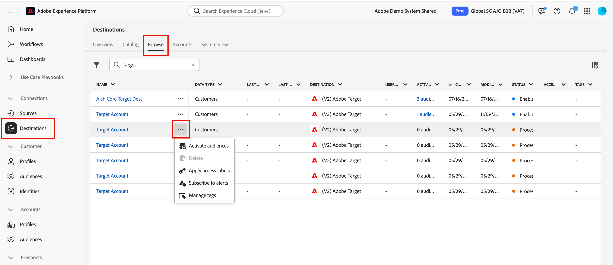
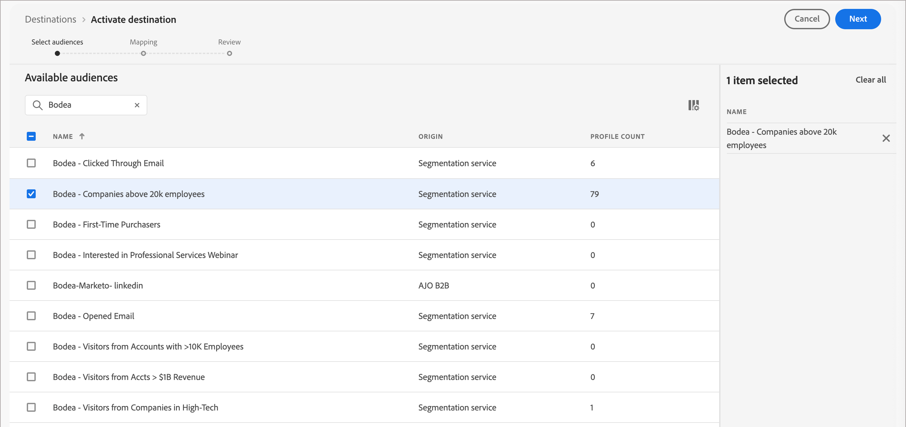
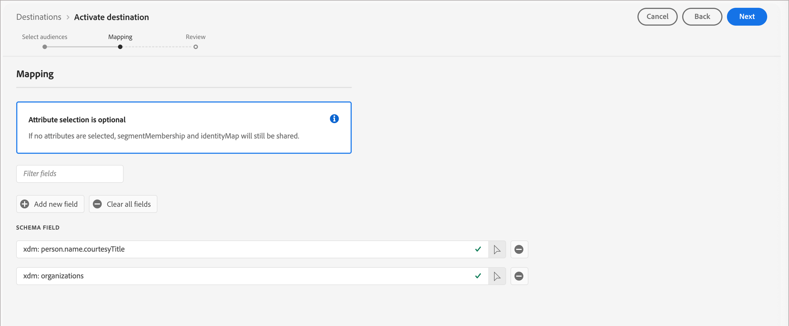
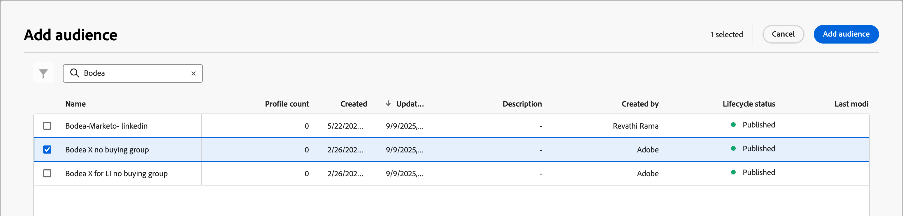

# Adobe Target external audiences

You can activate and personalize experiences for external audiences in [!DNL Adobe Target] through account journeys. Use this integration to achieve advanced and tailored personalization that increases engagement, and to maintain cross-platform consistency across [!DNL Target] and [!DNL Journey Optimizer B2B Edition]. This consistency ensures that teams align and personalize web channels for buying groups throughout the entire B2B buyer journey.

## Activate the external audience to Target as a destination

Activating the external audience to Adobe Target requires that you have configured [!DNL Adobe Target] as a destination in [!DNL Real-time Customer Data Platform (RTCDP)]. For additional information about this configuration, refer to the [RTCDP documentation](https://experienceleague.adobe.com/en/docs/platform-learn/tutorials/destinations/target/configure-the-target-destination){target="_blank"}.

>[!IMPORTANT]
>
>Using activation through a journey requires that your implementation of RTCDP uses Email Address as an identity.

The activation process requires that you add [!DNL Adobe Target] as an external audience or external destination. You begin by building a [!DNL Target] audience in the audience builder. You can also create a placeholder audience and add the external audience feature.

1. In Experience Platform, go to **[!UICONTROL Connections]** > **[!UICONTROL Destinations]** in the left navigation.

1. Select the **[!UICONTROL Browse]** tab.

1. Locate the destination connection that you want to use to activate your segments, click the _More menu_ ( **...** ) icon next to the name, and choose **[!UICONTROL Activate audiences]**.

   Enter text in the _[!UICONTROL Search]_ field to filter the displayed destinations for a match by name.

   {width="800" zoomable="yes"}   

1. In the _[!UICONTROL Available audiences]_ list, select your external audience and click **[!UICONTROL Next]**.

   {width="700" zoomable="yes"}   

1. Perform any additional field mapping to the destination (optional) and click **[!UICONTROL Next]**.

1. Review the new audience parameters and click **[!UICONTROL Finish]**.

   {width="700" zoomable="yes"}  

Upon activation, you can see the audience in [Adobe Target audiences](https://experienceleague.adobe.com/en/docs/target/using/audiences/create-audiences/audiences#use-list){target="_blank"} and use them in Adobe Target activities. 

## Activate a Target audience from a journey

In your journey, you can [add a _Take an action_ node to execute an action](../journeys/action-nodes.md). Actions are typically what you want to happen as a result of some kind of trigger, such as an event or a previous action. The journey executes the action when a qualifying account with person profiles reaches the node.

>[!NOTE]
>
>When a qualifying account with person profiles reaches the _Add to external customer audience_ node in a published journey, it can take up to 48 hours for those profiles to populate in the external audience.

1. With the _Take an action_ node selected in the journey canvas, choose the _[!UICONTROL Action on]_ **[!UICONTROL People]** option.

1. For _[!UICONTROL Action on people]_, choose **[!UICONTROL Add to external customer audience]**.

   {width="550" zoomable="yes"}

1. From the node properties on the right, set the external audience.

   * If there are one or more external audiences already created, you can choose **[!UICONTROL Select existing]** and [select the audience that you want to use](#choose-an-external-audience).

   * If you want to [create an audience](#create-an-external-audience) to use for the node, choose **[!UICONTROL Create new]**.

### Create an external audience

1. After you choose the **[!UICONTROL Create new]** option in the node properties, click **[!UICONTROL Create external customer audience]**.

   {width="400"}

1. In the dialog, enter a **[!UICONTROL Name]** (required) and **[!UICONTROL Description]** (optional) for the new audience.

   {width="400"}

1. Click **[!UICONTROL Create]**.

   The system creates the new audience and displays a confirmation message. You can then proceed to use it as an existing audience for the node action.

### Select an external audience

1. After you choose the **[!UICONTROL Select existing]** option in the node properties, click **[!UICONTROL Select external customer audience]**.

   {width="400"}

1. In the _[!UICONTROL Add audience]_ dialog, select the audience that you want to use.

   You can enter text in the _Search_ field to filter the displayed items for a match of the audience name.

   {width="650" zoomable="yes"}

1. Click **[!UICONTROL Add audience]**.
