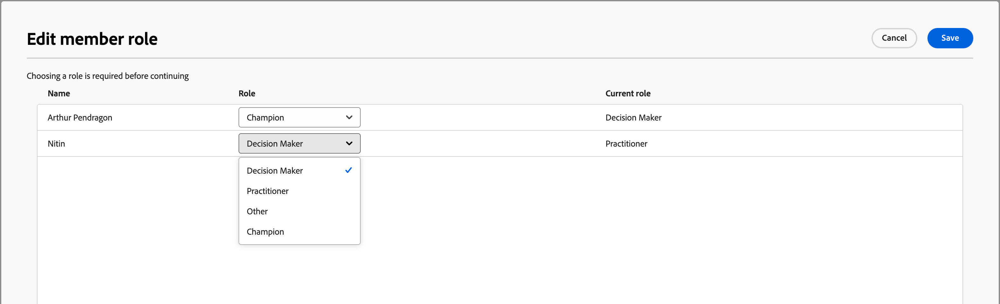

# Buying group details

When you click a buying group name from anywhere in Journey Optimizer B2B Edition, the buying group details are displayed. This overview provides useful information about the buying group, including generative AI summaries. There are also [actions](#buying-group-actions) that you can execute for contacts associated with the account.

{width="800" zoomable="yes"}

Use the **[!UICONTROL Overview]** tab to review information about the account, and the **[!UICONTROL Members]** tab to access a list of the buying group members.

## Overview tab

The Overview tab is comprised of three primary sections:

### Buying group summary

{zoomable="yes"}

The buying group summary section includes the following buying group information:

* Buying group name
* Account name (click the name to open the [account details](../accounts/account-details.md))
* Number of members in the buying group
* Engagement score
* Completeness score
* Current buying group stage
* Role template (click the name to open the [roles template](buying-groups-role-templates.md#access-and-browse-role-templates))
* Last modified/updated date
* Generative AI summary of the buying group

### Account overview

{zoomable="yes"}

The account overview section includes the following account information:

* Account name (click the name to open the account details)
* Number of people in the account
* Industry
* Open opportunities
* Latest three account journeys where the account is currently in use (click the name to open the journey details)
* Generative AI summary of the account

### Intent data

In Journey Optimizer B2B Edition, the Intent Detection model predicts a solution/product of interest with high enough confidence based on buying group members' activity. The intent of buying group members can be interpreted as the probability of having interest in a product. 

{{intent-data-note}}

{width="700" zoomable="yes"}

* Levels of intent
* Types of intent signal - Keywords, product, and solution

### Buying group members

{width="800" zoomable="yes"}

The _[!UICONTROL Buying group members]_ section displays two rows that highlight buying group members:

* **[!UICONTROL Decision maker]** - Top three decision makers based on person engagement score
* **[!UICONTROL Top engaged members]** - Other top engaged members based on person engagement score

Each member card includes the following details:

* Name
* Title
* Role
* Lead engagement score

Click **[!UICONTROL View details]** to access the following member information:

* Generative AI summary
* Last interesting moment 
* Most recent activities (two)
* Other Buying groups in which the lead is a member (limited to three buying groups based on the most recently added).
* Email address
* Phone number

{width="600" zoomable="yes"}

## Members tab

Select the **[!UICONTROL Members]** tab to view a list of all buying group members. Each member listing includes the name, role, job title, email address, phone number, and source.

{width="700" zoomable="yes"}

There are multiple actions that you can execute from the _Members_ tab:

### Assign a new member

An account can have one or more buying groups associated to it, buying group members are typically a subset of contacts from the account. You can manually add any contact from the associated account to the buying group.

1. Click **[!UICONTROL Assign new member]** at the top-right.

1. In the _[!UICONTROL Assign member]_ dialog, select the account leads that you want to add to the buying group and click **[!UICONTROL Next]**.

   {width="700" zoomable="yes"}

1. In the _[!UICONTROL Edit new member role]_ dialog, select the role to assign to each of the new members.

   {width="700" zoomable="yes"}

1. Click **[!UICONTROL Save]**.

### Remove a member

You can remove one or more selected members (up to 50 at a time) from the buying group. 

1. Select the checkboxes for the members that you want to remove.

1. In the selection bar at the bottom, click **[!UICONTROL Remove members]**.

   {width="700" zoomable="yes"}

1. In the confirmation dialog, click **[!UICONTROL Remove]**.

### Edit role

You can change role for one or more selected members (up to 50 at a time) of the buying group.

1. Select the checkboxes for the members that you want to change roles.

1. In the selection bar at the bottom, click **[!UICONTROL Edit roles]**.

   {width="700" zoomable="yes"}

1. In the _[!UICONTROL Edit member role]_ dialog, select the role to assign to each of the members.

   {width="700" zoomable="yes"}

1. Click **[!UICONTROL Save]**.

### Send email

You can send a marketer-approved email to one or more selected members (up to 50 at a time) of a buying group. The list of available emails is limited to approved emails from the connected Marketo Engage instance.

1. Select the checkboxes for the members that you want to receive the email.

1. At the top-right or in the selection bar at the bottom, click **[!UICONTROL Send email]**.

   {width="700" zoomable="yes"}

1. In the _[!UICONTROL Send email]_ dialog, select the Marketo Engage workspace, and then select the checkbox for the email that you want to send.

   {width="700" zoomable="yes"}

1. Click **[!UICONTROL Send]**.
