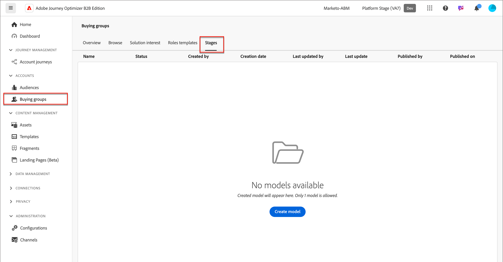
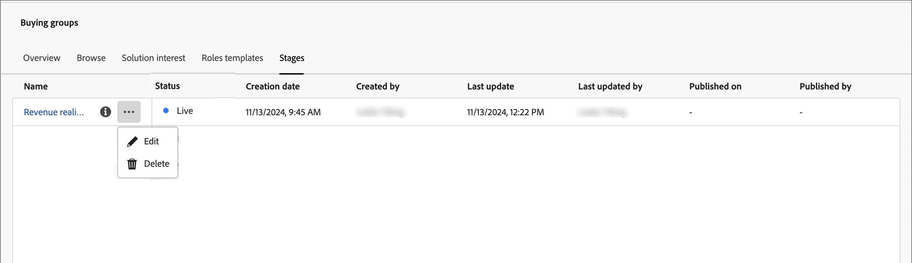

# Buying group stages

Buying group stages are designed to track the progression of buying groups in converting opportunities into customers. Use this feature to track buying group progression and identify the next best actions for buying group members. 

Define the stages within a single staging model, defining multiple stages and the transition flow between them. One or more stages are designated for entry into the lifecycle. The model also allows for non-linear progression, where you can specify transitions from one stage to another, such as from stage A to stages B, C, or D. It is required that one stage is designated as the success stage, such as a purchase or signed contract. It is optional that another stage be designated as a failure stage, such as a rejected contract or purchase of a competing solution from another vendor. This is achieved through [intelligent dashboards](../dashboards/intelligent-dashboard.md) that show how buying groups are progressing in terms of completing a sale opportunity or converting an opportunity into a customer.

{width="800" zoomable="yes"}

{width="30"} [Watch the video overview](#overview-video)

## Define your buying group stages model

You create and configure a buying group stages model by:

* Adding the lifecycle stages
* Defining the transition flows
* Designating the entry and destination stages

Only one model is supported, so it is important to work across you Marketing and Sales teams to plan the optimal model for your organization before you create and publish it in Journey Optimizer B2B Edition.<!-- Initially, only one stage model can be created, but future releases will support multiple stage models, allowing users to select which model to use in a journey. -->

When you create the buying group stage model, it is automatically in _Draft_ status and cannot be deleted or renamed. It remains in this status as you define the stages and configure the transition flow between the stages. When the model is in a published (_Live_) status, it cannot be changed.

### Create the model

1. On the left navigation, go to **[!UICONTROL Accounts]** > **[!UICONTROL Buying Groups]**.

1. In the Buying Groups page, select the **[!UICONTROL Stages]** tab.

   {width="800" zoomable="yes"}

   This _[!UICONTROL Stages]_ tab is in an _empty_ state until you create the model. 

1. Click **[!UICONTROL Create model]** in the center of the page.

1. In the dialog, enter the **[!UICONTROL Name]** (required) and **[!UICONTROL Description]** (optional) for the model.

   {width="700" zoomable="yes"}

   If you click _[!UICONTROL Cancel]_ in this dialog, you return to the _[!UICONTROL Stages]_ tab in an _empty_ state.

1. Click **[!UICONTROL Create]**.
 
### Define the stages

After you create the model, it opens in the workspace and you are prompted to create the stages for the model.

1. Click **[!UICONTROL Edit stages]**.

   {width="700" zoomable="yes"}

1. Define the first stage by entering the **[!UICONTROL Name]** (required) and **[!UICONTROL Description]** (optional).

   {width="700" zoomable="yes"}   

   The stages do not have to be added in a specific order, but it does determine how the stages are listed in the model details page. You designate the entry stage and the flow between stages when you define the transition rules.

1. Click **[!UICONTROL Add stage]** and repeat step 2 to define another stage.

   Repeat this step until you have the stages needed for the model.

   {width="700" zoomable="yes"}     

1. When you are satisfied with the stages that you have defined, click **[!UICONTROL Save]**.

   >[!IMPORTANT]
   >
   >**After the buying group stages are saved, they cannot be removed.** However, you can change the name and description for any of the stages as long as the model remains in _Draft_ status.

### Configure the workflow and transition rules

After you save the stages, it returns you to the model workspace. The _[!UICONTROL Allowed transit to]_ column is empty, which indicates that the transition rules for the model stages are not yet defined.

{width="700" zoomable="yes"} 

Transition rules determine how a buying group can move from one stage to another. For example, it can move from an entry stage to a middle stage, and from a middle stage to various other stages. An entry stage is an initial stage that a buying group can enter from a blank state, and destination stages are classified as success or failure stages.

1. Click **[!UICONTROL Edit transition rules]** at the top right. 

   This action opens the _[!UICONTROL Edit stage rules]_ dialog, where you define the logic for the flow.

   As you set the options, there are some built-in guardrails and messaging to help you avoid making logic errors in the flow. You can click _[!UICONTROL Cancel]_ to close the dialog and return to the _[!UICONTROL Stages]_ tab page without any changes.

1. In the _[!UICONTROL Select stage]_ section, designate starting and ending stages for the flow:

   * **[!UICONTROL Entry point stage]** (required) - Designate one or more entry stages for the buying group opportunity.
 
   * **[!UICONTROL Success stage]** (required) - Designate the stage that indicates that the buying group opportunity is successful (destination).

   * **[!UICONTROL Failure stage]** (optional) - Designate one or more stages that indicate the buying group opportunity has reached a point of failure (destination).

   {width="700" zoomable="yes"} 

1. For each non-destination stage, define one or more stages that come next in the flow (transition).

   All non-destination stages must have at least one **[!UICONTROL Allowed transit to]** stage selected. Otherwise, the model logic is not valid and accounts can get _stuck_ at that stage with no way to progress to success or failure.

   {width="700" zoomable="yes"} 

   You can optionally specify a transition from a failure stage. For example, you might designate a stage named _No response_ as a failure stage. But also designate a stage named _Resurgence_ as a possible transition to identify cases where a dormant account is reactivated. 

1. Click **[!UICONTROL Save]**.

   With the return to the model details page, the stages are listed in a table with the allowed transitions, and the destination and entry properties. 

| Column | Description |
| ------ | ---------- |
| **[!UICONTROL Stage name]** | Name of the stage. Click the information icon to view the description for the stage. |
| **[!UICONTROL Allowed transit to]** | Lists the stages that are valid for a _move to_ action within the model. |
| **[!UICONTROL Entry point stage]** | Indicates if the stage is valid as an entry point stage ([!UICONTROL Yes] or [!UICONTROL No]). |
| **[!UICONTROL Destination]** | Indicates if the stage is designated as a destination stage ([!UICONTROL Success] or [!UICONTROL Failure]). |

{width="700" zoomable="yes"} 

## Edit a draft model

As long as the buying group stages model remains in a _Draft_ state, you can edit the stages and transition rules.

_To view the draft model:_

1. On the left navigation, go to **[!UICONTROL Accounts]** > **[!UICONTROL Buying Groups]**.

1. In the _Buying Groups_ page, select the **[!UICONTROL Stages]** tab.

1. Click the model name to open the model details.

### Change the stages in the model

1. Click **[!UICONTROL Edit stages]**.

   In the _[!UICONTROL Edit stages]_ dialog, you can add new stages or change the name and description for existing stages.

   * Change the **[!UICONTROL Name]** or **[!UICONTROL Description]** of any stage as needed.

   * Scroll to the bottom and click **[!UICONTROL Add stage]** to define a new stage for the model if needed.

1. When you are satisfied with the stages that you have defined, click **[!UICONTROL Save]**.

   You can also click _[!UICONTROL Cancel]_ to close the dialog and return to the model details page without any changes.

### Edit the transition rules for the model

1. Click **[!UICONTROL Edit transition rules]**.

1. In the _Edit stage rules_ dialog, change the flow options as needed. 

   See [Configure the workflow and transition rules](#configure-the-workflow-and-transition-rules) for more information about these options and how they affect the model flow.

1. When you are satisfied with the transition rules that are defined, click **[!UICONTROL Save]**.

   You can also click _[!UICONTROL Cancel]_ to close the dialog and return to the model details page without any changes.

## Publish the buying group stages model

If there are no validation errors, the model can be published. When it is published, it changes to a _Live_ state and can be used to progress buying group stages in account journeys. 

>[!IMPORTANT]
>
>**After the model is published, it cannot be updated or deleted.** Make sure that what you have is correct before you publish the model.

1. Review the defined stages and transitions carefully.

   If revisions are needed, edit the model stages.

1. Click **[!UICONTROL Publish]**.

1. In the confirmation dialog, click **[!UICONTROL Publish]**.

   With the return to the model details page, the model is designated as _[!UICONTROL Live]_. Click the _Back_ arrow at the top left to return to the _[!UICONTROL Stages]_ tab page.

{width="700" zoomable="yes"} 
<!-- list these later when the Published columns are working correctly

Columns - Name, Status, Created by, Created date, Last updated by, Last update, Published by, Published on.
Name - Name of the stage model, hyperlinked. Clicking on it will navigate to the stage inventory page. 
Info icon beside the name - display the description on click.
Status - Live, Draft. If a draft stage model is Published, then its status is updated to Live. -->

## Delete the buying group stages model

You can delete the buying group stages model when it is in a draft or published state. If it is published (live), you can delete it only when it is not associated with a solution interest. 

1. On the left navigation, go to **[!UICONTROL Accounts]** > **[!UICONTROL Buying Groups]**.

1. In the _Buying Groups_ page, select the **[!UICONTROL Stages]** tab.

1. Click the _More_ menu icon (**...**) next to the stages model name and choose **[!UICONTROL Delete]**.

   {width="700"}

1. In the dialog, click **[!UICONTROL Delete]** to confirm.

## Use the model in account journeys

When the buying stages model is in a _Live_ status (published), add the model to the solution interests where you want to use it to track buying group progression. In your account journeys, you can include actions to transition accounts to a specified stage and add stage transitions as events that determine how accounts move through the journey. 

### Solution interest association

For each existing solution interest where you want to associate the buying group stages model, open the solution interest details and add the model. You can also add the model to the properties when you [create a solution interest](./solution-interests.md#create-a-solution-interest).

1. Select the _[!UICONTROL Solution interest]_ tab.

1. Open the solution interest using one of the following methods to open the properties for the solution interest that you want to edit:

   * Click the solution interest name.
   * Click the ellipsis (**...**) next to it and choose **[!UICONTROL Edit]**.

   {width="500" zoomable="no"}

1. Select the **[!UICONTROL Buying group stage model]** to use buying group stage progression (optional).

   {width="700" zoomable="yes"} 

1. If needed, change the **[!UICONTROL Update existing buying groups]** setting.

   When this option is enabled, all existing buying groups paired with the solution interest are updated through the 24-hour sync cycle.

1. Click **[!UICONTROL Save]**.

### Split paths

Using a [split path node](../journeys/journey-nodes.md#split-paths), you can filter at the account level or the people level according to buying group stages. For example, add a buying group stage as a path condition when splitting paths by buying group member.

>[!BEGINTABS]

>[!TAB Account level]

1. Open the account journey in the editor.

1. Click the plus ( **+** ) icon on a path and choose **[!UICONTROL Split paths]**.

   {width="300"}

1. In the node properties on the right, choose **[!UICONTROL Accounts]** for the split.

1. To define a condition applicable to _[!UICONTROL Path 1]_, click **[!UICONTROL Apply condition]**.
   
   {width="500"}

1. In the conditions editor, add the buying group filter to define the split path.

   * On the left, expand the **[!UICONTROL Special filters]** at the bottom and drag the **[!UICONTROL Has Buying Group]** attribute onto the filter workspace.

   * Set the **[!UICONTROL Solution Interest]** to one that is associated with the buying group stages model.

   * Click **[!UICONTROL Add constraint]** and choose **[!UICONTROL Buying group stage]**.

      {width="700" zoomable="yes"}

   * Click **[!UICONTROL Done]**.

   The split path is defined in the node properties on the right.

   {width="600" zoomable="yes"}   

1. Continue to define other paths for the split node and save the journey.

>[!TAB People level]

1. Open the account journey in the editor.

1. Click the plus ( **+** ) icon on a path and choose **[!UICONTROL Split paths]**.

   {width="300"}

1. In the node properties on the right, choose **[!UICONTROL People]** for the split.

   Leave the default for _[!UICONTROL Attribute used for conditions]_ as **[!UICONTROL People attributes only]**.

1. To define a condition applicable to _[!UICONTROL Path 1]_, click **[!UICONTROL Apply condition]**.
   
   {width="500"}

1. In the conditions editor, add the buying group filter to define the split path.

   * On the left, expand the **[!UICONTROL Special filters]** at the bottom and drag the **[!UICONTROL Member of Buying Group]** attribute onto the filter workspace.

   * Set the **[!UICONTROL Solution Interest]** to one that is associated with the buying group stages model.

   * Click **[!UICONTROL Add constraint]** and choose **[!UICONTROL Buying group stage]**.

      {width="700" zoomable="yes"}

   * Click **[!UICONTROL Done]**.

   The split path is defined in the node properties on the right.

   {width="600" zoomable="yes"}

1. Continue to define other paths for the split node and save the journey.

>[!ENDTABS]

### Update buying group stage account action

Using an [account action node](../journeys/journey-nodes.md#add-an-account-action), you can update the buying group stage. Defining this node involves selecting the solution interest and defining the new stage for the buying group.

>[!NOTE]
>
>If the new stage is not a valid transition (as defined in the model), the action is not applied to the account.

1. Open the account journey in the editor.

1. Click the plus ( **+** ) icon on a path and choose **[!UICONTROL Take an action]**.

   {width="400"}

1. In the node properties on the right, choose **[!UICONTROL Accounts]** for the action.

1. Define the action to update the buying group stage.

   * For **[!UICONTROL Action on accounts]**, select **[!UICONTROL Update Buying Group Stage]**.

   * For **[!UICONTROL Select solution interest]**, select one that is associated with the buying group stages model.

   * For **[!UICONTROL New stage]**, select the stage to transition the account.

   The action is defined in the node properties on the right.

   {width="600" zoomable="yes"}

1. Continue to make other changes and save the journey.

### Account event

Use the occurrence of a buying group stage change to move the account forward to the next step in the journey. Defining this node involves selecting the solution interest and additional constraints to satisfy the event trigger.

1. Open the account journey in the editor.

1. Click the plus ( **+** ) icon on a path and choose **[!UICONTROL Listen for an event]**.

   {width="400"}

1. In the node properties on the right, choose **[!UICONTROL Accounts]** for the event type.

1. For **[!UICONTROL Select accounts event]**, choose **[!UICONTROL Change in Buying Group Stage]**.

1. Click **[!UICONTROL Edit event]** and define details for the event.

   * For **[!UICONTROL Solution Interest]**, match the condition for a solution interest that is associated with the buying group stages model.

   * Click **[!UICONTROL Add constraint]** and select the buying group stage change that you want to use for triggering the event.

      {width="700" zoomable="yes"}
   
   * Click **[!UICONTROL Done]**.

   The event is defined in the node properties on the right.

   {width="700" zoomable="yes"}

1. Continue to make other changes and save the journey.

## Overview video

>[!VIDEO](https://video.tv.adobe.com/v/3448634/?learn=on)
