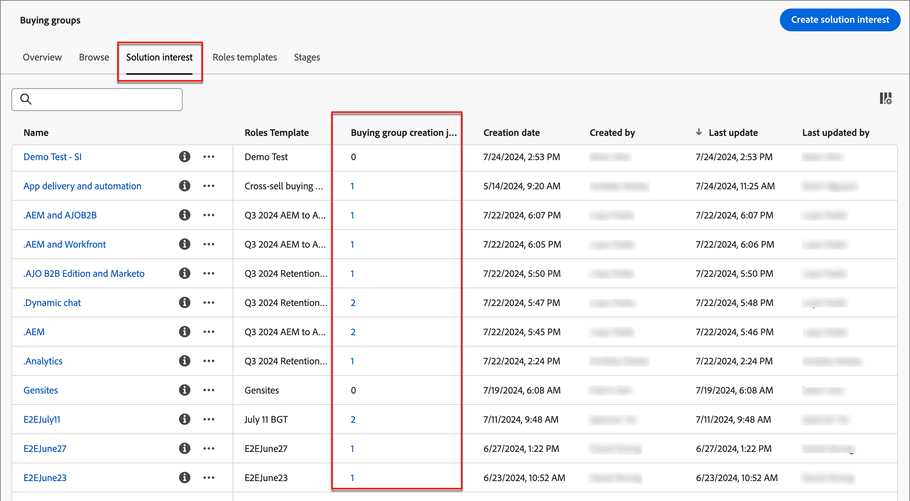

# Create buying groups

When the buying group is created, it is available for use in an Account Journey through the [Solution Interest](./solution-interests.md).

1. In your Adobe Experience Platform home page, click Adobe Journey Optimizer B2B Edition.

1. On the left navigation, click **[!UICONTROL Buying groups]**.

1. In the _[!UICONTROL Buying groups]_ page, click the **[!UICONTROL Create buying groups]** at the top-right on the page.

   {width="700" zoomable="yes"}

1. Follow the prompts on each page and click **[!UICONTROL Next]** to proceed.

## Guidance page

The first page provides guidance about the prerequisites/components that are required for creating buying groups. If you know that you have the necessary components in place, click **[!UICONTROL Next]**.

## Components

1. Select each component that you want to use:

   * **[!UICONTROL Solution interest]** - Select the solution interest from the list.

   * **[!UICONTROL Account audience]** - Click # and select an account audience from the list.

   Under _[!UICONTROL Properties]_, the name for the buying groups is automatically generated (read only) as < Solution interest name > for < account name >.

   {width="700" zoomable="yes"}

1. After you select the Solution interest and the account audience, click **[!UICONTROL Create]**.

## Confirmation

The confirmation dialog provides a summary of the buying groups process and an estimated time for completion. To confirm and launch the process, click **[!UICONTROL Create]**.

{width="400" zoomable="no"}

You can navigate user to the Solution interest tab and display the count of jobs created for the solution interest.

{width="700" zoomable="yes"}

<!-- Other buying group activities:

Member of buying group.
Assign a member of the buying group.
Remove a member of the buying group. -->
