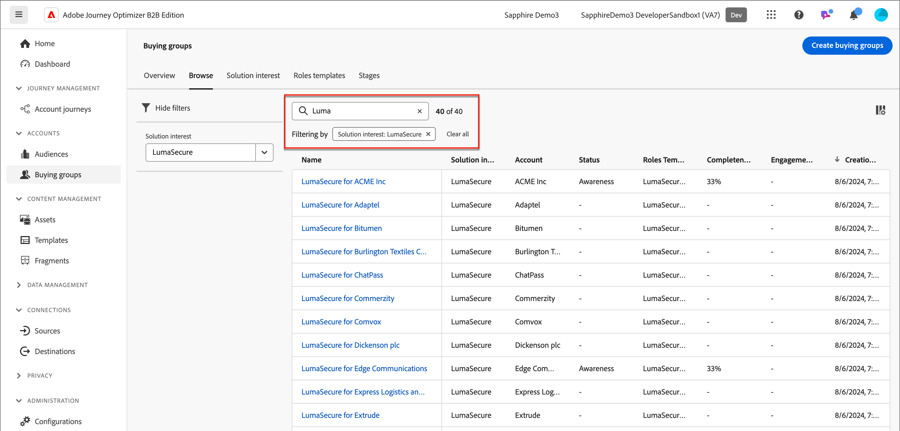

# Buying groups

For B2B sales and marketing activities, accounts are key to any strategy. Each account has a group of people associated with it, and these people may be employees of the account or contractors who work with the account. Accounts are hierarchical, and different products might be sold at different levels in the hierarchy. For example, Adobe Experience Platform might be sold at the corporate level to a top level account, while Adobe Photoshop might be sold to an account that represents a division or department within an organization, such as a design department within a larger corporation.

{width="800"}

Within the account, there could be a subset of people who comprise the _buying group_. These are people within an account that will ultimately make the purchase decision, so they need special attention from the marketer and could need different information delivered to them than the other people associated with the account. Buying groups may comprise a different group of people for different product lines or offerings. For example, a cybersecurity product might typically require a Chief Information Offer or Chief Security Officer, and a representative from the Legal department to approve a purchase, but a bug tracking product might typically have a VP of Engineering and an IT Director as members of the buying group. 

## Key components

You can increase marketing effectiveness by establishing buying groups in Journey Optimizer B2B Edition that identify missing members for your target accounts lists based on the solutions that your Sales teams are responsible for selling. Before you and your Marketing team start creating your buying groups, make sure that you have the key components defined. These components are critical for meeting your business goals and objectives.

| Component | Purpose |
| --------- | ------- |
| Solution interest | This component provides the answer to: <ul><li>As a marketing organization, what are you selling?</li><li>What product or collection of products are you targeting to sell?</li></ul>  **_Example:_** Cross-selling new Product X to existing customers|
| Account audience | This component provides the answer to: <ul><li>To whom are you selling?</li><li>What is the list of accounts that you are targeting?</li></ul> **_Example:_** Account segment defined by accounts with Product Y that have revenue over 1M|
| Buying group role templates |  This component provides the answer to: <ul><li>What roles are you targeting?</li><li>What set of rules are used to determine who is assigned to buying group roles?</li></ul>  **_Example:_** Assign a person with CMO title to the Decision Maker role |

## Buying group workflow

1. Create buying groups.

   Options:
   * Use [solution interest](./solution-interests.md) and [role template](./buying-groups-role-templates.md)
   * Use third-party import
   * Generate from AI/ML

1. Identify missing people.

   Analyze the buying group using filters.
   
   **_Example:_** Decision Maker role is missing and the completeness score is < 50

1. Complete the buying groups definitions.

   * Acquire missing people
   * Send to LinkedIn Destination
   * Enrich with Zoominfo

1. Add to account journeys.

## Access buying groups and components

1. In your Adobe Experience Platform home page, click Adobe Journey Optimizer B2B Edition.

1. On the left navigation, click **[!UICONTROL Buying groups]**.

   The page is organized as tabs:

   * Overview
   * Browse
   * Solution interest
   * Roles Teamplates

1. Select the **[!UICONTROL Browse]** tab to view the list of existing buying groups.

   {width="800" zoomable="yes"}

<!-- 

Buying group engagement score

Calculated based on the activities a member of the buying group performs.
Calculation logic - Final_Buying Group Engagement Score.xlsx
Engagement score will be a number on the UI.
Score will be rounded off without any decimals. E.g. if score is 75.89999, UI will display 76.
There is no upper limit for the score for GA.
Daily frequency cap of 20.
Activity look back duration = 30 days for GA.
Any role changes to a template requires recalculation of engagement score, for all buying groups created using that template.
Only inbound activities will be accounted towards calculating engagement score. -->