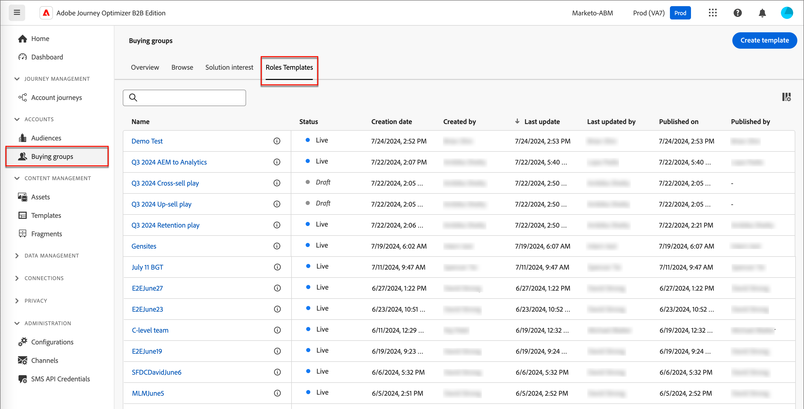
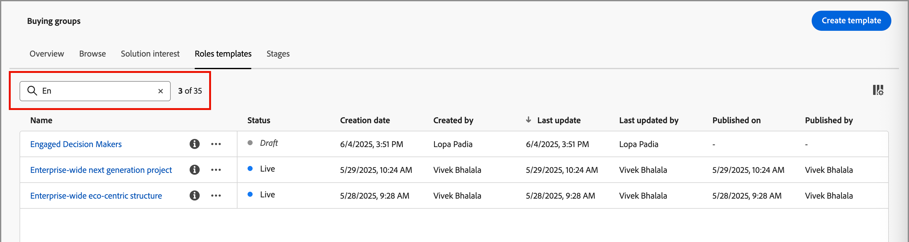
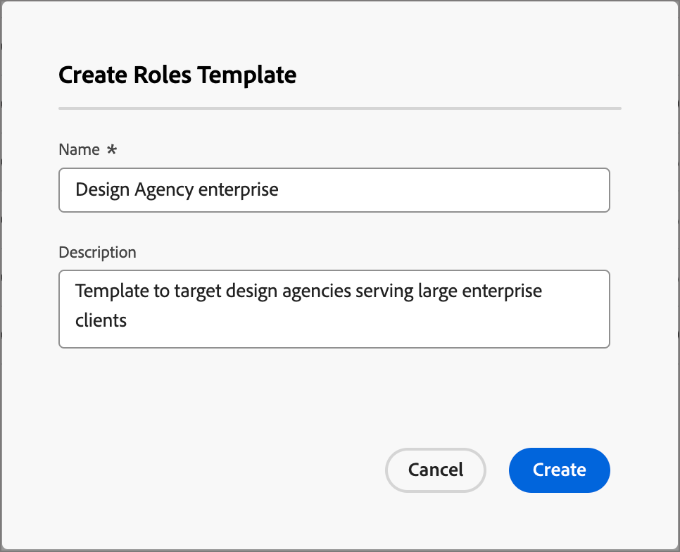
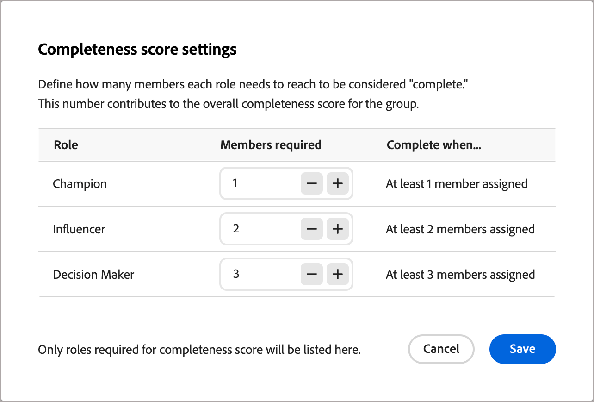
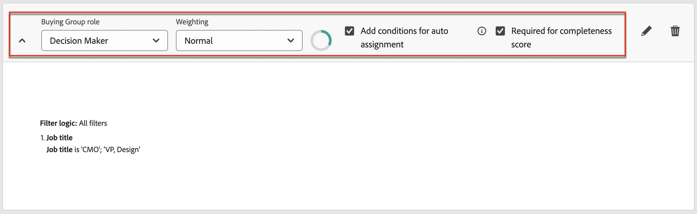
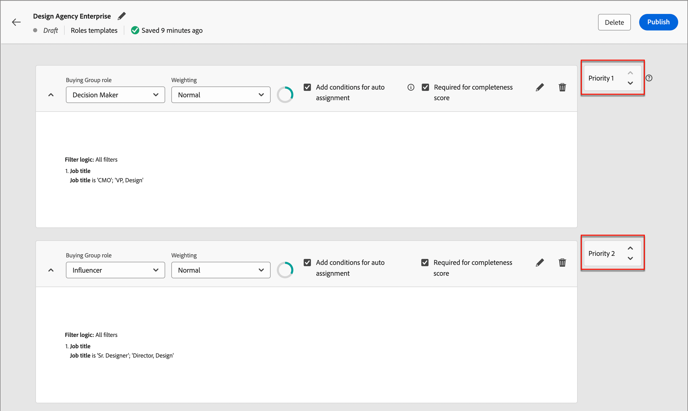

# Buying group role templates

In a B2B market, multiple individuals usually make buying decisions. Those individuals participate in the decision-making process according to their role within the organization. Create buying group role templates that contain a group of role definitions according to each product offering type or account use case.

{width="30"} [Watch the overview video](#overview-video)

>[!BEGINSHADEBOX]

## Audience Agent B2B

[Audience Agent B2B](../agents/audience-agent-b2b.md) can generate a buying group roles template from first-party intent detection and persona mapping. In the guided flow, you can identify personas linked to a product, review AI-recommended role-to-persona mappings, and refine the template with natural language before you publish it.

**Prompts to try:**

* Create a buying group template for `<product>`
* Add `<role>` mapped to `<persona>`
* Remove `<role>` / `<persona>`

{width="800" zoomable="yes"}

>[!ENDSHADEBOX]

>[!PREREQUISITES]
>
>Before you create a roles template, configure the data that role conditions can use:
>
>* [Person profile field mapping](../admin/field-mapping.md#xdm-business-person-attributes) for person attribute filters
>* [Intent data](../admin/intent-data.md) if you use intent filters in role conditions
>* [Custom buying group roles](./default-custom-roles.md#custom-roles) (optional) if you need roles beyond the six defaults

## Access and browse role templates {#access-and-browse-role-templates}

1. On the left navigation, click **[!UICONTROL Buying groups]**.

1. In the _[!UICONTROL Buying groups]_ page, select the **[!UICONTROL Roles Templates]** tab.

   {width="800" zoomable="yes"}

   The tab provides an inventory list of all existing roles templates and displays the following information in column format:

   * [!UICONTROL Name]
   * [!UICONTROL Status]
   * [!UICONTROL Creation date]
   * [!UICONTROL Created by]
   * [!UICONTROL Last update]
   * [!UICONTROL Last updated by]
   * [!UICONTROL Published on]
   * [!UICONTROL Published by]

   The list is sorted by the _[!UICONTROL Last update]_ by default. All roles templates have a status of `Draft` or `Live`.

1. To filter the list by name, use the search field at the top of the list.

   Enter the first few characters of the name to reduce the displayed list to the matching items. 

   {width="700" zoomable="yes"}

## Create a roles template

1. From the _[!UICONTROL Roles Templates]_ tab, click **[!UICONTROL Create template]** at the top-right corner.

1. In the dialog, enter a unique **[!UICONTROL Name]** (required) and **[!UICONTROL Description]** (optional) for the template.

   {width="400"}

1. Click **[!UICONTROL Create]**.

### Add the template roles {#add-the-template-roles}

After you create the template, it opens in the workspace and you are prompted to add the roles. The system displays the first role card by default.

#### Role condition filter types

Each role that you define for the template uses a set of filters, or _conditions_, to determine the members assigned to the role. Use the following filter types to define the conditions for a role:

| Type | Conditions |
| ---- | --------- |
| [!UICONTROL Person attributes] | Attributes from the [person profile](../admin/field-mapping.md#xdm-business-person-attributes), including: <li>City <li>Country <li>Email address <li>Email invalid <li>Email suspended <li>First name <li>Inferred state region <li>Job title <li>Last name <li>Mobile phone number <li>Person engagement score <li>Phone number <li>Postal code <li>State |
| [!UICONTROL Custom Objects] > Has `<custom object>` | [!BADGE Beta]{type=Informative tooltip="Beta feature"} The account or person does or does not have relational schema records. It can also be evaluated against any of the selected custom object criteria, as configured in the [XDM relational schemas](../admin/xdm-field-management.md#relational-schemas). |
| Special filters | <li>Member of list (deprecated) <li>Member of program (deprecated) |
| Intent data | <li>Category intent <li>Product intent <li>Keyword intent  (see [_Intent data_](../admin/intent-data.md)) |

#### Define role properties

1. For the first role card, define the role properties.

   * Choose the **[!UICONTROL Buying group role]** from the list.

      There are six default roles: `Decision Maker`, `Influencer`, `Practitioner`, `Executive Steering Committee`, `Champion`, and `Other`. The list also includes any [custom roles that are defined in the _Roles_ list](./default-custom-roles.md#custom-roles).

      {width="700" zoomable="yes"}

   * Set the **[!UICONTROL Weighting]** for the role, which is used to calculate the engagement score. 

      The value for each option is translated to a percentage for the score calculation: [!UICONTROL Trivial] = 20, [!UICONTROL Minor] = 40, [!UICONTROL Normal] = 60, [!UICONTROL Important] =  80, and [!UICONTROL Vital] = 100.

      For example, a role template with Vital, Important, and Normal roles converts to 100, 80, and 60 out of 240.

   * **[!UICONTROL Add conditions for auto-assignment]** - Select this checkbox to add conditions for auto-assigning members to the buying group who match the condition. If the checkbox is not selected, then adding conditions is NOT required.

   * **[!UICONTROL Required for completeness score]** - Select this checkbox for the role if you want it to be a requirement for calculating a completeness score.

#### Add conditions for auto-assignment

1. Click **[!UICONTROL Add Condition]** and define the conditional rule for the role.

   * In the _[!UICONTROL Condition]_ dialog, expand the list of **[!UICONTROL Person attributes]** and locate an attribute that you want to use to match the role. Drag it to the right and drop it in the filter space. 

      {width="700" zoomable="yes"}

      >[!NOTE]
      >
      >If you have custom person fields defined in the Experience Platform business person schema, you can use these fields as person attributes in conditions.

      Use the attribute to create a matching filter using one or more values. 
    
      In the following example, the Job title attribute is used to identify a match for Decision Maker. Any value for title that starts with `Director` or `Sr Director` evaluates as true for the condition.

      {width="700" zoomable="yes"}

   * If there are configured custom objects related to people [defined in the XDM Relational schemas](../admin/xdm-field-management.md#relational-schemas), expand the list of **[!UICONTROL Custom Objects]** to use them in the role condition.

      {width="700" zoomable="yes"}

   * If needed, add another attribute/object and condition that further refines the criteria for a match to the role.

   * Click **[!UICONTROL Done]**.

#### Add more roles

1. For each additional role that you want to include for the template, click **[!UICONTROL Add another role]** and repeat the steps under **Define role properties** and **Add conditions for auto-assignment** to define the role.

   {width="700" zoomable="yes"}

   Your changes are auto-saved in the _Draft_ status. If you are not ready to publish the roles template, click the left (back) arrow at the top of the page and return to the _[!UICONTROL Roles templates]_ list.

>[!BEGINSHADEBOX "Marketo Engage list membership"]

In Marketo Engage, _Smart Campaigns_ check membership of programs to ensure that leads don't receive duplicate emails and aren't members of multiple streams of emails at the same time. In Journey Optimizer B2B, you can check for Marketo Engage list membership as a condition for your roles template to help eliminate duplication in buying group membership and journey activities.
   
To use list membership as a role condition, expand **[!UICONTROL Special Filters]** and drag the **[!UICONTROL Member of List]** condition into the filter space. Then complete the filter definition to evaluate membership in one or more Marketo Engage lists.

{width="700" zoomable="yes"}
 

>[!NOTE]
>
>**Feature deprecation**
>
>In the current Journey Optimizer B2B Edition release, filtering based on list or program membership in a Marketo Engage instance is no longer supported.

>[!ENDSHADEBOX]

### Change the completeness score settings {#change-the-completeness-score-settings}

By default, completeness for a role is defined as one member assigned to the role. When using buying group completeness to indicate sales readiness, use these settings to align the score with the number of members required to close an opportunity.

For example, closing a deal for your solution _X_ requires multiple marketing decision makers to be identified and engaged because multiple marketing teams across an organization would use the solution. In this case, you want to increase the threshold to calculate a _complete_ buying group by requiring at least two marketing decision makers.

See [Completeness scores](./completeness-scores.md) for detailed information about completeness scoring and calculations.

1. At the top right of the roles template page, click **[!UICONTROL Completeness score settings]**.

   {width="700" zoomable="yes"}

1. In the dialog, change the **[!UICONTROL Members required]** value for each defined role as needed.

   You can enter the value, or click **&plus;** or **&minus;** to increase or decrease the value.

   {width="450"}

1. Click **[!UICONTROL Save]**.

### Publish the roles template

If the template is ready for use, click **[!UICONTROL Publish]** at the top-right.

Publishing the template sets the status to _Live_ and makes it available for association with a solution interest. There must be at least one defined role to publish the roles template.

After you publish, the template status is _Live_ on the **[!UICONTROL Roles Templates]** tab and you can select it when you [create a solution interest](./solution-interests.md).

## Edit a draft roles template

When a roles template is in a _Draft_ state, you can continue to edit the defined roles. Any changes that you make are automatically saved.

Change the role card header settings, such as the buying group role, weighting, auto-assignment, or completeness scoring requirement.

{width="600"}

### Modify the conditions for a role

To change the condition/filtering logic for any of the roles, click the _Edit_ (  ) icon at top right of the role card. This action opens the _[!UICONTROL Conditions]_ workspace where you can modify an existing filter, add or remove a filter, or change the filter logic.

### Delete a role card

If you want to remove a role from the template, click the _Delete_ (  ) icon in the role card. 

### Set the priority for roles

You can re-order the roles within the template, which determines the priority for assigning leads to a role. There is a **[!UICONTROL Priority]** controller displayed to the right of each role card. Click the _Up_ or _Down_ arrow at the right to move the role card up or down in priority.

{width="700"}

## Delete a roles template

You can delete a roles template if it is in the _Draft_ status. 

1. Select the roles template from the list to open it. 

1. Click **[!UICONTROL Delete]** at the top right.

   {width="700"}

1. In the dialog, click **[!UICONTROL Delete]** to confirm.

   After you confirm, the roles template is removed from the **[!UICONTROL Roles Templates]** inventory list.

## Overview video {#overview-video}

>[!VIDEO](https://video.tv.adobe.com/v/3433079/?learn=on)
