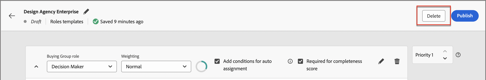

# Buying group role templates

In a B2B market, buying decisions are usually made by multiple individuals. Those individuals participate in the decision-making process according to their role within the organization. Create Buying Group role templates that contain these role definitions according to each product offering type or account use case.

## Access and browse role templates

1. In your Adobe Experience Platform home page, click Adobe Journey Optimizer B2B Edition.

1. On the left navigation, click **[!UICONTROL Buying groups]**.

1. In the _[!UICONTROL Buying groups]_ page, select the **[!UICONTROL Roles Templates]** tab.

   {width="700" zoomable="yes"}

   The tab provides an inventory list of all existing roles templates with the following columns:

   * [!UICONTROL Name]
   * [!UICONTROL Status]
   * [!UICONTROL Creation date]
   * [!UICONTROL Created by]
   * [!UICONTROL Last update]
   * [!UICONTROL Last updated by]
   * [!UICONTROL Published on]
   * [!UICONTROL Published by]

   The list is sorted by the _[!UICONTROL Last update]_ column by default.

   The number of _live_ (published) roles templates is displayed at the top-right of the page. All roles templates have a status of `Draft` or `Live`.

1. To filter the list by name, use the search field at the top of the list.

   Enter the first few characters of the name to reduce the displayed list to the matching items. 

   {width="700" zoomable="yes"}

## Create a roles template

1. From the _[!UICONTROL Roles Templates]_ tab, click **[!UICONTROL Create template]** at the top-right corner.

1. In the dialog, enter a unique **[!UICONTROL Name]** (required) and **[!UICONTROL Description]** (optional) for the template.

   {width="400"}

1. Add a rule for each role that you want to define for the template.

   * Choose the **[!UICONTROL Buying group role]** from the list.

      For the current release, there are six roles: `Decision Maker`, `Influencer`, `Practitioner`, `Executive Steering Committee`, `Champion`, and `Other`.

      {width="700" zoomable="yes"}  

   * Set the **[!UICONTROL Weighting]** for the role, which is used to calculate the engagement score. 

      The value for each option is translated to a percentage for the score calculation: [!UICONTROL Trivial] = 20, [!UICONTROL Minor] = 40, [!UICONTROL Normal] = 60, [!UICONTROL Important] =  80, and [!UICONTROL Vital] = 100.

      For example, a role template with roles using Vital, Important, and Normal, are then converted  as 100/240, 80/240, 60/240.

   * **[!UICONTROL Add conditions for auto-assignment]** - Select this checkbox to add conditions for auto-assigning members to the buying group who match the condition. If the checkbox is not selected, then adding conditions is NOT required.

   * **[!UICONTROL Required for completeness score]** - Select this checkbox for the role if you want it to be a requirement for calculating a completeness score. -->

   * Click **[!UICONTROL Add Condition]**.

      * In the condition dialog, expand the list of **[!UICONTROL Person attributes]** and locate an attribute that you want to use to match the role. Drag it to the right and drop it in the filter space. 

        {width="700" zoomable="yes"}

      * Use the attribute to create a matching filter using one or more values. 
    
        In the following example, the Job title attribute is used to identify a match for Decision Maker. Any value for title that starts with `Director` or `Sr Director` evaluates as true for the condition.

        {width="700" zoomable="yes"}

      * If needed, add another attribute and condition that further refines the criteria for a match to the role.

      * Click **[!UICONTROL Done]**.

   For each additional role that you want to include for the template, click **[!UICONTROL Add another role]** and define one or more conditions to match for the role.

   {width="700" zoomable="yes"}

1. If the template is ready for use, click **[!UICONTROL Publish]** at the top-right.

    Publishing the template sets it to a _Live_ status and makes it available to associate with a Solution Interest. There must be at least one defined role to publish the roles template. 

    Your changes are auto-saved in the _Draft_ status. If you are not ready to publish the roles template, click the left (back) arrow at the top of the page and return to the Roles Templates list.

## Edit a draft roles template

When a roles template is in a _Draft_ state, you can continue to edit the defined roles. Any changes that you make are automatically saved.

Change any of the settings in the header of the role card, including the buying group role, weighting, auto-assignment, and completeness scoring requirement.

{width="600"}

### Modify the filters for a role

To change the filtering logic for any of the roles, click the _Edit_ (pencil) icon at top right of the role card. This action opens the _[!UICONTROL Conditions]_ workspace where you can modify an existing filter, add another filter, remove a filter, or change the filter logic.

### Delete a role card

If you want to remove a role from the template, click the _Delete_ (trashcan) icon in the role card. 

### Set the priority for roles

You can re-order the roles within the template, which determines the priority for assigning leads to a role. There is a **[!UICONTROL Priority]** controller displayed to the right of each role card. Click the _Up_ or _Down_ arrow at the right to move the role card up or down in priority.

{width="700"}

## Delete a roles template

You can delete a roles template if it is in the _Draft_ status. 

1. Select the roles template from the list to open it. 

1. Click **[!UICONTROL Delete]** at the top right.

   {width="700"}

1. In the dialog, click **[!UICONTROL Delete]** to confirm.
