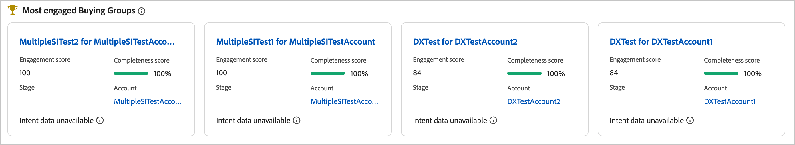

# Engagement scores {#engagement-scores}

>[!CONTEXTUALHELP]
>id="ajo-b2b_buying_group_engagement_score"
>title="Engagement score"
>abstract="Engagement scores determine the level of engagement for buying group members."

An engagement score is a number that indicates the level of engagement for the members of a buying group. These scores are based on the buying group member activities, weighted actions, and weighted roles. The resulting scores are normalized within a tenant (instance) to enable consistent comparison and allow for actionable insights. Score calculation starts as soon as you create the buying group. The Journey Optimizer B2B Edition data hub system computes the scores daily and uploads them to the Multi-Level Marketing (MLM) MySQL system using the ingestion service.

There are two types of engagement scores: 

* **Buying group engagement score** - The buying group engagement score is a normalized score between 0 to 100 and is based on the engagement score calculated at the person level. 

   The buying group engagement score is displayed in the [Buying group details](./buying-group-details.md) page. You can also view the most engaged buying groups in the Intelligent dashboard. 

   {width="700" zoomable="yes"}

* **Person engagement score** - The person engagement score is based on the activities of an individual buying group member.

    The person engagement score for each buying group member is displayed in the buying group details page [_[!UICONTROL Members]_ tab](./buying-group-details.md#buying-group-members). These scores are also displayed in pages and dashboards that include top-engaged members and overlapping contacts information.

    {width="550" zoomable="yes"}

>[!BEGINSHADEBOX]

The person engagement score is an attribute that is available to use for filtering in [roles templates](./buying-groups-role-templates.md#add-the-template-roles) and [journey splt-path-by-people nodes](../journeys/split-merge-paths-nodes.md#people-path-conditions).

{width="550" zoomable="yes"}

>[!ENDSHADEBOX]

Any engagement weighted activity performed by the members of the buying group in the last 30 days is used to calculate the scores. With the 30-day window, activity occurrences expire and scores can move downward (score decay). Displayed scores are rounded (for example, a score of 75.89999 is displayed as 76).

## Activities used for engagement scoring

Buying group scoring is not _triggered-based_. It is a daily process that evaluates the activity across all the members of the buying group and recomputes the score. Activities use _weights_ to inform buying group scoring according to the active weighting model, which determines how each activity is weighted.

There is a daily frequency cap of 20 for each activity. If a member of a buying group performs the same activity more than 20 times in a single day, the count for the activity is capped at 20.

{{engagement-activities}}

<!-- old list

| Activity name | Description | Engagement type | Max daily frequency count | Activity weight |
| --- | --- | --- | --- | --- |
| [!UICONTROL Visit Webpage]| A member visits a web page | Web | 20 | 40 |
| [!UICONTROL Fill Out Form]| A member fills and submits a form on a web page | Web | 20 | 40 |
| [!UICONTROL Click Link] | A member clicks a link on a web page | Web | 20 | 40 |
| [!UICONTROL Open Email] | A member opens an email | Email | 20 | 30 |
| [!UICONTROL Click Email] | A member clicks a link in an email | Email | 20 | 30 |
| [!UICONTROL Open Sales Email] | A member opens a sales email | Email | 20 | 30 |
| [!UICONTROL Click Sales Email] | A member clicks a link in a sales email | Email | 20 | 30 |
| [!UICONTROL Interesting Moment] | A member has an interesting moment | Curated | 20 | 60 |
| [!UICONTROL Tap Push Notification] | A member receives a push notification | Mobile | 20 | 30 |
| [!UICONTROL Mobile App Activity] | A member performs an activity on a mobile app | Mobile | 20 | 30 |
| [!UICONTROL Mobile App Session] | A member is active on a mobile app session | Mobile | 20 | 30 |
| [!UICONTROL Fill Out Facebook Lead Ads Form] | A member fills and submits a Lead Ads form on a Facebook page | Social | 20 | 30 |
| [!UICONTROL Click RTP Call to Action] | A member clicks a personalized call to action | Web | 20 | 60 |
| [!UICONTROL View In-App Message] | A member views an in-app message | Mobile | 20 | 30 |
| [!UICONTROL Tap In-App Message] | A member taps an in-app message | Mobile | 20 | 30 |
| [!UICONTROL Subscribe SMS] | A member subscribes to SMS communications | SMS | 20 | 90 |
| [!UICONTROL Reply to Sales Email] | A member replies to a sales email | Email | 20 | 30 |
| [!UICONTROL Engaged with a Dialogue] | A member engages with a Dynamic Chat dialogue | Chat | 20 | 90 |
| [!UICONTROL Interacted with Document in Dialogue] | A member interacts with a document in a Dynamic Chat dialogue | Chat | 20 | 90 |
| [!UICONTROL Scheduled Meeting in Dialogue] | A member schedules an appointment in a Dynamic Chat dialogue | Chat | 20 | 90 |
| [!UICONTROL Reached Dialogue Goal] | A member reaches a goal in a Dynamic Chat dialogue |  |20 | 90 |
| [!UICONTROL Responded to a poll in webinar] | A member responds to a poll in a webinar event | Chat | 20 | 90 |
| [!UICONTROL Call to action clicked in webinar] | A member clicks a call-to-action link in a webinar event | Call | 20 | 30 |
| [!UICONTROL Asset downloads in webinar] | A member downloads a file/asset in a webinar event | Event | 20 | 60 |
| [!UICONTROL Asks questions in webinar] | A member asks questions in a webinar event | Event | 20 | 60 |
| [!UICONTROL Has attended event] | A member attended an event | Event | 20 | 60 |
| [!UICONTROL Engaged with an Agent in Dialogue] | A member engages with an agent in a Dynamic Chat dialogue | Chat | 20 | 90 |
| [!UICONTROL Clicked Link in Chat in Dialogue] | A member clicks a link in a Dynamic Chat dialogue | Chat | 20 | 90 |
| [!UICONTROL Engaged with a Conversational Flow] | A member engages with a Dynamic Chat conversational flow | Chat | 20 | 90 |
| [!UICONTROL Scheduled Meeting in Conversational Flow] | A member schedules an appointment in a Dynamic Chat conversational flow | Chat | 20 | 90 |
| [!UICONTROL Reached Conversational Flow Goal] | A member reaches a goal in a Dynamic Chat conversational flow | Chat | 20 | 90 |
| [!UICONTROL Interacted with Document in Conversational Flow] | A member interacts with a document in a Dynamic Chat conversational flow | Chat | 20 | 90 |
| [!UICONTROL Engaged with an Agent in Conversational Flow] | A member engages with an Agent in a Dynamic Chat conversational flow | Chat | 20 | 90 |
| [!UICONTROL Clicked Link in Chat in Conversational Flow] | A member clicks a link in a Dynamic Chat conversational flow | Chat | 20 | 90 |
| [!UICONTROL Click Link in SMS V2] | A member clicks a link in an SMS message | SMS | 20 | 90 | -->

>[!NOTE]
>
>Engagement score activities are recorded in the Marketo Engage activity log for a person. You can access this log in the connected Marketo Engage instance. For more information, see [Locate the Activity Log for a Person](https://experienceleague.adobe.com/en/docs/marketo/using/product-docs/core-marketo-concepts/smart-lists-and-static-lists/managing-people-in-smart-lists/locate-the-activity-log-for-a-person){target="_blank"} in the Marketo Engage documentation.

## Role template weighting {#engagement-score-weighting}

>[!CONTEXTUALHELP]
>id="ajo-b2b_buying_group_engagement_score_weighting"
>title="Engagement score role weighting"
>abstract="Use role weighting to customize the engagement score calculation."

Users can assign _weighting_ to each role in the [roles template](./buying-groups-role-templates.md) to allocate different weights for a role. 

{width="700" zoomable="yes"}

Each weighting level translates to a value, which is used for calculating the engagement score:

* [!UICONTROL Trivial] = 20
* [!UICONTROL Minor] = 40
* [!UICONTROL Normal] = 60
* [!UICONTROL Important] = 80
* [!UICONTROL Vital] = 100

A roles template with three roles weighted as _[!UICONTROL Vital]_, _[!UICONTROL Important]_, and _[!UICONTROL Normal]_ convert to the following weighted percentages:

|Role           |Weighting |System value | Value calculation |Percentage |
|-------------- |--------- |------------- |------------------ |---------- |
|               |          |              |                   |           |
|Decision Maker |Vital     |100           |100/240            |41.67%     |
|Influencer     |Important |80            |80/240             |33.33%     |
|Practitioner   |Normal    |60            |60/240             |25%        |
|               |Total     |240           |                   |           |

## Score calculation example

The following example illustrates the engagement score calculation. It uses the outlined role weight percentage, count of inbound activities for each buying group member, and a daily cap of 20 for each event occurrence.

|Role           |Member    |Activity type|Yesterday's count|Today's count|Calculation|Total score|
|-------------- |--------- |-------------|-----------------|-------------|------|-----------|
|               |          |             |                 |             |      |           |
|Decision Maker |Adam      |Visited website|37               |15         |20 + 15|35        |
|               |          |Clicked email|1                |1            |1 + 1 |2          |
|               |          |             |                 |             |      |           |
|               |Mark      |Visited website|5                |3          |5 + 3 |8          |
|               |          |Clicked email|1                |1            |1 + 1 |2          |
|               |          |Downloaded pub|3                |2           |3 + 2 |5          |
|**Decision Makers total score**|         |             |                 |             |      |**52**         |
|               |          |             |                 |             |      |           |
|Influencer     |John      |Visited website|19               |9            |19 + 9|28         |
|**Influencers total score**|         |             |                 |             |      |**28**         |
|               |          |             |                 |             |      |           |
|Practitioner   |Bob       |Clicked email|1                |1            |1 + 1 |2          |
|               |          |             |                 |             |      |           |
|               |Paul      |Clicked email|1                |1            |1 + 1 |2          |
|               |          |             |                 |             |      |           |
|               |Calvin    |Clicked email|1                |1            |1 + 1 |2          |
|               |          |Visited website|1              |7            |1 + 7 |8          |
|               |          |Downloaded pub|1               |2            |1 + 2 |3          |
|**Practitioners total score**|         |             |                 |             |      |**17**         |

The final engagement score is calculated by applying the weighting for each of the role scores:

|Role           |Role total score |Role weight % |Score X weight % |
|-------------- |---------------- |------------- |---------------- |
|Decision Makers |52               |41.67%        |21.67            |
|Influencers     |28               |33.33%        |9.33             |
|Practitioners   |17               |25%           |4.25             |
|**Final engagement score**|                |             |**35.25**           |

## Scoring logic

In addition to the calculation logic outlined in the calculation example, there is a significantly complex normalization of scores that occurs in the system, across all people, buying groups, and accounts in your instance. A buying group engagement score has a dependency on the person engagement scores, according to the following ordered logic:

### Person engagement score calculation logic

1. Identify all _engagement-weighted_ activity types that have an associated weight and daily quota, such as  website visits, email clicks, and webinar attendance.

1. Identify all person _engagement-weighted_ actions performed within the activity look-back window, which is currently hard-coded to 30 days.

1. Normalize the activity type weights across all _engagement-weighted_ activity type weights identified in step 1, ignoring the ones that did not occur within the look-back window.

   This step leverages _Min-Max Normalization_ and significantly reduces the artificial dilution of activity type weight for a tenant that does not leverage most of them.

1. Apply the daily quota filtering per person and activity type.

   This step mitigates having very large outliers by avoiding lower value / high volume activities skewing the scores.

1. Calculate the raw person engagement score by summing the daily activity per activity type, multiplying it by the associated weight, and then summing the results for all days of the look-back window.

1. Use a _Power Transformation_ (Square Root) transform to stabilize variance by reducing possible outliers. 

   This transformations helps to reduce skewness and make patterns in the data more linear.

1. Apply an additional _Scaled Normalization_ transform to ensure that the scores leverage the entire range from 0 to 100.

### Buying group engagement score calculation logic

1. Apply a normalized weight to each buying group member by role, according to the weight configured in the roles template.

1. Normalize the buying group role weight for each buying group.

   This normalization avoids unnecessary role weight dilution if a buying group does not use all roles.

1. Aggregate all buying group member person engagement scores by multiplying the person engagement score by the person's role normalized role weight, and add them together.

1. Apply a _Power Transformation_ (Square Root) transform to stabilize variance by reducing possible outliers, especially for very large buying groups.

1. Apply an additional _Scaled Normalization_ transform to ensure that the scores leverage the entire range from 0 to 100.
