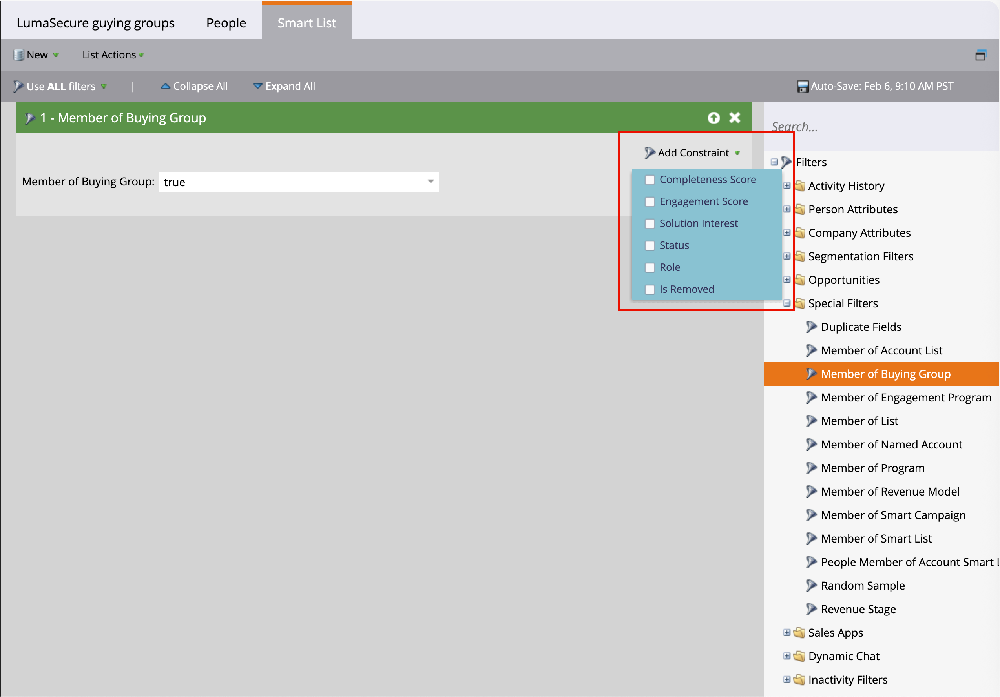
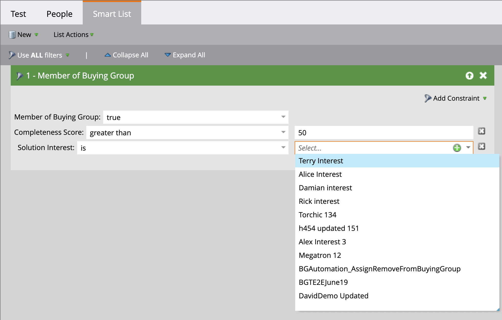
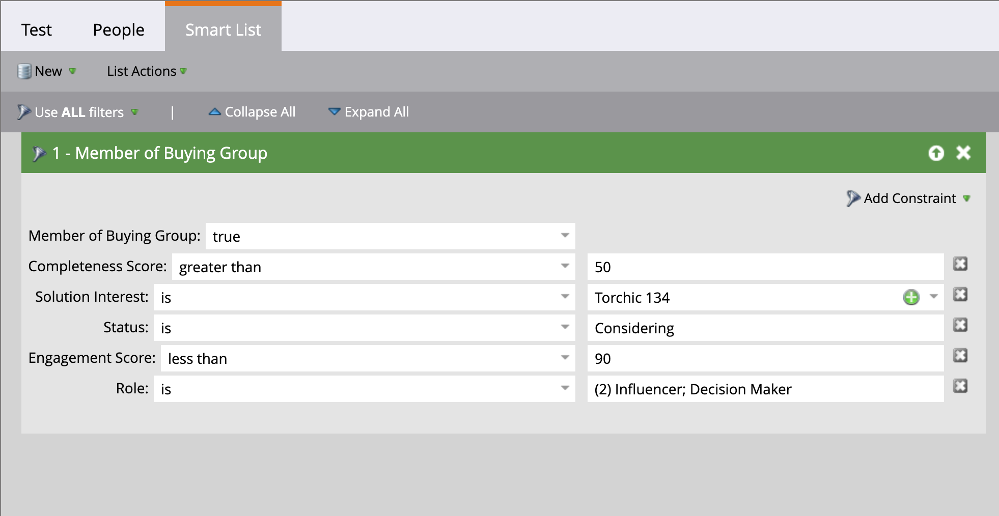

# Buying group filters in Marketo Engage

>[!IMPORTANT]
>
>**Feature deprecation**  
>
>With the [simplified architecture](../simplified-architecture.md) for Journey Optimizer B2B Edition, the buying group filters are no longer available in a connected Marketo Engage instance.  
>
>As an alternative, you can create a static list for each solution interest and then use the _Add to Marketo static list_ action from a journey node. This action adds buying group members to a particular static list in a connected Marketo Engage instance. Then, use the  solution interest focused static list for a smart list filter.

As a Marketer, you might want to suppress campaigns in Marketo Engage for people that are part of buying groups in Journey Optimizer B2B Edition. You can also inform the lead scoring workflows in Marketo Engage using information about the leads associated with buying groups. For example:

* Is this lead part of a buying group?
* Is the buying group complete and engaged?

If these conditions are true, you might choose to score lead the higher. If not, you might choose not to mark it as a marketing-qualified lead (MQL).

In your Marketo Engage instance that is connected to Journey Optimizer B2B Edition, you can use the _[!UICONTROL Member of Buying Group]_ filter in your Smart Lists to identify these leads according to your campaign strategy.

1. After you [create a Smart List in Marketo Engage](https://experienceleague.adobe.com/en/docs/marketo/using/product-docs/core-marketo-concepts/smart-lists-and-static-lists/creating-a-smart-list/create-a-smart-list){target="_blank"}, select the **[!UICONTROL Smart List]** tab to open the filter editor. 

1. In the filters list on the right, scroll down the list and expand the **[!UICONTROL Special Filters]** folder.

1. Click the **[!UICONTROL Member of Buying Group]** filter and drag it onto the filter definition area.

   {width="700" zoomable="yes"}

1. Set the _[!UICONTROL Member of Buying Group]_ option to **[!UICONTROL true]** or **[!UICONTROL false]**. 

   This constraint is required for the definition.

1. (Optional) Add other buying group-related constraints to the filter according to how you want to identify leads for the Smart List.

   * Click **[!UICONTROL Add Constraint]** at the top right of the filter card.

     {width="700" zoomable="yes"}

   * Select the constraint that you want to add, such as _Completeness Score_ or _Solution Interest_.

   * Set the evaluation that you want to use for a match. For a score, you can use an exact match, or a range that is above or below the number you enter. 
   
      For a discrete item, such as the solution interests defined in Journey Optimizer B2B Edition, you can select one or more items for the list.
      
      {width="600" zoomable="yes"}

      Select the first one and click the selector again to open the _[!UICONTROL Multiple Value Chooser]_ dialog.

      {width="500" zoomable="yes"}

      Move any of the remaining items over to the right and click **[!UICONTROL OK]** when you have the list of items that you want to use for the constraint.

   * Repeat these actions to add as many of the constraints that you need.

   {width="600" zoomable="yes"}
