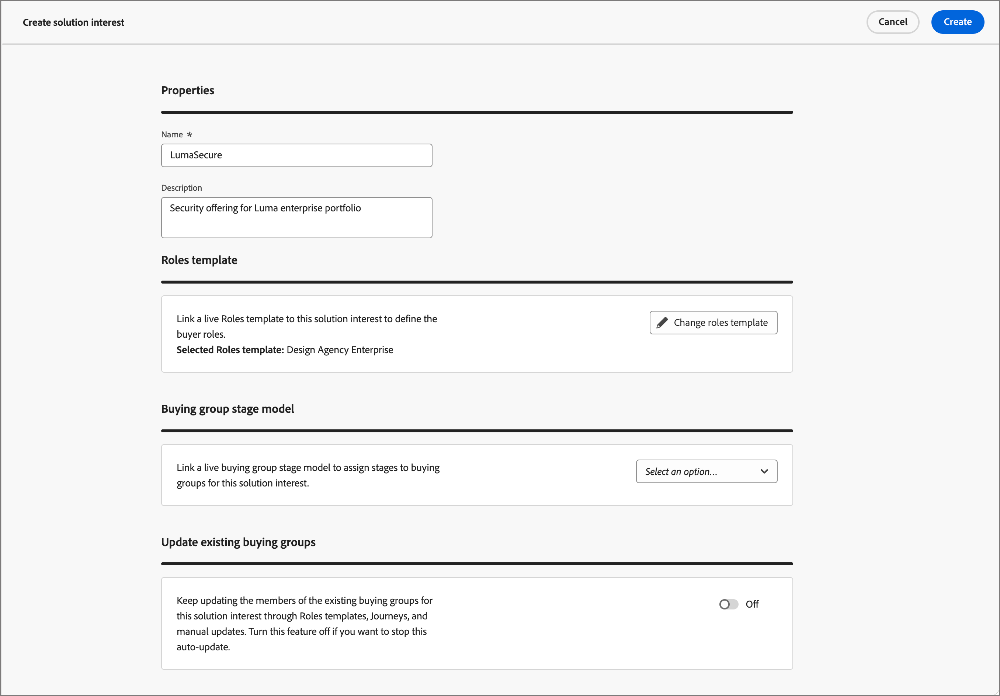

# Solution Interests

Before you create Buying Groups, you should know what you are selling and who you want to target. Your Marketing and Sales strategy should be aligned so that you can add the Solution Interest for the Buying Groups.

## Access and browse Soultion Interests

1. In your Adobe Experience Platform home page, click Adobe Journey Optimizer B2B Edition.

1. On the left navigation, click **[!UICONTROL Buying Groups]**.

1. In the Buying Groups page, select the **[!UICONTROL Solution interest]** tab.

   {width="700" zoomable="yes"}

   The tab provides an inventory list of all existing Solution Interests. It provides information as _[!UICONTROL Name]_, _[!UICONTROL Roles template]_, _[!UICONTROL Buying group creation jobs]_, _[!UICONTROL Last updated on]_, _[!UICONTROL Updated by]_, _[!UICONTROL Created on]_, and _[!UICONTROL Created by]_ in column format. 
   
   The list is sorted by the _[!UICONTROL Last updated on]_ column by default. Click the column title in the headr to toggle the sort bewteen descending and ascending.

## Create a Solution Interest

Before you create a Solution Interest, you must have a live (published) roles template that defines the roles you want to target. See [Buying Group role templates](./buying-groups-role-templates.md) for more information about creating a roles template and publishing a roles template.

1. From the _[!UICONTROL Solution Interest]_ tab, click **[!UICONTROL Create solution interest]** at the top-right corner.

1. Enter a unique a **[!UICONTROL Name]** (required) and a **[!UICONTROL Description]** (optional).

1. Choose a **[!UICONTROL Roles Template]** (required).

   Click the selector and choose a live roles template from the displayed list. You can associate only one live Roles Template with a Solution Interest.

   {width="700" zoomable="yes"}

1. Click **[!UICONTROL Create]** at the top-right corner.

   Your new Solution Interest is displayed in the Solution Interests  

>[!NOTE]
>
>Solution Interest edit and delete actions are NOT available for Beta.

