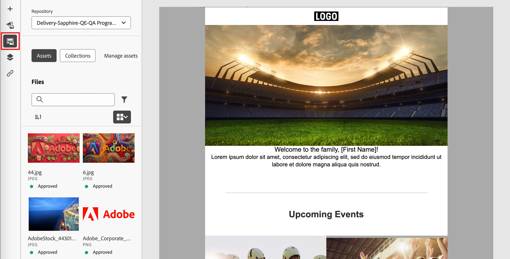

# Work with Experience Manager assets

When Adobe Experience Manager Assets as a Cloud Service is integrated with Adobe Journey Optimizer B2B Edition, you can easily discover and access digital assets for use in your marketing content. As you author your content, the assets are accessible from the _Experience Manager Assets_ item on the left navigation, and when authoring email content for an account journey. You can also upload assets to connected AEM Assets as a Cloud Service repository directly from Adobe Journey Optimizer B2B Edition.

>[!NOTE]
>
>Currently, only image assets from Adobe Experience Manager Assets are supported in Adobe Journey Optimizer B2B Edition. Changes to the assets must be done from the Adobe Experience Manager Assets central repository. [Learn more](https://experienceleague.adobe.com/en/docs/experience-manager-cloud-service/content/assets/manage/manage-digital-assets)

When you use these digital assets, the latest changes in Assets as a Cloud Service automatically propagate to live email campaigns through linked references. If images are deleted in Adobe Experience Manager Assets as a Cloud Service, the images appear with a broken reference in the emails. When assets that are currently used within account journeys are modified or deleted, the journey authors are notified about the image changes and the list of journeys using the image. All changes to the assets must be done in the Adobe Experience Manager Assets central repository.

When your environment has one or more [Assets repositories connections](../admin/configure-aem-repositories.md), content authors can use AEM Assets as the source for assets when creating an email, email template, or visual fragment.

>[!IMPORTANT]
>
>An administrator must add users who need access to Assets to the Assets Consumer Users or/and Assets Users Product profiles. [Learn more](https://experienceleague.adobe.com/en/docs/experience-manager-cloud-service/content/security/ims-support#managing-products-and-user-access-in-admin-console)

## Access AEM Assets images

In the visual content editor, click the _Experience Manager Assets_ <!--(  )-->icon in the left sidebar. This changes the tools panel to a list of available assets in the selected repository.

{width="700" zoomable="yes"}

### Change the displayed repository

If you have more than one connected AEM repository, click the menu arrow for **[!UICONTROL Repository]** to choose the repository you want to display in the left panel.

{width="700" zoomable="yes"}

There are multiple methods for adding an image asset to the visual canvas.

### Drag and drop an image

1. Browse the image thumbnails displayed in the left panel.

1. Drag the image thumbnail and drop it in the canvas where you what to add the new image component.

   {width="700" zoomable="yes"}

## Find and select an image

1. Add an image component to the canvas and click **[!UICONTROL Experience Manager Assets]** to open the _[!UICONTROL Select Assets]_ dialog.

   {width="600" zoomable="yes"}

1. From the dialog, choose an image using the available tools to locate the asset that you need:
   
   * Change the **[!UICONTROL Repository]** at the top right.

   * Click **[!UICONTROL Manage assets]** at the top right to open the Assets repository in another browser tab and use AEM Assets management tools.

   * Click the _View type_ selector at the top right to change the display to **[!UICONTROL List View]**, **[!UICONTROL Grid View]**, **[!UICONTROL Gallery View]**, or **[!UICONTROL Waterfall View]**.

   * Click the _Sort order_ icon to change the sort order between ascending and descending.

      {width="700" zoomable="yes"}

   * Click the **[!UICONTROL Sort by]** menu arrow to change the sort criteria to **[!UICONTROL Name]**, **[!UICONTROL Size]**, or **[!UICONTROL Modified]**.

   * Click the _Filter_ icon on the top left to filter the displayed items according to your criteria.

   * Enter text in the Search field to filter the displayed items for a match of the asset name.

   {width="700" zoomable="yes"}

1. Click **[!UICONTROL Select]**.
<!-- 

## Upload assets

To import files to Assets as a Cloud Service, you first need to browse or create the folder to be used for storage. You can then import an asset and add it to your email content. After assets are uploaded, you can [use the image assets as you author content](./assets-overview.md#add-assets-to-your-content).

1. While authoring your content in the email designer, drag an image element into the canvas. 

   The properties on the right reflect the image element selection. 

1. Click **[!UICONTROL Import media]** to open the _[!UICONTROL Upload image]_ dialog.

1. If your file system is open to your image file, drag and drop the file on the box in the dialog.

   {width="700" zoomable="yes"}

   You can also click the **[!UICONTROL Select a file from your computer]** link and use your file system to locate and select the image file. Click Open and the image file is displayed in the box.

1. Click **[!UICONTROL Import]**.
-->
