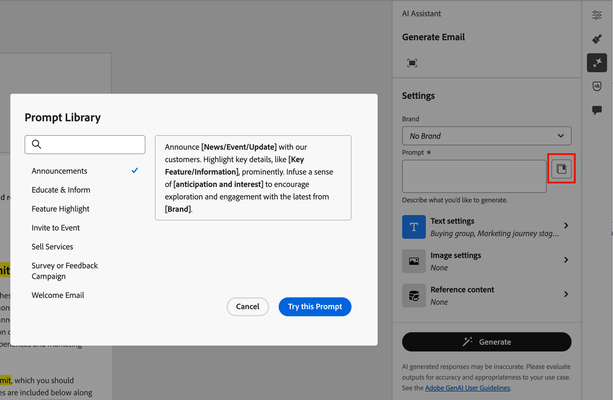
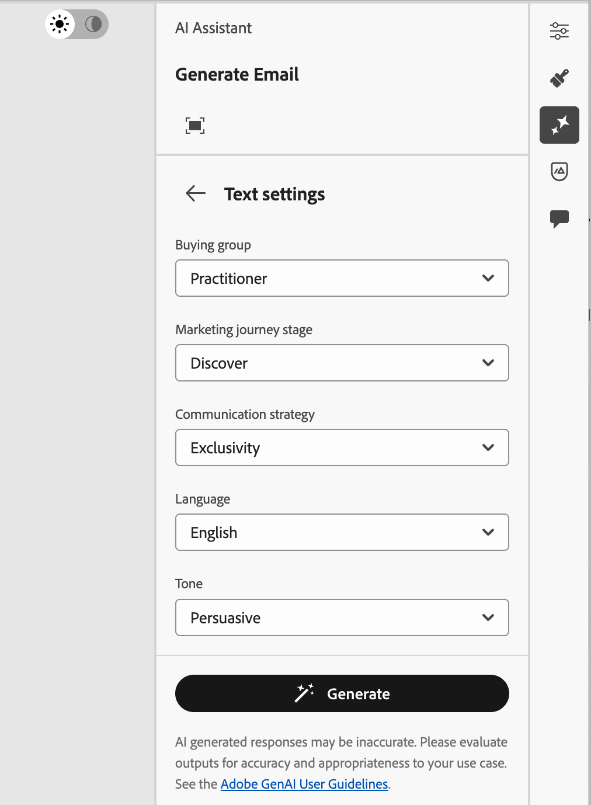
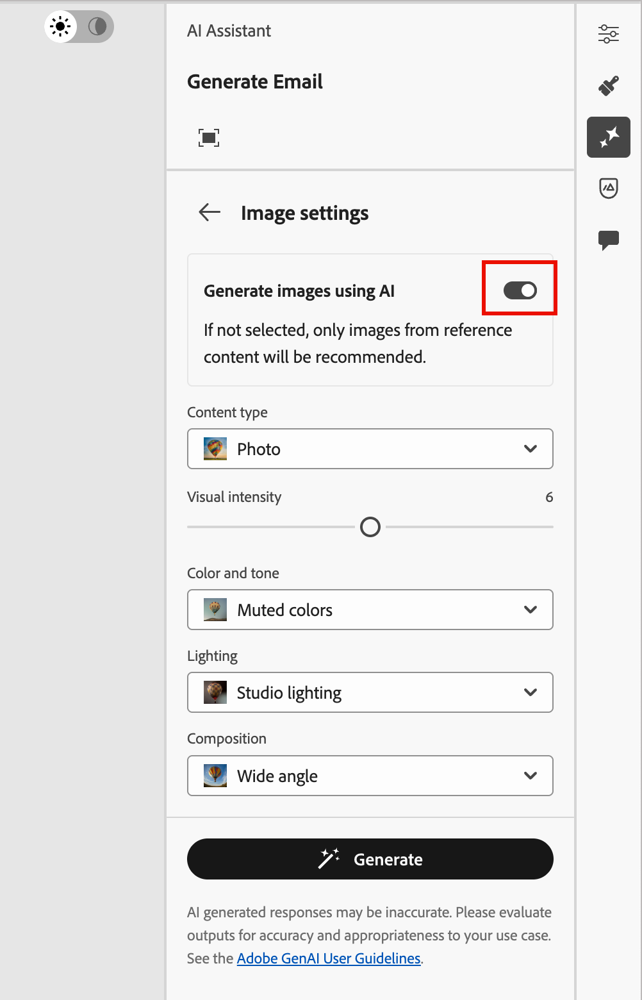
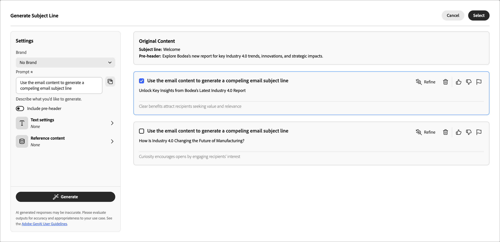
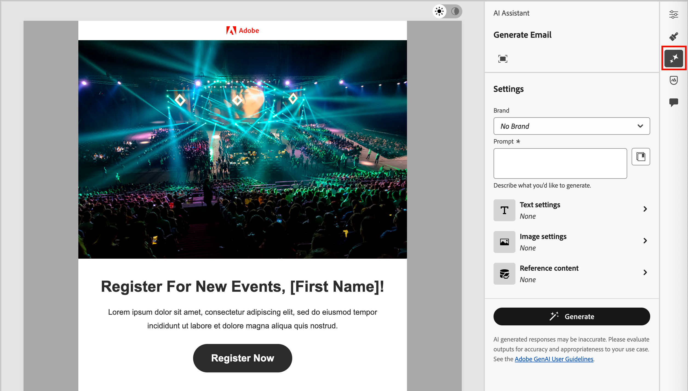
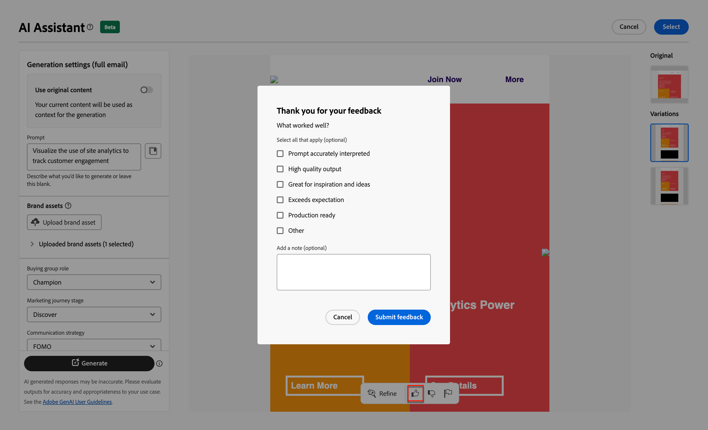
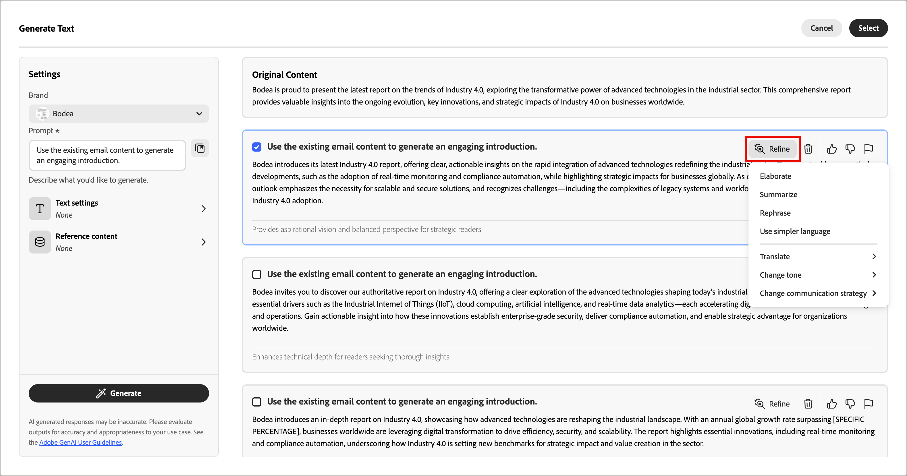

# AI Assistant for email content

As the Marketing industry becomes more competitive, brands are seeking efficient ways to generate impactful content quickly and efficiently. AI Assistant for email authoring in [!DNL Adobe Journey Optimizer B2B Edition] is Adobe's AI-powered content generation capability that revolutionizes the way marketers create professional and brand-consistent email content. With advanced generative AI models and deep understanding of brand guidelines, AI Assistant auto-generates personalized, engaging, and effective content. It uses your marketing objective and optimizes the content for brand outlined styles, layouts, tone, and more. AI Assistant makes the creation and execution of email marketing campaigns intuitive, simple, and hassle-free. Adding this capability to your workflows can save you time, improve efficiency, and drive better results.

This new capability provides a prompt-based content generation for full email generation or targeted within email structural components. For images, you can generate new image assets or simply generate recommendations from within the catalog of images in the input brand asset. You can also use this capability to generate optimal subject lines and preheaders to impact the email open rate.

>[!IMPORTANT]
>
>To access these features in Adobe Journey Optimizer B2B Edition, you must have the _[!UICONTROL AI Assistant]_ > _[!UICONTROL Generate Content]_ permission. For more information about how a product administrator can grant feature permissions, see [Edit roles for product permissions](../admin/user-management.md#edit-roles-for-product-permissions).

## Guidelines and limitations

Before you start using this capability, review the [guidelines and limitations](../ai-assistant/generative-ai-content.md#general-guidelines-and-limitations). You must also accept a [user agreement](https://www.adobe.com/legal/licenses-terms/adobe-dx-gen-ai-user-guidelines.html){target="_blank"} before you can use AI capabilities in [!DNL Journey Optimizer B2B Edition]. For more information, contact your Adobe representative.

With Adobe's commitment to promote transparency in the use of generative AI tools in media creation, Adobe applies [content credentials](https://helpx.adobe.com/firefly/web/get-started/learn-the-basics/content-credentials-overview.html){target="_blank"} for any content or project that includes a Firefly-generated asset when it is downloaded or exported.

The following limitations and guidelines apply to AI Assistant features used for email content generation in [!DNL Journey Optimizer B2B Edition]:

* English is the only supported language.
* Generated content might not be accurate &#8212; share your feedback so that Adobe engineers can refine the models.
* You can upload multiple content reference assets, but can leverage only one for a specific generation.
* Use a brand specific or custom template for generating content for a full email. Email templates with up to 8-10 images are recommended.
* Make sure to report any problematic outputs using the thumb up, thumb down, or flag icons when selecting generated variants.

## Input and settings for content generation

You can generate full content for an email, or for selected components in the email. When you use the AI Assistant tools to generate the content that you need, you provide the input, including prompts and reference content, and the settings for text and images.

### Prompts

Use well-defined prompts for the generative AI model to interpret with accuracy. The marketing objective/prompt that you provide strongly impacts the quality of the generated content. 

{width="320"}

For more information about creating effective prompts, see _[Prompt best practices](../ai-assistant/generative-ai-content.md#prompt-best-practices-for-generative-ai)_. 

>[!BEGINSHADEBOX]

## Prompt Library

An effective prompt is essential for generating the best possible content. If you want assistance with crafting your prompt, click the _Prompt library_  icon to access a library of prompt ideas that are organized according to objectives. Enter text in the search field to find a prompt based on a keyword string.

{width="500" zoomable="no"}

Select the prompt that best reflects your intended goals and click **[!UICONTROL Try this Prompt]**. In the _[!UICONTROL Prompt]_ field, replace any placeholders (such as `[Key Feature/Information]`) with the needed values that specify your brand, offering, campaign, and use cases.

>[!ENDSHADEBOX]

### Text settings

Expand the **[!UICONTROL Text settings]** in the right panel and set the options for generated text.

* **[!UICONTROL Buying group]** - Choose the [buying group role](../buying-groups/buying-groups-role-templates.md) to use for targeting your messaging. [!DNL Journey Optimizer B2B Edition] offers five standard B2B buying group roles out-of-the-box. Each buying group role has a distinct messaging focus:

   | Role | Messaging focus |
   | ---- | --------------- |
   | Executive Steering Committee | Product information  Pricing   Technical integration details   Product features and functions |
   | Influencer | Proof of quality  Ease of implementation  Subject matter expertise  Competitive advantages |
   | Decision maker | Return on investment  Financial value (RoI)  Customer stories |
   | Practitioner | Ease of use  Product features and functionality  Product compatibility  Ease of product integration |
   | Champion | Educational content  Thought leadership content  Customer stories |

* **[!UICONTROL Marketing journey stage]** - Choose the [buying group stage](../buying-groups/buying-group-stages.md) to use for targeting the messaging.
* **[!UICONTROL Communication strategy]** - Choose the most suitable communication style for your generated text.
* **[!UICONTROL Language]** - Choose the language of your generated content.
* **[!UICONTROL Tone]** - The tone should resonate with your audience. Whether you want to sound informative, playful, or persuasive, AI Assistant can adapt the message accordingly.

{width="400" zoomable="yes"}

Click the left arrow to return to the main _[!UICONTROL Settings]_.

### Image settings

To include images in your generated content, expand the **[!UICONTROL Image settings]** in the right panel and set the options.

The **[!UICONTROL Generate images using AI]** option is disabled by default. Enable this feature and set the following options to include generated images in the proposed content variations:

* **[!UICONTROL Aspect ratio]**: When an image component is selected, this setting determines the width and height of the asset. You have the option to choose from common ratios such as 16:9, 4:3, 3:2, or 1:1, or you can enter a custom size.
* **[!UICONTROL Content type]**: This categorizes the nature of the visual element, distinguishing between different forms of visual representation such as photos, graphics, or art.
* **[!UICONTROL Visual intensity]**: Control the image's impact by adjusting its intensity. A lower setting (2) will create a softer, more restrained appearance, while a higher setting (10) makes the image more vibrant and visually powerful.
* **[!UICONTROL Color and tone]**: The overall appearance of the colors within an image and the mood or atmosphere it conveys.
* **[!UICONTROL Lighting]**: This refers to the lighting present in an image, which shapes its atmosphere and highlights specific elements.
* **[!UICONTROL Composition]**: This refers to the arrangement of elements within the frame of an image.

{zoomable="yes"}

Click the left arrow to return to the main _[!UICONTROL Settings]_.

### Reference content

Upload reference content assets to generate accurate, on-brand content. Otherwise, generated content is based on publicly available information. Reference content serves as the source for content generation and image recommendations. For guidelines and best practices, see _[Optimized brand assets](../ai-assistant/generative-ai-content.md#optimized-brand-assets)_.

From the **[!UICONTROL Reference content]** settings, click **[!UICONTROL Upload file]** to add any asset that contains content you want to use for additional context.

<!-- {zoomable="yes"} -->

The file to upload can be in the following formats: PDF, JPEG, PNG, or ZIP files (containing supported file formats). The maximum size for an uploaded brand asset is 50MB. Larger files or a large number of images can work, but this increases the processing time.

You can select a previously uploaded file using the **[!UICONTROL Uploaded reference content]** menu. Simply toggle the asset that you want to include in your generation.

<!-- {zoomable="yes"} -->

## Generate email properties with AI Assistant

When you [add an email action](./add-email.md#add-an-email-action-node-in-a-journey) to an account journey, you define a set of email properties that are used for sending the email. AI Assistant can help achieve better email engagement by generating recommended content for the email **subject line** and **preheader**.

1. Create an email from an account journey or open an existing email from a journey node.

   The email preview page is displayed with the _[!UICONTROL Email properties]_ on the right.

1. Select any of the following tabs to learn how to use AI Assistant in your email property authoring.

>[!BEGINTABS]

>[!TAB Subject line generation]

The following steps describe the task sequence for using AI Assistant to generate an optimized subject line for your email:

1. In the _[!UICONTROL Email Properties]_, click the AI Assistant icon ( {width="30" zoomable="no"} ) at the right of the **[!UICONTROL Subject line]** field.

   {width="600" zoomable="yes"}

   The AI Assistant pop-up opens with the generation settings for the email subject line. 
   
   Depending on the email content that is associated with the email or how you want to use the subject line to fit your purpose, there are a couple of options for generating subject line text:

   * You can immediately click **[!UICONTROL Generate]** without a prompt or a brand asset to use the existing email body as the context for subject line generation.

   * (Recommended) You can provide a prompt, brand asset, and other setting values to provide context for generating the most optimal subject line text for your needs. (Steps 2 through 7)

1. In the **[!UICONTROL Prompt]** field, enter a description of what you want to generate.

   Use the [Prompt Library](#prompt-library) if you need some help with crafting an effective prompt.

1. Specify a brand asset that contains content to serve as the source for the text generation.

   * Select the asset from the catalog.

   * Click **[!UICONTROL Upload brand asset]** to add the brand asset file.

   {width="600" zoomable="yes"}

1. Scroll if needed and select the **[!UICONTROL Buying group role]** to use as the target audience for the generated text.

1. If needed, use the messaging options to tailor your content:

   * **[!UICONTROL Communication strategy]** - Choose the most suitable communication style for your generated text.
   * **[!UICONTROL Language]** - Select the language in which you want your content to be generated.
   * **[!UICONTROL Tone]** - Choose a tone that resonates with your audience. If you specify that you want to sound informative, playful, or persuasive, AI Assistant can adapt the message accordingly.

1. If needed, use the slider to set the desired length of text to be generated.

1. Change the **[!UICONTROL Use emojis]** option (on or off) according to your preference.

1. When your prompt and settings are ready, click **[!UICONTROL Generate]**.

1. Scroll the AI Assistant panel and browse through the generated variations to determine which one is the best fit. 

   * Click **[!UICONTROL Preview]** to view a full-screen version of a selected variation.

   * Provide feedback for the generated variants by clicking the _Thumbs Up_, _Thumbs Down_, or _Flag_ icon and choose the reason that best summarizes your feedback.

1. Navigate to the _Refine_ options within the Preview window to access additional customization features:

   * **[!UICONTROL Use as reference content]** - Select this option to use the variant as the reference content for generating other results.

   * **[!UICONTROL Rephrase]** - AI Assistant can rephrase your message in different ways, keeping your writing fresh and engaging for diverse audiences.

   * **[!UICONTROL Use simpler language]** - Leverage AI Assistant to simplify your language, ensuring clarity and accessibility for a wider audience.

   {width="600" zoomable="yes"}

1. Click **[!UICONTROL Select]** to replace the subject line text with the selected variant and return to the email properties.

>[!TAB Preheader generation]

An email preheader is the short summary text that follows the subject line when an email is viewed in the inbox. It is an optional element for an email, but a great opportunity to improve engagement. The following steps describe the task sequence for using AI Assistant to generate an optimized preheader for your email:

1. In the Email Properties, select the **[!UICONTROL Preheader]** checkbox and click the AI Assistant icon ( {width="30" zoomable="no"} ) at the right.

   {width="600" zoomable="yes"}

   The AI Assistant pop-up opens with the generation settings for the email preheader.

   Depending on the email content that is associated with the email or how you want to target the email, there are a couple of options for generating the preheader:

   * You can immediately click **[!UICONTROL Generate]** without a prompt or a brand asset to use the existing email body as the context for preheader generation.

   * (Recommended) You can provide a prompt, brand asset, and other setting values to provide context for generating the most optimal preheader for your needs. (Steps 2 through 7)

1. In the **[!UICONTROL Prompt]** field, enter a description of what you want to generate.

   Use the [Prompt Library](#prompt-library) if you need some help with crafting an effective prompt.

1. Specify a brand asset that contains content to serve as the source for the text generation.

   * Select the asset from the catalog.

   * Click **[!UICONTROL Upload brand asset]** to add the brand asset file.

   {width="600" zoomable="yes"}

1. Scroll if needed and select the **[!UICONTROL Buying group role]** to use as the target audience for the generated text.

1. If needed, use the messaging options to tailor your content:

   * **[!UICONTROL Communication strategy]** - Choose the most suitable communication style for your generated text.
   * **[!UICONTROL Language]** - Select the language in which you want your content to be generated.
   * **[!UICONTROL Tone]** - Choose a tone that resonates with your audience. If you specify that you want to sound informative, playful, or persuasive, AI Assistant can adapt the message accordingly.

1. If needed, use the slider to set the desired length of text to be generated.

1. Change the **[!UICONTROL Use emojis]** option (on or off) according to your preference.

1. When your prompt and settings are ready, click **[!UICONTROL Generate]**.

1. Scroll the AI Assistant panel and browse through the generated variations to determine which one is the best fit. 

   * Click **[!UICONTROL Preview]** to view a full-screen version of a selected variation.

   * Provide feedback for the generated variants by clicking the _Thumbs Up_, _Thumbs Down_, or _Flag_ icon and choose the reason that best summarizes your feedback.

1. Navigate to the _Refine_ options within the Preview window to access additional customization features:

   * **[!UICONTROL Use as reference content]** - Select this option to use the variant as the reference content for generating other results.

   * **[!UICONTROL Rephrase]** - AI Assistant can rephrase your message in different ways, keeping your writing fresh and engaging for diverse audiences.

   * **[!UICONTROL Use simpler language]** - Leverage AI Assistant to simplify your language, ensuring clarity and accessibility for a wider audience.

   {width="600" zoomable="yes"}

1. Click **[!UICONTROL Select]** to replace the preheader with the selected variant and return to the email properties.

>[!ENDTABS]

## Generate email body content with AI Assistant {#generative-ai-email-design}

After you [create and personalize your email](./email-authoring.md), use AI Assistant in [!DNL Journey Optimizer B2B Edition], powered by generative AI to elevate your email body content to the next level.

In the email design space, AI Assistant can help you optimize the impact of your deliveries by generating the full email body, targeted text content, and images that resonate with your audience. This optimization of your email campaigns is designed to produce better engagement. Select the _AI Assistant_ ( {width="30" zoomable="no"} ) to display the content generation tools that are available for the current content selection.

Use the following steps according to the type of email content generation that you want to use:

>[!BEGINTABS]

>[!TAB Full email generation]

Follow these steps to use AI Assistant for full email generation by refining an existing email template:

1. After [creating the email](./add-email.md), click **[!UICONTROL Edit email content]**.

1. Select a template.

   Full content generation requires a template. It can be a standard template provided by Adobe, or a saved template. You can also use the _[!UICONTROL Import HTML]_ option to import a template.

   For more information about using an email template, see _[Select a template](./email-authoring.md#select-a-template)_. 

1. In the email design space, access the AI Assistant menu by clicking the icon ( {width="30" zoomable="no"} ) at the right.

   {width="600" zoomable="yes"}

   The AI Assistant settings on the right reflect _Generate Email_.

1. Select your **[!UICONTROL Brand]** to ensure that the AI-generated content aligns with your brand specifications.

   If there are no published brands, click **[!UICONTROL Create a brand]** to define your [reusable brand guidelines](./brands-overview.md).

1. In the **[!UICONTROL Prompt]** field, enter a description of what you want to generate.

   Use the [Prompt Library](#prompt-library) if you need some help with crafting an effective prompt.

   >[!TIP]
   >
   >If you are new to prompting for generated content, review the _[Prompting best practices](../ai-assistant/generative-ai-content.md#prompt-best-practices)_.

1. Complete the content guidance settings to tailor the generated content:

   * [**[!UICONTROL Text settings]**](#text-settings) - Provide guidance for the generated text content.
   * [**[!UICONTROL Image settings]**](#image-settings) - If you want to include images in the generated content, enable image generation and provide guidance. 
   * [**[!UICONTROL Reference content]**](#reference-content) - Provide the content asset that serves as the source for content generation. 

   <!-- {width="600" zoomable="yes"} -->

1. When your prompt and settings are ready, click **[!UICONTROL Generate]**. 

1. Scroll down in the AI Assistant panel and browse through the generated variations to determine which one is the best fit. 

   * Click **[!UICONTROL Preview]** to view a full-screen version of a selected variation.

   * Provide feedback for the generated variants by clicking the _Thumbs Up_, _Thumbs Down_, or _Flag_ icon and choose the reason that best summarizes your feedback.

   {width="600" zoomable="yes"}

1. Click **[!UICONTROL Select]** to replace the template contents with the selected variant and return to the email design space.

   You can use the editing and formatting tools on the canvas to alter the generated content, as well as the _[!UICONTROL Settings]_ and _[!UICONTROL Style]_ options on the right.

>[!TAB Text only]

Follow these steps to use AI Assistant to refine or enhance the text content for an existing email:

1. In the email design space, select a _Text_ component to target the specific content.

1. On the outer rail of the right panel, select the _AI Assistant_ ( {width="30" zoomable="no"} ) icon.

   {width="600" zoomable="yes"}

   The settings on the right reflect the content generation settings for the text component.

1. Select your **[!UICONTROL Brand]** to ensure that the AI-generated content aligns with your brand specifications.

   If there are no published brands, click **[!UICONTROL Create a brand]** to [define your reusable brand guidelines](./brands-overview.md).

1. In the **[!UICONTROL Prompt]** field, enter a description of what you want to generate.

   {width="600" zoomable="yes"}

   Use the [Prompt Library](#prompt-library) if you need some help with crafting an effective prompt.

1. Complete the content guidance settings to tailor the generated content:

   * [**[!UICONTROL Text settings]**](#text-settings) - Provide guidance for the generated text content.

   * [**[!UICONTROL Reference content]**](#reference-content) - Provide the content assets that serve as the source for content generation. 

1. When your prompt and settings are ready, click **[!UICONTROL Generate]**. 

1. Browse through the generated _Variations_ and click **[!UICONTROL Preview]** to view a full-screen version of the selected variation.

   The _Preview_ dialog provides additional space to compare the variations, adjust your text and image settings if needed, and to regenerate the variations.

   You can also fine-tune a variation by applying refinement actions and submit feedback for the generated variations. See _[Preview and content refinement](#preview-and-content-refinement)_ for more details about variation refinement and feedback.

   {width="700" zoomable="yes"}

1. When you have the content that you want, click **[!UICONTROL Select]** to replace the text with the selected variant and return to the email design space.

   You can use the editing and formatting tools on the canvas to alter the text, as well as the _[!UICONTROL Settings]_ and _[!UICONTROL Style]_ options on the right.

>[!TAB Image only]

Follow these steps to use AI Assistant to refine or enhance the image content for an existing email:

1. In the email design space, select an _Image_ component to target the specific content.

1. On the outer rail of the right panel, select the _AI Assistant_ ( {width="30" zoomable="no"} ) icon.

   {width="600" zoomable="yes"}

   The AI Assistant settings on the right reflect the generation settings for the image component.

1. Select your **[!UICONTROL Brand]** to ensure that the AI-generated content aligns with your brand specifications.

   If there are no published brands, click **[!UICONTROL Create a brand]** to [define your reusable brand guidelines](./brands-overview.md). 

1. Enter a description of what you want in the **[!UICONTROL Prompt]** field.

   {width="600" zoomable="yes"}

   Use the [Prompt Library](#prompt-library) if you need some help with crafting an effective prompt.

1. Complete the content guidance settings to tailor the generated content:

   * [**[!UICONTROL Image settings]**](#image-settings) - If you want to include images in the generated content, enable image generation and use the guidance settings.

   * [**[!UICONTROL Reference content]**](#reference-content) - Provide the content assets that serve as the source for content generation. 

1. When you are satisfied with your prompt and settings, click **[!UICONTROL Generate]**.

   AI Assistant processes the request and generates best suited images based on the prompt and other inputs.

   >[!IMPORTANT]
   >
   >If there are no images in the reference content or there are no images relevant to the input prompt, the output is empty.

1. Browse through the _[!UICONTROL Variations]_ and select the one that is the best fit for the email content.
   
   To view a full-screen version of the selected variation, click **[!UICONTROL Preview]**.

1. Highlight the image that you want and click **[!UICONTROL Select]** to replace the image or placeholder with the selected item and return to the email design space.

   You can use the editing and formatting tools on the canvas to alter the image, as well as the _[!UICONTROL Settings]_ and _[!UICONTROL Style]_ options on the right.

>[!ENDTABS]

## Preview and refine the content {#refine-finalize}

After generating content variations, you can fine-tune the results to ensure that they meet your exact requirements. Review the brand alignment, adjust tone and language, and prepare the content for a reviewable draft. You can also submit feedback for a variation to help train AI Assistant and improve future output.

### Open the preview

1. After the initial content generation, browse through the **[!UICONTROL Variations]**.

1. Identify the variation that is the best match for your goals and click **[!UICONTROL Preview]** to view the selected variation in more depth.

   {width="700" zoomable="yes"} 

1. When you are satisfied with the selected variation, click **[!UICONTROL Select]** to apply it to your canvas.

### Refine a variation

Click the **[!UICONTROL Refine]** option to access additional customization features:

* **[!UICONTROL Elaborate]** - AI Assistant can help you expand on specific topics, providing additional details for better understanding and engagement.

* **[!UICONTROL Summarize]** - Lengthy information can overload page viewers. Use AI Assistant to condense key points into clear, concise summaries that grab attention and encourage them to read further.

* **[!UICONTROL Rephrase]** - Rewrite the message while preserving its meaning. This option helps you generate alternative wording, improve flow, or adjust phrasing without changing the core message.

* **[!UICONTROL Use simpler language]** - Simplify the language, ensuring clarity and accessibility for a wider audience.

* **[!UICONTROL Translate]** - Translate the text to another language. (Currently, English is the only supported language. Other languages are planned for future releases.)

* **[!UICONTROL Change tone]** - Adjust the tone of the message to better match your communication style, such as making it more friendly, professional, urgent, or inspirational.

* **[!UICONTROL Change Communication strategy]** - Modify the messaging approach based on your objectives, such as creating urgency, or emphasizing exciting appeal.

<!-- is this option coming back? * **[!UICONTROL Use as reference content]** - Select this option to use the variant as the reference content for generating other results. -->

{width="700" zoomable="yes"}

### Submit variation feedback

Provide feedback for the generated variants by clicking the _Thumbs Up_, _Thumbs Down_, or _Flag_ icon and choose the reason that best summarizes your feedback. 

{width="600" zoomable="yes"}

### Check your brand alignment (Beta)

<!-- Are we surfacing scoring here in the future, or will it be a separate post-creation task? 1. Click the percentage icon to view your **[!UICONTROL Brand Alignment Score]** and identify any misalignments with your brand. -->

The brand alignment evaluation and scoring help you to ensure consistency in tone, messaging, and visual identity across your email campaigns, while also serving as a quality check before your content goes live. When the email content is complete, click the _Brand alignment_ (  ) icon on the right to open the _Brand alignment_ right panel in the email design space.

{width="600" zoomable="yes"}

For detailed information, see [Validate your brand alignment](./brand-alignment.md#validate-your-brand-alignment)
